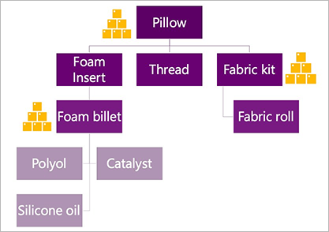
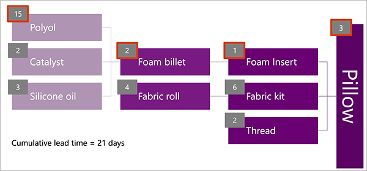
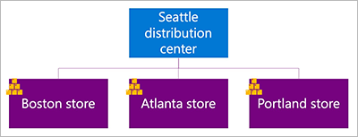

# Inventory positioning

[!include [banner](../../includes/banner.md)]

Strategic inventory positioning involves identifying decoupling points in your supply chain, where you can build up inventory on hand. This approach is mainly used to help compress lead times and absorb shocks to your supply chain. It lets you mitigate the "bullwhip effect," because demand variability isn't passed all the way down the supply chain. (The *bullwhip effect* refers to how small fluctuations in demand at the retail level can cause progressively larger fluctuations in demand at the wholesale, distributor, manufacturer, and raw material supplier levels.)

Inventory positioning is the first step of Demand Driven Materials Resource Planning (DDMRP).

## Inventory positioning for manufacturing

This section provides an example that shows how to make inventory positioning decisions if you manufacture a typical pillow product. The pillow has a multi-level bill of materials (BOM), as shown in the following illustration.

 for a pillow product")

### Choose your decoupling points

When you're choosing where to put your decoupling points, consider all the following aspects of each item in the BOM as criteria:

- External variability
- Inventory leverage and flexibility
- Critical operation protection
- Customer tolerance time
- Sales order visibility horizon
- Market potential lead time

In the pillow example, you might put your first decoupling point at the *foam billets* for the following reasons:

- It's difficult to source the materials that are used to make the foam billets, and availability is volatile. Therefore, the *external variability* criterion is met.
- The foam billets can be cut into many different shapes and sizes to create foam inserts for other products that you manufacture, in addition to the pillow. Therefore, the *inventory leverage and flexibility* criterion is met.

You might then put your next decoupling point at the *fabric kit*, which is pre-cut pillow fabric. You might choose this point because you have only one fabric cutting machine. Therefore, the *critical operation protection* criterion is met.

Finally, you might put your last decoupling point at the finished good pillow item. You might choose this point because you have a very low *customer tolerance time* on sales, and because your *sales order visibility horizon* is fairly short. Therefore, you want to ensure that you have the on-hand inventory to meet incoming orders. You can also set a higher price by keeping the lead time this short, which is what the *market potential lead time* criterion refers to.

Based on this analysis, the following illustration shows what the pillow BOM will look like. Yellow inventory symbols highlight the decoupling points.

### Calculate your decoupled lead time

This section shows how to calculate your new lead times after you've introduced decoupling points.

In the following illustration for the pillow example that was started in the previous section, lead times are shown in gray boxes at the upper left of each BOM component. Boxes that have a red outline indicate items that drive the cumulative lead time (the sum of the longest lead times at each level of the BOM). This lead time is 21 days when you start from scratch.

However, if you apply the decoupling points that you previously chose, the decoupled items will always be in stock. Therefore, they will have a lead time of 0 (zero). The new lead time for the pillow is now just five days: two days to purchase the thread and three days to produce the pillow. This lead time is known as the *decoupled lead time*.

## Strategic inventory positioning in a retail model

Because retailers stock only finished products, BOMs aren't an issue. However, retailers can still use DDMRP by setting strategic inventory positioning and buffer levels based on storage locations in the distribution network.

The following illustration shows an example of a company that has a distribution center in Seattle, and stores in Boston, Atlanta, and Portland.

You might decide that the transfer time to move a blanket product between the distribution center and the stores violates your *customer tolerance time*, because your customers expect the blanket to be in stock when they visit. In this case, you will set up a decoupling point for the blanket item at each of the three stores. Each store will have different buffer levels, based on its lead times, demand patterns, and so on.

## Implement inventory positioning in Dynamics 365 Supply Chain Management

This section describes how to implement your inventory positioning strategy in Microsoft Dynamics 365 Supply Chain Management.

### Set up item coverage groups that create decoupling points

Items become decoupling points when they belong to a coverage group that is configured with a **Coverage code** value of *Decoupling point*. Therefore, the first step in the process of setting up DDMRP is to decide which coverage groups you must implement for your DDMRP strategy, and then create them by following these steps.

1. Go to **Master planning \> Setup \> Coverage \> Coverage groups**.
1. On the Action Pane, select **New** to create a coverage group.
1. Enter information that identifies the coverage group, and then select the calendar to use.
1. On the **General** tab, set the **Coverage code** field to *Decoupling point*. This setting will cause all items that belong to this coverage group to be treated as decoupling points for DDMRP. It also enables all DDMRP settings for this group, as described later in this procedure.
1. On the **Other** tab, in the **DDMRP parameters** section, set the following fields:

    - **Lead time factor** – Specify a factor (as a decimal value between 0 and 1) to control the impact that lead time should have when the minimum and maximum stock levels are calculated for items in this coverage group. In general, the longer the lead time an item has, the lower its lead time factor should be. A lower lead time factor produces lower minimum and maximum stock levels, and therefore causes smaller and more frequent orders. DDMRP methodology recommends a value between 0.20 and 0.40 for items that have long lead times, between 0.41 and 0.60 for items that have medium lead times, and between 0.61 and 1.00 for items that have short lead times. For more information, see [Buffer profile and levels](ddmrp-buffer-profile-and-levels.md).
    - **Variability factor** – Specify a factor (as a decimal value between 0 and 1) to control the impact that varying demand should have when the minimum stock level is calculated for items in this coverage group. In general, the more variable an item's demand is, the higher its variability factor should be. A higher variability factor produces a higher minimum stock level. DDMRP methodology recommends a value between 0.00 and 0.40 for items that have low variability, between 0.41 and 0.60 for items that have medium variability, and between 0.61 and 1.00 for items that have high variability. For more information, see [Buffer profile and levels](ddmrp-buffer-profile-and-levels.md).
    - **Min, max, and re-order point period** – Specify how often to calculate buffer values (*Daily* or *Weekly*).

1. On the **Other** tab, in the **Average daily usage** section, set the following fields:

    - **Average daily usage based on** – Select which time periods the calculation of the average daily usage (ADU) should be based on. Select one of the following values:

        - *Past* – Look only at past usage for the number of days that are specified in the **Past period (days)** field. The ADU is calculated as the total demand for an item during the calculation period (in inventory units) divided by the number of days in the calculation period.
        - *Forward* – Look only at projected future usage (including forecasts) for the number of days that are specified in the **Forward period (days)** field. The ADU is calculated as the total demand for an item during the calculation period (in inventory units) divided by the number of days in the calculation period. 
        - *Blended* – Look at both the past and future usage. Settings for the **Past period (days)** field, the **Forward period (days)** field, and blending options all apply. 

            *Blended ADU* = (\[*Past weighting* × *Past ADU*\] + \[*Forward weighting* × *Forward ADU*\]) ÷ (*Past weighting* + *Forward weighting*)

    - **Past period (days)** – Enter the number of past days (up to and including today) that the system should consider when it calculates the ADU of items in this coverage group. This setting applies only when the **Average daily usage based on** field is set to *Past* or *Blended*.
    - **Forward period (days)** – Enter the number of future days (from today and up to the specified day) that the system should consider when it calculates the ADU of items in this coverage group. This setting applies only when the **Average daily usage based on** field is set to *Forward* or *Blended*.
    - **Relative weight of past period for blended average daily usage** – Enter the weight (as a percentage) to apply to the past period when the blended ADU is calculated. This setting applies only when the **Average daily usage based on** field is set to *Blended*.
    - **Relative weight of forward period for blended average daily usage** – Enter the weight (as a percentage) to apply to the forward period when the blended ADU is calculated. This setting applies only when the **Average daily usage based on** field is set to *Blended*.

1. For all other tabs and fields, enter the detailed settings that are used to calculate requirements for the items that are linked to this coverage group.

### Set an item as a decoupling point

To set an item as a decoupling point, follow these steps.

1. Go to **Product information management \> Products \> Released products**.
1. Find and select a released item that you want to set up for DDMRP.
1. On the Action Pane, on the **Plan** tab, select **Item coverage**.
1. On the **Item coverage** page, several item coverage records might already be listed, each of which applies to a different combination of storage and product dimensions. You can select an existing item coverage record that applies to the dimensions where you want to create a decoupling point. Alternatively, you can select **New** on the Action Pane to create a new item coverage record.
1. Set up the item coverage record as usual. At a minimum, you must specify the site and warehouse where the decoupling point will apply.
1. While the appropriate record is still selected, select the **General** tab.
1. Select the **Use specific settings** checkbox.
1. Set the **Coverage group** field to a coverage group that is set up to create decoupling points (as described in the previous section).
1. The item is now configured as a decoupling point. Usually, when you use DDMRP, you will also configure settings here that affect buffer sizes and the reorder quantity. However, you can complete that configuration later. For more information about the settings, see [Set up buffers for a decoupling point item](ddmrp-buffer-profile-and-levels.md#set-up-buffers).

> [!NOTE]
> To plan items that aren't decoupling points, follow the same steps that you follow when standard material requirements planning (MRP) is used.
