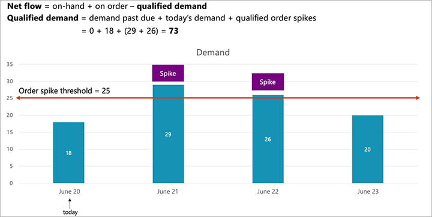

# Demand-driven planning

[!include [banner](../../includes/banner.md)]

The article describes how to generate planned orders for items that are set up as decoupling points.

## Net flow and qualified demand

During master planning, the system applies the concept of *net flow* to establish the effective on-hand quantity based on the actual on-hand inventory, plus inventory that is on order (existing supply orders that aren't yet received), minus what is referred to as *qualified demand* (qualified upcoming sales), as shown in the following illustration. When the system is determining which buffer zone an item belongs in and what the ordered quantity should be, it evaluates the net flow, not the actual on-hand inventory.

When a planned order is triggered during a planning run, the ordered quantity will be the maximum level minus the net flow. To assign an order priority, the system uses [priority-based planning](priority-based-planning.md) functionality instead of requirement dates. Demand Driven Material Requirements Planning (DDMRP) assigns the priority of a planned order based on the ordered quantity as a percentage of maximum inventory. In the previous illustration, the ordered quantity is 53 percent of the maximum quantity. Therefore, the order priority for replenishment will be 53. (For context, 0 is the highest priority, and 100 is the lowest priority.)

*Qualified demand* is the past-due demand, plus today's demand, plus qualified order spikes in the future. The following illustration shows an example of demand levels for today (June 12) and the next three days. DDMRP lets you set an order spike threshold to identify demand that exceeds normal expectations. If the threshold is set at 25 pieces, two of the future dates that are shown in the illustration will qualify as order spikes. You must assign an order spike threshold for each product individually by using its **Item coverage** page, as described in [Set up buffers for a decoupling point item](ddmrp-buffer-profile-and-levels.md#set-up-buffers).

Provided that there is no past-due demand, you can now add today's demand (18) to the quantities of the two order spikes (29 and 26) to get a qualified demand of 73. Even though there is demand for June 23, notice that it isn't included in the net flow calculation, because DDMRP triggers planned order differently than traditional planning coverage groups.

## Generating planned orders with DDMRP

During a planning run, the system will create a new planned order if the net flow for an item drops below the reorder point. When you use DDMRP, you will usually do a planning run every day. Therefore, you're essentially checking your inventory levels once a day to determine which items must be replenished.

The following illustration shows an example of a situation where you have an order for 18 pieces on June 20, 29 pieces on June 21, 26 pieces on June 22, and 20 pieces on June 23. Because the spike threshold is set at 25 pieces, two of these orders are flagged as spikes. There are 220 pieces of this item on hand.

If you run master planning now, it will generate a planned order if the net flow is found to drop below the reorder point (219 pieces in this example).

This example produces a planned purchase order for a quantity of 130, which equals the maximum level minus the net flow. The planned order is assigned a priority of 53.07, based on its percentage of the maximum quantity. Because these values were found on June 20, the system creates a planned order that is dated June 20 plus the decoupled lead time for the item (five business days in this example). Therefore, because five business days are one week from today, the planned order is dated June 27.

> [!NOTE]
> Master planning calculates only decoupled items by using DDMRP. All other items are calculated by using standard material requirements planning (MRP).
