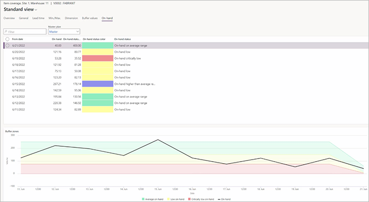
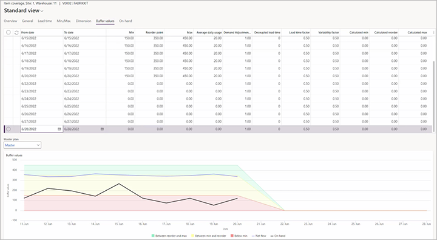
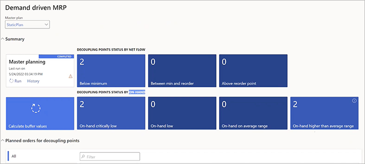

# Visual and collaborative execution

[!include [banner](../../includes/banner.md)]

This article describes how to monitor your Demand Driven Material Requirements Planning (DDMRP) decoupling points, buffer zones, planned orders, and history.

## Visually track buffers and quantities for a selected item

In Microsoft Dynamics 365 Supply Chain Management, you can visually track how buffers, on-hand quantities, and net-flow levels change over time for any selected released product. Follow these steps to open and review the charts.

1. Go to **Product information management \> Products \> Released products**.
1. Select a released item that is set up as a decoupling point. (For more information, see [Inventory positioning](ddmrp-inventory-positioning.md).)
1. On the Action Pane, on the **Plan** tab, select **Item coverage**.
1. On the **Item coverage** page, select an item coverage record that creates a decoupling point. (This record will show the name of a coverage group that is set up to create decoupling points.)
1. Select the **On-hand** tab. This tab includes a chart that shows how on-hand quantities changed over time, together with the value of the on-hand level that was recorded for a specific period every time that master planning is run. The tab also includes a table that shows which of the following categories each recorded on-hand level falls into:

    - **Critically low** – Less than half the minimum for the period.
    - **Low** – Between half the minimum and the minimum.
    - **Average on-hand** – Between the minimum and the minimum plus the green zone.
    - **Higher than average** – Higher than average.

    

    > [!NOTE]
    > The colors that are used on the **On-hand** tab represent different ranges than the similar colors used on the **Buffer values** tab.

1. To view how your buffer values changed over time, and how they compare to on-hand and net-flow levels, select the **Buffer values** tab.

    

## Track the status and planned orders for all decoupling points

The **Demand driven MRP** workspace provides several tools, together with key performance indicators (KPIs) and overviews of the status of your decoupling point items and related planned orders. To open it, go to **Master planning \> Workspaces \> Demand driven MRP**.

## Get overviews of decoupling points and planned orders

In addition to the **Demand driven MRP** workspace, Supply Chain Management provides several pages where you can view information about your DDMRP setup, decoupling points, and planned orders. Some of these pages also provide convenient buttons on the Action Pane that let you manage buffers, run master planning, and open other related views.

- To view decoupling point status by net flow level, go to **Master planning \> Master planning \> DDMRP \> Decoupling points status by net flow**.
- To view decoupling point status by on-hand inventory level, go to **Master planning \> Master planning \> DDMRP \> Decoupling points status by on-hand**.
- To view planned orders for decoupling points, go to **Master planning \> Master planning \> DDMRP \> Planned orders for decoupling points**.
- To view decoupled lead times, go to **Master planning \> Master planning \> DDMRP \> Decoupled lead time**.

## Clean up decoupling point buffer values

Over time, your system will build up a large amount of historical data that is related to ongoing buffer calculations. This historical data will cause your data volume to increase and can eventually affect the performance of your system. Therefore, we recommend that you occasionally clean up the old decoupling point buffer values.

> [!WARNING]
> The cleanup job will remove historical buffer value settings and historical on-hand/net-flow information. It isn't reversible.

Follow these steps to clean up your decoupling point buffer values.

1. Go to **Master planning \> Master planning \> DDMRP \> Clean up decoupling point buffer values**.
1. In the **Clean up decoupling point buffer values** dialog box, set the following fields:

    - **Delete records older than (days)** – Specify the age of the youngest records to keep, in days. All decoupling point buffer value records that are older than this value will be deleted.
    - **Master plan** – Select a master plan that includes items that should be affected by this cleanup. The cleanup will apply to all the items in the plan after the **Filter** settings that you specify in this dialog box are applied.

1. To limit the set of records that the batch job should run on, on the **Records to include** FastTab, select **Filter** to open the **Inquiry** dialog box. This dialog box works just as it does for other types of [background jobs](../../../fin-ops-core/dev-itpro/sysadmin/batch-processing-overview.md) in Supply Chain Management.
1. On the **Run in the background** FastTab, specify how, when, and how often the cleanup should be done. The fields work just as they do for other types of [background jobs](../../../fin-ops-core/dev-itpro/sysadmin/batch-processing-overview.md) in Supply Chain Management.
1. Select **OK** to add the new job to a batch queue for execution.
