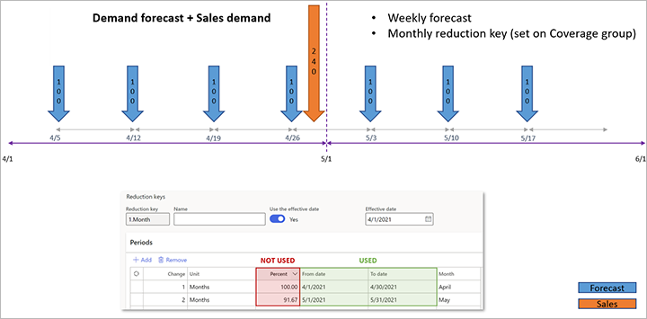
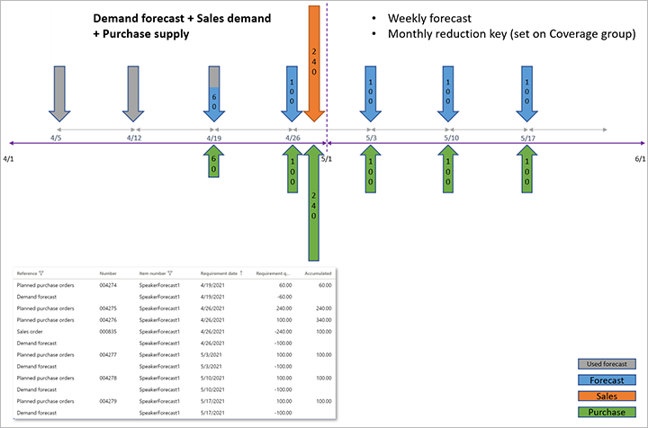
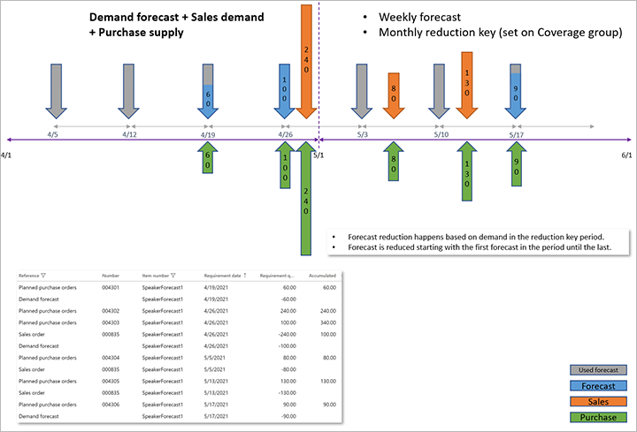

# Master planning with demand forecasts

[!include [banner](../../includes/banner.md)]

You can use a demand forecast to account for expected demand in your master planning. You can manually create a demand forecast, import it, or generate it by using the demand forecasting functionality in Microsoft Dynamics 365 Supply Chain Management. For more information about demand forecasting, see [Demand forecasting overview](../introduction-demand-forecasting.md).

> [!NOTE]
> Separate forecast planning isn't supported with Planning Optimization. Therefore, the **Current forecast plan** setting on the **Master planning parameters** page has no effect when you use Planning Optimization.

## Set up a master plan to include a demand forecast

To configure a master plan so that it includes a demand forecast, follow these steps.

1. Go to **Master planning \> Setup \> Plans \> Master plans**.
1. Select an existing plan, or create a new plan.
1. On the **General** FastTab, set the following fields:

    - **Forecast model** – Select the forecast model to apply. This model will be considered when a supply suggestion is generated for the current master plan.
    - **Include demand forecast** – Set this option to *Yes* to include the demand forecast in the current master plan. If you set it to *No*, demand forecast transactions won't be included in the master plan.
    - **Method used to reduce forecast requirements** – Select the method that should be used to reduce forecast requirements. For more information, see the [Forecast reduction keys](#reduction-keys) section later in this article.

1. On the **Time fence in days** FastTab, you can set the following fields to specify the period that the demand forecast is included during:

    - **Forecast plan** – Set this option to *Yes* to override the forecast plan time fence that originates from the individual coverage groups. Set it to *No* to use the values from the individual coverage groups for the current master plan.
    - **Forecast time period** – If you set the **Forecast plan** option to *Yes*, specify the number of days (from today's date) that the demand forecast should be applied.

    > [!IMPORTANT]
    > The **Forecast plan** setting isn't supported with Planning Optimization.

## Set up a coverage group to include a demand forecast

To configure a coverage group so that it includes a demand forecast, follow these steps.

1. Go to **Master planning \> Setup \> Plans \> Coverage groups**.
1. Select an existing coverage group, or create a new group.
1. On the **Other** FastTab, set the following fields:

    - **Forecast plan time fence** – Enter the number of days (from today's date) that the demand forecast should be applied for. This value can be overridden by using the **Forecast plan** option on the master plan, as described in the previous section.
    - **Reduction key** – Select the reduction key to apply. For more information, see the [Create and set up a forecast reduction key](#create-reduction-key) and [Use a reduction key](#use-reduction-key) sections later in this article.
    - **Reduce forecast by** – For master plans where the **Method used to reduce forecast requirements** field is set to *Transactions - reduction key* or *Transactions - dynamic period*, specify which transactions should reduce the forecast. Select one of the following values:

        - **All transactions** – All transactions should reduce the forecast.
        - **Orders** – Only sales orders should reduce the forecast.

        > [!NOTE]
        > If you select *All transactions*, transactions that have both demand and supply in the same inventory dimensions are considered neutral and are ignored during the forecast reduction. For example, if the planning dimension is set to site only, not warehouse, a transfer order between site 1, warehouse 11, and site 1, warehouse 13, will be ignored and won't reduce the remaining demand forecast.

    - **Include intercompany orders** – Set this option to *Yes* if intercompany orders should be included when the forecast is reduced. Otherwise, set it to *No*.
    - **Include customer forecast in the demand forecast** – Specify whether a customer forecast should be included in the overall forecast. This option determines how actual demand reduces the forecasted demand. You can use it to ensure that master planning covers the supply of items that are purchased by specific customers.

        - Set this option to *Yes* to include a customer forecast in the overall forecast. In this case, actual customer demand reduces both the customer forecast and the overall forecast. Master planning generates planned orders to cover only the overall forecast quantity.
        - Set this option to *No* if you don't want to include a customer forecast in the overall forecast. In this case, actual customer demand reduces only the customer forecast. Master planning generates planned orders to cover both the overall forecast quantity and the forecast for each customer quantity.

## Forecast reduction keys

This section provides information about the different methods that are used to reduce forecast requirements. It includes examples of the results of each method. It also explains how to create, set up, and use a forecast reduction key. Some methods use a forecast reduction key to reduce forecast requirements.

### Methods that are used to reduce forecast requirements

When you include a forecast in a master plan, you can select how the forecast requirements are reduced when actual demand is included. Note that master planning excludes forecast requirements from the past, which means all forecast requirements before today's date.

To include a forecast in a master plan and select the method that is used to reduce forecast requirements, go to **Master planning \> Setup \> Plans \> Master plans**. In the **Forecast model** field, select a forecast model. In the **Method used to reduce forecast requirements** field, select a method. The following options are available:

- None
- Percent – reduction key
- Transactions – reduction key
- Transactions – dynamic period

The following sections provide more information about each option.

#### None

If you select **None**, the forecast requirements aren't reduced during master scheduling. In this case, master planning creates planned orders to supply the forecasted demand (forecast requirements). These planned orders maintain the suggested quantity, regardless of other types of demand. For example, if sales orders are placed, master planning creates additional planned orders to supply the sales orders. The quantity of the forecast requirements isn't reduced.

#### Percent – reduction key

If you select **Percent - reduction key**, the forecast requirements are reduced according to the percentages and periods that are defined by the reduction key. In this case, master planning creates planned orders where the quantity is calculated as forecasted quantity × reduction key in each period. If there are other types of demand, master planning also creates planned orders to supply that demand.

##### Example: Percent – reduction key

This example shows how a reduction key reduces demand forecast requirements according to the percentages and periods that are defined by the reduction key.

For this example, you include the following demand forecast in a master plan.

| Month    | Demand forecast |
|----------|-----------------|
| January  | 1,000           |
| February | 1,000           |
| March    | 1,000           |
| April    | 1,000           |

On the **Reduction keys** page, you set up the following lines.

| Change | Unit  | Percent |
|--------|-------|---------|
| 1      | Month | 100     |
| 2      | Month | 75      |
| 3      | Month | 50      |
| 4      | Month | 25      |

You assign the reduction key to the item's coverage group. Then, on the **Master plans** page, in the **Method used to reduce forecast requirements** field, you select **Percent - reduction key**.

In this case, if you run forecast scheduling on January 1, the demand forecast requirements are consumed according to the percentages that you set up on the **Reduction keys** page. The following requirement quantities are transferred to the master plan.

| Month                | Planned order quantity | Calculation    |
|----------------------|------------------------|----------------|
| January              | 0                      | = 0% × 1,000   |
| February             | 250                    | = 25% × 1,000  |
| March                | 500                    | = 50% × 1,000  |
| April                | 750                    | = 75% × 1,000  |
| May through December | 1,000                  | = 100% × 1,000 |

#### Transactions – reduction key

If you set the **Method used to reduce forecast requirements** field to *Transactions - reduction key*, the forecast requirements are reduced by the qualified demand transactions that occur during the periods that are defined by the reduction key.

The qualified demand is defined by the **Reduce forecast by** field on the **Coverage groups** page. If you set the **Reduce forecast by** field to *Orders*, only sales order transactions are considered qualified demand. If you set it to *All transactions*, any non-intercompany issue inventory transactions are considered qualified demand. If intercompany sales orders should also be considered qualified demand, set the **Include intercompany orders** option to *Yes*.

Forecast reduction starts with the first (earliest) demand forecast record in the reduction key period. If the quantity of qualified inventory transactions is more than the quantity of demand forecast lines in the same reduction key period, the balance of inventory transactions quantity will be used to reduce the demand forecast quantity in the previous period (if there's unconsumed forecast).

If no unconsumed forecast remains in the previous reduction key period, the balance of inventory transactions quantity will be used to reduce the forecast quantity in the next month (if there's unconsumed forecast).

The value of the **Percent** field on the reduction key lines isn't used when the **Method used to reduce forecast requirements** field is set to *Transactions - reduction key*. Only the dates are used to define the reduction key period.

> [!NOTE]
> Any forecast that is posted on or before today's date will be ignored and won't be used to create planned orders. For example, if your demand forecast for the month is generated on January 1, and you run master planning that includes demand forecasting on January 2, the calculation will ignore the demand forecast line that is dated January 1.

##### Example: Transactions – reduction key

This example shows how actual orders that occur during the periods that are defined by the reduction key reduce demand forecast requirements.

For this example, you select *Transactions - reduction key* in the **Method used to reduce forecast requirements** field on the **Master plans** page.

The following demand forecast lines exist on April 1.

| Date     | Number of pieces forecasted |
|----------|-----------------------------|
| April 5  | 100                         |
| April 12 | 100                         |
| April 19 | 100                         |
| April 26 | 100                         |
| May 3    | 100                         |
| May 10   | 100                         |
| May 17   | 100                         |

The following sales order lines exist in April.

| Date     | Number of pieces requested |
|----------|----------------------------|
| April 27 | 240                        |

The following requirement quantities are transferred to the master plan when master planning is run on April 1. As you see, the April forecast transactions were reduced by the demand quantity of 240 in a sequence, starting from the first of those transactions.

| Date     | Number of pieces required |
|----------|---------------------------|
| April 5  | 0                         |
| April 12 | 0                         |
| April 19 | 60                        |
| April 26 | 100                       |
| April 27 | 240                       |
| May 3    | 100                       |
| May 10   | 100                       |
| May 17   | 100                       |

Now, assume that new orders were imported for the period of May.

The following sales order lines exist in May.

| Date   | Number of pieces requested |
|--------|----------------------------|
| May 4  | 80                         |
| May 11 | 130                        |

The following requirement quantities are transferred to the master plan when master planning is run on April 1. As you see, the April forecast transactions were reduced by the demand quantity of 240 in a sequence, starting from the first of those transactions. However, the May forecast transactions were reduced by a total of 210, starting from the first demand forecast transaction in May. However, the totals per period are preserved (400 in April and 300 in May).

| Date     | Number of pieces required |
|----------|---------------------------|
| April 5  | 0                         |
| April 12 | 0                         |
| April 19 | 60                        |
| April 26 | 100                       |
| April 27 | 240                       |
| May 3    | 0                         |
| May 4    | 80                        |
| May 10   | 0                         |
| May 11   | 130                       |
| May 17   | 90                        |

#### Transactions – dynamic period

If you select **Transactions - dynamic period**, the forecast requirements are reduced by the actual order transactions that occur during the dynamic period. The dynamic period covers the current forecast dates and ends at the start of the next forecast. In this case, master planning creates planned orders to supply the forecasted demand (forecast requirements). However, when actual order transactions are placed, the forecast requirements are reduced. The actual transactions consume part of the forecasted requirements.

When this option is used, the following behavior occurs:

- Reduction keys aren't required or used.
- If the forecast is completely reduced, the forecast requirements for the current forecast become 0 (zero).
- If there's no future forecast, forecast requirements from the last forecast that was entered are reduced.
- Time fences are included in the forecast reduction calculation.
- Positive days are included in the forecast reduction calculation.
- If actual order transactions exceed the forecasted requirements, the remaining transactions aren't forwarded to the next forecast period.

##### Example 1: Transactions – dynamic period

Here a simple example that shows how the **Transactions - dynamic period** method works.

For this example, you include the following demand forecast in a master plan.

| Date       | Demand forecast |
|------------|-----------------|
| January 1  | 1,000           |
| February 1 | 1,000             |

You also create the following sales orders.

| Date        | Sales order quantity |
|-------------|----------------------|
| January 15  | 200                  |
| February 15 | 400                  |

In this case, the following planned orders are created.

| Demand forecast date | Quantity | Explanation                           |
|--------------------- |----------|---------------------------------------|
| January 1            | 800      | Forecast requirements (= 1,000 – 200) |
| January 15           | 200      | Sales orders requirements             |
| February 1           | 600      | Forecast requirements (= 1,000 – 400) |
| February 15          | 400      | Sales orders requirements             |

##### Example 2: Transactions – dynamic period

In most cases, systems are set up so that transactions reduce demand forecast in specific forecast periods: weeks, months, and so on. These periods are defined in the reduction key. However, the time between two demand forecast lines can also *imply* a period.

For this example, you create a demand forecast for the following dates and quantities.

| Date       | Demand forecast |
|------------|-----------------|
| January 1  | 1,000           |
| January 5  | 500             |
| January 12 | 1,000           |

Notice that, in this forecast, there isn't a clear period between the forecast dates. Between the first and second dates, there is a four-day span, and between the second and third dates there is a seven-day span. These spans are the dynamic periods.

You also create the following sales order lines.

| Date                             | Sales order quantity |
|----------------------------------|----------------------|
| December 15 in the previous year | 500                  |
| January 3                        | 100                  |
| January 10                       | 200                  |

In this case, the forecast is reduced in the following manner:

- Because the first sales order isn't in any period, it doesn't reduce any forecast.
- Because the second sales order is between January 1 and January 5, it reduces the forecast for January 1 by 100.
- Because the third sales order is between January 5 and January 12, it reduces the forecast for January 5 by 200.

Therefore, the following planned orders are created.

| Demand forecast date             | Quantity | Explanation                                                         |
|----------------------------------|----------|---------------------------------------------------------------------|
| December 15 in the previous year | 500      | Sales order requirements                                            |
| January 1                        | 900      | Forecast requirements period January 1 to January 5 (= 1,000 – 100) |
| January 3                        | 100      | Sales order requirements                                            |
| January 5                        | 300      | Forecast requirements period January 5 to January 10 (= 500 – 200)  |
| January 12                       | 1,000    | Forecast requirements period January 12 to end                      |

### Create and set up a forecast reduction key

A forecast reduction key is used in the **Transactions - reduction key** and **Percent- reduction key** methods for reducing forecast requirements. Follow these steps to create and set up a reduction key.

1. Go to **Master planning \> Setup \> Coverage \> Reduction keys**.
2. Select **New** to create a reduction key.
3. In the **Reduction key** field, enter a unique identifier for the forecast reduction key. Then, in the **Name** field, enter a name. 
4. Define the periods and the reduction key percentage in each period:

    - The **Effective date** field indicates the date when creation of the periods starts. When the **Use the effective date** option is set to **Yes**, the periods start on the effective date. When it's set to **No**, the periods start on the date when master planning is run.
    - Define the periods that the forecast reduction should occur during.
    - For a specific period, specify the percentages that the forecast requirements should be reduced by. You can enter positive values to decrease requirements or negative values to increase requirements.

### Use a reduction key

A forecast reduction key must be assigned to the coverage group of the item. Follow these steps to assign a reduction key to an item's coverage group.

1. Go to **Master planning \> Setup \> Coverage \> Coverage groups**.
2. On the **Other** FastTab, in the **Reduction key** field, select the reduction key to assign to the coverage group. The reduction key then applies to all items that belong to the coverage group.
3. To use a reduction key to calculate forecast reduction during master scheduling, you must define this setting in the setup of the forecast plan or the master plan. Go to one of the following locations:

    - **Master planning \> Setup \> Plans \> Forecast plans**
    - **Master planning \> Setup \> Plans \> Master plans**

4. On the **Forecast plans** or **Master plans** page, on the **General** FastTab, in the **Method used to reduce forecast requirements** field, select either **Percent - reduction key** or **Transactions - reduction key**.

### Reduce a forecast by transactions

When you select **Transactions - reduction key** or **Transactions - dynamic period** as the method for reducing forecast requirements, you can specify which transactions reduce the forecast. On the **Coverage groups** page, on the **Other** FastTab, in the **Reduce forecast by** field, select **All transactions** if all transactions should reduce the forecast or **Orders** if only sales orders should reduce the forecast.

## Forecast models and submodels

This section describes how to create forecast models and how to combine multiple forecast models by setting up submodels.

A *forecast model* names and identifies a specific forecast. After you've created the forecast model, you can add forecast lines to it. To add forecast lines for multiple items, use the **Demand forecast lines** page. To add forecast lines for a specific selected item, use the **Released products** page.

A forecast model can include forecasts from other forecast models. To achieve this result, you add other forecast models as *submodels* of a parent forecast model. You must create each relevant model before you can add it as a submodel of a parent forecast model.

The resulting structure gives you a powerful way to control forecasts, because it lets you combine (aggregate) the input from multiple individual forecasts. Therefore, from a planning point of view, it's easy to combine forecasts for simulations. For example, you might set up a simulation that is based on the combination of a regular forecast with the forecast for a spring promotion.

### Submodel levels

There's no limit on the number of submodels that can be added to a parent forecast model. However, the structure can be only one level deep. In other words, a forecast model that is a submodel of another forecast model can't have its own submodels. When you add submodels to a forecast model, the system checks whether that forecast model is already a submodel of another forecast model.

If master planning encounters a submodel that has its own submodels, you receive an error message.

#### Submodel levels example

Forecast model A has forecast model B as a submodel. Therefore, forecast model B can't have its own submodels. If you try to add a submodel to forecast model B, you receive the following error message: "Forecast model B is a submodel for model A."

### Aggregating forecasts across forecast models

Forecast lines that occur on the same day will be aggregated across their forecast model and its submodels.

#### Aggregation example

Forecast model A has forecast models B and C as submodels.

- Forecast model A includes a demand forecast for 2 pieces (pcs) on June 15.
- Forecast model B includes a demand forecast for 3 pcs on June 15.
- Forecast model C includes a demand forecast for 4 pcs on June 15.

The resulting demand forecast will be a single demand for 9 pcs (2 + 3 + 4) on June 15.

> [!NOTE]
> Each submodel uses its own parameters, not the parameters of the parent forecast model.

### Create a forecast model

To create a forecast model, follow these steps.

1. Go to **Master planning \> Setup \> Demand forecasting \> Forecast models**.
1. On the Action Pane, select **New**.
1. Set the following fields for the new forecast model:

    - **Model** – Enter a unique identifier for the model.
    - **Name** – Enter a descriptive name for the model.
    - **Stopped** – Usually, you should set this option to *No*. Set it to *Yes* only if you want to prevent editing of all forecast lines that are assigned to the model.

    > [!NOTE]
    > The **Include in cash flow forecasts** field and the fields on the **Project** FastTab aren't related to master planning. Therefore, you can ignore them in this context. You must consider them only when you work with forecasts for the **Project management and accounting** module.

### Assign submodels to a forecast model

To assign submodels to a forecast model, follow these steps.

1. Go to **Inventory management \> Setup \> Forecast \> Forecast models**.
1. In the list pane, select the forecast model to set up a submodel for.
1. On the **Submodel** FastTab, select **Add** to add a row to the grid.
1. In the new row, set the following fields:

    - **Submodel** – Select the forecast model to add as a submodel. This forecast model must already exist, and it must not have any submodels of its own.
    - **Name** – Enter a descriptive name for the submodel. For example, this name might indicate the submodel's relation to the parent forecast model.

[!INCLUDE[footer-include](../../../includes/footer-banner.md)]
