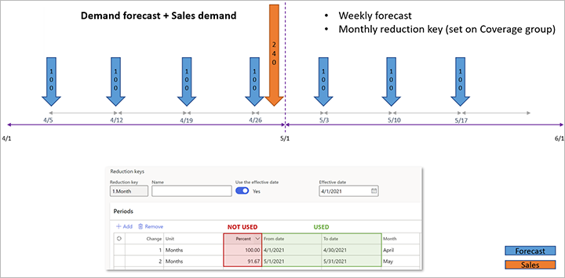
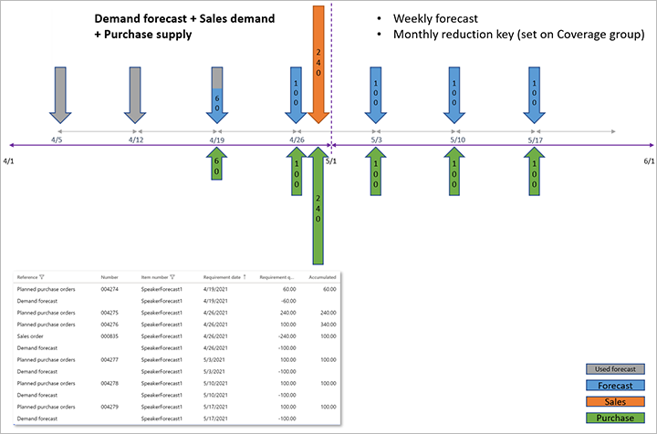
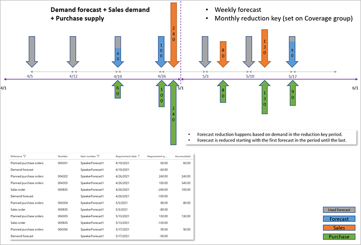

# Master planning with demand forecasts

[!include [banner](../../includes/banner.md)]

Use a demand forecast to account for expected demand in your master planning. You can manually create a demand forecast, import it, or generate it by using the demand forecasting functionality in Microsoft Dynamics 365 Supply Chain Management. For more information about demand forecasting, see [Demand forecasting overview](../introduction-demand-forecasting.md).

> [!NOTE]
> Planning Optimization doesn't support separate forecast planning. Therefore, the **Current forecast plan** setting on the **Master planning parameters** page has no effect when you use Planning Optimization.

## Set up a master plan to include a demand forecast

To configure a master plan so that it includes a demand forecast, follow these steps:

1. Go to **Master planning** > **Setup** > **Plans** > **Master plans**.
1. Select an existing plan, or create a new plan.
1. On the **General** FastTab, set the following fields:

    - **Forecast model** – Select the forecast model to apply. This model is considered when a supply suggestion is generated for the current master plan.
    - **Include demand forecast** – Set this option to *Yes* to include the demand forecast in the current master plan. If you set it to *No*, demand forecast transactions aren't included in the master plan.
    - **Method used to reduce forecast requirements** – Select the method that should be used to reduce forecast requirements. Learn more in the [Forecast reduction keys](#reduction-keys) section later in this article.

1. On the **Time fence in days** FastTab, set the following fields to specify the period that the demand forecast is included during:

    - **Forecast plan** – Set this option to *Yes* to override the forecast plan time fence that originates from the individual coverage groups. Set it to *No* to use the values from the individual coverage groups for the current master plan.
    - **Forecast time period** – If you set the **Forecast plan** option to *Yes*, specify the number of days (from today's date) that the demand forecast should be applied.

    > [!IMPORTANT]
    > Planning Optimization doesn't support the **Forecast plan** setting.

## Set up a coverage group to include a demand forecast

To configure a coverage group to include a demand forecast, follow these steps:

1. Go to **Master planning** > **Setup** > **Plans** > **Coverage groups**.
1. Select an existing coverage group, or create a new group.
1. On the **Other** FastTab, set the following fields:

    - **Forecast plan time fence** – Enter the number of days (from today's date) that the demand forecast should apply to. You can override this value by using the **Forecast plan** option on the master plan, as described in the previous section.
    - **Reduction key** – Select the reduction key to apply. Learn more in the [Create and set up a forecast reduction key](#create-reduction-key) and [Use a reduction key](#use-reduction-key) sections later in this article.
    - **Reduce forecast by** – For master plans where the **Method used to reduce forecast requirements** field is set to *Transactions - reduction key* or *Transactions - dynamic period*, specify which transactions should reduce the forecast. Select one of the following values:

        - **All transactions** – All transactions reduce the forecast.
        - **Orders** – Only sales orders reduce the forecast.

        > [!NOTE]
        > If you select *All transactions*, the system considers transactions that have both demand and supply in the same inventory dimensions neutral and it ignores them during the forecast reduction. For example, if the planning dimension is set to site only, not warehouse, the system ignores a transfer order between site 1, warehouse 11, and site 1, warehouse 13, and it doesn't reduce the remaining demand forecast.

    - **Include intercompany orders** – Set this option to *Yes* if intercompany orders should be included when the forecast is reduced. Otherwise, set it to *No*.
    - **Include customer forecast in the demand forecast** – Specify whether a customer forecast should be included in the overall forecast. This option determines how actual demand reduces the forecasted demand. Use it to ensure that master planning covers the supply of items that specific customers purchase.

        - Set this option to *Yes* to include a customer forecast in the overall forecast. In this case, actual customer demand reduces both the customer forecast and the overall forecast. Master planning generates planned orders to cover only the overall forecast quantity.
        - Set this option to *No* if you don't want to include a customer forecast in the overall forecast. In this case, actual customer demand reduces only the customer forecast. Master planning generates planned orders to cover both the overall forecast quantity and the forecast for each customer quantity.

## Forecast reduction keys

This section provides information about the different methods that reduce forecast requirements. It includes examples of the results of each method. It also explains how to create, set up, and use a forecast reduction key. Some methods use a forecast reduction key to reduce forecast requirements.

### Methods to reduce forecast requirements

When you include a forecast in a master plan, select how to reduce the forecast requirements when actual demand is included. Master planning excludes forecast requirements from the past, which means all forecast requirements before today's date.

To include a forecast in a master plan and select the method to reduce forecast requirements, go to **Master planning** > **Setup** > **Plans** > **Master plans**. In the **Forecast model** field, select a forecast model. In the **Method used to reduce forecast requirements** field, select a method. The following options are available:

- None
- Percent – reduction key
- Transactions – reduction key
- Transactions – dynamic period

The following sections provide more information about each option.

#### None

If you select *None*, the forecast requirements aren't reduced during master scheduling. In this case, master planning creates planned orders to supply the forecasted demand (forecast requirements). These planned orders maintain the suggested quantity, regardless of other types of demand. For example, if sales orders are placed, master planning creates additional planned orders to supply the sales orders. The quantity of the forecast requirements isn't reduced.

#### Percent – reduction key

If you select *Percent - reduction key*, the system reduces the forecast requirements according to the percentages and periods that the reduction key defines. In this case, master planning creates planned orders where the quantity is calculated as forecasted quantity × reduction key in each period. If other types of demand exist, master planning also creates planned orders to supply that demand.

##### Example: Percent – reduction key

This example shows how a reduction key reduces demand forecast requirements according to the percentages and periods that the reduction key defines.

For this example, you include the following demand forecast in a master plan.

| Month    | Demand forecast |
|----------|-----------------|
| January  | 1,000           |
| February | 1,000           |
| March    | 1,000           |
| April    | 1,000           |

On the **Reduction keys** page, you set up the following lines.

| Change | Unit  | Percent |
|--------|-------|---------|
| 1      | Month | 100     |
| 2      | Month | 75      |
| 3      | Month | 50      |
| 4      | Month | 25      |

You assign the reduction key to the item's coverage group. Then, on the **Master plans** page, in the **Method used to reduce forecast requirements** field, you select *Percent - reduction key*.

In this case, if you run forecast scheduling on January 1, the system consumes the demand forecast requirements according to the percentages that you set up on the **Reduction keys** page. The following requirement quantities are transferred to the master plan.

| Month                | Planned order quantity | Calculation    |
|----------------------|------------------------|----------------|
| January              | 0                      | = 0% × 1,000   |
| February             | 250                    | = 25% × 1,000  |
| March                | 500                    | = 50% × 1,000  |
| April                | 750                    | = 75% × 1,000  |
| May through December | 1,000                  | = 100% × 1,000 |

#### Transactions – reduction key

If you set the **Method used to reduce forecast requirements** field to *Transactions - reduction key*, the system reduces the forecast requirements by the qualified demand transactions that occur during the periods that the reduction key defines.

The **Reduce forecast by** field on the **Coverage groups** page defines the qualified demand. If you set the **Reduce forecast by** field to *Orders*, only sales order transactions are considered qualified demand. If you set it to *All transactions*, any non-intercompany issue inventory transactions are considered qualified demand. If intercompany sales orders should also be considered qualified demand, set the **Include intercompany orders** option to *Yes*.

Forecast reduction starts with the first (earliest) demand forecast record in the reduction key period. If the quantity of qualified inventory transactions is more than the quantity of demand forecast lines in the same reduction key period, the balance of inventory transactions quantity is used to reduce the demand forecast quantity in the previous period (if there's unconsumed forecast).

If no unconsumed forecast remains in the previous reduction key period, the balance of inventory transactions quantity reduces the forecast quantity in the next month (if there's unconsumed forecast).

The value of the **Percent** field on the reduction key lines isn't used when the **Method used to reduce forecast requirements** field is set to *Transactions - reduction key*. Only the dates define the reduction key period.

> [!NOTE]
> The system ignores any forecast that you post on or before today's date and doesn't use it to create planned orders. For example, if you generate your demand forecast for the month on January 1, and you run master planning that includes demand forecasting on January 2, the calculation ignores the demand forecast line that is dated January 1.

##### Example: Transactions – reduction key

This example shows how actual orders that occur during the periods that the reduction key defines reduce demand forecast requirements.

For this example, you select *Transactions - reduction key* in the **Method used to reduce forecast requirements** field on the **Master plans** page.

The following demand forecast lines exist on April 1.

| Date     | Number of pieces forecasted |
|----------|-----------------------------|
| April 5  | 100                         |
| April 12 | 100                         |
| April 19 | 100                         |
| April 26 | 100                         |
| May 3    | 100                         |
| May 10   | 100                         |
| May 17   | 100                         |

The following sales order lines exist in April.

| Date     | Number of pieces requested |
|----------|----------------------------|
| April 27 | 240                        |

The following requirement quantities are transferred to the master plan when master planning is run on April 1. As you see, the April forecast transactions were reduced by the demand quantity of 240 in a sequence, starting from the first of those transactions.

| Date     | Number of pieces required |
|----------|---------------------------|
| April 5  | 0                         |
| April 12 | 0                         |
| April 19 | 60                        |
| April 26 | 100                       |
| April 27 | 240                       |
| May 3    | 100                       |
| May 10   | 100                       |
| May 17   | 100                       |

Now, assume that you import new orders for the period of May.

The following sales order lines exist in May.

| Date   | Number of pieces requested |
|--------|----------------------------|
| May 4  | 80                         |
| May 11 | 130                        |

When you run master planning on April 1, the system transfers the following requirement quantities to the master plan. As you see, the demand quantity of 240 reduces the April forecast transactions in a sequence, starting from the first of those transactions. However, the demand quantity of 210 reduces the May forecast transactions, starting from the first demand forecast transaction in May. The totals per period are preserved (400 in April and 300 in May).

| Date     | Number of pieces required |
|----------|---------------------------|
| April 5  | 0                         |
| April 12 | 0                         |
| April 19 | 60                        |
| April 26 | 100                       |
| April 27 | 240                       |
| May 3    | 0                         |
| May 4    | 80                        |
| May 10   | 0                         |
| May 11   | 130                       |
| May 17   | 90                        |

#### Transactions – dynamic period

If you select *Transactions - dynamic period*, actual order transactions that occur during the dynamic period reduce the forecast requirements. The dynamic period covers the current forecast dates and ends at the start of the next forecast. In this case, master planning creates planned orders to supply the forecasted demand (forecast requirements). However, when you place actual order transactions, they reduce the forecast requirements. The actual transactions consume part of the forecasted requirements.

When you use this option, the following behavior occurs:

- Reduction keys aren't required or used.
- If the forecast is completely reduced, the forecast requirements for the current forecast become 0 (zero).
- If there's no future forecast, the system reduces forecast requirements from the last forecast that you entered.
- Time fences are included in the forecast reduction calculation.
- Positive days are included in the forecast reduction calculation.
- If actual order transactions exceed the forecasted requirements, the remaining transactions aren't forwarded to the next forecast period.

##### Example 1: Transactions – dynamic period

Here's a simple example that shows how the *Transactions - dynamic period* method works.

For this example, you include the following demand forecast in a master plan.

| Date       | Demand forecast |
|------------|-----------------|
| January 1  | 1,000           |
| February 1 | 1,000             |

You also create the following sales orders.

| Date        | Sales order quantity |
|-------------|----------------------|
| January 15  | 200                  |
| February 15 | 400                  |

In this case, the system creates the following planned orders.

| Demand forecast date | Quantity | Explanation                           |
|--------------------- |----------|---------------------------------------|
| January 1            | 800      | Forecast requirements (= 1,000 – 200) |
| January 15           | 200      | Sales orders requirements             |
| February 1           | 600      | Forecast requirements (= 1,000 – 400) |
| February 15          | 400      | Sales orders requirements             |

##### Example 2: Transactions – dynamic period

In most cases, systems are set up so that transactions reduce demand forecast in specific forecast periods: weeks, months, and so on. These periods are defined in the reduction key. However, the time between two demand forecast lines can also *imply* a period.

For this example, you create a demand forecast for the following dates and quantities.

| Date       | Demand forecast |
|------------|-----------------|
| January 1  | 1,000           |
| January 5  | 500             |
| January 12 | 1,000           |

Notice that, in this forecast, there isn't a clear period between the forecast dates. Between the first and second dates, there's a four-day span, and between the second and third dates there's a seven-day span. These spans are the dynamic periods.

You also create the following sales order lines.

| Date                             | Sales order quantity |
|----------------------------------|----------------------|
| December 15 in the previous year | 500                  |
| January 3                        | 100                  |
| January 10                       | 200                  |

The sales orders reduce the forecast in the following ways:

- Because the first sales order isn't in any period, it doesn't reduce any forecast.
- Because the second sales order is between January 1 and January 5, it reduces the forecast for January 1 by 100.
- Because the third sales order is between January 5 and January 12, it reduces the forecast for January 5 by 200.

Therefore, the system creates the following planned orders.

| Demand forecast date             | Quantity | Explanation                                                         |
|----------------------------------|----------|---------------------------------------------------------------------|
| December 15 in the previous year | 500      | Sales order requirements                                            |
| January 1                        | 900      | Forecast requirements period January 1 to January 5 (= 1,000 – 100) |
| January 3                        | 100      | Sales order requirements                                            |
| January 5                        | 300      | Forecast requirements period January 5 to January 10 (= 500 – 200)  |
| January 12                       | 1,000    | Forecast requirements period January 12 to end                      |

### Create and set up a forecast reduction key

A forecast reduction key is used in the *Transactions - reduction key* and *Percent- reduction key* methods for reducing forecast requirements. Follow these steps to create and set up a reduction key.

1. Go to **Master planning** > **Setup** > **Coverage** > **Reduction keys**.
1. Select **New** to create a reduction key.
1. In the **Reduction key** field, enter a unique identifier for the forecast reduction key. Then, in the **Name** field, enter a name.
1. Define the periods and the reduction key percentage in each period:

    - The **Effective date** field indicates the date when creation of the periods starts. When the **Use the effective date** option is set to *Yes*, the periods start on the effective date. When it's set to *No*, the periods start on the date when master planning is run.
    - Define the periods that the forecast reduction should occur during.
    - For a specific period, specify the percentages that the forecast requirements should be reduced by. Enter positive values to decrease requirements or negative values to increase requirements.

### Use a reduction key

A forecast reduction key must be assigned to the coverage group of the item. Follow these steps to assign a reduction key to an item's coverage group.

1. Go to **Master planning** > **Setup** > **Coverage** > **Coverage groups**.
1. On the **Other** FastTab, in the **Reduction key** field, select the reduction key to assign to the coverage group. The reduction key then applies to all items that belong to the coverage group.
1. To use a reduction key to calculate forecast reduction during master scheduling, you must define this setting in the setup of the forecast plan or the master plan. Go to one of the following locations:

    - **Master planning** > **Setup** > **Plans** > **Forecast plans**
    - **Master planning** > **Setup** > **Plans** > **Master plans**

1. On the **Forecast plans** or **Master plans** page, on the **General** FastTab, in the **Method used to reduce forecast requirements** field, select either *Percent - reduction key* or *Transactions - reduction key*.

### Reduce a forecast by transactions

When you select *Transactions - reduction key* or *Transactions - dynamic period* as the method for reducing forecast requirements, you can specify which transactions reduce the forecast. On the **Coverage groups** page, on the **Other** FastTab, in the **Reduce forecast by** field, select *All transactions* if all transactions should reduce the forecast or *Orders* if only sales orders should reduce the forecast.

## Consider customer, customer group, required BOM, and required Route in demand forecast reduction

Each demand forecast line can specify a customer, a customer group, a *required BOM*, and a *required Route*. When you turn on the *Consider BOM and route in supply- and demand forecast reduction with Planning Optimization* feature in [Feature management](../../../fin-ops-core/fin-ops/get-started/feature-management/feature-management-overview.md), Planning Optimization respects all four of these dimensions when it decides whether an existing demand transaction (such as a sales order line) reduces a forecast line.

### Prerequisites

Before you can use the BOM and route forecast reduction behavior described in this section, your system must meet the following requirements:

- You must be running Microsoft Dynamics 365 Supply Chain Management version 10.0.49 or later.
- The feature named *Consider BOM and route in supply- and demand forecast reduction with Planning Optimization* must be turned on in [Feature management](../../../fin-ops-core/fin-ops/get-started/feature-management/feature-management-overview.md).

### Matching principle

The behavior follows a single principle:

> A transaction reduces a forecast line only when, for every dimension the forecast line specifies, the transaction either matches that value or doesn't specify a value for that dimension. A transaction that specifies a different value than the forecast line for any dimension can't reduce that forecast line.

In other words, a transaction can be at the same specificity as the forecast line or less specific, but it can't be specific in a *different* way.

### Specificity rules for demand forecast lines

The principle leads to the following rules. In each rule, *transaction* refers to a sales order line (or, when the coverage group is set to **All transactions**, any qualifying issue inventory transaction) that would otherwise reduce the forecast.

- A forecast line that specifies both a required BOM and a required Route is reduced only by transactions that specify the same BOM and the same route, or that leave one or both of those values blank.
- A forecast line that specifies a required BOM but no required Route is reduced by transactions that specify the same BOM (regardless of route) and by transactions that specify no BOM.
- A forecast line that specifies a required Route but no required BOM is reduced by transactions that specify the same route (regardless of BOM) and by transactions that specify no route.
- A forecast line that specifies neither a required BOM nor a required Route is reduced by any otherwise-qualifying transaction.
- A transaction that specifies neither a BOM nor a route can reduce any forecast line, regardless of how specific that forecast line is.

The same principle applies to the customer and customer group dimensions on the forecast line: a sales order for a specific customer can reduce a forecast line that specifies the same customer, or that specifies only the customer group that the customer belongs to, or that specifies no customer or customer group. A sales order for a different customer can't reduce a customer-specific forecast line.

The following table summarizes the matching behavior for the BOM and route dimensions. A *Yes* indicates that the transaction reduces the forecast line. A *No* indicates that the transaction doesn't reduce the forecast line because it specifies a conflicting value.

| Forecast line specifies                | Tx (B1, R1) | Tx (B1, R2) | Tx (B2, R1) | Tx (B1, –) | Tx (–, R1) | Tx (–, –) |
|----------------------------------------|:-----------:|:-----------:|:-----------:|:----------:|:----------:|:---------:|
| required BOM = B1, required Route = R1 | Yes         | No          | No          | Yes        | Yes        | Yes       |
| required BOM = B1 only                 | Yes         | Yes         | No          | Yes        | Yes        | Yes       |
| required Route = R1 only               | Yes         | No          | Yes         | Yes        | Yes        | Yes       |
| Neither specified                      | Yes         | Yes         | Yes         | Yes        | Yes        | Yes       |

> [!NOTE]
> This specificity logic is independent of the **Include customer forecast in the demand forecast** option on the coverage group. That option still controls whether a customer-specific forecast also reduces (and contributes to) the overall forecast. The rules in this section determine which transactions are *eligible* to reduce a given forecast line in the first place.

### Example: Two demand forecast lines with different required BOMs

You have an item that has the following demand forecast lines.

| Model    | Date     | Quantity | Unit | Customer | Customer group | Required BOM | Required Route | Site | Warehouse |
|----------|----------|----------|------|----------|----------------|--------------|----------------|------|-----------|
| CurrentF | 10/10/22 | 10       | ea   |          |                | B1           |                | 1    | 11        |
| CurrentF | 10/10/22 | 10       | ea   |          |                | B2           |                | 1    | 11        |

A sales order line exists for a quantity of *15 ea* with BOM *B2*, dated within the same forecast period.

The system behaves differently based on whether the *Consider BOM and route in supply- and demand forecast reduction with Planning Optimization* feature is turned on:

- **When the feature is turned *off*** – The sales order reduces the demand forecast in the order that the lines are encountered, without checking the BOM. The first line is reduced to *0*, the second line is reduced to *5*, and Planning Optimization creates a planned order to cover the residual *5 ea* of forecast on the second line.
- **When the feature is turned *on*** – Only the second line matches the sales order's BOM. The sales order reduces the second line to *0* and leaves the first line at *10*. Planning Optimization then creates a planned order to cover the *10 ea* of remaining demand with BOM *B1*, plus a planned order to cover the *15 ea* of sales-order demand with BOM *B2*.

### Example: Combined customer, customer group, required BOM, and required Route

You have an item that has the following demand forecast lines. Customer *Cust-1* belongs to customer group *CG-1*. Customer *Cust-2* doesn't belong to customer group *CG-1*.

| Line | Quantity | Customer | Customer group | Required BOM | Required Route |
|------|----------|----------|----------------|--------------|----------------|
| L1   | 10       | Cust-1   | CG-1           | B1           | R1             |
| L2   | 10       |          | CG-1           | B1           |                |
| L3   | 10       |          |                |              | R1             |
| L4   | 10       |          |                |              |                |

The following sales order lines exist for the same item, site, and warehouse within the same forecast period.

| Sales order | Quantity | Customer | BOM | Route |
|-------------|----------|----------|-----|-------|
| SO-A        | 5        | Cust-1   | B1  | R1    |
| SO-B        | 5        | Cust-1   | B1  |       |
| SO-C        | 5        | Cust-2   | B1  | R1    |
| SO-D        | 5        |          |     |       |

With the feature turned on, Planning Optimization evaluates each sales order against each forecast line. When a sales order can reduce more than one forecast line, Planning Optimization applies the reduction to the most specific matching line first, so that less-specific forecast lines remain available to cover other demand.

- *SO-A* (Cust-1, B1, R1) matches every dimension of *L1*. It also matches *L2* (the customer belongs to *CG-1*, the BOM matches, and *L2* doesn't constrain the route), but *L1* is more specific, so it reduces *L1* by *5*.
- *SO-B* (Cust-1, B1, no route) matches the customer and BOM of *L1* and is less specific on route, so it also reduces *L1* by *5*. *L1* is now fully consumed.
- *SO-C* (Cust-2, B1, R1) can't reduce *L1* or *L2*, because *Cust-2* doesn't match *L1*'s customer and doesn't belong to *L2*'s customer group. It does match *L3* on route (and is allowed to be more specific than the forecast line on the other dimensions), so it reduces *L3* by *5*.
- *SO-D* (no customer, no BOM, no route) is fully unspecified, so it can reduce any remaining forecast line. Planning Optimization applies it to the most specific line that still has open quantity, which is *L2*, reducing *L2* by *5*.

The residual demand forecast quantities are *L1* = 0, *L2* = 5, *L3* = 5, and *L4* = 10. Planning Optimization creates planned orders to cover this residual demand together with the sales-order demand.

> [!NOTE]
> When the feature is turned on, the same BOM and route matching also applies to demand transactions that have already been processed within the forecast period–for example, invoiced sales orders. The BOM and route that were specified on the original sales order are honored when the order reduces a forecast line, just as they are for open sales orders.
>
> Reduction by already-processed transactions is itself controlled by a separate feature management feature: *Include invoiced and delivered orders during supply and demand forecast reduction for planning optimization*. That feature must also be turned on for processed orders to participate in forecast reduction at all. The *Consider BOM and route in supply- and demand forecast reduction with Planning Optimization* feature then governs how the BOM and route on those processed orders are matched.

The same rules apply to supply forecasts. Learn more in [Consider sub-BOM and sub-Route in supply forecast reduction](supply-forecast.md#consider-sub-bom-and-sub-route-in-supply-forecast-reduction).

## Forecast models and submodels

This section describes how to create forecast models and how to combine multiple forecast models by setting up submodels.

A *forecast model* names and identifies a specific forecast. After you create the forecast model, you can add forecast lines to it. To add forecast lines for multiple items, use the **Demand forecast lines** page. To add forecast lines for a specific selected item, use the **Released products** page.

A forecast model can include forecasts from other forecast models. To achieve this result, add other forecast models as *submodels* of a parent forecast model. You must create each relevant model before you can add it as a submodel of a parent forecast model.

The resulting structure gives you a powerful way to control forecasts, because it lets you combine (aggregate) the input from multiple individual forecasts. Therefore, from a planning point of view, it's easy to combine forecasts for simulations. For example, you might set up a simulation that is based on the combination of a regular forecast with the forecast for a spring promotion.

### Submodel levels

You can add unlimited submodels to a parent forecast model. However, the structure can be only one level deep. In other words, a forecast model that is a submodel of another forecast model can't have its own submodels. When you add submodels to a forecast model, the system checks whether that forecast model is already a submodel of another forecast model.

If master planning encounters a submodel that has its own submodels, you receive an error message.

#### Submodel levels example

Forecast model A has forecast model B as a submodel. Therefore, forecast model B can't have its own submodels. If you try to add a submodel to forecast model B, you receive the following error message: "Forecast model B is a submodel for model A."

### Aggregating forecasts across forecast models

The system aggregates forecast lines that occur on the same day across their forecast model and its submodels.

#### Aggregation example

Forecast model A has forecast models B and C as submodels.

- Forecast model A includes a demand forecast for 2 pieces (pcs) on June 15.
- Forecast model B includes a demand forecast for 3 pcs on June 15.
- Forecast model C includes a demand forecast for 4 pcs on June 15.

The resulting demand forecast is a single demand for 9 pcs (2 + 3 + 4) on June 15.

> [!NOTE]
> Each submodel uses its own parameters, not the parameters of the parent forecast model.

### Create a forecast model

To create a forecast model, follow these steps:

1. Go to **Master planning** > **Setup** > **Demand forecasting** > **Forecast models**.
1. On the Action Pane, select **New**.
1. Set the following fields for the new forecast model:

    - **Model** – Enter a unique identifier for the model.
    - **Name** – Enter a descriptive name for the model.
    - **Stopped** – Usually, you should set this option to *No*. Set it to *Yes* only if you want to prevent editing of all forecast lines that are assigned to the model.

    > [!NOTE]
    > The **Include in cash flow forecasts** field and the fields on the **Project** FastTab aren't related to master planning. Therefore, you can ignore them in this context. Consider them only when you work with forecasts for the **Project management and accounting** module.

### Assign submodels to a forecast model

To assign submodels to a forecast model, follow these steps:

1. Go to **Inventory management** > **Setup** > **Forecast** > **Forecast models**.
1. In the list pane, select the forecast model to set up a submodel for.
1. On the **Submodel** FastTab, select **Add** to add a row to the grid.
1. In the new row, set the following fields:

    - **Submodel** – Select the forecast model to add as a submodel. This forecast model must already exist, and it must not have any submodels of its own.
    - **Name** – Enter a descriptive name for the submodel. For example, this name might indicate the submodel's relation to the parent forecast model.

[!INCLUDE[footer-include](../../../includes/footer-banner.md)]
