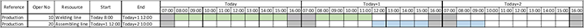
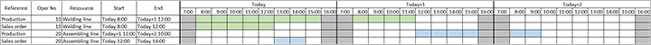
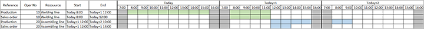
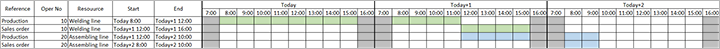

# Finite capacity planning and scheduling

[!include [banner](../../includes/banner.md)]

Finite capacity is an approach that helps you understand how much work can be produced during a specific period when limitations on different resources are taken into consideration. The purpose of finite capacity scheduling is to ensure that work proceeds at an even and efficient pace throughout the plant.

Finite capacity planning and scheduling creates a more realistic schedule for the production processes than the infinite loading approach creates. If there isn't enough capacity on the resources, the delivery date will be pushed out, and the job will be scheduled when there is enough capacity.

> [!NOTE]
> Finite capacity planning and scheduling works in nearly the same way, regardless of whether you use Planning Optimization or the deprecated master planning engine. However, Planning Optimization doesn't use the **Bottleneck time** fence parameter. When you use Planning Optimization, bottleneck resources are always scheduled by using the same time fence as non-bottleneck resources (as indicated by the finite capacity time fence).

## Set up finite capacity functionality

To use finite capacity functionality, you must enable capacity planning globally, and you must enable finite capacity planning both for the master plan where you want to use it and for each resource where it applies. For plans and resources where finite capacity is enabled, scheduling of planned production orders will consider capacity that has already been reserved. Planned production orders are backward-scheduled from the requirement date. If capacity isn't available to meet the optimal schedule, the system will try to require component items on an earlier date. If your capacity can change as requirements change (for example, when you're working with shifts), you should not use finite capacity functionality, because the calculated processing times won't be correct. Scheduling considers only capacity that is already reserved for resources where finite capacity is enabled. By enabling finite capacity for a resource, you make it possible to modify the finite capacity time fence.

### Activate Master planning parameters

To use finite capacity functionality, you must enable capacity planning on the **Master planning parameters** page.

1. Go to **Master planning \> Setup \> Master planning parameters**.
1. On the **Planned orders** tab, in the **Capacity planning** section, set the **Production** option to *Yes*.

### Activate a master plan

You must enable finite capacity planning and scheduling for each master plan where you want to use it.

1. Go to **Master planning \> Setup \> Plans \> Master plans**.
1. In the list pane, select a master plan that you want to set up to use finite capacity planning and scheduling.
1. On the **General** FastTab, in the **Planned production orders** section, set the **Finite capacity** option to *Yes*.
1. Repeat steps 2 and 3 for each additional master plan that you want to set up.

### Activate resources

You must enable finite capacity planning and scheduling for each resource where you want to use it.

1. Go to **Production control \> Setup \> Resources \> Resources**.
1. In the list pane, select a resource that you want to set up to use finite capacity planning and scheduling.
1. On the **Operation** FastTab, in the **Capacity button** section, set the **Finite capacity** option to *Yes*.
1. Repeat steps 2 and 3 for each additional resource that you want to set up.

## Examples

This section provides the following examples that show how to work with both infinite and finite capacity planning and scheduling:

- Example 1 – Infinite capacity planning
- Example 2 – Finite capacity planning with a time fence of one day
- Example 3 – Finite capacity planning with a time fence of two days

### Preconditions

All three examples assume the preconditions that are described in this section.

Product *Product1* has a route that contains the following operations.

| Operation no. | Operation name | Resource        | Run time | Process qty. | Next |
|---------------|----------------|-----------------|----------|--------------|------|
| 10            | Welding        | Welding line    | 1        | 2            | 20   |
| 20            | Assembling     | Assembling line | 1        | 4            |      |

Workers at your company work in one shift for eight hours (8:00–16:00).

There is a scheduled production order for *24 pcs* of *Product1*. It has a delivery date of *Today + 3 days*.

As a result of planning, the system loads the resources in the following way:

- **Welding line:** This resource is loaded from *Today at 8:00* until *Today + 1 at 12:00*.
- **Assembling line:** This resource is loaded from *Today + 1 at 12:00* until *Today + 2 at 10:00*.

The following illustration shows the resulting Gantt chart (select it for a larger view).

### Example 1 – Infinite capacity planning

This example shows the planning results when you use infinite capacity planning instead of finite capacity planning.

The master plan has the following relevant setting, which disables finite capacity planning for the plan:

- **Finite capacity:** *No*

The **Finite capacity** option is also set to *No* for both the relevant resources to disable finite capacity planning for them:

- Welding line
- Assembling line

You now add a new sales order for *8 pcs* of *Product1* and run the plan. As a result, the system loads the welding line from *Today at 8:00* until *Today at 12:00*. After operations on the welding line are completed, the system will load the assembling line from *Today at 12:00* until *Today at 14:00*.

The following illustration shows the resulting Gantt chart (select it for a larger view).

### Example 2 – Finite capacity planning with a time fence of one day

This example shows planning results when you use finite capacity planning and a time fence of one day.

The master plan has the following relevant settings, which enable finite capacity planning and set a time fence for the plan:

- **Finite capacity:** *Yes*
- **Finite capacity time fence:** *1*

The **Finite capacity** option is also set to *Yes* for both the relevant resources to enable finite capacity planning for them:

- Welding line
- Assembling line

You now add a new sales order for *8 pcs* of *Product1* and run the plan. As a result, the system loads the welding line from *Today + 1 at 8:00* until *Today + 1 at 12:00*. After operations on the welding line are completed, the system will load the assembling line from *Today + 1 at 12:00* until *Today + 1 at 14:00*. The system considers the finite capacity for only one day.

The following illustration shows the resulting Gantt chart (select it for a larger view).

### Example 3 – Finite capacity planning with a time fence of two days

This example shows planning results when you use finite capacity planning and a time fence of two days.

The master plan has the following relevant settings, which enable finite capacity planning and set a time fence for the plan:

- **Finite capacity:** *Yes*
- **Finite capacity time fence:** *2*

The **Finite capacity** option is also set to *Yes* for both the relevant resources to enable finite capacity planning for them:

- Welding line
- Assembling line

You now add a new sales order for *8 pcs* of *Product1* and run the plan. As a result, the system loads the welding line from *Today + 1 at 12:00* until *Today + 1 at 16:00*. After operations on the welding line are completed, the system will load the assembling line from *Today + 2 at 8:00* until *Today + 2 at 10:00*. The system considers the finite capacity for only two days.

The following illustration shows the resulting Gantt chart (select it for a larger view).

> [!IMPORTANT]
> You should always set the finite capacity time fence as required to fit your business needs. The examples that are provided in this article merely illustrate the functionality. In reality, a single-day time fence is probably too low for most manufacturers that use finite capacity planning.
