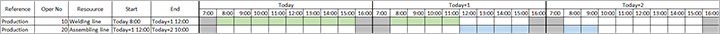

# Finite capacity planning and scheduling

[!include [banner](../includes/banner.md)]

Finite capacity is an approach to understanding how much work can be produced in a certain time period, taking limitations on different resources into consideration. The goal of finite capacity scheduling is to ensure that work proceeds at an even and efficient pace throughout the plant.

Finite capacity planning and scheduling creates a more realistic schedule for the production processes than the infinite loading approach. If there is not enough capacity on the resources, the delivery date will be pushed out and the job will be scheduled when there is enough capacity.

## Planning Optimization support for finite capacity planning

Finite capacity planning and scheduling works nearly the same way regardless of whether you using Planning Optimization or the built-in planning engine. However, the **Bottleneck time** fence parameter isn't used by Planning Optimization. When you use Planning Optimization, bottleneck resources are always scheduled using the same time fence as non-bottleneck resources (as indicated by the finite capacity time fence).

## Set up finite capacity functionality

To use finite capacity functionality, you must enable capacity planning globally, and enable finite capacity planning both for the master plan where you want to use it and for each resource where it applies. For plans and resources where finite capacity is enabled, scheduling of planned production orders will consider capacity that has already been reserved. Planned production orders are backward-scheduled from the requirement date. If capacity isn't available to meet the optimal schedule, the system will try to require component items on an earlier date. If your capacity can change as requirements change (such as when working with shifts), you shouldn't use finite capacity functionality because the calculated processing times won't be correct. Scheduling only considers capacity that is already reserved for resources where finite capacity is enabled. Enabling finite capacity for a resource makes it possible to modify the finite capacity time fence.

### Activate Master planning parameters

To use finite capacity functionality, you must enable capacity planning on the **Master planning parameters** page, as described in the following procedure.

1. Go to **Master planning > Setup > Master planning parameters**.
1. Open the **Planned orders** tab.
1. In the **Capacity planning** field group, set **Production** to *Yes*.

### Activate a Master plan

You must enable finite capacity planning and scheduling for each master plan where you want to use it, as described in the following procedure.

1. Go to **Master planning > Setup > Plans > Master plans**.
1. On the list pane, select a master plan you want to set up to use finite capacity planning and scheduling.
1. Expand the **General** FastTab.
1. In the **Planned production orders** field group, set **Finite capacity** to *Yes*.
1. Repeat this procedure as needed to set up each relevant master plan.

### Activate resources

You must enable finite capacity planning and scheduling for each resource where you want to use it, as described in the following procedure.

1. Go to **Production control > Setup > Resources > Resources**.
1. On the list pane, select a resource you want to set up to use finite capacity planning and scheduling.
1. Expand the **Operation** FastTab.
1. In the **Capacity button** field group, set **Finite capacity** to *Yes*.
1. Repeat this procedure as needed to set up each relevant resource.

## Examples

This section provides the following examples of how to work with both infinite and finite capacity planning and scheduling:

- Example 1 – Infinite capacity
- Example 2 – Finite capacity with time fence 1 day
- Example 3 – Finite capacity with time fence 2 days

### Preconditions

Each of the examples assumes the preconditions described in this section.

There is a product *Product-1* with route that contains the operations listed in the following table.

| Operation no. | Operation name | Resource        | Run time | Process qty. | Next |
|---------------|----------------|-----------------|----------|--------------|------|
| 10            | Welding        | Welding line    | 1        | 2            | 20   |
| 20            | Assembling     | Assembling line | 1        | 4            |      |

Workers at your company work in one shift for 8 hours (8:00 – 16:00).

There is a scheduled production order for *24 pcs* of *Product-1* with delivery date of *Today + 3 days*.

As a result of planning, the system loads the resources as follows:

- **Welding line** – Loaded from *Today at 8:00* until *Today + 1 day at 12:00*
- **Assembling line** – Loaded from *Today + 1 day at 12:00* until *Today + 2 days at 10:00*.

The following image shows the resulting Gantt chart (select to enlarge).

### Example 1 – Infinite capacity

This example shows planning results when you use infinite capacity planning instead of finite capacity planning.

The master plan as the following relevant setting:

- **Finite capacity:** *No* <!-- KFM: Continue here. -->

Resource:

Welding line: **Finite capacity** = *No*

Assembling line: **Finite capacity** = *No*

A new Sales order for 8 pcs for *Product-1* is added

As the result of planning the system will load Welding line starting from Today 8:00 till Today 12:00 and after finishing operations on Welding line, Assembling line will be load from Today 12:00 till 14:00.

The Gantt diagram you can find on the picture below:

### Example 2 – Finite capacity with time fence 1 day

Master plan:

**Finite capacity** = *Yes*

**Finite capacity time fence** = 1

Resource:

Welding line: **Finite capacity** = *Yes*

Assembling line: **Finite capacity** = *Yes*

A new Sales order for 8 pcs for *Product-1* is added

Considering added Sales order and as the result of planning the system will load Welding line starting from Today+1 8:00 till Today+1 12:00 and after finishing operations on Welding line, Assembling line will be load from Today+1 12:00 till 14:00. The system considers the Finite capacity only for 1 day.

The Gantt diagram you can find on the picture below:

### Example 3 – Finite capacity with time fence 2 days

Master plan:

**Finite capacity** = *Yes*

**Finite capacity time fence** = 2

Resource:

Welding line: **Finite capacity** = *Yes*

Assembling line: **Finite capacity** = *Yes*

A new Sales order for 8 pcs for *Product-1* is added

Considering added Sales order and as the result of planning the system will load Welding line starting from Today+1 12:00 till Today+1 16:00 and after finishing operations on Welding line, Assembling line will be load from Today+2 8:00 till 10:00. The system considers the Finite capacity for 2 days.

The Gantt diagram you can find on the picture below:

It is always recommended to set the time fence for finite capacity to fit your business needs, the above examples are to showcase the functionality and a day of finite capacity would be too low for most manufacturers.
