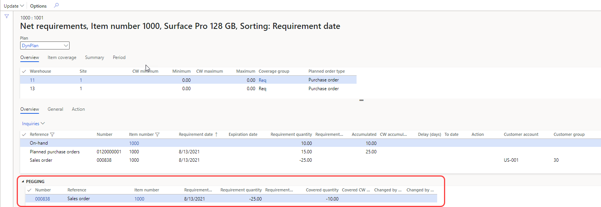
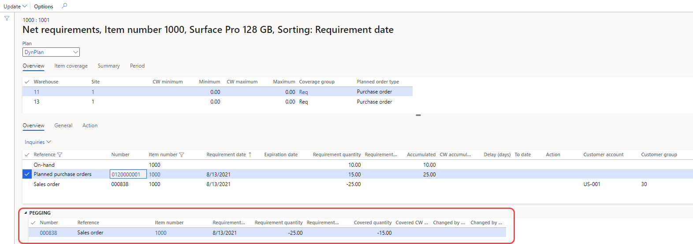

# Net requirements and pegging information

[!include [banner](../../includes/banner.md)]

When you run master planning, it's important that you understand its output, how existing supply covers the demand, and why specific supply was generated. You can use the **Net requirements** page to better understand the calculated requirements that master planning produces.

The **Net requirements** page shows the net requirements that master planning calculated for the product. It also shows the coverage settings that were applied during the master planning run, a breakdown of the requirements totals by transaction type, and pegging information.

## Open the Net requirements page

You can open the **Net requirements** page in any of the following ways:

- Go to **Product information management \> Products \> Released products**. Select or open a product. Then, on the Action Pane, on the **Plan** tab, in the **Requirement** group, select **Net requirements**.
- Go to **Sales and marketing \> Sales orders \> All sales orders**. Open a sales order. Then, on the **Sales order lines** FastTab, on the toolbar, select **Product and supply \> Net requirements**.
- Go to **Master planning \> Master planning \> Planned orders**. Select or open a planned order. Then, on the Action Pane, on the **View** tab, in the **Requirements** group, select **Requirement profile**.

## Use the Net requirements page

The **Net requirements** page consists of upper and lower sections. The Action Pane on this page includes an **Update** button.

### Update the Net requirements page to reflect new supply and demand

Before new supply or demand will appear among the net requirements of an item, you must do one of the following:

- Run a master plan that includes the item.
- Open the **Net requirements** page for the item and then, from the Action Pane, select **Update > Master planning**. This action runs master planning for the selected item.

For example, if you manually create a planned order (supply), change an existing planned order (supply), or create sales order (demand), the changes won't appear on an item's **Net requirements** page until after master planning runs for that item.

### Select a master plan to view

Before you review the net requirements of the product, be sure to select the relevant master plan in the **Plan** field at the top of the page.

### Upper section

The upper section of the page provides the following tabs:

- **Overview** – View the item requirements of the product dimensions.
- **Item coverage** – View the coverage settings that were used during the calculation of requirements.
- **Summary** – View a breakdown of the requirements totals by transaction type.
- **Period** – View the receipts, issues, and projected available inventory for each period that is defined by the period template. You can also get a graphical view of the projected available inventory.

### Lower section

The lower section of the page provides the following tabs:

- **Overview** – View the list of product requirements that were calculated during the master planning run, together with issue and receipt transactions that correspond to the requirements. By default, the list is sorted by requirement date. When you select a requirement, the **Pegging** FastTab in the lower section shows either the source of the requirement or the transactions that fulfill the requirement.
- **General** – View detailed information about the selected requirement.
- **Action** – View action messages for the requirements.

### The Action Pane

The following commands are available on the Action Pane:

- **Update \> Master planning** – Run master planning directly from the **Net requirements** page.
- **Update \> Forecast planning** – Run forecast planning directly from the **Net requirements** page. Planning Optimization doesn't support this operation.
- **Update \> Continuity scheduling** – Run continuity scheduling directly from the **Net requirements** page. Planning Optimization doesn't support this operation.

## Example scenario

This example shows how pegging information is presented on the **Net requirements** page.

### Prerequisites

Before you work through the scenario, prepare the following prerequisites:

1. You must work on a system where the standard sample data is available, and you must set the legal entity to *USMF*.
2. This example uses product *1000*, which is part of the USMF sample data. Make sure that this product is available, and that it is set up in the following way:

    - **Default order type:** *Purchase order*
    - **Inventory on-hand:** *10.00*

3. Create a sales order for a quantity of *25.00* of product *1000*. Use the storage dimensions where on-hand inventory is located.
4. Run master planning for the *DynPlan* master plan.

### Review the calculated requirements

Next, you will open the **Net requirements** page for product *1000* to review how calculated requirements correspond to each other.

1. Go to **Product information management \> Products \> Released products**.
1. Select the product that has an **Item number** value of *1000*.
1. On the Action Pane, on the **Plan** tab, in the **Requirement** group, select **Net requirements**.
1. On the **Net requirements** page, set the **Plan** field to *DynPlan*.
1. On the **Overview** tab in the lower part of the page, verify that the following requirements are listed as rows in the grid.

    | Reference | Requirement quantity | Accumulated |
    |---|---|---|
    | On-hand | 10.00 | 10.00 |
    | Planned purchase orders | 15.00 | 25.00 |
    | Sales order | -25.00 | (Blank) |

    > [!NOTE]
    > The **Requirement quantity** field represents the total quantity that the requirement either requires (if the value is negative) or supplies (if the value is positive). The **Accumulated** field represents the total receipt and issue quantities that accumulated up through the selected period.

1. Select the *On-hand* requirement line, and then, on the **Pegging** FastTab, review the requirements that are covered by this supply. The following row should appear there.

    | Reference | Requirement quantity | Covered quantity |
    |---|---|---|
    | Sales order | -25.00 | -10.00 |

    The existing on-hand inventory partially covers the demand that comes from the sales order.

    

1. Select the *Planned purchase orders* requirement line, and then, on the **Pegging** FastTab, review the requirements that are covered by this supply. The following row should appear there.

    | Reference | Requirement quantity | Covered quantity |
    |---|---|---|
    | Sales order | -25.00 | -15.00 |

    Because the sales order has already been partially covered, the system creates a planned purchase order for the remaining uncovered quantity.

    

1. Select the *Sales order* requirement line, and then, on the **Pegging** FastTab, review the requirements that cover this demand. The following rows should appear there.

    | Reference | Requirement quantity | Covered quantity |
    |---|---|---|
    | On-hand | 10.00 | 10.00 |
    | Planned purchase orders | 15.00 | 15.00 |

    

> [!NOTE]
> The *Safety stock* requirement isn't included on the **Net requirements** page.

[!INCLUDE[footer-include](../../../includes/footer-banner.md)]
