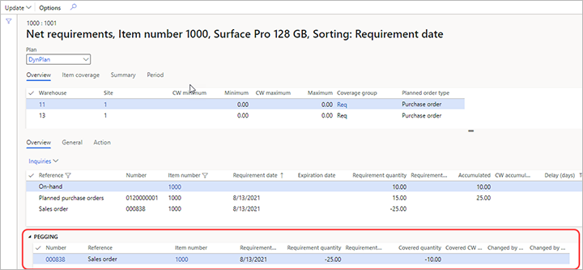

# Net requirements and pegging information with Planning Optimization

[!include [banner](../../includes/banner.md)]

When you run master planning in Planning Optimization, it is important to understand its output, how existing supply covers the demand, and why specific supply was generated. You can use the **Net requirements** page to better understand the calculated requirements that are the results of master planning.

The **Net requirements** page displays the net requirements calculated for the product by Planning Optimization. This page also shows the coverage settings that were applied during the master planning run, the breakdown of the requirements totals according to transaction type, and pegging information.

## Open the Net requirements page

You can access the **Net requirements** page in any of the following ways:

- Go to **Product information management > Products > Released products**. Select or open a product. On the Action pane, open the **Plan** tab and, in the **Requirement** group, select **Net requirements**.
- Go to **Sales and marketing > Sales orders > All sales orders**. Open a sales order. On the **Sales order lines** FastTab, select **Product and supply > Net requirements** from the toolbar.
- Go to **Master planning > Master planning > Planned orders**. Select or open a planned order. On the Action pane, open the **View** tab and, in the **Requirements** group, select **Requirement profile**.

## Use the Net requirements page

The **Net requirements** page consists of upper and lower sections, and its Action Pane includes an **Update** button with options.

### Choose a master plan to view

Before reviewing the net requirements of the product, be sure to select the relevant master plan in the **Plan** field at the top of the **Net requirements** page.

### The upper section

The upper section of the page provides the following tabs:

- **Overview** – Shows the item requirements of the product dimensions.
- **Item coverage** – Shows the coverage settings that were used during requirements calculation.
- **Summary** – Shows a breakdown of the requirements totals according to transaction type.
- **Period** – Shows the receipts, issues, and projected available inventory for each of the periods defined by the period template. You can also get a graphical view of the projected available inventory.

### The bottom section

The bottom section of the page provides the following tabs:

- **Overview** – Shows the list of the product requirements calculated during the master planning together with issue and receipt transactions corresponding to requirements. The list is sorted by **Requirement date** by default. When you select a requirement, the **Pegging** FastTab in the bottom section displays either the source of the requirement or the transactions that fulfill the requirement.
- **General** – Shows detailed information of the selected requirement.
- **Action** – Shows action messages for the requirements.

### The Action Pane

Teh following commands are available on the Action Pane:

- **Update \> Master planning** – Run master planning directly from the **Net requirements** page.
- **Update \> Forecast planning** – Run forecast planning directly from the **Net requirements** page. This operation is not yet supported by Planning Optimization.
- **Update \> Continuity scheduling** – Run continuity scheduling directly from the **Net requirements** page. This operation is not yet supported by Planning Optimization.

## Example scenario

This example shows how pegging information is present on the **Net requirements** page.

### Prerequisites

Before working through the scenario, prepare the following prerequisites:

- You must work on a system where the standard sample date is available, and set the legal entity to *USMF*
- This example uses product *1000*, which is part of the USMF sample data. Make sure this product is available and set up as follows:
  - **Default order type:** *Purchase order*
  - **Inventory on-hand:** *10.00*
- Create a sales order for a quantity of *25.00* of the product *1000*, use the storage dimensions where on-hand is located.
- Run master planning for *DynPlan* master plan.

### Review the calculated requirements

Now you will open the **Net requirements** page for the product *1000* to review how calculated requirements correspond to each other.

1. Go to **Product information management > Products > Released products**.
1. Select the product with **Item number** *1000*.
1. On the Action pane, open the **Plan** tab and, in the **Requirement** group, select **Net requirements**.
1. On the **Net requirements** page, set **Plan** to *DynPlan*.
1. Select the **Overview** tab in the bottom section of the page.
1. Verify following requirements are listed as rows on the grid:

    - **Reference:** *On-hand* | **Requirement quantity:** *10.00* | **Accumulated:** *10.00*
    - **Reference:** *Planned purchase orders* | **Requirement quantity:** *15.00* | **Accumulated:** *25.00*
    - **Reference:** *Sales order* | **Requirement quantity:** *-25.00* | **Accumulated:** *blank*

    > [!NOTE]
    > The **Requirement quantity** field represents the total quantity required by the requirement (negative sign) or supplied by it (positive sign). The **Accumulated** field represents the total receipt and issue quantities accumulated up to the selected period.

1. Select the *On-hand* requirement line and, under the **Pegging** FastTab, review the requirements that are covered by this supply. The following row should appear here:

    - **Reference:** *Sales order* | **Requirement quantity:** *-25.00* | **Covered quantity:** *-10.00*

    The existing on-hand partially covers the demand that comes from the sales order.

    

1. Select the *Planned purchase orders* requirement line and, under the **Pegging** FastTab, review the requirements that are covered by this supply. The following row should appear here:

    - **Reference:** *Sales order* | **Requirement quantity:** *-25.00* | **Covered quantity:** *-15.00*

    Because the sales order has been already partially covered, the system creates a planned purchase order for the remaining uncovered quantity.

    

1. Select the *Sales order* requirement line and, under the **Pegging** FastTab, review the requirements that cover this demand. The following rows should appear here:

    - **Reference:** *On-hand* | **Requirement quantity:** *10.00* | **Covered quantity:** *10.00*
    - **Reference:** *Planned purchase orders* | **Requirement quantity:** *15.00* | **Covered quantity:** *15.00*

    

> [!NOTE]
> Since some features are not yet supported by Planning Optimization, so the *Safety stock* and *Expired batch* requirement types aren't present on **Net requirements** page. For more information, see [Planning Optimization fit analysis](planning-optimization-fit-analysis.md).

> [!NOTE]
> If you are using the built-in master planning engine, then batch-controlled products are supported. For batch-controlled products, expired on-hand is displayed on the **Net requirements** page but is not pegged with demand requirements. Such expired on-hand lines are shown on the **Net requirements** page as *Expired batch* requirement lines.

[!INCLUDE[footer-include](../../../includes/footer-banner.md)]