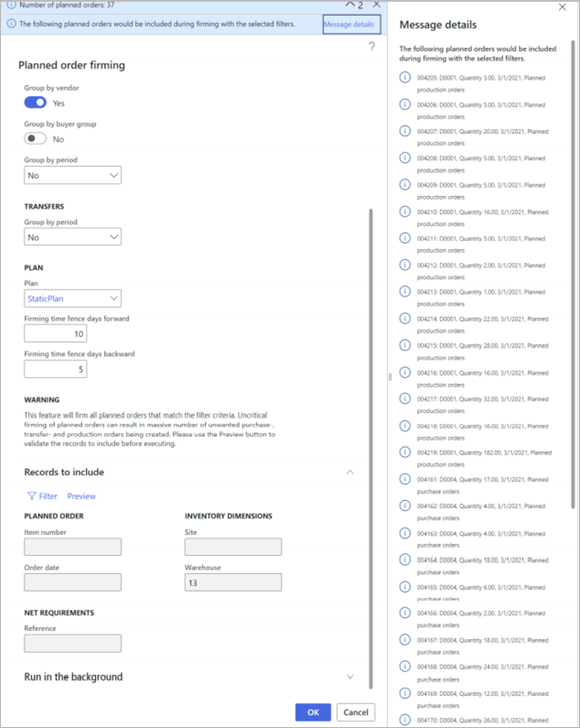

# Firm planned orders

[!include [banner](../../includes/banner.md)]

Planned orders must be *firmed* (that is, released) as part of the master planning process. When planned orders are firmed, they become actual purchase orders, transfer orders, or production orders. These orders are also known as *released orders* or *open orders*.

There are three methods for firming planned orders:

- **Manual firming** – Select specific planned orders in a list, and then manually start the process.
- **Auto-firming** – Define a default firming time fence for coverage groups, individual items, and combinations of items and master plans. Then, during master planning runs, planned orders will automatically be firmed if the order date is within the specified time fence for firming.
- **Query-based firming** – Define a query to select planned orders based on their properties. You can set up a batch job to run the query and firm matching orders on a regular schedule.

This article describes each method in detail.

## Enable the features that are described in this article

Most planned order features are available in all standard installations of Microsoft Dynamics 365 Supply Chain Management. However, a few of the features that are described in this article must be turned on in Feature management before you can use them.

### Turn parallelized firming of planned orders on or off

Parallelized firming helps speed up the firming process by parallelizing it across multiple threads. This approach can be useful when many planned orders are firmed. To use this functionality, the *Parallel firming of planned orders* feature must be turned on for your system. 

As of Supply Chain Management version 10.0.21, this feature is turned on by default. As of Supply Chain Management 10.0.25, this feature is mandatory and can't be turned off. If you're running a version older than 10.0.25, then you can turn this functionality on or off by going to [Feature management](../../../fin-ops-core/fin-ops/get-started/feature-management/feature-management-overview.md) and searching for the *Parallel firming of planned orders* feature.

### Turn planned order firming with filtering on or off

Planned order firming with filtering lets you define logical criteria for selecting which planned orders to firm. You can also preview which planned orders were selected, run the process in the background, and/or schedule it as a batch job.

To use this feature, it must be turned on for your system. As of Supply Chain Management version 10.0.25, the feature is turned on by default. As of Supply Chain Management version 10.0.29, the feature is mandatory and can't be turned off. If you're running a version older than 10.0.29, then admins can turn this functionality on or off by searching for the *Planned order firming with filtering* feature in the [Feature management](../../../fin-ops-core/fin-ops/get-started/feature-management/feature-management-overview.md) workspace.

### Turn auto-firming for Planning Optimization on or off

Automatic firming lets you firm planned orders as part of the master planning process during the time fence for firming. Auto-firming is always supported for the planning engine that is built into Supply Chain Management. However, to use it with Planning Optimization too, you must turn on the feature.

As of Supply Chain Management version 10.0.21, this feature is turned on by default. As of Supply Chain Management 10.0.29, this feature is mandatory and can't be turned off. If you're running a version older than 10.0.29, then you can turn this functionality on or off by going to [Feature management](../../../fin-ops-core/fin-ops/get-started/feature-management/feature-management-overview.md) and searching for the *Auto-firming for Planning Optimization* feature.

## Manually firm planned orders

To manually firm planned orders, you find and select the planned orders that you want to firm, and then you manually start the firming process.

1. [Open any planned orders list page](approved-planned-order.md#view-planned-orders).
1. Use the **Filter** field, **Plan** field, and column headings to filter and sort the list so that you can find the planned orders that you're looking for.
1. Select the check box for each planned order that you want to firm. If you want to firm all the planned orders that are currently listed on the page (based on the filters that you applied), skip this step.
1. On the Action Pane, select one of the following buttons:

    - **Firm** – Firm only the selected planned orders.
    - **Firm all** – Firm all the planned orders that are currently listed on the page (based on the filters that you applied), regardless of any check boxes that are selected. This option can be useful if you're firming many planned orders.

1. In the **Firming** dialog box, on the **Parameters** FastTab, set the following fields. (Many of these fields take their default values from the **Standard update** tab on the **Master planning parameters** page.)

    - **Update marking** – Select the inventory marking policy to use when planned orders are firmed.
    - **Stop firming if an error occurs** – Set this option to *Yes* to stop firming all selected planned orders if an error occurs in one of them. This option must be set to *No* if the **Parallelize firming** option is set to *Yes*.
    - **Parallelize firming** – This option is available only if the [*Parallel firming of planned orders* feature](#enable-features) is turned on for your system, and if you've selected two or more planned orders for firming. Set it to *Yes* to run the firming processes in parallel. Parallel firming can help improve performance.
    - **Number of threads** – This option is available only if the [*Parallel firming of planned orders* feature](#enable-features) is turned on for your system, and if you've set the **Parallelize firming** option to *Yes*. Enter the number of threads to use to parallelize the firming process. For advice about how to use this option in master planning, see [Improve master planning performance](../master-planning-performance.md#number-of-threads).

        > [!NOTE]
        > A value of *0* (zero) for the **Number of threads** field increases the running time of master planning. Therefore, we recommend that you always set this field to a value that is more than 0.

    - **Group by vendor** – Set this option to *Yes* to group planned purchase orders and create one purchase order per vendor during firming. Alternatively, you can create one purchase order that has one line for each planned order.
    - **Group by buyer group** – Set this option to *Yes* to group planned purchase orders and create one purchase order that combines the vendor and buyer group. To use this option, you must also set the **Group by vendor** option to *Yes*.
    - **Group by purchase agreement** – Set this option to *Yes* to group planned purchase orders that have the same vendor as existing purchase agreements and create one purchase order per purchase agreement. This option is automatically enabled when **Group by vendor** is enabled. To use **Group by purchase agreement**, **Find purchase agreement** must be set to *Yes* on the **Master planning parameters** page.
    - **Group by period** (in the **Purchase orders** section) – Select the period to group planned purchase orders by. To use this option, you must also select the **Group by vendor** option.
    - **Group by period** (in the **Transfers** section) – Select the period to group planned transfer orders by. The orders will be grouped based on **From warehouse** and **To warehouse** values.

    > [!NOTE]
    > Each of the "Group by" options causes the system to convert each planned order to a line in the single purchase order that results from the grouping.

    

1. On the **Run in the background** FastTab, set up the job so that it runs in batch mode. However, it doesn't make sense to set up a recurrent schedule when you're doing manual firming. The fields work just as they work for other types of [background jobs](../../../fin-ops-core/dev-itpro/sysadmin/batch-processing-overview.md) in Supply Chain Management. However, for manual firming, the batch job will process only the currently selected planned orders. It won't process any orders that fit the filters that are currently applied on the page.
1. Select **OK** to apply your settings and generate the firmed orders.

## Auto-firm planned orders

Automatic firming lets you firm planned orders as part of the master planning process. You can define a firming time fence for coverage groups, individual items, and combinations of items and master plans. Then, during master planning runs, planned orders will automatically be firmed if the order date is within the specified time fence for firming. Planned orders that are generated by Planning Optimization and the deprecated master planning engine handle the order date (that is, the start date) differently.

> [!NOTE]
> Auto-firming of planned purchase orders can occur only for items that are associated with a vendor.
> 
> Derived orders (that is, subcontract purchase orders) that are firmed will have a status of *In-review* if change tracking is turned on.

> [!IMPORTANT]
> Before the feature that is described in this section can be used with Planning Optimization, the [*Auto-firming for Planning Optimization* feature](#enable-features) must be turned on for your system, as described at the beginning of this article. Auto-firming can always be used with the deprecated master planning engine.

### Auto-firming with Planning Optimization vs. the deprecated master planning engine

Both Planning Optimization and the deprecated master planning engine can be used to auto-firm planned orders. However, there are some important differences. For example, Planning Optimization uses the order date (that is, the start date) to determine which planned orders to firm, whereas the deprecated master planning engine uses the requirement date (that is, the end date). The following table summarizes the differences.

| Feature | Planning Optimization | Deprecated master planning engine |
|---|---|---|
| **Date basis** | Auto-firming is based on the order date (start date). | Auto-firming is based on the requirement date (end date). |
| **Lead time** | Because the order date (start date) triggers the firming, you don't have to consider the lead time as part of the firming time fence. | To help guarantee that orders are firmed in a timely manner, the firming time fence must be longer than the lead time. |
| **Orders for the current week** | To firm all orders that must start during the current week, the firming time fence must be one week. | To firm all orders that must start during the current week, the firming time fence must be the lead time plus one week. |

### Set up auto-firming and the firming time fence

You turn on auto-firming by assigning an automated firming time fence to the relevant coverage setup, as described later in this section. If auto-firming isn't turned on for any coverage setup, or if planning is started from a specific page, such as the **Net requirements** page for a released product, the auto-firming process is skipped.

Grouping and marking options for auto-firming take their values from the **Standard update** tab on the **Master planning parameters** page.

The auto-firming time fence is defined by the number of days that you enter for the relevant coverage setup. You can turn on auto-firming and control the firming time fence in the following ways:

- To define the default firming time fence for a coverage group, go to **Master planning \> Setup \> Coverage \> Coverage groups**, and select a coverage group. Then, on the **Other** FastTab, in the **Automatic firming time fence (days)** field, enter the number of days.
- To overwrite the firming time fence that is defined for the coverage group for a specific item, go to **Product information management \> Released products**. On the Action Pane, select **Plan**, and then select **Item coverage**. On the **General** tab, select **Override time fence**, and then, in the **Automatic firming time fence (days)** field, enter the number of days.
- To overwrite the firming time fence that is defined for the coverage group and item coverage for a specific master plan, go to **Master planning \> Setup \> Master plans**, and select a master plan. Then, on the **Time fence in days** FastTab, set the **Firming** option to *Yes*, and enter the number of days.

If you set all the previously mentioned time fences to *0* (zero), auto-firming is effectively disabled for the relevant covered items.

## Firm planned orders by using a query

Query-based firming lets you plan firming based on criteria that are defined in advance. Unlike auto-firming, query-based firming allows for automated firming of different subsets of orders at different points in time. Additionally, you can use either manual or automated operations to firm different types of planned orders. You can also preview which firmed orders are selected based on your settings. Therefore, you can confirm that the selection fits your expectations.

You can combine auto-firming with query-based firming. For example, a query-based firming job has a forward time fence that is longer than the time fence for a matching auto-firming coverage configuration. Therefore, the query-based firming job will process its planned orders before the auto-firming is triggered. You can take advantage of this behavior to schedule orders for specific vendors differently than orders for similar products from other vendors.

> [!IMPORTANT]
> Before the feature that is described in this section can be used, the [*Planned order firming with filtering* feature](#enable-features) must be turned on for your system, as described at the beginning of this article.

To firm a planned order by using the query-based firming process, follow these steps.

1. Go to **Master-planning \> Master planning \> Run \> Planned order firming**.
1. In the **Planned order firming** dialog box, on the **Parameters** FastTab, set the basic processing, marking, and grouping options. These options work just as they do in the **Firming** dialog box. (See the previous section for descriptions.) Then, in the **Plan** section, set the following fields that are unique to the **Planned order firming** dialog box:

    - **Plan** – Select the master plan that should be applied during firming of the planned orders that are found by this query.
    - **Firming time fence days forward** – Select how far in the future the various requirements and other considerations must be calculated by master planning.
    - **Firming time fence days backward** – Select how far in the past the various requirements and other considerations must be calculated by master planning.

    

1. To specify which records should be included in the order, select the **Filter** button on the **Records to include** FastTab. A standard query dialog appears, where you can define selection criteria, sorting criteria, and joins. The fields work just as they do for other types of queries in Supply Chain Management. The fields here are read-only and show values that are related to your query.

    

1. Select **Preview** to preview the content of your firmed order, based on your settings so far. The list of planned orders that will be firmed is shown as a message. You can then adjust your settings as required until the preview shows the firmed order as you intend it.

    

    > [!WARNING]
    > This feature will firm all planned orders that match the filter criteria. Uncritical firming of planned orders can cause massive numbers of unwanted purchase, transfer, and production orders to be created. Before you continue, always use the **Preview** button to validate the records that will be included.

1. On the **Run in the background** FastTab, set up the job so that it runs in batch mode, and/or set up a recurrent schedule. The fields work just as they do for other types of [background jobs](../../../fin-ops-core/dev-itpro/sysadmin/batch-processing-overview.md) in Supply Chain Management.
1. Select **OK** to apply your settings and generate the firmed orders.

## Track firmed orders

To track a planned order that was firmed, follow these steps.

1. [Open any planned orders list page](approved-planned-order.md#view-planned-orders).
1. Open or select the planned order that you want to track.
1. On the Action Pane, on the **View** tab, in the **View** group, select **Firming history**.

[!INCLUDE[footer-include](../../../includes/footer-banner.md)]
