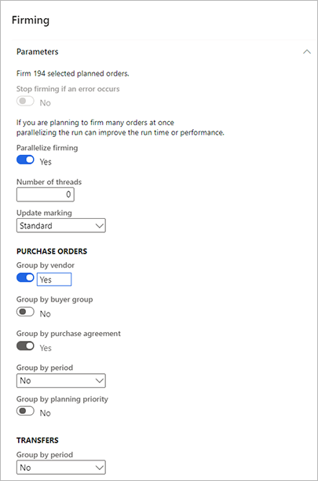

# Firm planned orders

[!include [banner](../../includes/banner.md)]

Planned orders must be *firmed* (that is, released) as part of the master planning process. When planned orders are firmed, they are transformed into actual purchase orders, transfer orders, or production orders. These are also known as *released* or *open orders*.

There are three methods of firming planned orders, each of which is described in detail in this topic.

- **Manual firming** – Select specific planned orders from a list and then start the process manually.
- **Query-based firming** – Define a query to select planned orders based on their properties. You can set up a batch job to run the query and firm matching orders on a regular schedule.
- **Autofirming** – Define a default firming time fence for coverage groups, individual items, and item and master plan combinations for planned orders to be firmed automatically during a master planning run when the order date is within the specified time fence for firming.

## Enable the features described in this topic

Most planned order features are available in all standard Supply Chain Management installations that use Planning Optimization. However, a few of the features described in this topic must be enabled in feature management before you can use them.

### Enable parallelized firming of planned orders

Parallelized firming helps speed up the firming process by parallelizing it across multiple threads. This can be relevant when a high number of planned orders are firmed.

To make this functionality available on your system, go to [Feature management](../../../fin-ops-core/fin-ops/get-started/feature-management/feature-management-overview.md) and turn on the *Parallel firming of planned orders* feature.

### Enable planned order firming with filtering

Planned order firming with filtering lets you establish logical criteria for selecting which planned orders to firm. You can also preview which planned orders were selected, run the process in the background, and/or schedule it as a batch job.

To make this functionality available on your system, go to [Feature management](../../../fin-ops-core/fin-ops/get-started/feature-management/feature-management-overview.md) and turn on the *Planned order firming with filtering* feature.

### Enable autofirming

Automatic firming lets you firm planned orders as part of the master planning process within the time fence for firming.

To make this functionality available on your system, go to [Feature management](../../../fin-ops-core/fin-ops/get-started/feature-management/feature-management-overview.md) and turn on the *Auto-firming for Planning Optimization* feature.

## Firm planned orders manually

When you firm planned orders manually, you find and select the planned orders you want to firm and then manually start the firming process. To do this:

1. [Open any planned orders list page](approved-planned-order.md).
1. Use the **Filter** field, **Plan** field, and column headings to filter and sort the list to help find the planned orders you are looking for.
1. Select the check box for each planned order you want to firm (unless you are planning to firm all of the planned orders currently found by your filters).
1. On the Action Pane, select one of the following buttons:
    - **Firm** – This will firm the selected planned orders only.
    - **Firm all** – This will firm all planned orders currently listed on the page (as established by the various filters), regardless of which check boxes are selected. This option can be useful if you are firming a high number of planned orders.
1. The **Firming** dialog box opens. Make the following settings on the **Parameters** FastTab (many of these settings take their default values from the **Master planning parameters** page):

    - **Update marking** – Select the inventory marking policy to use when firming planned orders.
    - **Stop firming if an error occurs** – Set this to *Yes* to stop firming all selected planned orders if an error occurs in one of them. Must be set to *No* when **Parallelize firming** is enabled.
    - **Parallelize firming** – This setting is only available if the [*Parallel firming of planned orders* feature](#enable-features) is enabled on your system, and if you have selected two or more planned orders for firming. Set this to *Yes* to run the firming processes in parallel, which can help improve performance.
    - **Number of threads** – This setting is only available if the [*Parallel firming of planned orders* feature](#enable-features) is enabled on your system, and if you have set **Parallelize firming** to *Yes*. Enter the number of threads to use to parallelize the firming process. See [Improve master planning performance](../master-planning-performance.md#number-of-threads) for advice on how to use this parameter in master planning.
        > [!NOTE]
        > Setting **Number of threads** to *0* (zero) increases the master planning running time. Therefore, we recommend that you always set a value that is more than 0.
    - **Purchase orders \> Group by vendor** – Select this option to group planned purchase orders together to make a single purchase order per vendor when firming. Alternatively, you can create one purchase order with one line for each planned order.
    - **Purchase orders \> Group by buyer group** – Select this option to group planned purchase orders together to create a single purchase order that combines the vendor and buyer group. To use this option, you must also enable the **Group by vendor** option.
    - **Purchase orders \> Group by period** – Select the time period during which you want to group planned purchase orders. To use the option, you must also enable the **Group by vendor** option.
    - **Transfers \> Group by period** – Select the time period during which you want to group planned transfer orders. The orders will be grouped based on **From warehouse** and **To warehouse** values.

    

1. Use the **Run in the background** FastTab to set the job to run in batch, but it doesn't make sense to set up a recurrent schedule when you are doing manual firming. These settings work just as they do for other types of [background jobs](../../../fin-ops-core/dev-itpro/sysadmin/batch-processing-overview.md) in Supply Chain Management. However, for manual firming, this batch job will process only the currently selected planned orders, and not any orders that fit the current filter on the page.

1. Select **OK** to apply your settings and generate the firmed orders.

## Firm planned orders using a query

[!INCLUDE [preview-banner-section](../../../includes/preview-banner-section.md)]

<!-- KFM: Is this feature being initially released in a preview version of SCM? If so, which one? -->
<!-- OBA: It will be 10.0.19 -->

Query-based firming lets you plan firming based on criteria specified in advance. Since it allows automated firming of different subsets of orders at different points in time, you are able to firm different kinds of planned orders with both manual and automated execution operation.  <!-- KFM: How do we combine manual and automatic selections? --> It also lets you preview the firmed order based on your settings so you can confirm whether the order fits your expectations.

> [!IMPORTANT]
> To use the feature described in this section, the [*Planned order firming with filtering* feature](#enable-features) must be enabled on your system, as described at the start of this topic.

To firm a planned order using the query-based firming process:

1. Go to **Master-planning \> Master planning \> Run \> Planned order firming**.
1. The **Planned order firming** dialog box opens.
1. On the **Parameters** FastTab, set the basic processing, marking, and grouping options described in the previous section (these work the same way they as they do on the **Firming** dialog box). Then make the following settings in the **Plan** field group, which are unique to the **Planned order firming** dialog box:

    - **Plan** – <!-- KFM: Describe this setting -->
    - **Firming time fence days forward** – <!-- KFM: Describe this setting -->
    - **Firming time fence days backward** – <!-- KFM: Describe this setting -->

    

1. To set the criteria of which records to include in the order, select the **Filter** button from the **Records to include** toolbar. A standard query dialog opens, which lets you establish selection criteria, sorting criteria, and joins. These settings work just as they do for other types of queries in Supply Chain Management. The fields here are read-only and show values related to your query.

    

1. Select **Preview** to preview the content of your firmed order based on your settings so far. The list of planned orders to be firmed is then displayed as an Infolog message. If necessary, adjust your settings until the preview shows the firmed order as you intend it.

    

    > [!WARNING]
    > This feature will firm all planned orders that match the filter criteria. Uncritical firming of planned orders can result in massive number of unwanted purchase-, transfer- and production orders being created. Always use the **Preview** button to validate the records to include before continuing.

1. Use the **Run in the background** FastTab to set the job to run in batch and/or set up a recurrent schedule. These settings work just as they do for other types of background jobs in Supply Chain Management. <!-- KFM: Please confirm this description -->

1. Select **OK** to apply your settings and generate the firmed orders.

## Autofirm planned orders

Automatic firming lets you firm planned orders as part of the master planning process. It lets you define a firming time fence for coverage groups, individual items, and item and master plan combinations for planned orders to be firmed automatically during a master planning run when the order date is within the specified time fence for firming. Planned orders generated by Planning Optimization and the built-in master planning operation handle the order date differently (that is, the start date). <!-- KFM: Why is only PO mentioned here? Maybe we should instead point out that PO and built-in are handled slightly differently as described later in this section. -->

> [!NOTE]
> Auto-firming of a planned purchase order can occur only for items that are associated with a vendor.
> 
> Firmed derived orders (subcontract purchase orders) will show a status of *In-review* when case change tracking is enabled.

> [!IMPORTANT]
> To use the feature described in this section, the [*Auto-firming for Planning Optimization* feature](#enable-features) must be enabled on your system, as described at the start of this topic.

### Autofirming with Planning Optimization vs. the built-in planning engine

Both Planning Optimization and the built-in planning engine can be used to autofirm planned orders. However, there are some important differences. For example, whereas Planning Optimization uses the order date (that is, the start date) to determine which planned orders to firm, the built-in Supply Chain Management planning engine uses the requirement date (that is, the end date). The following table summarizes the differences.

| &nbsp; | Planning Optimization | Built-in planning engine |
| --- | --- | --- |
| Date basis | Autofirming is based on the order date (start date). | Autofirming is based on the requirement date (end date). |
| Lead time | Because the order date (start date) triggers the firming, you don't have to consider the lead time as part of the firming time fence. | To help guarantee that orders are firmed in due time, the firming time fence must be longer than the lead time. |
| Orders for the current week | To firm all orders that must start during the current week, the firming time fence must be one week. | To firm all orders that must start during the current week, the firming time fence must be the lead time plus one week. |

### Set up autofirming and the firming time fence

If autofirming is turned on for a master planning run that uses Planning Optimization, the autofirming process is done according to the autofirming setup <!-- KFM: How do I turn it on? Where is the autofirming setup? What about for the built-in engine? -->. If autofirming isn't turned on, or if planning is started from the **Net requirements** page, the autofirming process is skipped. <!-- KFM: Where is the **net requirements** page? -->

<!-- KFM: What about parallel firming, do we need that feature? What about the grouping and marking options available for manual firming? -->

The firming time fence is calculated forward from the master planning run date. It's defined by the number of days that you enter. You can control the firming time fence in the following ways:

- To define the default firming time fence for a coverage group, go to **Master planning** \> **Setup** \> **Coverage** \> **Coverage groups**, and select a coverage group. Then, on the **Other** FastTab, in the **Automatic firming time fence (days)** field, enter the number of days.
- To overwrite the firming time fence that is defined for the coverage group for a specific item, go to **Product information management** \> **Released products**, then from the Action Pane select **Plan** and then select **Item coverage**. Then, on the **General** tab, select **Override time fence** and in the **Automatic firming time fence (days)** field, enter the number of days.
- To overwrite the firming time fence that is defined for the coverage group and item coverage for a specific master plan, go to **Master planning** \> **Setup** \> **Master plans**, and select a Master plan. Then, on the **Time fence in days** FastTab, set **Firming** to **Yes**, and enter the number of days.

## Track firmed orders

<!-- KFM: Should we keep this section here? -->

You can track a planned order that was firmed by doing the following steps:

1. [Open any planned orders list page](approved-planned-order.md)
1. Open or select the planned order you want to track.
1. On the Action Pane, open the **View** tab and, from the **View** group, select **Firming history**.

[!INCLUDE[footer-include](../../../includes/footer-banner.md)]