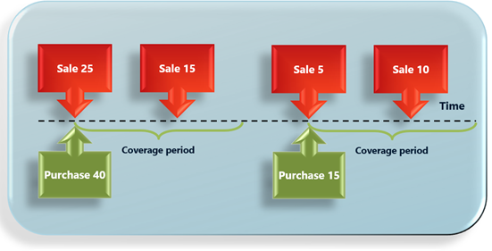
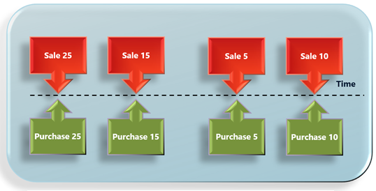
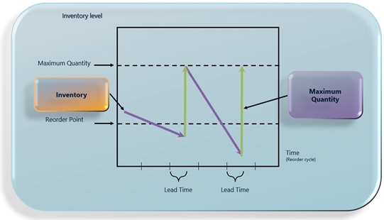

# Replenishment methods and quantity modification

[!include [banner](../../includes/banner.md)]

This topic provides information about replenishment methods in Planning Optimization. It also explains how the multiple order quantity for a product affects the result.

Replenishment methods are also known as coverage methods and lot-sizing methods.

## Coverage codes

Planning Optimization can be configured to use different replenishment methods. The replenishment methods are the techniques that the system uses to calculate requirements for a product. Replenishment methods are defined by coverage codes that you can set up on either the coverage group or the product.

The following coverage codes can be used in Planning Optimization:

- **Period** – The replenishment method combines all the demand for a period into one order for the product. The order will be planned for the first day of the period, and its quantity will fulfill the net requirements during the established period. The period starts with the first demand of the product and covers the defined length of time. The next period will start with the next requirements of the product. The *Period* coverage code is often used for non-predictable inventory draw, season-influenced products, or high-cost products. The following illustration shows an example.

    

- **Requirement** – In the replenishment method, the system creates a planned purchase, transfer, or production order per requirement for the product. This method is used for expensive products that have intermittent demand. The *Requirement* coverage code is often used for configurable products or make-to-order scenarios. The following illustration shows an example.

    

- **Min./Max.** – The replenishment method is based on the inventory level. It defines the replenishment of inventory up to a specific level when the predicted on-hand level is below a specific threshold. The replenishment quantity will be the difference between the maximum level and the predicted on-hand level. The *Min./Max.* coverage code is often used for predictable inventory draw, high runners, or less expensive products. The following illustration shows an example.

    

- **Manual** – In the replenishment method, the system doesn't suggest purchase, transfer, or production orders for the product. Instead, the planner for the product is responsible for creating the required orders for the replenishment of the product. The *Manual* coverage code is often used for products that system-generated planned orders aren't wanted for.

## Impact of the order quantity from default order settings

On the **Default order setting** page for a released product, you can specify each of following quantity settings on the **Purchase order**, **Inventory**, and **Sales order** FastTabs. (The **Inventory** FastTab is used for both transfer orders and production orders.)

- **Multiple** – Planned orders will be a multiple of this quantity.

    For example, if the **Multiple** field is set to *5*, an order can be for a quantity of 5, 10, 15, 20, and so on.

- **Min. order quantity** – Planned orders won't be less than the specified value.

    For example, if the **Min. order quantity** field is set to *10*, a planned order for a quantity of 10 will be created, even if only four are required to fulfill the demand.

- **Max. order quantity** – Planned orders won't exceed the specified value. If the demand is more than the **Max. order quantity** value, multiple planned orders will be created to cover it.

    For example, if the **Max. order quantity** field is set to *100*, and the demand is 450, four planned orders for a quantity of 100 and one planned order for a quantity of 50 will be created.

## Examples of replenishment that use the Min./Max. coverage code

If you don't specify a value in the **Multiple** field for a product on the **Default order setting** page, and if you're using the *Min./Max.* replenishment method, Planning Optimization will replenish the inventory up to a specific level when the predicted on-hand level is below a specific threshold.

If you define a multiple quantity for a product, the *Min./Max.* replenishment method changes its behavior and considers the **Multiple** value.

In other words, Planning Optimization will still replenish the inventory up to the defined maximum level when the predicted on-hand level is less than the defined minimum level. However, the replenishment quantity must be a multiple of the **Multiple** value.

If the replenishment quantity (the difference between the maximum level and the predicted on-hand level) isn't a multiple of the defined multiple quantity, Planning Optimization uses the first possible value that, together with predicted on-hand level, will be below the maximum level. If the sum is less than the minimum level, Planning Optimization uses the first value that, together with predicted on-hand, will be above the maximum level.

The following subsections provide some examples that show how the multiple order quantity for a product affects the result of the *Min./Max.* replenishment method.

### Example 1

A product has the following configuration:

- **Coverage code:** *Min./Max.*
- **Minimum:** *15*
- **Maximum:** *22*
- **Multiple:** *0*

There are 10 pieces of on-hand inventory for the product, and there is no other demand or supply.

When master planning runs, a planned order for 12 pieces is created to replenish inventory to the maximum quantity.

### Example 2

A product has the following configuration:

- **Coverage code:** *Min./Max.*
- **Minimum:** *15*
- **Maximum:** *22*
- **Multiple:** *5*

There are 10 pieces of on-hand inventory for the product, and there is no other demand or supply.

When master planning runs, a planned order for 10 pieces is created (because 15 pieces of replenishment plus 10 pieces of on-hand inventory will exceed the maximum quantity).

### Example 3

A product has the following configuration:

- **Coverage code:** *Min./Max.*
- **Minimum:** *21*
- **Maximum:** *24*
- **Multiple:** *5*

There are 10 pieces of on-hand inventory for the product, and there is no other demand or supply.

When master planning runs, the planned order for 15 pieces is created (because 10 pieces of replenishment plus 10 pieces of on-hand inventory will be less than the minimum quantity).

[!INCLUDE[footer-include](../../../includes/footer-banner.md)]
