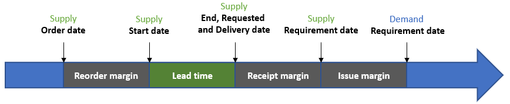
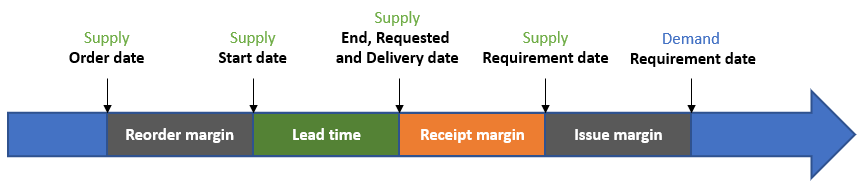
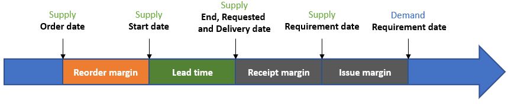
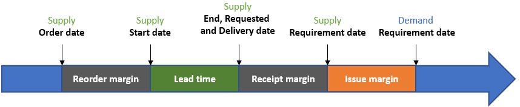
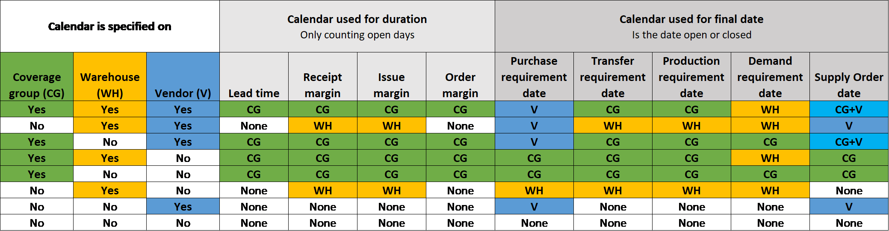
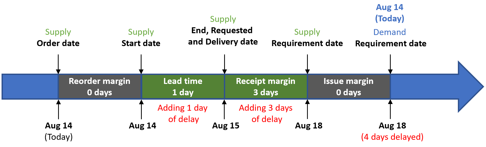

# Safety margins

[!include [banner](../../includes/banner.md)]

This article describes how safety margins work during master planning.

## Safety margins overview

Safety margins provide buffer time beyond the normal lead time. For example, when material must be unpacked or inspected after it arrives from the vendor, you can't just add the extra time to the purchase lead time, because this approach gives the additional buffer time to the supplier. This example uses the receipt margin to ensure that the supplier delivers earlier. This approach provides buffer time so that the goods can be handled internally.

There are three types of safety margins:

- **Reorder margin** – The buffer time for placing the supply order
- **Receipt margin** – The buffer time for handling incoming supply
- **Issue margin** – The buffer time for handling shipments

The following illustration shows how these safety margins apply over time.

All margins are defined in days. The default value, *0* (zero), indicates that no margin is applied. If you set up multiple margins, they all add to the total time from the supply *order date* to the demand *requirement date*. For example, a setup has no lead time, and all three margin types are set to one day. In this case, there are three days between the supply order date and the demand requirement date, so if the order date is July 1, the requirement date is July 4.

### Receipt margin

The receipt margin is probably the most used of the three safety margins. It's applied to the *delivery date* and goes backward from the *requirement date*. In other words, you should receive the products the specified number of receipt margin days before you need them.

The following illustration highlights the receipt margin.

The receipt margin typically acts as a buffer to ensure time for warehouse registration or other time-consuming processes that the system doesn't capture as part of the general lead time. For purchases, one benefit is that the *delivery date* of the purchase order moves forward accordingly. If you increase the lead time instead of using a safety margin, the vendor still needs to deliver at the last minute.

The receipt margin doesn't change the *requirement date* of the supply. Therefore, you don't directly see the receipt margin when you compare requirement dates for demand and supply (for example, on the **Net requirements** page). For example, if the receipt margin is set to four days, and a purchase order line is planned for receipt on the fifteenth of the month, master planning calculates the adjusted receipt date as the nineteenth of the month.

A receipt margin isn't applied when on-hand inventory is used as the supply. All on-hand inventory is assumed to be available immediately, regardless of when you actually received it.

### Reorder margin

The following illustration highlights the reorder margin.

The reorder margin adds time before the item lead time for all planned orders during master planning. Therefore, it ensures extra time for placing a supply order. This margin typically acts as a buffer to ensure time for approval processes or other internal processes that are required during the creation of supply orders. The reorder margin goes between the supply *order date* and *start date*.

### Issue margin

The following illustration highlights the issue margin.

The system deducts the issue margin from the demand requirement date during master planning. It helps ensure that you have time to react to and ship incoming demand orders. This margin acts as a buffer to ensure time for shipment and related outbound warehouse processes.

When you apply an issue margin, the related supply and demand requirement dates don't match. Instead, they differ by the issue margin, because the issue margin is added between the supply *requirement date* and the demand *requirement date*.

## Set up safety margins

### Define safety margins

You can flexibly set safety margins on both the *coverage group* and the *master plan*. The margins add together. For example, if you set a receipt margin of two days on the coverage group and three days on the master plan, the effective receipt margin is five days.

Setting the margin on the master plan is useful when you want to simulate longer lead times or uncertainty for a specific plan, but without affecting the daily planning.

#### Coverage group safety margins

To apply a safety margin to a coverage group, follow these steps:

1. Go to **Master planning** \> **Setup** \> **Coverage groups**.
1. In the list pane, select the coverage group.
1. On the **Other** FastTab, in the **Safety margins in days** section, use the following fields to set the required safety margins (in days):

    - Receipt margin added to requirement date
    - Issue margin deducted from requirement date
    - Reorder margin added to item lead time

#### Master plan safety margins

To apply a safety margin to a master plan, follow these steps:

1. Go to **Master planning** \> **Setup** \> **Plans** \> **Master plans**.
1. In the list pane, select the master plan.
1. On the **Safety margins in days** FastTab, use the following fields to set the required safety margins (in days):

    - Receipt margin added to requirement date
    - Issue margin deducted from requirement date
    - Reorder margin added to item lead time

### Define whether calculations are based on calendar days or work days

You can set all safety margins so that they're calculated based on either calendar days or work days.

1. Go to **Master planning** \> **Setup** \> **Master planning parameters**.
1. On the **General** tab, in the **Safety margins in days** section, set the **Working days** option to *Yes* to calculate margins based on working days. Set the option to *No* to calculate margins based on calendar days.

For example, a calendar is open from Monday through Friday and closed from Saturday through Sunday. If there's a receipt margin of one day, a requirement date on a Monday produces a delivery date on the previous Friday, because Saturday and Sunday aren't working days.

The calendar that determines the working days depends on the setup and the supply type. It can be controlled by the calendars of the coverage group, the warehouse, and the vendor.

> [!NOTE]
> If *warehouse* isn't part of the coverage dimension (in other words, planning is based only on *site*), the warehouse calendar isn't used.

The system can handle a setup where one or more calendars are defined. The following subsections describe the possible combinations that you can use to control the result.

#### Calendar that is used for the duration

The defined calendars control the actual total lead time in calendar days, from the supply order date to the demand requirement date. The system uses the following calendar prioritization:

- **Purchase lead time** – Only the coverage group calendar is considered.
- **Receipt margin** – The system uses the coverage group calendar, if it's defined. Otherwise, it uses the warehouse calendar.
- **Issue margin** – The system uses the coverage group calendar, if it's defined. Otherwise, it uses the warehouse calendar.
- **Order margin** – Only the coverage group calendar is considered.

#### Calendar that is used for the final date

The following rules determine whether the planning engine can use a given date for a given date type:

- **Purchase receipt date** – The system uses the vendor calendar, if it's defined. Otherwise, it uses the coverage group calendar, if it's defined. If neither of those calendars is defined, the system uses the warehouse calendar.
- **Transfer receipt date** – The system uses the coverage group calendar, if it's defined. Otherwise, it uses the warehouse calendar.
- **Production receipt date** – The system uses the coverage group calendar, if it's defined. Otherwise, it uses the warehouse calendar.
- **Demand issue open day** – The system uses the warehouse calendar, if it's defined. Otherwise, it uses the coverage group calendar.
- **Order open day** – The system uses a combination (intersection) of the coverage group calendar and the vendor calendar. Both calendars must be open to use the date. If only one of the calendars is defined, the system uses that calendar alone.

#### Calendar setup overview matrix

The following illustration presents a matrix that summarizes which calendars apply when safety margins are calculated. (Select the image to open a high-resolution version of it.) The following abbreviations and colors indicate where each type of calendar is specified:

- **Coverage group (CG):** Green
- **Warehouse (WH):** Yellow
- **Vendor (V):** Blue

## Calculating delays

The system includes all three types of safety margins when it determines whether an order is delayed.

For example, an item has a lead time of one day and a receipt margin of three days. A sales order for this item is set as required today. In this case, the delay is calculated as *lead time* + *receipt margin* = four days. Therefore, if today is August 14, the four days of delay produces a delivery on August 18. The following illustration shows this example.

## Issue margin and on-hand

Sometimes, the system doesn't apply the issue margin to an order when on-hand supply exists for an item. The reason for this behavior is that the on-hand supply doesn't have a date, so the system can't apply the issue margin.

This situation usually occurs when you sell an item with an issue margin from a warehouse (for example WH11) that is replenished by a transfer order from another warehouse (for example WH13). In this case, one of the following situations could apply:

- **If on-hand supply exists in WH13** – On WH11, the system applies the margin between the sales order date and the transfer order receipt date. However, on WH13, the date of the transfer order shipment is the same as the receipt date because there's on-hand supply, so the system doesn't apply any issue margin.

- **If on-hand supply doesn't exist in WH13** – If there's no on-hand supply, and WH13 is to be replenished by other means (such as a purchase order), then the system applies the issue margin between the transfer order receipt date and the purchase order receipt date.

### Soft issue margin

Without soft issue margin, the system applies the full issue margin, even when doing so causes a demand to be delayed (that is, the planned requirement date is pushed past the demand requirement date). In some scenarios, this behavior is undesirable because it introduces delays to orders that could otherwise be fulfilled on time or closer to the original requirement date if the issue margin would be dynamically reduced.

*Soft issue margin* provides an alternative behavior. When enabled, the system treats the issue margin as a preferred buffer rather than a hard requirement. Instead of always applying the full issue margin, the system reduces it as needed to avoid pushing the requirement date into the future. The soft issue margin works as follows:

- **If the full issue margin can be applied without causing a delay** – The system applies the full issue margin, just as it does with the standard behavior. No change occurs.
- **If the full issue margin would cause a delay** – The system reduces the issue margin to the largest value that doesn't push the planned requirement date past the demand requirement date. The margin can be reduced to any value between its full configured value minus one day and zero days.
- **If the order is already delayed** (the demand requirement date is in the past) – The system ignores the issue margin entirely. The issue margin isn't included in the delay calculation. Instead, the difference between the demand requirement date and the planned order date is surfaced to indicate that the order can't be fulfilled on time.

This behavior applies at each level in the supply chain independently. If a bill of materials (BOM) structure includes both a finished good and a raw material, the system evaluates and adjusts the issue margin separately for each level.

#### Enable soft issue margin

1. Enable the feature "Soft issue margins with Planning Optimization".

2. To enable the soft issue margin for a coverage group, go to **Master planning** \> **Setup** \> **Coverage groups**, select the coverage group, and then on the **Other** FastTab, set the **Soft issue margin** option to *Yes*. Soft issue margin can only be enabled on coverage group level.

#### Examples

The following examples illustrate how the soft issue margin works. Both examples use the following setup:

- The issue margin is 10 days on all items.
- Today's date is October 1.
- The **Add the calculated delay to the requirement date for production orders** option is disabled.

##### Example 1: Issue margin reduced to avoid delay

The demand requirement date is October 7. Without soft issue margin, the system applies the full 10-day issue margin at both the finished good level and the raw material level. Because only six days are available between today's date and the requirement date, the full margin causes a delay at both levels.

With the soft issue margin enabled, the system reduces the issue margin at both levels to the largest values that don't push the planned dates past the requirement date. The orders are planned without delay.

##### Example 2: Order already delayed, issue margin ignored

The demand requirement date is September 24. Without the soft issue margin, the system applies the full 10-day issue margin at both the finished good level and the raw material level, which further increases the delay.

With soft issue margin enabled, the system ignores the issue margin entirely at both levels because the demand requirement date is already in the past. The delay is surfaced as the difference between the demand requirement date (September 24) and the earliest possible planned order date (October 1). The issue margin doesn't add to the delay.

#### Greedy application across multi-level supply chains

The soft issue margin is applied *greedily* along the supply chain, starting from the demand side. This means that the first level in the chain (closest to the original demand) consumes as much of the available issue margin as possible. Subsequent levels (further from the demand, closer to the supply source) receive whatever margin remains.

For example, consider a supply chain where a sales order at warehouse WH11 is fulfilled by a transfer from warehouse WH12, which in turn is replenished by a purchase order. If the soft issue margin is configured for the item at both warehouses, the system first allocates as much issue margin as possible to the issue from WH11 (the warehouse closest to the customer demand). The issue from WH12 (which is further upstream in the supply chain) then receives whatever margin is still available without causing a delay.

This greedy allocation means that downstream operations (closer to the customer) are prioritized for margin, while upstream operations absorb the reduction.

#### Known limitations of soft issue margin

The greedy application of soft issue margins can lead to situations where the requirement dates set by the engine are too optimistic. When applying the soft issue margin date, the engine does not yet know about potential delays that could occur further up the supply chain. Once delays upstream are encountered and factored into the plan, requirement dates will not be updated to account for delays compressing the soft issue margin.

This can lead to situations where the requirement date of a planned supply is set too early. After accounting for delays, FnO will show delay days even though only the soft issue margin got compressed instead of delaying the demand.

##### Example of known limitation

The following example illustrates the known limitation.

Example setup:

- The issue margin is 2 days on all items.
- Today's date is May 18th.

A sales order for item P1 has a requirement date of May 22. A soft issue margin of 2 days is configured on P1. The system greedily applies the full issue margin and schedules a production order with a requirement date of May 20. The production order requires raw material R1, which also has a 2-day issue margin and is scheduled with a requirement date of May 18.

However, the purchase order for R1 has a purchase lead time of 3 days. This causes a 3-day delay on the purchase order, which adjusts the planned date to May 21. The delay propagates up to the production order, which also adjusts to May 21. Because soft issue margin is enabled, the issue margin at the production level is compressed and doesn't add further delay. The delay also propagates to the sales order level, but again the soft issue margin is compressed (from two days to one day), so the sales order isn't delayed beyond May 22.

After delays are resolved, a discrepancy exists between the requirement dates and the planned dates. The requirement dates that were set before the delays were known are now too optimistic. The system doesn't retroactively adjust these requirement dates, which can result in delay days being shown even though the supply isn't actually delayed according to the soft issue margin. This is by design and a known limitation of the soft issue margin feature.

#### Impact of known limitation

Due to not updating the requirement dates in case of delays, several other features that rely on the requirement dates/delays may also be impacted. For example:

1. Delay days
2. Actions
3. BOM/route selection
4. Trade agreements

## Related information

- [Calendars and master planning](../supply-chain-calendars-master-planning.md)
- [Calculate requested ship dates for purchase orders](../supplier-requested-confirmed-dates.md)
- [Improve scheduling engine performance](../scheduling-engine-performance.md)
- [Date and time parameters used by Planning Optimization](date-time-used.md)
