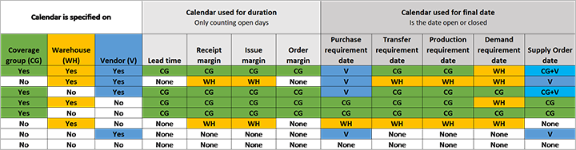

# Safety margins

[!include [banner](../../includes/banner.md)]

This article describes how safety margins work during master planning.

## Safety margins overview

Safety margins provide buffer time beyond the normal lead time. For example, when material must be unpacked or inspected after it arrives from the vendor, you can't just add the extra time to the purchase lead time, because this approach gives the additional buffer time to the supplier. This example uses the receipt margin to ensure that the supplier delivers earlier. This approach provides buffer time so that the goods can be handled internally.

There are three types of safety margins:

- **Reorder margin** – The buffer time for placing the supply order
- **Receipt margin** – The buffer time for handling incoming supply
- **Issue margin** – The buffer time for handling shipments

The following illustration shows how these safety margins apply over time.

All margins are defined in days. The default value, *0* (zero), indicates that no margin is applied. If you set up multiple margins, they all add to the total time from the supply *order date* to the demand *requirement date*. For example, a setup has no lead time, and all three margin types are set to one day. In this case, there are three days between the supply order date and the demand requirement date, so if the order date is July 1, the requirement date is July 4.

### Receipt margin

The receipt margin is probably the most used of the three safety margins. It's applied to the *delivery date* and goes backward from the *requirement date*. In other words, you should receive the products the specified number of receipt margin days before you need them.

The following illustration highlights the receipt margin.

The receipt margin typically acts as a buffer to ensure time for warehouse registration or other time-consuming processes that the system doesn't capture as part of the general lead time. For purchases, one benefit is that the *delivery date* of the purchase order moves forward accordingly. If you increase the lead time instead of using a safety margin, the vendor still needs to deliver at the last minute.

The receipt margin doesn't change the *requirement date* of the supply. Therefore, you don't directly see the receipt margin when you compare requirement dates for demand and supply (for example, on the **Net requirements** page). For example, if the receipt margin is set to four days, and a purchase order line is planned for receipt on the fifteenth of the month, master planning calculates the adjusted receipt date as the nineteenth of the month.

A receipt margin isn't applied when on-hand inventory is used as the supply. All on-hand inventory is assumed to be available immediately, regardless of when you actually received it.

### Reorder margin

The following illustration highlights the reorder margin.

The reorder margin adds time before the item lead time for all planned orders during master planning. Therefore, it ensures extra time for placing a supply order. This margin typically acts as a buffer to ensure time for approval processes or other internal processes that are required during the creation of supply orders. The reorder margin goes between the supply *order date* and *start date*.

### Issue margin

The following illustration highlights the issue margin.

The system deducts the issue margin from the demand requirement date during master planning. It helps ensure that you have time to react to and ship incoming demand orders. This margin acts as a buffer to ensure time for shipment and related outbound warehouse processes.

When you apply an issue margin, the related supply and demand requirement dates don't match. Instead, they differ by the issue margin, because the issue margin is added between the supply *requirement date* and the demand *requirement date*.

## Set up safety margins

### Define safety margins

You can flexibly set safety margins on both the *coverage group* and the *master plan*. The margins add together. For example, if you set a receipt margin of two days on the coverage group and three days on the master plan, the effective receipt margin is five days.

Setting the margin on the master plan is useful when you want to simulate longer lead times or uncertainty for a specific plan, but without affecting the daily planning.

#### Coverage group safety margins

To apply a safety margin to a coverage group, follow these steps.

1. Go to **Master planning** \> **Setup** \> **Coverage groups**.
1. In the list pane, select the coverage group.
1. On the **Other** FastTab, in the **Safety margins in days** section, use the following fields to set the required safety margins (in days):

    - Receipt margin added to requirement date
    - Issue margin deducted from requirement date
    - Reorder margin added to item lead time

#### Master plan safety margins

To apply a safety margin to a master plan, follow these steps.

1. Go to **Master planning** \> **Setup** \> **Plans** \> **Master plans**.
1. In the list pane, select the master plan.
1. On the **Safety margins in days** FastTab, use the following fields to set the required safety margins (in days):

    - Receipt margin added to requirement date
    - Issue margin deducted from requirement date
    - Reorder margin added to item lead time

### Define whether calculations are based on calendar days or work days

You can set all safety margins so that they're calculated based on either calendar days or work days.

1. Go to **Master planning** \> **Setup** \> **Master planning parameters**.
1. On the **General** tab, in the **Safety margins in days** section, set the **Working days** option to *Yes* to calculate margins based on working days. Set the option to *No* to calculate margins based on calendar days.

For example, a calendar is open from Monday through Friday and closed from Saturday through Sunday. If there's a receipt margin of one day, a requirement date on a Monday produces a delivery date on the previous Friday, because Saturday and Sunday aren't working days.

The calendar that determines the working days depends on the setup and the supply type. It can be controlled by the calendars of the coverage group, the warehouse, and the vendor.

> [!NOTE]
> If *warehouse* isn't part of the coverage dimension (in other words, planning is based only on *site*), the warehouse calendar isn't used.

The system can handle a setup where one or more calendars are defined. The following subsections describe the possible combinations that you can use to control the result.

#### Calendar that is used for the duration

The defined calendars control the actual total lead time in calendar days, from the supply order date to the demand requirement date. The following calendar prioritization is used:

- **Purchase lead time** – Only the coverage group calendar is considered.
- **Receipt margin** – The coverage group calendar is used, if it's defined. Otherwise, the warehouse calendar is used.
- **Issue margin** – The coverage group calendar is used, if it's defined. Otherwise, the warehouse calendar is used.
- **Order margin** – Only the coverage group calendar is considered.

#### Calendar that is used for the final date

The following rules determine whether the planning engine can use a given date for a given date type:

- **Purchase receipt date** – The vendor calendar is used, if it's defined. Otherwise, the coverage group calendar is used, if it's defined. If neither of those calendars is defined, the warehouse calendar is used.
- **Transfer receipt date** – The coverage group calendar is used, if it's defined. Otherwise, the warehouse calendar is used.
- **Production receipt date** – The coverage group calendar is used, if it's defined. Otherwise, the warehouse calendar is used.
- **Demand issue open day** – The warehouse calendar is used, if it's defined. Otherwise, the coverage group calendar is used.
- **Order open day** – A combination (intersection) of the coverage group calendar and the vendor calendar is used. Both calendars must be open to use the date. If only one of the calendars is defined, that calendar is used alone.

#### Calendar setup overview matrix

The following illustration presents a matrix that summarizes which calendars apply when safety margins are calculated. (Select the image to open a high-resolution version of it.) The following abbreviations and colors indicate where each type of calendar is specified:

- **Coverage group (CG):** Green
- **Warehouse (WH):** Yellow
- **Vendor (V):** Blue

## Calculating delays

The system includes all three types of safety margins when it determines whether an order is delayed.

For example, an item has a lead time of one day and a receipt margin of three days. A sales order for this item is set as required today. In this case, the delay is calculated as *lead time* + *receipt margin* = four days. Therefore, if today is August 14, the four days of delay produces a delivery on August 18. The following illustration shows this example.

## Issue margin and on-hand

Sometimes, the system doesn't apply the issue margin to an order when on-hand supply exists for an item. The reason for this behavior is that the on-hand supply doesn't have a date, so the system can't apply the issue margin.

This situation usually occurs when you sell an item with an issue margin from a warehouse (for example WH11) that is replenished by a transfer order from another warehouse (for example WH13). In this case, one of the following situations could apply:

- **If on-hand supply exists in WH13** – On WH11, the system applies the margin between the sales order date and the transfer order receipt date. However, on WH13, the date of the transfer order shipment is the same as the receipt date because there's on-hand supply, so the system doesn't apply any issue margin.

- **If on-hand supply doesn't exist in WH13** – If there's no on-hand supply, and WH13 is to be replenished by other means (such as a purchase order), then the system applies the issue margin between the transfer order receipt date and the purchase order receipt date.
