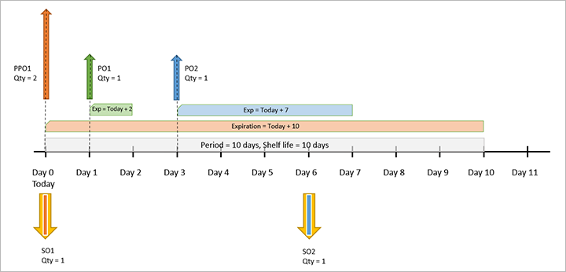

# Master planning for products with limited shelf life

[!include [banner](../../includes/banner.md)]

Shelf life is the period of time when a product can be stored until it can no longer be used or sold. For products that have a limited shelf life, you'll probably use a FEFO (first-expire-first-out) warehouse strategy, which prioritizes the consumption and sale of items based on their remaining shelf life. The method is relevant for food, medicines, and other goods that are characterized by a short storage time. According to FEFO, items in the warehouse are stored like goods on a supermarket shelf, with products that have a long shelf life placed deep into the shelves so that products with a shorter remaining shelf life are shipped first.

## Use shelf life

This section explains how master planning suggests supply for shelf life items and shows some examples of results.

When you run a master plan, it generates suggest planned orders (supply) that will fulfill your demand while minimizing delays. When your plan includes items with limited shelf life, planning calculations becomes more complex because the plan must not only minimize delays, but also use existing supply before it expires. The plan must seek to use supply that is closest to its expiration date before using supply that expires later. Therefore, master planning seeks to achieve the following goals, in this order:

1. Minimize sum of delays
1. Maximize sum of FEFO supply
1. Minimize replenishment of inventory

In some cases there may be a conflict between the first two goals, so a choice must be made&mdash;do you want to delay a shipment or do you want to use supply that expires later rather than sooner? During master planning, the system resolves this issue by prioritizing minimal delays over using up soon-to-be-expired supply. In general, these conflicts appear when there may be delays and coverage by period. Therefore, we recommend using a coverage period that is shorter than the shelf life for an item. Other types of coverage (such as requirement) most likely won't encounter such conflicts.

## Set up shelf life

### Configure each master plan to consider shelf life

By default, master plans don't consider shelf life. Use the following procedure to enable shelf life calculations for each master plan that requires it:

1. Go to **Master planning \> setup \> plans \> Master plans**.
1. Either select an existing plan in the list pane or create a new one.
1. Expand the **General** FastTab and set **Use shelf life dates** to *Yes*.

### Configure tracking dimension groups to track the batch dimension

To track the shelf life of an item, that item must be tracked at the batch dimension, which means that the batch reference and the required dates are recorded upon receipt or manufacture and through every inventory transaction of the item. You manage this option by setting up one or more tracking dimension groups to do the required tracking and then assigning the relevant items to these groups as needed.

Use the following procedure to set up a tracking dimension group to track the batch dimension:

1. Go to **Product information management \> Setup \> Dimension and variant groups \> Tracking dimension groups**.
1. Do one of the following to create or select the tracking dimension group you want to set to track the batch dimension:
    - Create a new group by selecting **New** on the Action Pane. Give the new group a **Name** and **Description** and then select **Save** on the Action Pane.
    - Select an existing group form the list pane.
1. Expand the **Tracking dimension** FastTab. In the **Batch number** row, select the check boxes in the **Active** and **Physical inventory** columns.

### Set up shelf life for a product

Use the following procedure to set up shelf life for a product:

1. Go to **Product information management \> Products \> Released products**.
1. Create or open the product you want to set up.
1. Expand the **General** FastTab and make the following setting:
    - **Tracking dimension group** – To use the shelf life settings, this field must be set to a tracking dimension group that is set up to track the batch dimension. You can only be specify this value when first creating a product; you can't change it for existing products.
1. Expand the **Manage inventory** FastTab and make the following settings:
    - **Shelf advice period in days** – Specify the period (in days) by which to check a batch of this product to ensure it's suitable for consumption or resale. This value is added to a batch's *manufacturing date* to determine its *shelf advice date*. You can configure the system to generate quality orders when a batch approaches its shelf advice date.
    - **Shelf life period in days** – Specify the number of days before a batch of this product expires. This value is added to the date of manufacture to get the *expiration date*. The batch is considered unusable after this date.
    - **Best before period in days** – Specify the period (in days) after which a batch of this product is still deemed sellable but may no longer retain some of its original properties. This value is added to the date of manufacture to get the *best-before date*. You can run reports to identify inventory that is past its best-before date. 

### Set sellable days rule for each customer

*Sellable days* functionality ensures that products from a batch that will soon expire aren't sent to customers. Moreover, it ensures that when products are sent to a customer, an adequate number of sellable days will still remain after delivery.

To use the sellable days functionality, you must define the number of sellable days that applies for each product (or group of products) for each customer. There's no data entity for this process, so you must do it manually.

Use the following procedure to set up sellable days per product for each customer:

1. Go to **Sales and marketing \> Customers \> All customers**.
1. Find and select the customer you want to set up.
1. On the Action Pane, open the **Sell** tab and, from the **Set up** group, select **Sell \> Sellable days**.
1. The **Sellable days for customer** page opens. The grid lists existing sellable days rules for each product or group of products. Use buttons on the Action Pane to add or edit rows in the grid as needed. A **Filter** is provided to help you find existing rows.
1. For each row, make the following settings:
    - **Item code** – Select one of the following values to specify the scope of items that will be affected.
        - *Table* – The row applies to a specific item.
        - *Group* – The row applies to a specific item group.
        - *All* – The row applies to all items.
    - **Item relation** – If you set the **Item code** field to *Table*, select a specific item. If you set the **Item code** field to *Group*, select an item group. If you set the **Item code** field to *All*, this 
    - **Sellable days** – Enter the minimum number of days that the customer requires to sell matching products before the batch expires. The sellable days value is based on the requested (or confirmed, if defined) receipt date for the matching products on the sales order.
    - *(Other product dimensions)* – To further limit the scope of a row, specify other dimension values (such as **Size**, **Color**, and so on) as needed. You can control which dimensions are shown in the grid by selecting **Display dimensions** on the Action Pane.

### Set all relevant products to be FEFO date controlled

For sellable days to work, each relevant item must belong to an item model group that has the **FEFO date-controlled** check box selected.

Use the following procedure to set up an item model group to support sellable days functionality:

1. Go to **Inventory management \> Setup \> Inventory \> Item model groups**.
1. Either select an existing group from the list pane or create a new one by selecting **New** on the Action Pane.
1. Expand the **Inventory policies** FastTab.
1. Select the **FEFO date-controlled** check box.
1. Make other settings for the group as needed.

Use the following procedure to view or set the item model group that a product belongs to:

1. Go to **Product information management \> Products \> Released products**.
1. Open the product you want to inspect or edit.
1. Expand the **General** FastTab and set the **Item model group** to a group that has  **FEFO date-controlled** enabled.

## Example 1: Simple FEFO, period 10 days, lead time 0 days

This example shows a basic example of shelf life, where pegging between the supply orders and the demand is done to satisfy the goals of the system, which are:

- Minimize sum of delays
- Maximize sum of FEFO supply
- Minimize replenishment of inventory

The system has the following item and master plan settings:

- **Coverage code (replenishment strategy)** – Period 
- **Coverage period** – 10 days (equal to the shelf life)
- **Shelf life** – 10 days
- **Sellable days** – 0 days
- **Lead time** – 0 days
- **Negative days** – 0 days
- **Type of planned order (default order settings of the item)** – Purchase order

There are three sales orders (SO) for the item:

- **SO1** – Quantity (qty) = 2, requested delivery date = today + 1 day
- **SO2** – Qty = 1, requested delivery date = today + 4 days
- **SO3** – Qty = 1, requested delivery date =  + 5 days

All of these sales orders create demand for the item.

The following supply exists for the item:

- **On-hand inventory** – Qty = 1, expiration date = today + 5 days
- **Purchase order (PO1)** – Receipt date = today + 2 days, qty = 1, expiration date = today + 4 days

The system will create a list of supply that can cover this demand, and it will sort the list by expiration date (using FEFO).

Master planning will create the needed pegging between supply and demand. It will also create any needed demand based on the supply list (using FEFO) and consider availability date.

- SO1 can be fulfilled by on-hand quantity, but can't be fulfilled by PO1 because the availability date for PO1 is one day later than SO1 requires. As a result, SO1 generates a demand for one unit of goods.
- SO2 can be covered by PO1 because PO1 will arrive by the requested time and the expiration date will still be valid. Therefore, the SO2 requirement is fully covered by PO1.
- SO3 isn't covered because resources aren't available. As a result, SO3 generates a demand for one unit of goods.

To cover all the remaining requirements, the system must create the following planned purchase order:

- **PPO1** – Receipt date = today, qty = 2, expiration date = today + 10 days

The following table shows the final result:

| Demand | Pegging |
|---|---|
| **SO1** – Delivery date = today + 1 day, qty = 2 | **On-hand** – Qty = 1, expiration date = today + 5 days **PPO1** – Receipt date = today, qty = 1, expiration date = today + 10 days |
| **SO2** – Delivery date = today + 4 days, qty = 1 | **PO1** – Receipt date = today + 2 days, 1 qty, expiration date = today + 4 days |
| **SO3** – Delivery date = today + 5 days, qty = 1 | **PPO1** – Receipt date = today, qty = 2, expiration date = today + 10 days |

The following illustration shows the timeline for this example.

## Example 2: Simple FEFO, requirement, lead time 3 days

This example illustrates how the system seeks to minimize delays, which can sometimes result in overordering.

The system has the following item and master plan settings:

- **Coverage code (replenishment strategy)** – Requirement
- **Shelf life** – 10 days
- **Sellable days** – 0 days
- **Lead time** – Established by the following vendor trade agreements:
  - **Trade agreement 1** – If qty = 1, then the lead time = 4
  - **Trade agreement 2** – If qty = 2, then the lead time = 3
- **Negative days** – 0 days
- **Type of planned order (default order settings of the item)** – Purchase order

The system has one sales order (SO1):

- **SO1** – Qty = 2, requested delivery date = today + 3 days

This demand is covered by the existing supply and a confirmed purchase order (PO):

- **On-hand inventory** – Available = today, qty = 1, expiration date = today + 2 days
- **PO1** – Receipt date = today + 3 days, qty = 1, expiration date = today + 4 days

SO1 can't be fulfilled by on-hand inventory because the inventory expiration date is before the shipment date. PO1 can cover the SO1 requirement with just 1 qty. As a result, SO1 generates demand for one unit of goods. To cover this requirement, the system will create a planned purchase order (PPO1).

The system has two trade agreements (the first one for qty = 1, lead time = 4 days; and the second one for qty = 2, lead time = 3 days), so the system will minimize delay by creating planned purchase order (PPO1) that meets the second trade agreement. Therefore, we'll have overdelivery (qty = 2, expiration date = today + 10 days). The following table shows the final result.

| Demand | Pegging |
|---|---|
| **SO1** – Delivery date = today + 3 days, qty = 2 | **PO1** – Receipt date = today + 3 days, qty = 1, expiration date = today + 4 days **PPO1** – Receipt date = today + 3 days, qty = 1, expiration date = today + 10 days |

The following illustration shows the timeline for this example.

## Example 3: Simple FEFO, requirement, lead time 3 days, sellable days 5 days

This example shows how shelf life works when adding sellable days for an item.

The system has the following item and master plan settings:

- **Coverage code (replenishment strategy)** – Requirement
- **Shelf life** – 10 days
- **Sellable days** – 5 days
- **Lead time** – 5 days
- **Negative days** – 0 days
- **Type of planned order (default order settings of the item)** – Purchase order

The following sales orders exist in the system:

- **SO1** – Qty = 2, requested delivery date = today + 2 days
- **SO2** – Qty = 1, requested delivery date = today + 3 days
- **SO3** – Qty = 1, requested delivery date = today + 5 days

This demand can be covered by existing supply and a confirmed purchase order:

- **On-hand inventory** – Available = today, qty = 1, expiration date = Today + 6 days
- **PO1** – Receipt date = today + 2 days, qty = 3, expiration date = today + 10 days

The system creates a list of pegging candidates based on the supply (FEFO) list and availability dates. Therefore, SO1 can't be fulfilled by the on-hand inventory because that inventory expires before the end of the sellable days required by the customer (requested receipt date + 5 days). PO1 can cover the SO1 requirement with two units and SO2 requirement with one unit. As a result, only SO3 still has uncovered demand for one unit of goods. To cover this requirement, the system will create the following planned purchase order:

- **PP01** – Receipt date = today + 5 days, qty = 1, expiration date = today + 10 days

The following table summarizes the result.

| Demand | Pegging |
|---|---|
| **SO1** – Delivery date = today + 2 days, qty = 2 | **PO1** – Receipt date = today + 2 days, qty = 2, expiration date = today + 10 days |
| **SO2** – Delivery date = today + 3 days, qty = 1 | **PO1** – Receipt date = today + 2 days, qty = 1, expiration date = today + 10 days |
| **SO3** – Delivery date = today + 5 days, qty = 1 | **PPO1** – Receipt date = today + 5 days, qty = 1, expiration date = today + 10 days |

The following illustration shows the timeline for this example.

## Example 4: Simple FEFO, period, lead time depends on quantity

This example illustrates how the system seeks to minimize delays, which can sometimes result in overordering.

The system has the following item and master plan settings:

- **Coverage code (replenishment strategy)** – Period
- **Coverage period** – 10 days (equal to the shelf life)
- **Shelf life** – 10 days
- **Sellable days** – 0 days
- **Lead time** – Established by the following vendor trade agreements:
  - **Trade agreement 1** – If qty = 1, then the lead time = 5
  - **Trade agreement 2** – If qty = 2, then the lead time = 0
- **Negative days** – 0 days
- **Type of planned order (default order settings of the item)** – Purchase order

The following sales orders exist in the system:

- **SO1** – Qty = 1, requested delivery date = today
- **SO2** – Qty = 1, requested delivery date = today + 6 days

This demand can be partially covered by existing supply from the following confirmed purchase orders:

- **PO1** – Receipt date = today + 1 days, qty = 1, expiration date = today + 2 days
- **PO2** – Receipt date = today + 3 days, qty = 1, expiration date = today + 7 days

The system has two trade agreements (the first one for qty = 1, lead time = 5 days; and the second one for qty = 2, lead time = 0 days), so the system will minimize delay by creating the following planned purchase order (PPO1), which meets the second trade agreement:

- **PP01** – Receipt date = today, qty = 2, expiration date = today + 10 days

SO1 will be covered by one unit from PPO1. SO2 will be covered by PO2 because PO2 expires sooner than PPO1.

The following table summarizes the result.

| Demand | Pegging |
|---|---|
| **SO1** – Delivery date = today, qty = 1 | **PPO1** – Receipt date = today, qty = 1, expiration date = today + 10 days |
| **SO2** – Delivery date = today + 6 days, qty = 1 | **PO2** – Receipt date = today + 3 days, qty = 1, expiration date = today + 7 days |

> [!NOTE]
> PO1 isn't used (because it arrives too late for S01 and will expire before S02 is delivered). PPO1 has overodered by 1 unit to allow the lead time to be zero (according to trade agreement 2).

The following illustration shows the timeline for this example.

## Example 5: Simple FEFO, requirement, 10 negative days

<!-- KFM: This is more of a negative days example than a shelf life example. We should point out more explicitly how shelf life affects this situation (or maybe otherwise remove this example). -->

This example shows how shelf life works when adding a large number of negative days for an item. Negative days are the number of days that you're willing to wait before ordering replenishment of an item with negative inventory. The system won't create supply unless the number of negative days is exceeded.

The system has the following item and master plan settings:

- **Coverage code (replenishment strategy)** – Requirement
- **Lead time** – 0 days
- **Negative days** – 10 days
- **Type of planned order (default order settings of the item)** – Purchase order

The following sales order exists in the system:

- **SO1** – Qty = 1, requested delivery date = today

This demand can be covered by existing supply from the following confirmed purchase order:

- **PO1** – Receipt date = today + 3 days, qty = 1, expiration date = today + 5 days

Because the system is configured to allow 10 negative days, it will cover the demand of SO1 by using PO1 even through that will result in a delay of three days due to SO1 creating negative inventory until PO1 arrives. No planned order is created even though lead time is 0 and creating a PPO would reduce delays.

The following table summarizes the result.

| Demand | Pegging |
|---|---|
| **SO1** – Delivery date = today, qty = 1 | **PO1** – Receipt date = today + 3 days, qty = 1, expiration date = today + 5 days |

The following illustration shows the timeline for this example.

## Example 6: Simple FEFO, requirement, 5 negative days

This example shows how shelf life works when the number of negative days for an item is less than its shelf-life period.

The system has the following item and master plan settings:

- **Coverage code (replenishment strategy)** – Requirement
- **Sellable days** – 0 days
- **Lead time** – 0 days
- **Negative days** – 5 days
- **Type of planned order (default order settings of the item)** – Purchase order

The following sales order exists in the system:

- **SO1** – Qty = 2, requested delivery date = today

This demand could be covered by existing supply from the following confirmed purchase orders:

- **PO1** – Receipt date = today, qty = 1, expiration date = today + 1 day
- **PO2** – Receipt date = today + 2 days, qty = 1, expiration date = today + 3 days

However, the system must respect the restriction that shipped items can't be expired at the time of shipment, so PO2 and PO1 can't both be used for SO1 because PO1 expires before PO2 arrives. Therefore, the system will create the following planned purchase order to finish covering the demand for SO1:

- **PPO1** – Receipt date = today, qty = 1, expiration date = today + 10 days

The system could take advantage of the five negative days to use PO2 and PPO1 to cover SO1, but that would result in delaying delivery until PO2 arrives, and PO1 would expire in the meantime. Therefore the system will cover SO1 using PPO1 and PO1.

The following table summarizes the result.

| Demand | Pegging |
|---|---|
| **SO1** – Delivery date = today, qty = 2 | **PO1** – Receipt date = today, qty = 1, expiration date = today + 1 day **PPO1** – Receipt date = today, qty = 1, expiration date = today + 10 days |

The following illustration shows the timeline for this example.

