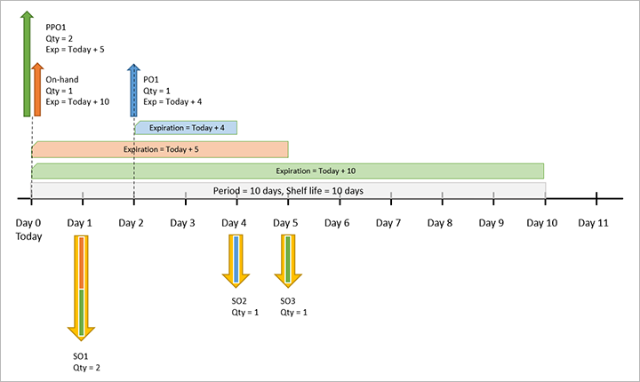
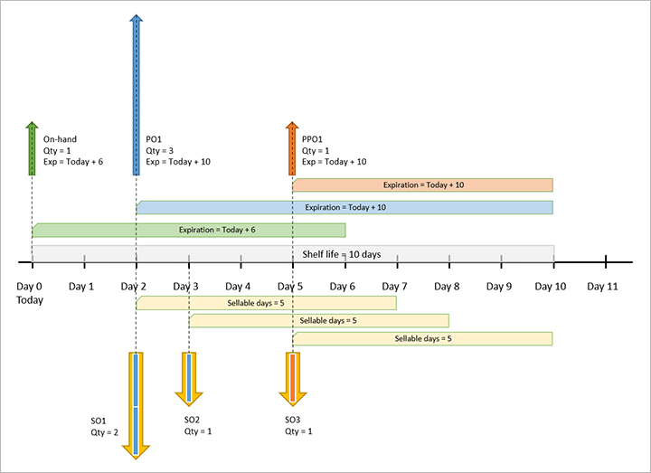
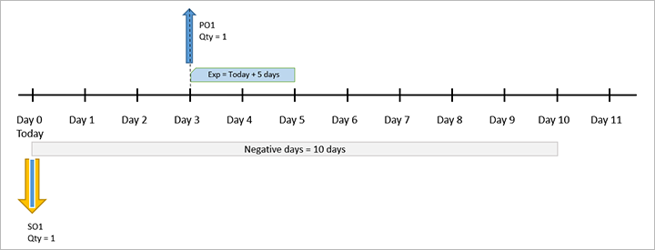

# Master planning for products with limited shelf life

[!include [banner](../../includes/banner.md)]

Shelf life is the amount of time that a product can be stored until it can no longer be used or sold. For products that have a limited shelf life, you will probably use a first-expire, first-out (FEFO) warehouse strategy, which prioritizes the consumption and sale of items based on their remaining shelf life. This warehouse strategy is relevant for food, medicines, and other goods that are characterized by a short storage time. According to FEFO, items in the warehouse are stored like goods on a supermarket shelf: products that have a long shelf life are placed deep into the shelves, so that products that have a shorter remaining shelf life are shipped first.

## Using shelf life in master planning

This section explains how master planning suggests supply for shelf-life items.

When you run a master plan, it generates suggested planned orders (supply) that will fulfill your demand and also minimize delays. If your plan includes items that have limited shelf life, planning calculations become more complex, because the plan must not only minimize delays but also use existing supply before it expires. The plan must try to use supply that is closest to its expiration date before supply that expires later. Therefore, master planning seeks to achieve the following goals, in this order:

1. Minimize the sum of delays.
1. Maximize the sum of FEFO supply.
1. Minimize the replenishment of inventory.

In some cases, there might be a conflict between the first two goals, and a choice must be made: do you want to delay a shipment, or do you want to use supply that expires later instead of supply that expires sooner? To resolve this conflict during master planning, the system prioritizes minimizing delays over using up soon-to-expire supply. In general, this type of conflict occurs when there might be delays and coverage by period. Therefore, we recommend that you use a coverage period that is shorter than the shelf life of an item. Other types of coverage (such as requirement) are unlikely to encounter this type of conflict.

## Set up shelf life

### Configure each master plan to consider shelf life

By default, master plans don't consider shelf life. Use the following procedure to enable shelf-life calculations for each master plan that requires them.

1. Go to **Master planning \> setup \> plans \> Master plans**.
1. Either select an existing plan in the list pane or create a new one.
1. On the **General** FastTab, set the **Use shelf life dates** option to *Yes*.

### Configure tracking dimension groups to track the batch dimension

The shelf life of an item can be tracked only if that item is tracked at the batch dimension. In other words, the batch reference and the required dates must be recorded upon receipt or manufacture, and through every inventory transaction of the item. To manage this option, set up one or more tracking dimension groups to do the required tracking, and then assign the relevant items to these groups as required.

Use the following procedure to set up a tracking dimension group to track the batch dimension.

1. Go to **Product information management \> Setup \> Dimension and variant groups \> Tracking dimension groups**.
1. Follow one of these steps:

    - On the Action Pane, select **New** to create a new tracking dimension group. Enter a name and description, and then select **Save** on the Action Pane.
    - In the list pane, select the existing tracking dimension group that you want to set up to track the batch dimension.

1. On the **Tracking dimension** FastTab, in the **Batch number** row, select the checkboxes in the **Active** and **Physical inventory** columns.

### Set up shelf life for a product

Use the following procedure to set up shelf life for a product.

1. Go to **Product information management \> Products \> Released products**.
1. Create or open the product that you want to set up.
1. To use the shelf-life settings, on the **General** FastTab, set the **Tracking dimension group** field to a tracking dimension group that is set up to track the batch dimension. You can set this field only when you're first creating a product. You can't change the value for existing products.
1. On the **Manage inventory** FastTab, set the following fields:

    - **Shelf advice period in days** – Specify the period (in days) by which to check a batch of this product to ensure that it's suitable for consumption or resale. The value of this field is added to a batch's *manufacturing date* to determine its *shelf advice date*. You can configure the system to generate quality orders when a batch approaches its shelf advice date.
    - **Shelf life period in days** – Specify the number of days before a batch of this product expires. This value is added to the *date of manufacture* to determine the *expiration date*. The batch is considered unusable after this date.
    - **Best before period in days** – Specify the period (in days) after which a batch of this product is deemed still sellable but can no longer retain some of its original properties. This value is added to the *date of manufacture* to determine the *best-before date*. You can run reports to identify inventory that is past its best-before date. 

### Set a sellable days rule for each customer

*Sellable days* functionality ensures that products from a batch that will soon expire aren't sent to customers. Moreover, it ensures that when products are sent to a customer, an adequate number of sellable days will still remain after delivery.

To use the sellable days functionality, you must define the number of sellable days that applies for each product (or group of products) for each customer. You must manually complete this process, because there is no data entity for it.

Use the following procedure to set up sellable days for each product for each customer.

1. Go to **Sales and marketing \> Customers \> All customers**.
1. Find and select the customer that you want to set up.
1. On the Action Pane, on the **Sell** tab, in the **Set up** group, select **Sell \> Sellable days**.
1. On the **Sellable days for customer** page, the grid lists existing sellable days rules for each product or group of products. Use buttons on the Action Pane to add or edit rows in the grid as required. A **Filter** is provided to help you find existing rows.
1. For each row, set the following fields:

    - **Item code** – Select one of the following values to specify the scope of items that will be affected:

        - *Table* – The row applies to a specific item.
        - *Group* – The row applies to a specific item group.
        - *All* – The row applies to all items.

    - **Item relation** – If you set the **Item code** field to *Table*, select a specific item. If you set the **Item code** field to *Group*, select an item group. If you set the **Item code** field to *All*, this field in unavailable.
    - **Sellable days** – Enter the minimum number of days that the customer must have to sell matching products before the batch expires. The sellable days value is based on the requested receipt date (or the confirmed receipt date, if it's defined) for the matching products on the sales order.
    - *(Other product dimensions)* – To further limit the scope of a row, specify other dimension values (such as **Size** and **Color**) as required. To control which dimensions are shown in the grid, select **Display dimensions** on the Action Pane.

### Set up all relevant products so that they are FEFO date controlled

For sellable days to work, each relevant item must belong to an item model group where the **FEFO date-controlled** checkbox is selected.

Use the following procedure to set up an item model group so that it supports sellable days functionality.

1. Go to **Inventory management \> Setup \> Inventory \> Item model groups**.
1. Either select an existing group in the list pane or create a new one by selecting **New** on the Action Pane.
1. On the **Inventory policies** FastTab, select the **FEFO date-controlled** checkbox.
1. Set other fields for the group as required.

Use the following procedure to view or set the item model group that a product belongs to.

1. Go to **Product information management \> Products \> Released products**.
1. Open the product that you want to inspect or edit.
1. On the **General** FastTab, set the **Item model group** field to a group where the **FEFO date-controlled** checkbox is selected.

## Example 1: Simple FEFO, 10-day period, zero days of lead time

This example shows a basic example of shelf life, where pegging between the supply orders and the demand is done to satisfy the following goals of the system:

- Minimize the sum of delays.
- Maximize the sum of FEFO supply.
- Minimize the replenishment of inventory.

The system has the following item and master plan settings:

- **Coverage code (replenishment strategy):** Period 
- **Coverage period:** 10 days (equal to the shelf life)
- **Shelf life:** 10 days
- **Sellable days:** 0 days
- **Lead time:** 0 days
- **Negative days:** 0 days
- **Type of planned order (default order settings of the item):** Purchase order

The following sales orders for the item exist in the system:

- **SO1:** Quantity (qty) = 2, requested delivery date = today + 1 day
- **SO2:** Qty = 1, requested delivery date = today + 4 days
- **SO3:** Qty = 1, requested delivery date = today + 5 days

All these sales orders create demand for the item.

The following supply exists for the item:

- **On-hand inventory:** Qty = 1, expiration date = today + 5 days
- **Purchase order 1 (PO1):** Receipt date = today + 2 days, qty = 1, expiration date = today + 4 days

The system creates a list of supply that can cover this demand, and it sorts the list by expiration date (by using FEFO).

Master planning creates the required pegging between supply and demand. It also creates any required demand based on the supply list (by using FEFO) and considers the availability date.

- SO1 can be fulfilled by the on-hand quantity, but it can't be fulfilled by PO1, because the availability date for PO1 is one day later than SO1 requires. Therefore, SO1 generates demand for one unit of goods.
- SO2 can be covered by PO1, because PO1 will arrive by the requested time and the expiration date will still be valid. Therefore, the SO2 requirement is fully covered by PO1.
- SO3 isn't covered, because resources aren't available. Therefore, SO3 generates demand for one unit of goods.

To cover all the remaining requirements, the system must create the following planned purchase order:

- **PPO1:** Receipt date = today, qty = 2, expiration date = today + 10 days

The following table summarizes the result.

| Demand | Pegging |
|---|---|
| **SO1:** Delivery date = today + 1 day, qty = 2 | 
**On-hand:** Qty = 1, expiration date = today + 5 days

**PPO1:** Receipt date = today, qty = 1, expiration date = today + 10 days
 |
| **SO2:** Delivery date = today + 4 days, qty = 1 | **PO1:** Receipt date = today + 2 days, 1 qty, expiration date = today + 4 days |
| **SO3:** Delivery date = today + 5 days, qty = 1 | **PPO1:** Receipt date = today, qty = 2, expiration date = today + 10 days |

The following illustration shows the timeline for this example.

## Example 2: Simple FEFO, requirement, three days of lead time

This example shows how the system's attempt to minimize delays can sometimes cause overordering to occur.

The system has the following item and master plan settings:

- **Coverage code (replenishment strategy):** Requirement
- **Shelf life:** 10 days
- **Sellable days:** 0 days
- **Lead time:** Established by the following vendor trade agreements:

    - **Trade agreement 1:** If qty = 1, lead time = 4
    - **Trade agreement 2:** If qty = 2, lead time = 3

- **Negative days:** 0 days
- **Type of planned order (default order settings of the item):** Purchase order

The following sales order exists in the system:

- **SO1:** Qty = 2, requested delivery date = today + 3 days

This demand is covered by the existing supply and a confirmed purchase order:

- **On-hand inventory:** Available = today, qty = 1, expiration date = today + 2 days
- **PO1:** Receipt date = today + 3 days, qty = 1, expiration date = today + 4 days

SO1 can't be fulfilled by on-hand inventory, because the inventory expiration date is before the shipment date. PO1 can cover the SO1 requirement with a quantity of only 1. Therefore, SO1 generates demand for one unit of goods. To cover this requirement, the system creates a planned purchase order (PPO1).

The system has two trade agreements (one for qty = 1, lead time = 4 days, and one for qty = 2, lead time = 3 days). Therefore, the system tries to minimize delays by creating a planned purchase order (PPO1) that meets the second trade agreement. The result is an overdelivery (qty = 2, expiration date = today + 10 days).

The following table summarizes the result.

| Demand | Pegging |
|---|---|
| **SO1:** Delivery date = today + 3 days, qty = 2 | 
**PO1:** Receipt date = today + 3 days, qty = 1, expiration date = today + 4 days

**PPO1:** Receipt date = today + 3 days, qty = 1, expiration date = today + 10 days
 |

The following illustration shows the timeline for this example.

## Example 3: Simple FEFO, requirement, three days of lead time, five sellable days

This example shows how shelf life works when sellable days are added for an item.

The system has the following item and master plan settings:

- **Coverage code (replenishment strategy):** Requirement
- **Shelf life:** 10 days
- **Sellable days:** 5 days
- **Lead time:** 5 days
- **Negative days:** 0 days
- **Type of planned order (default order settings of the item):** Purchase order

The following sales orders exist in the system:

- **SO1:** Qty = 2, requested delivery date = today + 2 days
- **SO2:** Qty = 1, requested delivery date = today + 3 days
- **SO3:** Qty = 1, requested delivery date = today + 5 days

This demand can be covered by existing supply and a confirmed purchase order:

- **On-hand inventory:** Available = today, qty = 1, expiration date = Today + 6 days
- **PO1:** Receipt date = today + 2 days, qty = 3, expiration date = today + 10 days

The system creates a list of pegging candidates, based on the supply (FEFO) list and availability dates. Therefore, SO1 can't be fulfilled by the on-hand inventory, because that inventory expires before the end of the sellable days that the customer requires (requested receipt date + 5 days). PO1 can cover the SO1 requirement with two units and the SO2 requirement with one unit. Therefore, only SO3 still has uncovered demand for one unit of goods. To cover this requirement, the system creates the following planned purchase order:

- **PP01:** Receipt date = today + 5 days, qty = 1, expiration date = today + 10 days

The following table summarizes the result.

| Demand | Pegging |
|---|---|
| **SO1:** Delivery date = today + 2 days, qty = 2 | **PO1:** Receipt date = today + 2 days, qty = 2, expiration date = today + 10 days |
| **SO2:** Delivery date = today + 3 days, qty = 1 | **PO1:** Receipt date = today + 2 days, qty = 1, expiration date = today + 10 days |
| **SO3:** Delivery date = today + 5 days, qty = 1 | **PPO1:** Receipt date = today + 5 days, qty = 1, expiration date = today + 10 days |

The following illustration shows the timeline for this example.

## Example 4: Simple FEFO, period, lead time depends on the quantity

This example shows how the system's attempt to minimize delays can sometimes cause overordering to occur.

The system has the following item and master plan settings:

- **Coverage code (replenishment strategy):** Period
- **Coverage period:** 10 days (equal to the shelf life)
- **Shelf life:** 10 days
- **Sellable days:** 0 days
- **Lead time:** Established by the following vendor trade agreements:

    - **Trade agreement 1:** If qty = 1, lead time = 5
    - **Trade agreement 2:** If qty = 2, lead time = 0

- **Negative days:** 0 days
- **Type of planned order (default order settings of the item):** Purchase order

The following sales orders exist in the system:

- **SO1:** Qty = 1, requested delivery date = today
- **SO2:** Qty = 1, requested delivery date = today + 6 days

This demand can be partially covered by existing supply from the following confirmed purchase orders:

- **PO1:** Receipt date = today + 1 days, qty = 1, expiration date = today + 2 days
- **PO2:** Receipt date = today + 3 days, qty = 1, expiration date = today + 7 days

The system has two trade agreements (one for qty = 1, lead time = 5 days, and one for qty = 2, lead time = 0 days). Therefore, the system tries to minimize delay by creating the following planned purchase order that meets the second trade agreement:

- **PP01:** Receipt date = today, qty = 2, expiration date = today + 10 days

SO1 will be covered by one unit from PPO1. SO2 will be covered by PO2, because PO2 expires sooner than PPO1.

The following table summarizes the result.

| Demand | Pegging |
|---|---|
| **SO1:** Delivery date = today, qty = 1 | **PPO1:** Receipt date = today, qty = 1, expiration date = today + 10 days |
| **SO2:** Delivery date = today + 6 days, qty = 1 | **PO2:** Receipt date = today + 3 days, qty = 1, expiration date = today + 7 days |

> [!NOTE]
> PO1 isn't used, because it will arrive too late for S01 and will expire before S02 is delivered. PPO1 has overordered by one unit to enable the lead time to be 0 (zero), per trade agreement 2.

The following illustration shows the timeline for this example.

## Example 5: Simple FEFO, requirement, 10 negative days

This example shows how shelf life works when a large number of negative days is added for an item. Negative days are the number of days that you're willing to wait before you order replenishment of an item that has negative inventory. The system doesn't create supply unless the number of negative days is exceeded.

The system has the following item and master plan settings:

- **Coverage code (replenishment strategy):** Requirement
- **Lead time:** 0 days
- **Negative days:** 10 days
- **Type of planned order (default order settings of the item):** Purchase order

The following sales order exists in the system:

- **SO1:** Qty = 1, requested delivery date = today

This demand can be covered by existing supply from the following confirmed purchase order:

- **PO1:** Receipt date = today + 3 days, qty = 1, expiration date = today + 5 days

Because the system is configured to allow 10 negative days, it covers the demand of SO1 by using PO1, even though the result will be a delay of three days because SO1 creates negative inventory until PO1 arrives. No planned purchase order is created, even though the lead time is 0 (zero) and the creation of a planned purchase order would reduce delays.

The following table summarizes the result.

| Demand | Pegging |
|---|---|
| **SO1:** Delivery date = today, qty = 1 | **PO1:** Receipt date = today + 3 days, qty = 1, expiration date = today + 5 days |

The following illustration shows the timeline for this example.

## Example 6: Simple FEFO, requirement, five negative days

This example shows how shelf life works when the number of negative days for an item is less than its shelf-life period.

The system has the following item and master plan settings:

- **Coverage code (replenishment strategy):** Requirement
- **Sellable days:** 0 days
- **Lead time:** 0 days
- **Negative days:** 5 days
- **Type of planned order (default order settings of the item):** Purchase order

The following sales order exists in the system:

- **SO1:** Qty = 2, requested delivery date = today

This demand can be covered by existing supply from the following confirmed purchase orders:

- **PO1:** Receipt date = today, qty = 1, expiration date = today + 1 day
- **PO2:** Receipt date = today + 2 days, qty = 1, expiration date = today + 3 days

However, the system must respect the restriction that shipped items can't be expired at the time of shipment. Therefore, PO2 and PO1 can't both be used for SO1, because PO1 expires before PO2 arrives. The system creates the following planned purchase order to finish covering the demand for SO1:

- **PPO1:** Receipt date = today, qty = 1, expiration date = today + 10 days

The system can take advantage of the five negative days and use PO2 and PPO1 to cover SO1. However, this approach will cause delivery to be delayed until PO2 arrives, and PO1 will expire in the meantime. Therefore, the system covers SO1 by using PPO1 and PO1.

The following table summarizes the result.

| Demand | Pegging |
|---|---|
| **SO1:** Delivery date = today, qty = 2 | 
**PO1:** Receipt date = today, qty = 1, expiration date = today + 1 day

**PPO1:** Receipt date = today, qty = 1, expiration date = today + 10 days
 |

The following illustration shows the timeline for this example.

