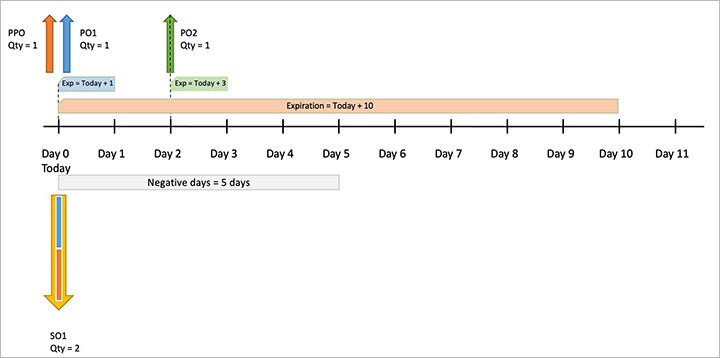

# Master planning for products with limited shelf life

[!include [banner](../../includes/banner.md)]

Shelf life is the period of time when a product can be stored until it can no longer be used. For products that have a limited shelf life, you will probably use a FEFO (first-expire-first-out) warehouse strategy, which prioritizes shipments based on the remaining shelf life. The method is relevant for food, medicines, and other goods that are characterized by a short storage time. According to FEFO, goods are stored like goods on a supermarket shelf, with products that have a long shelf life remaining placed deep into the shelves so that products with a shorter remaining shelf life are shipped first.

## Use shelf life

This section explains how master planning suggests supply for shelf life items and examples of results.

When running master planning, it will give you the best possible plan to suggest you supply (planned orders) to fulfill your demand minimizing delays, as it is important and given that the objective is to minimize delays on your demand.

Introducing shelf life, the planning problem becomes more complex, as now the good will expire and while trying to diminish delays, it is also trying to use the existing supply during its shelf life.

Now we add shelf life into the mix and that means we are trying to maximize the shelf life. So, we want to the extent possible, use supply that expires sooner rather than later.

The goals that master planning tries to achieve are (in this order):

- Minimize sum of delays
- Maximize sum of FEFO supply
- Minimize replenishment of inventory

There, but in some cases there may be a conflict between the first two goals. In some cases, there may be a choice. Do we want a shipment to be delayed or do we want to use supply that expires later rather than sooner? However, we cannot have both. As a result, master planning will prioritize minimizing delays over using expired supply.

In general, these conflicts appear when there may be delays and coverage by period.

> [!NOTE]
> We recommend that the shelf life for the item is longer than the period setup.

Other types of coverage, like requirement, will most likely not be in these situations.

Now, we will show different examples where this contradiction may exist.

Here is a list of examples and what each of them will illustrate:

- Example 1 – This example shows a basic example of shelf life, where the pegging between the supply orders and the demand are done satisfying the goals of the system
- Example 2 – This example shows how the system has the goal to minimize delays, which in some cases (as shown in this example) may result in overordering.
- Example 3 – This example illustrates how shelf life works when adding sellable days for the item
- Example 4 – This example illustrates that the main objective of the system is to minimize delays and in some cases, it may result it overordering.
- Example 5 – This example illustrates how shelf life works when adding a big number of negative days for the item.
- Example 6 – This example shows how shelf life works when a number of negative days for the item less than shelf-life period.

## Set up shelf life

### Master Planning Parameters

The Master plan parameters needs **Use shelf life dates** activated. This will cause master planning to create a planned order when the inventory is due to be expired. The user can activate this parameter under Setup field group on the general FastTab on the **Master plan** form

### Tracking dimension group

To enable items to be shelf-life controlled, the item must be tracked at the batch dimension. This means the batch reference and the required dates are recorded upon receipt or manufacture and through every inventory transaction of the item. In other words, you need to use existing or create a new one tracking dimension group with enabled *Active* and*Physical inventory* parameters for**Batch number** on the **Tracking dimension groups** page (**Product information management \> Setup \> Dimension and variant groups \> Tracking dimension groups**)

### Item setup

**Tracking dimension group**, **Shelf advice period in days**, **Shelf life in days** and **Best before in days** must be setup in the item for it to be setup as a shelf life item. All these parameters in days can be set up under the **Item data** field group on the **Manage inventory** FastTab of the **Released product detail** page.

Getting into detail for each of these:

The fields **Shelf advice period in days**, **Shelf life in days** and **Best before in days** described below and should be setup for each released product. All these fields can be found under **Manage inventory** tab of the **Released product details** page.

#### Shelf advice period in days

This is the period, in days, that you want to check the item to ensure the product is suitable for resale. It is added to the manufacturing date to determine the Shelf advice date. Quality orders can be configured to automatically generate when the product approaches its advice date.

#### Shelf-life period in days

This is the number of days before the product expires. Days are added to the date of manufacture to get the expiration date. This is really the date when the product will be considered unworthy to sell.

> [!NOTE]
> Shelf advice field is not used during planning.

#### Best before period in days

This is the period in days, that the item is deemed sellable but may not retain its original properties. It is subtracted from the expiry date to calculate the Best before date. Reports can be run identifying the inventory past the Sell by date.

### Sellable days

The functionality of the Sellable days ensures that a product with a short shelf life is not sent to customers. Moreover, when a product is sent to customers, they have enough "sellable days" from the moment when the product is expected to reach the customer.

To start using the Sellable days functionality, sellable days need to be defined against the Customer record. There is not a data entity for this process, so the user can do it manually.

Navigate to **Sales and marketing \> Customers \> All customers**. Click the **Setup** button under the **Set up** button group on the **Sell** tab. In the dropdown list select *Sellable days*.

On the **Sellable days for customer** page the user can define the customer's sellable days for all products (value *All* in the**Item code** field), a group of products (Item group, value *Group* in the**Item code** field), or a specific product. Sellable days is the minimum number of days that the customer requires to sell the product before the batch expires. Sellable days is based on the requested (or confirmed if defined) receipt date for that product on the sales order.

> [!NOTE]
> For sellable days to work the item must have the "FEFO date-controlled" flag selected on the item model group associated with the item. If this flag is not enabled the sellable days will be ignored by the system.*

## Example 1: Simple FEFO, period 10 days, lead time 0 days

This example shows a basic example of shelf life, where the pegging between the supply orders and the demand are done satisfying the goals of the system (1- Minimize sum of delays 2- Maximize sum of FEFO supply 3-Minimize replenishment of inventory)

Item and master planning setup:

- **Replenishment strategy (coverage code)**: *Period*
- **Period**: *10 days*
- **Shelf life**: *10 days*
- **Sellable days**: *0 days*
- **Lead time**: *0 days*
- **Type of planned order (default order settings of the item)**: *Purchase order*

There are three Sales orders (SO) for the item above:

- SO1 Quantity (Qty) = 2, requested for today+3 days,
- SO2 Qty =1, requested for today+4 days,
- SO3 Qty =1, requested for today+5 days.

All these Sales orders create demand for item.

There is existing supply for the item:

- On-hand – On-hand quantity = 1 and its expiration date is Today + 5 days
- Purchase order (PO) with delivery date is Today+2 days, PO qty = 1 and Expiration date = Today + 4 days

The system will create a list of supply that can cover these demands and sort this list by the Expiration date (FEFO)

Master planning will create the needed pegging between supply and demand, as well as create any needed demand based on the Supply (FEFO) list and considering availability date. Thus, SO1 can be fulfilled by On-hand quantity and cannot be fulfilled by PO because the availability date for PO is one day later than SO1 needs. As a result, SO1 still makes a demand for one unit of goods.

SO2 can be covered by PO because the PO arrival will be available at requested time and the Expiration date is still to be valid. So, the SO2 requirement will be fully covered by PO.

SO3 will not be covered because lack of available resources. It means that SO3 requires 1 qty.

To cover all remaining requirements the system will create a Planned purchase order (PPO) for Today, qty 2 and Exp Today+10 days. The final result is shown in the table below.

| Demand (sorted requirement date) | Pegging |
|-------------------------|-------------------------|
| SO1 Today + 3 , 2 qty | On-hand Today , 1 qty, Exp Today + 5 PPO Today, 1 qty, Exp Today +10 |
| SO2 Today + 4 , 1 qty | PO Today + 2, 1 qty, Exp Today + 4 |
| SO3 Today + 5 , 1 qty | PPO Today, 2 qty, Exp Today +10 |

The result is shown on the picture below. Note that PO represents purchase order and PPO planned purchase order.

## Example 2: Simple FEFO, requirement, lead time 3 days

This example illustrates how the system has the goal to minimize delays, which in some cases (as shown in this example) may result in overordering.

Initial conditions:

- **Replenishment strategy**: *Requirement*
- **Shelf life**: *10 days*
- **Sellable days**: *0 days*
- **Lead time**:
  - *Trade agreements: if qty = 1 the Lead time = 4*
  - *Trade agreements: if qty = 2 the Lead time = 3*
- **Type of planned order**: *Purchase order*

The system has one Sales order (SO):

- SO1 Quantity (Qty) = 2 requested for today+3 days,

This demand may be covered by the existing supply with a confirmed purchase order:

- On-hand – the items that are always available on warehouse and can be shipped at any time. On-hand quantity = 1 and its expiration date is Today + 2 days
- Purchase order with delivery date is Today+3 days, PO qty = 1 and Expiration date = Today + 4 days

All these conditions are reflected in the table below.

SO1 cannot be fulfilled by On-hand quantity because the Expiration date is less than the shipment date. PO can cover the SO requirement by 1 qty. As a result, SO1 still makes a demand for one unit of goods.

To cover this requirement the system will create a Planned purchase order (PPO). Since the system has two Trade agreements, the first one for Qty=1 with Lead time = 4 days and the second one for Qty=2 with Lead time = 3 days, the system will create PPO for Today+3 days to minimize delay, according to the second Trade agreement, we will have overdelivery and Qty=2 and Exp Today+10. The final result is shown in the table below.

This is the key decision that the system will take to minimize delays, so that it is always preferable to minimize delays rather than overordering.

| Demand (sorted requirement date) | Pegging |
|-------------------------|-------------------------|
| SO1 Today + 3 , 2 qty | PO Today + 3, 1 qty, Exp Today + 4 **PPO Today+3, 1 qty, Exp Today +10** **Net requirement: 0 qty** |
|  |  |

As the result, after planning the system will have On-hand Today with Qty=1 and Expiration date = Today+2 and overdelivery PPO for Today+3 with Qty=2 and Expiration date Today+10.

The result is shown on the picture below.

## Example 3: Simple FEFO, requirement, lead time 3 days, sellable days 5 days

This example shows how shelf life works when adding sellable days for the item

Initial conditions:

- **Replenishment strategy**: *Requirement*
- **Shelf life**: *10 days*
- **Sellable days**: *5 days*
- **Lead time**: 3 days
- **Sellable days**: 5 days
- **Type of planned order**: *Purchase order*

There are three Sales orders (SO):

- SO1 Quantity (Qty) = 2 requested receipt date for today+2 days,
- SO2 Quantity = 1 requested receipt date for today+3 days,
- SO3 Quantity = 1 requested receipt date for today+5 days,

This demand may be covered by the existing supply with a confirmed purchase order:

- On-hand – the items that are always available on warehouse and can be shipped at any time. On-hand quantity = 1 and its expiration date is Today + 6 days
- Purchase order with delivery date is Today+3 days, PO qty = 3 and Expiration date = Today + 10 days

The list of the Pegging candidates will be created based on the Supply (FEFO) list and considering availability date. Thus, SO1 cannot be fulfilled by On-hand quantity because the Expiration date is less than the requested receipt date + 5 Sellable days for a Customer. PO can cover the SO1 requirement by 1 qty and SO2 requirement by 2 qty. As a result, only SO3 still makes a demand for one unit of goods.

To cover this requirement the system will create a Planned purchase order (PPO).

Since the system has Lead time = 3 days and demand Today+5 days, the system will create PPO for Today+5 days to minimize a delay, with Quantity =1 and Expiration date = Today+10.

As the result, after planning the system will have On-hand Today with Qty=1 and Expiration date = Today+6.

The result is shown in the table and on the picture below.

| Demand (sorted requirement date) | Pegging |
|-------------------------|-------------------------|
| SO1 Today + 2 , 2 qty | PO Today + 3, 2 qty, Exp Today + 10 |
| SO2 Today + 3 , 1 qty | PO Today + 3, 1 qty, Exp Today + 10 |
| SO3 Today + 5 , 1 qty | PPO Today+5, 1 qty, Exp Today +10 |

## Example 4: Simple FEFO, period, lead time depends on quantity

This example illustrates that the main objective of the system is to minimize delays and in some cases, it may result it overordering.

Initial conditions:

- **Replenishment strategy**: *Period*
- **Period** is equal to **Shelf life**
- **Trade agreements:**
  - If qty is 1, the lead time is 5
  - If qty is 2, the lead time is 0
- **Type of planned order**: *Purchase order*

There are two Sales orders (SO):

- SO1 Quantity (Qty) = 1 requested receipt date for today,
- SO2 Quantity = 1 requested receipt date for today+6 days,

This demand may be covered by the existing supply with confirmed purchase orders:

- Purchase order PO1 with delivery date is Today+1 day, PO qty = 1 and Expiration date = Today + 2 days
- Purchase order PO2 with delivery date is Today+3 days, PO qty = 1 and Expiration date = Today + 7 days

Based on the trade agreement restrictions and to minimize a delay the system will create a Planned purchase order PPO with overordering Quantity = 2 and Expiration date = Today+10. The SO1 will be covered by Quantity =1 of the created Planned purchase order and SO2 will be covered by the existent PO1 with delivery date is Today+3 days, PO qty = 1 and Expiration date = Today + 7 days.

As the result, after planning the system will have Purchase order PO1 with delivery date is Today+1 day, PO qty = 1 and Expiration date = Today + 2 days and Expiration date = Today+6 and the rest of the created Planned purchase order PPO with Quantity = 1 and Expiration date = Today+10.

The result is shown on the picture below.

| Demand (sorted requirement date) | Pegging |
|-------------------------|-------------------------|
| SO1 Today, 1 qty | PPO Today, 1 qty, Exp Today +10 |
| SO2 Today + 6 , 1 qty | PO2 Today + 3, 1 qty, Exp Today + 7 |
|  | Note: PO1 is not in use, PPO overorderdering qty 1 |

## Example 5: Simple FEFO, requirement, 10 negative days

This example shows how shelf life works when adding a big number of negative days for the item.

Negative days are the number of days that you're willing to wait before you order new replenishment when you have negative inventory. So that the system will not create supply if the number of negative days is not exceeded.

Initial conditions:

- **Replenishment strategy**: *Requirement*
- **Negative days:** *10*
- **Type of planned order**: *Purchase order*

The system has a Sales orders (SO):

- SO1 Quantity (Qty) = 1 requested receipt date for today,

This demand may be covered by the supply:

- Purchase order PO1 with delivery date is Today+3 days, PO qty = 1 and Expiration date = Today + 5 days

Since the user set up 10 negative days, the system will cover the demand of SO1 by using PO1 even with a delay of 3 days.

No planned order is created even though lead time is 0 and creating a PPO would reduce delays.

The result is shown on the picture below.

As shown, the system will cover the demand with existing supply despite the delay in delivery.

| Demand (sorted requirement date) | Pegging |
|-------------------------|-------------------------|
| SO1 Today, 1 qty | PO Today + 3, 1 qty, Exp Today + 5 |

## Example 6: Simple FEFO, requirement, 5 negative days

This example will illustrate that how shelf life works when a number of negative days for the item less than shelf-life period.

Initial conditions:

- **Replenishment strategy**: *Requirement*
- **Negative days:** 5
- **Type of planned order**: *Purchase order*

The system has a Sales orders (SO):

- SO1 Quantity (Qty) = 2 requested receipt date for today,

This demand may be covered by the supply:

- Purchase order PO1 with delivery date is Today, PO qty = 1 and Expiration date = Today + 1 day
- Purchase order PO2 with delivery date is Today + 2 days, PO qty = 1 and Expiration date = Today + 3 days

We will respect the restriction that requires the shipped items do not have batch expires at the time of shipment. So, the system will create a new Planned purchase order PPO with Quantity = 1 and Expiration date = Today + 10 days. This PPO will cover Quantity = 1 of SO1 and the existent Purchase order PO2 will cover the rest of SO1 demand.

The PO1 will not be used in this planning exercise.

The result is shown on the picture below.

| Demand (sorted requirement date) | Pegging |
|-------------------------|-------------------------|
| SO1 Today, 2 qty | PO1 Today, 1 qty, Exp Today + 1 |
|  | PPO Today, 1 qty, Exp Today + 10 |
|  |  |

