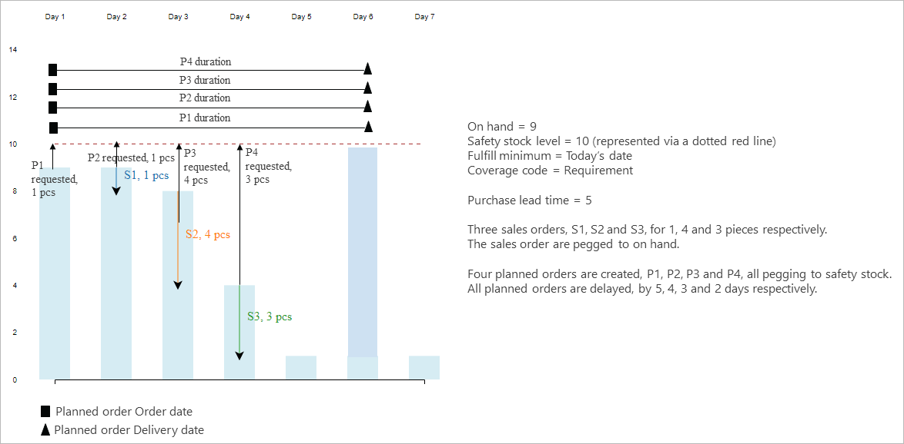
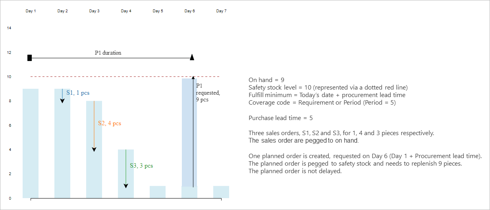
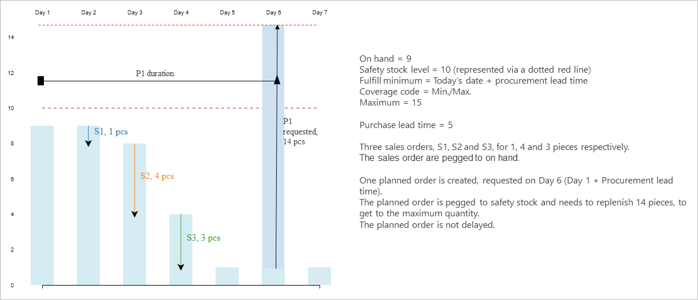
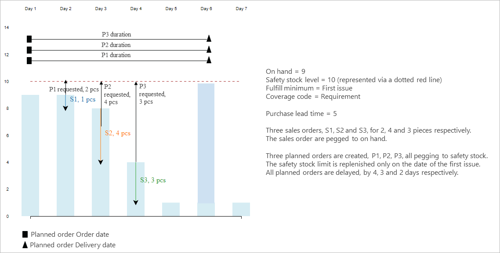

# Safety stock fulfillment with the deprecated master planning engine

[!include [banner](../includes/banner.md)]

This article describes how safety stock functionality differs when you use the deprecated master planning engine compared to when you use Planning Optimization. For more information about safety stock, including information that applies to both planning engines, see [Safety stock fulfillment for items](safety-stock-replenishment.md).

## Differences in safety stock functionality

The following table summarizes the differences in safety stock functionality between the deprecated master planning engine and Planning Optimization.

| | Planning Optimization | Deprecated master planning engine |
|---|---|---|
| **Meaning of safety stock** | 
Safety stock ensures that the accumulated on-hand inventory is always above the minimum value that's defined in the item coverage settings for each item.

Safety stock isn't actual demand.

Demand is prioritized over the safety stock.
 | 
Safety stock is a demand just like other types of demand.

You can choose when safety stock will be fulfilled.
 |
| **When safety stock is fulfilled** | Safety stock is always fulfilled on *Today's date* + *Procurement time*, regardless of the setting for the item coverage. | On the **Item coverage** page for an item, on the **General** tab, the **Fulfill minimum** field defines when the safety stock must be fulfilled. The options are *Today's date*, *Today's date + procurement time*, *First issue*, and *Coverage time fence*. |
| **Safety stock pegging and net requirements** | The *Safety stock* requirement type isn't included and isn't shown on the **Net requirements** page. Safety stock doesn't represent demand, and no requirement date is associated with it. Instead, it sets a constraint on the amount of inventory that must be present at all times. However, the value of the **Minimum** field is still considered when planned orders are calculated during master planning. We recommend that you inspect the **Accumulated quantity** column on the **Net requirements** page to confirm that this value was considered. Because the pegging differs, different actions might be suggested. | Safety stock is a demand type, similar to a sales order line, forecast line, or bill of materials (BOM) line. Master planning will always fulfill it on the date that's specified in the **Fulfill minimum** field. In some cases, safety stock might take precedence over actual demand fulfillment. |

## Safety stock fulfillment date options

The deprecated master planning engine respects the value of the **Fulfill minimum** field on the **General** tab of the **Item coverage** page. This field lets you select the date or the period during which the inventory level must meet the quantity that you specified in the **Minimum** field. The **Fulfill minimum** field is available when you select **Period**, **Requirement**, or **Min/Max** in the **Coverage code** list.

If minimum keys are used, set the **Minimum periods** option to *Yes* to fulfill the minimum inventory level for all the periods that are set up in the minimum key. If you set the option to *No*, the minimum inventory is fulfilled for the current period only.

The following scenario shows how the **Fulfill minimum** setting works and how the values differ.

> [!NOTE]
> For all the illustrations in this article, the x-axis represents inventory, the y-axis represents days, the bars represent the inventory level, and the arrows represent transactions, such as sales order lines, purchase order lines, or planned orders.

The **Fulfill minimum** field can have the following values:

- *Today's date*
- *Today's date + procurement time*
- *First issue*
- *Coverage time fence*

The following subsections describe how each value works.

### Today's date

The specified minimum quantity is met on the date when master planning is run. The system tries to fulfill the safety stock limit as soon as possible, even though the attempt might be unrealistic because of the lead time.

Planned order P1 is created for today's date to bring the available inventory above the safety stock level on this date. The sales order lines S1 through S3 continue to lower the inventory level. Master planning generates planned orders P2 through P4 to bring the inventory level back to the safety limit after each sales order requirement.

When the **Requirement** coverage code is used, multiple planned orders are created. It's always a good idea to use either **Period** or **Min/Max** coverage for items and materials that are in frequent demand. In that way, the replenishment is bundled. The following illustration shows an example for the **Period** coverage code.

The following illustration shows an example for the **Min/Max** coverage code.

### Today's date + procurement time

The specified minimum quantity is met on the date when master planning is run, plus the purchase or production lead time. This time includes any safety margins. If the item carries a trade agreement, and the **Find trade agreements** checkbox is selected on the **Master planning parameters** page, the delivery lead time from the trade agreement isn't considered. Instead, lead times are taken from either the item coverage settings or the item.

This fulfillment mode will create plans that have fewer delays and fewer planned orders, regardless of the coverage group that's set up on the item.

The following illustration shows the outcome of the plan if the coverage code is **Requirement** or **Period**.

The following illustration shows the outcome of the plan if the coverage code is **Min/Max**.

### First issue

The specified minimum quantity is met on the date when the available inventory goes below the minimum level. Even if the available inventory is below the minimum level on the date when master planning is run, this fulfillment mode won't try to cover it until the next requirement comes in.

The following illustration shows an example for the **Requirement** coverage code.

The following illustration shows an example for the **Period** coverage code.

The following illustration shows an example for the **Min/Max** coverage code.

On the date when master planning is run, if the available inventory is already under the safety stock limit, both the **Today's date** fulfillment mode and the **Today's date + procurement time** fulfillment mode will trigger the replenishment immediately. However, the **First issue** fulfillment mode will wait until there's another issue transaction for the item, such as a sales order and BOM line requirement. It will then trigger the replenishment on the date of that transaction.

On the date when master planning is run, if the available inventory isn't under the safety stock limit, the **Today's date** and **First issue** fulfillment modes will provide the same result, as shown in the following illustration.

On the date when master planning is run, if the available inventory isn't under the safety stock limit, the **Today's date + procurement time** fulfillment mode will provide the following result, because it postpones the fulfillment until the end of the procurement lead time.

### Coverage time fence

The specified minimum quantity is met during the period that's specified by the **Coverage time fence** field. This option is useful when master planning doesn't allow available inventory to be used for real orders, such as sales or transfers, because it's trying to maintain the safety level. However, in a future release, this mode of replenishment will no longer be needed, and this option will be deprecated.
