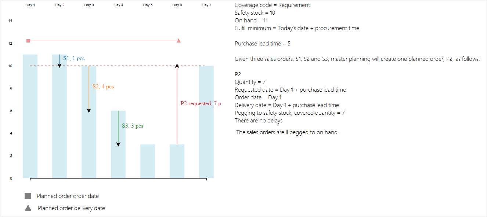

# Safety stock fulfillment with the deprecated master planning engine

[!include [banner](../includes/banner.md)]

This article describes how safety stock functionality differs when you use the deprecated master planning engine compared to when you use Planning Optimization. For more information about safety stock (including information that applies to both planing engines) see [Safety stock fulfillment for items](safety-stock-replenishment.md).

## Differences in safety stock

The following table summarizes the differences in safety stock functionality between the deprecated master planning engine and Planning Optimization.

| &nbsp; | Planning optimization | Deprecated master planning engine |
|---|---|---|
| Meaning of safety stock | 
Safety stock ensures that the accumulated on-hand inventory is always above the minimum value defined in the item coverage for each item.

Safety stock is not actual demand.

Demand is prioritized over the safety stock.
 | 
Safety stock is a demand just like other types of demand.

You can choose when safety stock would be fulfilled and <!-- KFM: Incomplete sentence. What do we want to say here? --> |
| When safety stock is fulfilled | Always on *\[Today's date\] &plus; \[Procurement time\]*, regardless of the setting on item coverage | On the **Item coverage** page for an item, on the **General** tab, the **Fulfill minimum** setting defines when the safety stock must be fulfilled. The options are: *Today's date*, *Today's date + procurement time*, *First issue*, and *Coverage time fence*. |
| Safety stock pegging and net requirements | The *Safety stock* requirement type isn't included and isn't displayed on the **Net requirements** page. Safety stock doesn't represent demand and doesn't have a requirement date associated with it. Instead, it sets a constraint on how much inventory must be present at all times. However, the **Minimum** field value is still taken into account when calculating planned orders during master planning. We suggest that you inspect the **Accumulated quantity** column on the **Net requirements** page to see that this value was considered. Because the pegging is different, different actions may be suggested.  |<!-- KFM: Info is also needed here. --> |

## Safety stock fulfillment date options

The deprecated master planning engine respects the **Fulfill minimum** setting (available on the **General** tab of the **Item coverage** page), which allows you to select the date or the period during which the inventory level must meet the quantity that you specified in the **Minimum** field. This field is available when you select **Period**, **Requirement**, or **Min/Max** in the **Coverage code** list.

If **Minimum keys** are used, set **Minimum periods** to *Yes* to fulfill the minimum inventory level for all the periods that are set up in the minimum key. If you clear the check box, the minimum inventory is fulfilled for the current period only.

The following scenario shows how the **Fulfill minimum** setting works and what are the differences between its values.

> [!NOTE]
> For all the illustrations in this article, the x-axis represents inventory, the y-axis represents days, the bars represent the inventory level, the arrows represent transactions, such as sales order lines, purchase order lines, or planned orders.

The **Fulfill minimum** parameter can have the following values:

- *Today's date*
- *Today's date + procurement time*
- *First issue*
- *Coverage time fence*

The following subsection describe how each of these values work.

### Today's date

The specified minimum quantity is met on the date when master planning is run. The system tries to fulfill the safety stock limit as soon as possible, even though it may be unrealistic due to the lead time.

Planned order P1 is created for today's date to bring the available inventory above the safety stock level on this date. The sales order lines S1 to S3 continue to lower the inventory level. Planned orders P2 to P4 are generated by master planning so that the inventory level is brought back to the safety limit after each sales order requirement.

When the **Requirement** coverage code is used, multiple planned orders are created. It is always a good idea to use either **Period** or **Min/Max** coverage for items and materials in frequent demand, to bundle the replenishment. The following illustration shows an example for coverage code **Period**.

The following illustration shows an example for coverage code **Min/Max**.

### Today's date + procurement time

The specified minimum quantity is met on the date when master planning is run, plus the purchase or production lead time. This time includes any safety margins. If the item carries a trade agreement, and the **Find trade agreements** check box is selected on the **Master planning parameters** page, the delivery lead time from the trade agreement is not considered. Lead times are taken from the item's coverage settings or from the item.

This fulfillment mode will create plans with less delays and fewer planned orders, regardless of the coverage group set up on the item.

The following illustration shows the outcome of the plan if the coverage code is **Requirement** or **Period**.

The following illustration shows the outcome of the plan if the coverage code is **Min/Max**.

### First issue

The specified minimum quantity is met on the date when the available inventory goes below the minimum level, as shown in the following illustration. Even if the available inventory is below the minimum level on the date when master planning is run, **First issue** will not attempt to cover it until the next requirement comes in.

The following illustration shows an example for coverage code **Requirement**.

The following illustration shows an example for coverage code **Period**.

The following illustration shows an example for coverage code **Min/Max**.

On the date when master planning is run, if the available inventory is already under the safety stock limit, **Today's date** and **Today's date + procurement time** will trigger the replenishment immediately. **First issue** will wait until there is another issue transaction, such as sales order and BOM line requirement, for the item, and then it will trigger the replenishment on the date of this transaction.

On the date when master planning is run, if the available inventory isn't under the safety stock limit, **Today's date** and **First issue** will provide exactly the same result, as shown in the following illustration.

On the date when master planning is run, if the available inventory is not under the safety stock limit, **Today's date + procurement time** will provide the following result, because it postpones the fulfillment until the end of the procurement lead time.

### Coverage time fence

The specified minimum quantity is met during the period that is specified in the **Coverage time fence** field. This option is useful when master planning does not allow available inventory to be used for real orders, such as sales or transfers, in the attempt to maintain the safety level. However, in a future release, this mode of replenishment will no longer be needed, and this option will be deprecated.
