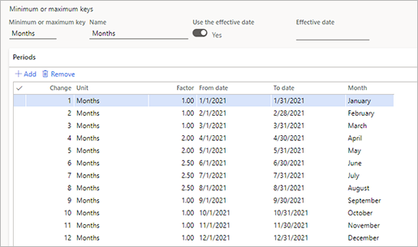
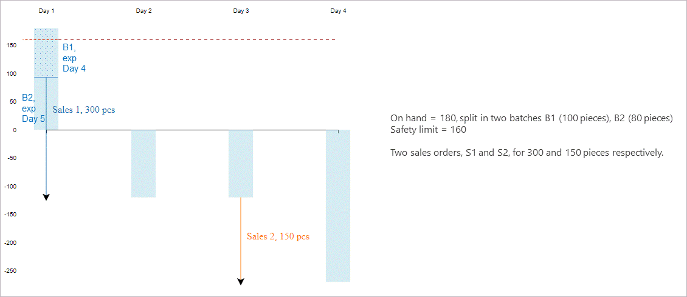
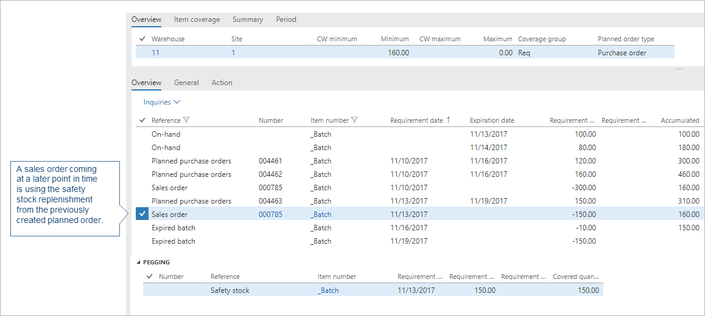

# Safety stock fulfillment for items

[!include [banner](../includes/banner.md)]

Safety stock is an item quantity held in the inventory for the purpose of reducing the risk that the item will run out of stock. Safety stock is used when demand coming from sales orders is greater than planned for final goods and/or when a supplier is unable to deliver additional units in the expected time.

The system will always try to prevent the accumulated quantity of an item from falling below its safety stock limit. Whenever the master planning engine detects that the accumulated on-hand inventory for an item will fall below its minimum, it will create a planned order to replenish the item and schedule it to arrive before the minimum threshold his crossed. This means that safety stock is fulfilled on *\[Today's date\] &plus; \[Procurement time\]*.

During planning, if there is actual demand, the system will peg that demand against a planned order that was generated for safety stock if it means that the demand could therefore be fulfilled on time. Because system will always try to keep the accumulated on-hand inventory level above the safety stock level, it will create a new planned order to cover the safety stock that was claimed for the actual demand.

> [!NOTE]
> Safety stock is not a demand as such, so any other demand will be prioritized over the safety stock. This means that the system can create a planned order to fulfill safety stock, but if actual demand arrives later, then that demand can claim the safety stock quantity (the new demand will be pegged against the original planned order).

## Set the safety stock level for an item

To define safety stock for an item at a specific location, follow these steps:

1. Go to **Product information management \> Products \> Released products**.
1. Select the relevant product in the grid.
1. On the Action Pane, open the **Plan** tab and select **Item coverage**.
1. While on the **Overview** tab, select **New** from the Action Pane to add a new line to the grid.
1. For the new line, specify the relevant product dimensions (**Site**, **Warehouse**, and other dimensions as needed (such as color or style)).
1. Enter the safety stock value in the **Minimum** column. The master planning engine will always generate planned orders to prevent the accumulated inventory level from falling below this limit. The value is expressed in inventory units. If you leave the field blank, the default value is zero.

> [!NOTE]
> The **General** tab of the **Item coverage** page includes a field called **Fulfill minimum**. This setting is ignored when you are using Planning Optimization (the system always behaves as though **Fulfill minimum** were set to *Today's date + procurement time*). For details about how this setting works when using the deprecated master planning engine, see [Safety stock fulfillment with the deprecated planning engine](safety-stock-replenishment-in-deprecated-engine.md).

## Example: Safety stock

Suppose your system is set up with the following:

- The warehouse has 30 ea of total on-hand inventory of item Z0001.
- There is a demand forecast showing that 2 ea of item Z0001 is consumed every day.
- The safety stock for item Z0001 is set to 20 ea.
- The lead time for item Z0001 is 5 days.

When master planning runs, it will create several orders to ensure that the accumulated on-hand inventory remains above the safety stock threshold. The following table provides an example.

| Reference | Item number | Requirement date | Requirement quantity | Accumulated |
|---|---|---|---|---|
| Demand forecast | Z0001 | 3/31/2023 | -6.00 | 24 |
| Demand forecast | Z0001 | 4/3/2023 | -2.00 | 22 |
| Demand forecast | Z0001 | 4/4/2023 | -2.00 | 20 |
| Planned purchase orders | Z0001 | 4/5/2023 | 2.00 | 22 |
| Demand forecast | Z0001 | 4/5/2023 | -2.00 | 20 |

<!-- KFM: Maybe write something about the pegging here? -->

The Net requirements page for item Z0001 could therefore resemble the following example:

## Example: Minimum key

You can use minimum keys to handle seasonal fluctuations in demand. For example, you can decrease the minimum inventory level for an item in the off-season, and then gradually increase the level during the other months. You create a minimum key by going to **Master planning \> Setup \> Coverage \> Minimum/maximum keys**.

You specify the minimum key to adjust the safety stock level by seasonality in the **Minimum key** field on the **General** tab of the **Item coverage** page. If you are using minimum keys, set **Minimum periods** to *Yes* to fulfill the minimum inventory level for all the periods that are set up in the minimum key. If you set **Minimum periods** to *No*, the minimum inventory is fulfilled for the current period only.

The following procedure is an example that shows how to set up a minimum key that accounts for increased seasonal demand during the spring and summer months.

1. Go to **Master planning \> Setup \> Coverage \> Minimum/maximum keys**.
1. Select **New** to create a minimum/maximum key.
1. In the **Minimum or maximum key** field, enter an identifier for the key. In the **Name** field, enter a name for the key.
1. Set the **Use the effective date** option to *Yes* and leave the **Effective date** field blank to make the key valid from the first day of the current year.

    > [!NOTE]
    > The combination of the **Use the effective date** and **Effective date** settings defines the date that the key is valid from.
    >
    > - When the **Use the effective date** option is set to *No*, the key is valid from the current date or system date.
    > - When the **Use the effective date** option is set to *Yes*, the key is valid from the date that is defined in the **Effective date** field.

1. In the **Periods** section, create 12 lines, and set the following values for them:

    - **Change** – Assign each line a unique number from 1 through 12. This field indicates the incremental change in the unit of time that is defined by the **Unit** field.
    - **Unit** – Select *Months* for every line.
    - **From date**, **To date**, and **Month** – These fields are automatically set, based on the **Change** and **Unit** settings. Monthly periods start from the first day of the current year.
    - **Factor** – Enter the values that are described in the following table. This field defines the factor that you want to multiply the minimum inventory by.

        | Line (Change) | Factor | Result |
        |---|---|---|
        | 1–3 | 1 | Minimum inventory is based on the setting for January through March on the **Item coverage** page. |
        | 4–5 | 2 | Minimum inventory is multiplied by a factor of 2 for April through May. |
        | 6–8 | 2.5 | Minimum inventory is multiplied by a factor of 2.5 for June through August. |
        | 9–12 | 1 | Minimum inventory reverts to the setting for September through December on the **Item coverage** page. |

    Your settings should now resemble the settings in the following illustration.

    

> [!NOTE]
> You can also use a wizard to create a minimum/maximum key. On the **Minimum or maximum keys** page, on the Action Pane, select **Wizard** to open the **Minimum/Maximum Keys** wizard. The wizard will guide you step by step through the process of creating and setting up the minimum/maximum key.

If the coverage code is *Min/Max*, you can also specify the maximum inventory quantity that you want to maintain for an item. The value is also expressed in inventory units. If the projected available inventory falls below the minimum quantity, master planning generates a planned order to fulfill all open requirements and brings the available inventory up to the specified maximum quantity. Just as when you set up the minimum inventory quantity, you must define all other planned coverage dimensions before you can set the **Maximum** field.

## Example: Min/Max coverage code

The minimum quantity is 10, and the maximum quantity is 15. Current on-hand inventory is 4. This gives a minimum quantity requirement of 6. However, because the maximum quantity is 15, master planning generates a planned order for 11 items.

For items that follow seasonal demands, you may need to maintain different maximum levels. To do that, you need to define **Maximum keys** by going to **Master planning \> Setup \> Coverage \> Minimum/maximum keys**. Fill in the **Maximum key** field on the **Item coverage** page. You can view the information about the safety stock levels, defined via minimum keys on the **Min/Max** tab, on the **Item coverage** page. You need to make sure that, for a certain period, the minimum and the maximum values are kept in sync.

## Plan safety stock replenishment for First Expired, First Out (FEFO) items

At any point in time, the inventory receipt with the latest expiry date will be used for safety stock to allow real demand, such as sale lines or BOM lines, to be fulfilled in the FEFO (First Expired, First Out) order.

To show how this works, consider the following scenario.

When planning is run, it will cover the first sales order from the existing on-hand inventory and an additional purchase order, for the remaining quantity.

A planned order is created to make sure that the available inventory is brought back to the safety limit.

When the second sales order is planned, the previously created planned order that covers the safety stock is used to cover this quantity. Hence, the safety stock is constantly rolling.

Finally, another planned order is created to cover the safety stock.

All the batches expire accordingly, and planned orders are created to refill the safety stock after it has expired.

## How master planning handles the safety stock constraint

Safety stock is tracked in the system as a requirement type, just like sales lines or BOM requirements. You can see the safety stock requirement line on the **Net requirements** page if you remove the default filter on the **Requirement type** column.

Fulfilling the safety stock requirement transaction is deprioritized if the system determines that this causes delays in the fulfillment of real demand, such as sales lines, BOM lines, transfer requirements, or demand forecast lines. Otherwise, making sure that the available inventory is above the safety stock quantity has the same priority as any other demand types. This ensures no delays for real transactions and helps to prevent over-replenishment and early-replenishment of safety stock.

During the coverage phase of master planning, safety stock replenishment is no longer deprioritized. On-hand inventory can be used before any other demand types. During the delay calculation, new logic will be added to go over the delayed sales lines, BOM line requirements, and all the other demand types, to determine whether they could be delivered on time, provided that the safety stock is used. If the system identifies that it can minimize delays by using safety stock, then the sales lines or BOM lines will replace their initial coverage with the safety stock, and the system will trigger the replenishment for the safety stock instead.

If the plan or the item is not set up for delayed calculation, then the safety stock constraint will have the same priority as any other demand types. This means there is a reserve of on-hand and other available inventory before other demand types.

## Additional resources

- [Use the safety stock journal to update minimum coverage for items](safety-stock-journal.md)

[!INCLUDE[footer-include](../../includes/footer-banner.md)]
