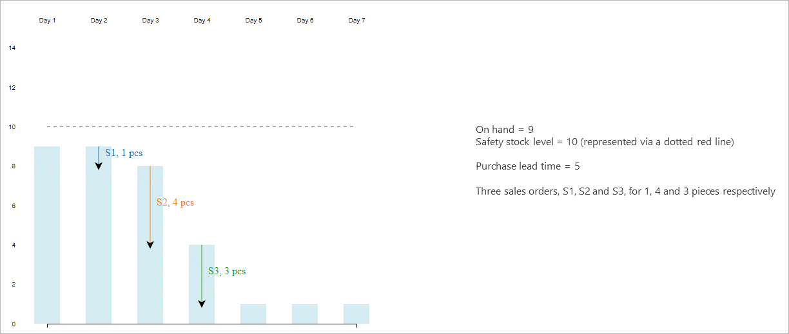
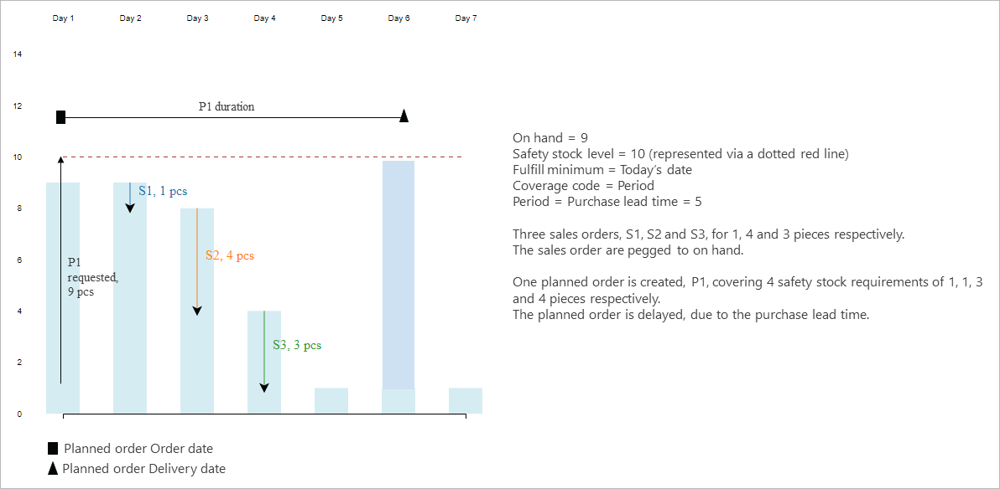
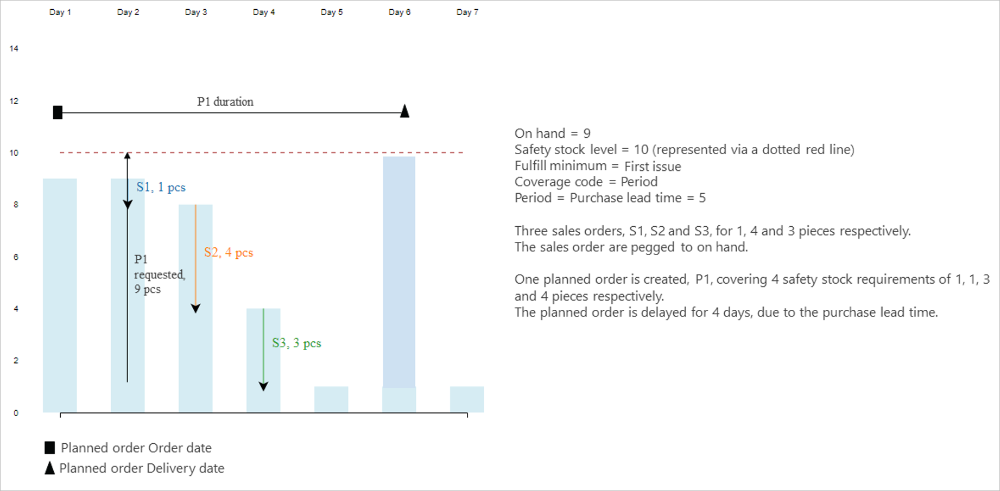
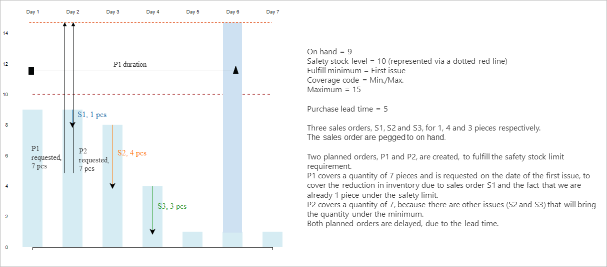
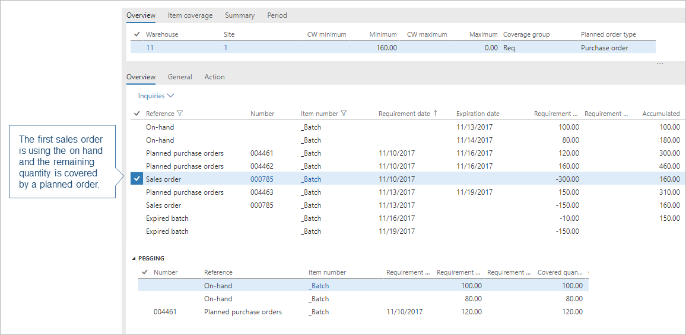
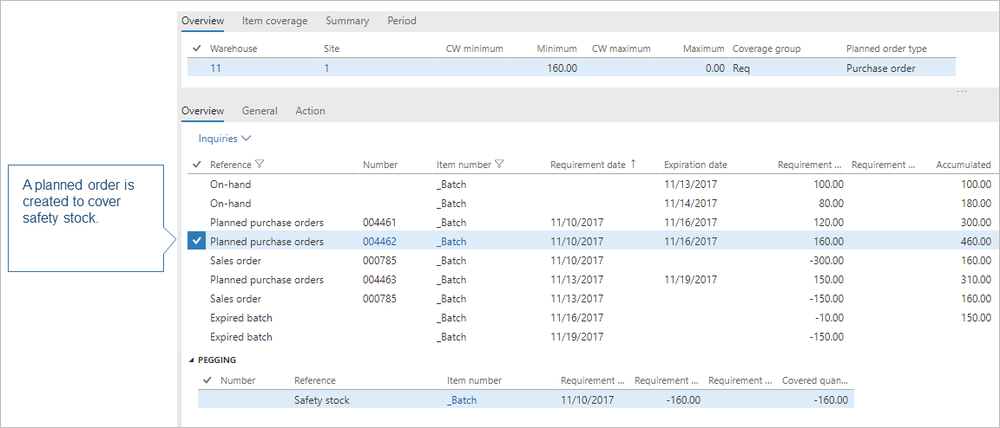

---
# required metadata

title: Safety stock fulfillment for items
description: This topic discusses safety stock fulfillment and how to set up safety stock quantity for items. 
author: roxanadiaconu
manager: tfehr
ms.date: 11/27/2017
ms.topic: article
ms.prod: 
ms.service: dynamics-ax-applications
ms.technology: 

# optional metadata

ms.search.form: ReqSafetyKey, ReqItemTableSetup, ReqItemJournalName, ReqItemTable, EcoResProductDetailsExtended
# ROBOTS: 
audience: Application User, IT Pro
# ms.devlang: 
ms.reviewer: kamaybac
ms.search.scope: Core, Operations
# ms.tgt_pltfrm: 
ms.custom: 
ms.assetid: 
ms.search.region: global
ms.search.industry: 
ms.author: roxanad
ms.dyn365.ops.version: 7.3 
ms.search.validFrom: 2017-12-31

---

# Safety stock fulfillment for items

[!include [banner](../includes/banner.md)]

Safety stock indicates an additional quantity of an item held in the inventory in order to reduce the risk that the item will be out of stock. Safety stock is used as a buffer stock in case sales orders come in and the supplier is unable to deliver the additional items to meet the customer's requested ship date. When safety stock is used to fulfill a sales order, the safety stock will be reduced. You can use Master planning to automatically bring the inventory back to the safety level.    

## Set up safety stock levels for items

Safety stock is set up as part of item coverage on the **Item coverage** page under **Released products** > **Plan** > **Coverage**.

In the **Minimum** field, enter the safety stock level that you want to maintain for the item. The value is expressed in inventory units. If you leave the field blank, the default value is zero. This field is available when you select **Period**, **Requirement**, or **Min/Max** in the **Coverage code** list. The stock level limit applies to the available inventory, which means that reservations and markings may trigger safety stock replenishment before the physical quantity goes below the specified minimum level.

> [!NOTE]
> You must define all other planned coverage dimensions before you can define the **Minimum** field. This prevents an invalid record from being used during master planning. This situation can occur if, for example, a dimension group is extended with an additional planned coverage dimension for which the minimum and maximum inventory quantities are not yet defined.

You can use minimum keys to handle seasonal fluctuations in demand. For example, you can decrease the minimum inventory level for an item in the off-season, and then gradually increase the level during the other months. You create a minimum key by going to **Master planning** > **Setup** > **Coverage** > **Minimum/maximum keys**. You specify the minimum key to adjust the safety stock level by seasonality in the **Minimum key** field on the **Item coverage** page. 

## Example: Minimum key
If you want to set up a minimum key that accounts for increased seasonal demand during the spring and summer months, go to **Master planning** > **Setup** > **Coverage** > **Minimum/maximum keys** and follow these steps.

1. Create 12 lines and assign a number from 1 to 12 to the lines in the **Change** field.
2. In the **Unit** field, select **Months**.
3. In the **Factor** field, enter the values that are described in the following table.

|Line|Enter this value|Result|
|---|---|---|
|1-3|1|Minimum inventory is based on the setting for January through March on the **Item coverage** page.|
|4-5|2|Minimum inventory is multiplied by a factor of 2 for April through May.|
|6-8|2.5|Minimum inventory is multiplied by a factor of 2.5 for June through August.|
|9-12|1|Minimum inventory reverts to the setting for September through December on the **Item coverage** page.|

If the coverage code is **Min/Max**, you can also specify the **Maximum** inventory quantity that you want to maintain for the item. The value is also expressed in inventory units. If the projected available inventory falls below the minimum quantity, master planning generates a planned order to fulfill all open requirements and brings the available inventory up to the specified maximum quantity. Just like you set up **Minimum**, you must define all other planned coverage dimensions before you can define the **Maximum** field.

## Example: Min/Max coverage code
The minimum quantity is 10, and the maximum quantity is 15. Current on-hand inventory is 4. This gives a minimum quantity requirement of 6. However, because the maximum quantity is 15, master planning generates a planned order for 11 items.

For items that follow seasonal demands, you may need to maintain different maximum levels. To do that, you need to define **Maximum keys** by going to **Master planning** > **Setup** > **Coverage** > **Minimum/maximum keys**. Fill in the **Maximum key** field on the **Item coverage** page. You can view the information about the safety stock levels, defined via minimum keys on the **Min/Max** tab, on the **Item coverage** page. You need to make sure that, for a certain period, the minimum and the maximum values are kept in sync.

## Safety stock fulfillment 

The **Fulfill minimum** parameter allows you to select the date or the period during which the inventory level must meet the quantity that you specified in the **Minimum** field. This field is available when you select **Period**, **Requirement**, or **Min/Max** in the **Coverage code** list.

If **Minimum keys** are used, select the **Minimum periods** check box to fulfill the minimum inventory level for all the periods that are set up in the minimum key. If you clear the check box, the minimum inventory is fulfilled for the current period only.

The following scenario shows how this parameter works and what are the differences between its values.

> [!NOTE]
> For all the illustrations in this topic, the x-axis represents inventory, the y-axis represents days, the bars represent the inventory level, the arrows represent transactions, such as sales order lines, purchase order lines, or planned orders.

The **Fulfill minimum** parameter can have the following values:
### Today's date 
The specified minimum quantity is met on the date when master planning is run. The system tries to fulfill the safety stock limit as soon as possible, even though it can be unrealistic due to the lead time. 

Planned order P1 is created for today's date to bring the available inventory above the safety stock level on this date. The sales order lines S1 to S3 continue to lower the inventory level. Planned orders P2 to P4 are generated by master planning so that the inventory level is brought back to the safety limit after each sales order requirement.
When the **Requirement** coverage code is used, multiple planned orders are created. It is always a good idea to use either **Period** or **Min/Max** coverage for items and materials in frequent demand, to bundle the replenishment. The following illustration shows an example for coverage code **Period**.

The following illustration shows an example for coverage code **Min/Max**.

### Today's date + procurement time 
The specified minimum quantity is met on the date when master planning is run, plus the purchase or production lead time. This time includes any safety margins. If the item carries a trade agreement, and the **Find trade agreements** check box is selected on the **Master planning parameters** page, the delivery lead time from the trade agreement is not considered. Lead times are taken from the item's coverage settings or from the item.
This fulfillment mode will create plans with less delays and fewer planned orders regardless of the coverage group set up on the item. 
The following illustration shows the outcome of the plan if the coverage code is **Requirement** or **Period**.  

The following illustration shows the outcome of the plan if the coverage code is **Min/Max**.  

### First issue 
The specified minimum quantity is met on the date when the available inventory goes below the minimum level, as shown in the following illustration. Even if the available inventory is below the minimum level on the date when master planning is run, **First issue** will not attempt to cover it until the next requirement comes in.
The following illustration shows an example for coverage code **Requirement**.

The following illustration shows an example for coverage code **Period**.

The following illustration shows an example for coverage code **Min/Max**.

On the date when master planning is run, if the available inventory is already under the safety stock limit, **Today's date** and **Today's date + procurement time** will trigger the replenishment immediately. **First issue** will wait until there is another issue transaction, such as sales order and BOM line requirement, for the item, and then it will trigger the replenishment on the date of this transaction. 
On the date when master planning is run, if the available inventory is not under the safety stock limit, **Today's date** and **First issue** will provide exactly the same result, as shown in the illustration below. 

On the date when master planning is run,if the available inventory is not under the safety stock limit, **Today's date + procurement time** will provide the following result, because it postpones the fulfillment until the end of the procurement lead time.

### Coverage time fence
The specified minimum quantity is met during the period that is specified in the **Coverage time fence** field. This option is useful when master planning does not allow available inventory to be used for real orders, such as sales or transfers, in the attempt to maintain the safety level. However, in a future release, this mode of replenishment will no longer be needed, and this option will be deprecated.
## Plan safety stock replenishment for First Expired, First Out (FEFO) items
At any point in time, the inventory receipt with the latest expiry date will be used for safety stock to allow real demand, such as sale lines or BOM lines, to be fulfilled in the FEFO (First Expired, First Out) order.
To show how this works, consider the following scenario.

When planning is run, it will cover the first sales order from the existing on-hand inventory and an additional purchase order, for the remaining quantity.

A planned order is created to make sure that the available inventory is brought back to the safety limit.

When the second sales order is planned, the previously created planned order that covers the safety stock is used to cover this quantity. Hence, the safety stock is constantly rolling.

Finally, another planned order is created to cover the safety stock.

All the batches are expire accordingly, and planned orders are created to refill the safety stock after it has expired.

## How master planning handles the safety stock constraint

Safety stock is tracked in the system as a requirement type, just like sales lines or BOM requirements. You can see the safety stock requirement line on the **Net requirements** page if you remove the default filter on the **Requirement type** column.

Fulfilling the safety stock requirement transaction is deprioritized if the system determines that this causes delays in the fulfilment of real demand, such as sales lines, BOM lines, transfer requirements, or demand forecast lines. Otherwise, making sure that the available inventory is above the safety stock quantity has the same priority as any other demand types. This ensures no delays for real transactions and helps to prevent over-replenishment and early-replenishment of safety stock.

During the coverage phase of master planning, safety stock replenishment is no longer deprioritized. On-hand inventory can be used before any other demand types. During the delay calculation, new logic will be added to go over the delayed sales lines, BOM line requirements, and all the other demand types, to determine whether they could be delivered on time, provided that the safety stock is used. If the system identifies that it can minimize delays by using safety stock, then the sales lines or BOM lines will replace their initial coverage with the safety stock, and the system will trigger the replenishment for the safety stock instead.

If the plan or the item is not set up for delayed calculation, then the safety stock constraint will have the same priority as any other demand types. This means there is a reserve of on-hand and other available inventory before other demand types.
