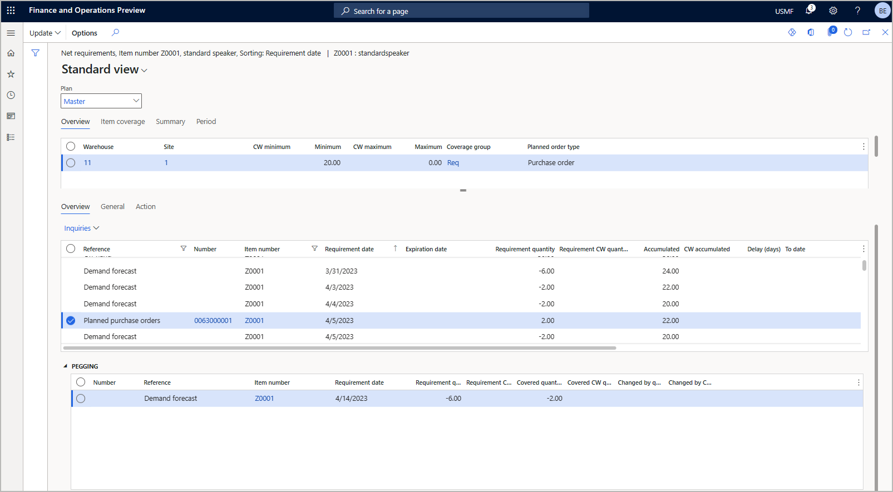

# Safety stock

<!-- KFM: The document suggested putting this under "Configuration" in the TOC. But we also have a section called "Safety stock"; should we actually put it under there? -->

<!-- KFM: We already have a topic about safety stock: [Safety stock fulfillment for items](safety-stock-replenishment.md). Should we combine this info with that? That topic probably also needs to be updated to reflect Planning Optimization instead of "classic". -->

Safety stock is an item quantity held in the inventory for the purpose of reducing the risk that the item will run out of stock. Safety stock is used when demand coming from sales orders is greater than planned for final goods and/or when a supplier is unable to deliver additional units in the expected time.

The system will always try to prevent the accumulated quantity of an item from falling below its safety stock limit. Whenever the master planning engine detects that the accumulated on-hand inventory for an item will fall below its minimum, it will create a planned order to replenish the item and schedule it to arrive before the minimum threshold his crossed. This means that safety stock is fulfilled on *\[Today's date\] &plus; \[Procurement time\]*.

> [!NOTE]
> Safety stock is not a demand as such, so any other demand will be prioritized over the safety stock. This means that the system can create a planned order to fulfill safety stock, but if actual demand arrives later, then that demand can claim the safety stock quantity (the new demand will be pegged against the original planned order). <!-- KFM: This text was somewhat ambiguous in the draft. Please confirm this reformulation. -->

## Set the safety stock level for an item

To define safety stock for an item at a specific location, follow these steps:

1. Go to **Product information management \> Products \> Released products**.
1. Select the relevant product in the grid.
1. On the Action Pane, open the **Plan** tab and select **Item coverage**.
1. While on the **Overview** tab, select **New** from the Action Pane to add a new line to the grid.
1. For the new line, specify the relevant product dimensions (**Site**, **Warehouse**, and other dimensions as needed (such as color or style)).
1. Enter the safety stock value in the **Minimum** column. The master planning engine will always generate planned orders to prevent the accumulated inventory level from falling below this limit.

<!-- KFM: It seems like the **Fulfill minimum** setting on the **General** tab does nothing when using PO. Maybe we should say so here. -->

## Example of safety stock

Suppose your system is set up with the following:

- The warehouse has 30 ea of total on-hand inventory of item Z0001.
- There is a demand forecast showing that 20 ea of item Z0001 is consumed every day.
- The safety stock for item Z0001 is set to 20 ea.
- The lead time for item Z0001 is 5 days.
- There is a demand forecast for item Z0001 with different days and quantities. <!-- KFM: Is it intentional that we have two different demand forecasts in this list? -->
- Then when master planning runs, several orders are created to ensure that the accumulated on-hand inventory remains above the safety stock threshold

<!-- KFM: We can't use a screenshot as a substitute for documentation (screenshots are inaccessible and aren't localized). Please provide a text description of what we are showing here, what page this is, how it relates to the values in the above bullet list, etc. -->

However, as there is actual demand, the system will create planned orders. Those planned orders will be used by the actual demand instead of for the safety stock. <!-- KFM: Why "however"? I'm not sure what point we are making here. -->
