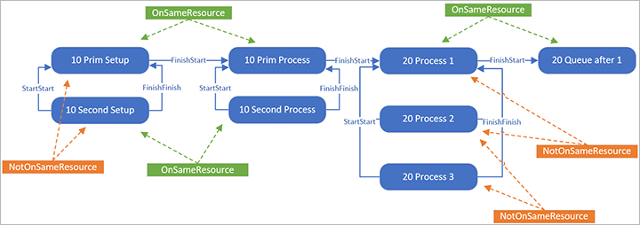

---
# required metadata

title: Improve scheduling engine performance
description: This article provides information about the scheduling engine and how to improve performance. 
author: t-benebo
ms.date: 09/03/2020
ms.topic: article
ms.prod: 
ms.technology: 

# optional metadata

ms.search.form: 
# ROBOTS: 
audience: Application User
# ms.devlang: 
ms.reviewer: kamaybac
# ms.tgt_pltfrm: 
ms.assetid: 5ffb1486-2e08-4cdc-bd34-b47ae795ef0f
ms.search.region: Global
ms.search.industry: 
ms.author: benebotg
ms.search.validFrom: 2020-09-03
ms.dyn365.ops.version: 

---

# Improve scheduling engine performance

[!include [banner](../includes/banner.md)]

The resource scheduling engine is used when scheduling routes for planned and released production orders. The engine was originally released as part of Dynamics AX 2012 and has gone through several improvements since its release.

The [job shop scheduling problem](https://en.wikipedia.org/wiki/Job_shop_scheduling) is an extremely complex combinatorial problem where solution time grows exponentially with the number of decision variables. Oftentimes, customers set up production routes and related data in a way that results in a scheduling problem that can't be solved in reasonable time even on the most modern hardware. This article will help you understand the scheduling engine and how a specific setup can have influence on the performance.

When it comes to improving the performance of the scheduling, general guidelines recommend reducing the complexity of the problem the engine needs to solve. Some of the main factors that can affect performance include:

- Routes with many operations
- Routes with parallel operations
- Operations with quantity of resources higher than one
- Operations with many applicable resources
- Use of hard links
- Use of finite capacity
- The number of different calendars used
- The number of working time slots per day in the calendar
- Total duration of the route
- Running multiple scheduling engines in parallel

## Overview of basic scheduling flow

To understand how a given setup can affect performance, it is important to understand something about how the process flows, both inside the engine and in the X++ code that surrounds it.

The basic process of scheduling an order consists of three main steps:

- **Loading data** – Here, the X++ data models are transformed into the engine's internal data model in the form of jobs and constraints.
- **Scheduling** – This is the main source for scheduling that processes the given model and constraints, and generates a result. During this process, the engine will request working time information and existing capacity reservations from X++ as needed.
- **Save data** – The engine result in the form of job capacity reservation slots is processed by X++ code to save capacity reservations and update the start and end times of the jobs/operation/order.

## Load data into the engine

The scheduling engine has a more abstract data model than the Supply Chain Management database because it has been built as a generic engine that can handle different sources of data. The concepts of route, secondary operations, and run time need to be "translated" into the generic job and constraint model that the engine exposes. The logic for building the model has a significant amount of business logic to it and is different depending on the source data. The responsible X++ class is `WrkCtrScheduler` and it has derived classes for planned production orders, released production orders, and project forecasts.

As an example, consider a route shown in the following table and image, which seems relatively simple.

| Oper. No. | Priority | Setup time | Run time | Queue time after | Quantity of resources | Next |
| --- | --- | --- | --- | --- | --- | --- |
| 10 | Primary | 1.00 | 2.00 | | 1 | 20 |
| 10 | Secondary&nbsp;1 | | | | 1 | 20 |
| 20 | Primary | | 3.00 | 1.00 | 3 | 0 |

When sending this to the engine, it is split out into eight jobs, as shown in the following illustration (select the image to enlarge it).

The standard link between two jobs is `FinishStart`, meaning that the end time of one job must be before the start time of another job. Because the setup must be performed by the same resource that will later do the process, there are `OnSameResource` constraints between them. Between the jobs for primary and secondary operation for 10, there are `StartStart` and `FinishFinish` links, which means that the jobs must both start and end at the same time, and there are `NotOnSameResource` constraints, which will prevent the same resource for primary and secondary.

For operation 20, where the quantity of resources has been set to 3, the process job has been split into three distinct jobs where all the jobs must run at the exact same time.
In this case, the route group has been set up to not reserve capacity for queue after times, which is why there is only a single job for the queue after.

The scheduling engine only understands the concepts of jobs and has no notion of operations. This means that when doing operation scheduling, the operations are also split into jobs, although these will not be persisted in the database.

For each job, we will also define what the job capacity requirement is (the number of seconds required). Depending on how the resource requirements have been defined, we may also, for each job, send a list of all the potential applicable resources that the job could run on and what the capacity requirement is for that specific resource. Even though the list of applicable resources is sent when building the model, the engine will still need to ensure that the resource assignment is actually valid for the entire job duration.

## Scheduling engine internals

### Scheduling engine interface

To get an idea of how the engine works internally, it is best to look at the functionality it exposes externally. In X++, the main interface is `WrkCtrSchedulerEngineInterface`. It has the methods described in the following subsections.

#### General engine

| **Method** | **Purpose** |
| --- | --- |
| `run` | Schedules all loaded jobs and returns the error code. |
| `getJobSchedulingSequenceResult` | Gets the scheduling result and the first error job for the sequence identified by a specific job. |
| `validateJobCapacityReservations` | Validates the capacity reservations for all the jobs stored by the engine. |
| `setReservationsTimeStamp` | Sends a timestamp to the engine set on all new capacity reservations for the scheduled jobs in the cache of the engine. |
| `addPropertyToGroupAggregation` | Adds a property prefix to the set of properties used when capacity is aggregated. |
| `addResource` | Adds a resource to the scheduling engine resource pool. |
| `addResourceGroup` | Adds a resource group to the scheduling engine resource group pool. |
| `addResourceGroupMembership` | Adds a resource as a member to a resource group. |
| `addOptimizationGoal` | Adds a scheduling optimization goal (duration or priority). |

#### Individual jobs

| **Method** | **Purpose** |
| --- | --- |
| `addJobInfo` | Adds a job information record that informs the engine about a job that should be scheduled. |
| `addConstraintJobEndsAt` | Adds a constraint that a job should end at a specified date and time. |
| `addConstraintJobStartsAt` | Adds a constraint that a job should start at a specified date and time. |
| `addConstraintMaxJobDays` | Defines the constraint that a job can span over a specified maximal number of days. |
| `addConstraintResourceRequirement` | Adds the constraint that the job must be scheduled on a specific resource. |
| `addJobBindPriority` | Adds a job bind priority for a (job, constraint level) pair. A higher priority value means the job variables will be bound earlier. The job will be processed before jobs with lower priority value in the same sequence. |
| `addJobCapacity` | Adds capacity load information for a job (like the required job runtime) independent on which resource the job runs on. |
| `addJobResourceCapacity` | Adds a resource to the set of resources that may be used to perform a job, and states the capacity required when running on that resource. |
| `addJobGoal` | Adds job goal information for a specific constraint level (earliest end time or latest start time). |
| `addJobResourcePriority` | Adds the priority to use when a job is scheduled on a resource. |
| `addJobResourceRuntime` | Specifies a job time that is dependent of the resource the job will be scheduled on. |
| `addJobRuntime` | Specifies a job time that is independent of the resource on which the job will be scheduled. |
| `scheduleJobOnResourceGroup` | Marks a job for scheduling on the resource group level. |
| `setJobResourcePreemptionAllowed` | Sets whether preemption is allowed for a job on a resource (if engine is allowed to schedule the job in noncontiguous capacity slots). |
| `setRequiredNumberOfResources` | Sets the number of resources required to schedule a job (only for operations scheduling). |

#### Constraints between jobs

| **Method** | **Purpose** |
| --- | --- |
| `addJobLink` | Adds a link (such as finish\>start) between two jobs. |
| `addConstraintEndsDelayed` | Defines the constraint that a job cannot end before another jobs end plus some delay time. |
| `addConstraintJobListWorkingTimeIntersect` | Adds a constraint that the capacity slots reserved for the jobs must be on the intersecting working times for the two resources used by the jobs. |
| `addConstraintJobOverlap` | Add a constraint that defines how jobs are sequenced when a given quantity of an item can be moved between two resources while the first resource is still not finished processing, so that the second resource can start processing. |
| `addConstraintNotOnSameResource` | Adds a constraint that two jobs should not be scheduled on the same resource. |
| `addConstraintOnSameResource` | Adds a constraint that two jobs must be using the same resource. |
| `addJobSameReservations` | Adds a constraint that a job must end up having capacity reservations for the same time slots as the primary job. |
| `setPrimaryParallelJob` | Adds information about what job is the primary job in a set of parallel jobs. |

### Solver

The engine itself is essentially a specialized constraint solver with custom heuristics added. The solver is based on two main elements: variables and constraints.

#### Variable

A variable represents a domain of possible values. Scheduling engine has two types of variables:

- **DateTime variable** - Has a domain of all dates and times, and the domain can be restricted by moving the lower and upper bound for the time of the variable closer to each other.
- **Resource variable** - Has a domain of applicable resources, and the domain can be restricted by eliminating resources from the list.

#### Constraint

A constraint acts on variables by restricting their domains, but it also depends on variables so it gets activated when variables change. The process of "constraint propagation" is when a constraint performs its main function and reports back to the main logic if successful.

A variable is considered bound when it can't be restricted further, which for DateTime variable means that upper and lower bound is the same, and for the Resource variable that it has only a single applicable resource. When all variables are bound, a solution is found.

### Constraint levels

When scheduling is executed as part of the material requirements planning (MRP) coverage phase, the orders will be scheduled backward from requirement date. However, if it is not possible to find a schedule that starts today or later and ends before the requirement date, then the scheduling direction will change to forward from today.

This main business rule is handled by organizing the constraints in levels. If no solution is found when using the constraints on the highest level, then the constraints on that level are all dropped, and the lower level is tried. In praxis, this means that for backward scheduling the model will contain a level 1 with job goals of latest start time given a maximum end time constraint (the requirement date), and a level 0 with job goals of earliest end time and given a minimum start time constraint of today.

### Algorithm

The main steps of the engine algorithm are:

1. Find sequences (job chains) which can be solved separately.
1. Try to find an initial solution for the sequence for the highest constraint level.
    1. Sort the jobs in the sequence based on job goal and priorities, such that a start job can be found.
    1. Loop the jobs in the following sequence:
        1. Find all constraints that need to be propagated and run propagation.
        1. If all variables for the job have been bound, then a solution for that job has been found.
        1. If one of the variables could not be bound without violating the constraints, then roll back the variable binding, try a different value in the domain (for resource variable), and rerun the constraint propagation.
1. If no solution was found, then all constraints on the current constraint level is removed, the constraint level lowered (if any lower levels are available) and solution search retried with the new set of constraint.
1. If a feasible solution was found, then the optimization phase is started, which will try to find a better solution until the optimization timeout is reached or all resource combinations have been exhausted.

The constraint solver is not aware of the specifics of the scheduling algorithm. It is in the definition and combination of the various constraints that the "magic" happens.

### Determining working times

A large part of the (internal) constraints in the engine controls the working time and capacity of a resource. Essentially, the task is to traverse the working time slots for a resource from a given point in a given direction, and find a long enough interval in which the jobs required capacity (time) can fit.

To do this, the engine needs to know the working times of a resource. Opposite to the main model data, the working times are *lazy loaded*, meaning that they are loaded into the engine as needed. The reason for this approach is that there are often working times in Supply Chain Management for a calendar for a very long period and typically many calendars exist so the data would be quite large to pre-load.

Calendar information is requested by the engine in chunks, by invoking the X++ class method `WrkCtrSchedulingInteropDataProvider.getWorkingTimes`. The request is for a specific calendar ID in a specific time interval. Depending on the state of the server cache in Supply Chain Management, each of these requests could end up in several database calls, which takes a long time (relative to the pure computational time). Also, if the calendar contains very elaborate working time definitions with many working time intervals per day, this adds to the time the loading takes.

When the working time data is loaded in the scheduling engine, this is retained in its internal cache for the specific calendar, meaning that if any other jobs or resources are using the same calendar then the next lookups can be performed quickly from memory. One common cause of bad performance is if a separate calendar ID is used for each resource, because data will then need to be requested for each calendar, even though the content of the calendars might be the same.

### Finite capacity

When using finite capacity, the working time slots from the calendar are split and reduced based on the existing capacity reservations. These reservations are also fetched through the same `WrkCtrSchedulingInteropDataProvider` class as the calendars, but instead use the method `getCapacityReservations`. When scheduling during master planning, the reservations for the specific master plan are considered and if enabled on the **Master planning parameters** page, the reservations from firmed production orders are also included. Similarly, when scheduling a production order, it is also an option to include reservations from existing planned orders, although this is not as common as the other way around.

Using finite capacity will cause scheduling to take longer due to several reasons:

- Fetching the capacity information from database is a slow operation and the server-side caching of capacity information is typically not as good as for working times because they are not shared among resources like calendars typically are.
- The number of working time slots to traverse increases due to the splits, and slots for a longer time period must typically be investigated before a solution can be found.
- After the scheduling is complete, a check for conflicting reservations must be performed (see the "Running scheduling engines in parallel" section for details).

### Examining the resource combinations

If the job sequence only contains the standard `FinishStart` links, meaning it forms a simple chain without any branches, an optimal result (seen from the single order, not across orders) can be achieved by finding the best solution for the first job and then moving on to find the best solution for the next job. The best solution for a job means finding the resource that can get the from and to date of the job closest to the job goal (in forward scheduling this means getting the end date of the job as early as possible) while still respecting the constraints.

When there are parallel jobs, finding a solution may involve examining different combinations of resources. The number of possible resource combinations is the product of the number of applicable resources for the connected parallel jobs. Especially when scheduling an order backwards from a requirement date, it can take quite a while for the logic to realize that there is no solution to the problem that will make the parallel jobs fit before today's date, as it will need to check all the combinations because there could be some resources that had a higher efficiency or a different calendar that might give a result. This means that if no timeout limit has been set it will run for a long time before changing the direction to forward.

This combinatorial logic also means that adding more applicable resources may make the engine run slower. If performance problems occur when having parallel operations and scheduling with infinite capacity, it can partly be fixed by having the route designer take a decision on which resource should be used and then assign the resource directly on the operation (because the engine in most cases will always end up picking the same resource, so the end result will be the same).

### Hard links

Setting the link type between two jobs to hard, ensures that there is no time gap between the finish of one job and the start of the next one. This can be very useful in scenarios like when metal is heated in one job and then processed in the next job, where it is not desirable to have the metal cool down in between.

With standard soft links and forward scheduling, if the route forms a simple chain without any branches, a result can be achieved by finding a solution for the first job that satisfies its own constraints and then moving on through the chain propagating the end time from the previous job to the next job. If the current job can't find any capacity, the start time for it will be moved out further, without any consequence for the previous jobs potentially creating gaps between the jobs. However with hard links (especially in connection with finite capacity) for the same scenario, the fact that one job later in the chain cannot find capacity, will mean that all previous scheduled jobs will have to be "dragged" along one by one and thereby rescheduled a number of times. Especially in scenarios with high load for multiple resources, the hard links can cause a chain reaction where the jobs will affect each other and a number of iterations will have to be performed before the result stabilizes into a feasible schedule.

## Running scheduling engines in parallel

When performing scheduling as part of a master planning run where helpers are used, each of the master planning helper threads can also pick up production order scheduling tasks. This means that multiple scheduling engines can be running at the same time. While multithreading in general is a highly significant performance benefit, there are also some functional downsides when it comes to scheduling.

In MRP, all production orders for a given bill of materials (BOM) level are scheduled in requirement date sequence, meaning that those orders with the earliest requirement date should be scheduled first and thereby have the highest chance of getting the available resource capacity. However, with multiple engines picking from the list of unscheduled orders the sequence is no longer ensured, as one might complete faster than the other.

Also, when scheduling using finite capacity and when multiple engine instances are trying to schedule orders that are potentially using the same resources at the same time interval, a race condition can occur. The number of such race conditions is recorded in the **Scheduling conflicts** field on the master plans history page. The conflict resolution logic is as follows:

- Schedule an order (lock-free) and get capacity reservations.
- Take the lock.
- Check if newer capacity reservations exist for the scheduled resources in the timespan.
  - If no, write the capacity and release the lock.
  - If yes, release the lock and reschedule the order from the beginning.

So, when scheduling with multiple engine instances, the result is not fully deterministic because it will depend on the exact timing of each of the threads.

## Operation scheduling performance

Even though operation scheduling is also known as rough-cut capacity planning, seen from an engine standpoint, it can be a harder problem to solve if finite capacity is used, as more data is needed to determine feasibility.

The capacity of a resource group depends on which and how many resources are members of the resource group. A resource group in itself does not have any capacity&mdash;only when resources are a member of the group will it have capacity. Because the resource group membership can vary over time, capacity must be evaluated per day.

In operations scheduling, the resource group's calendar is used to determine the start and end times for each operation. This means that the resource group's calendar places a limit on how much time can be operations scheduled for one operation on one day in one resource group. Opposite the calendar for the specific resources, the efficiency data of the calendar is ignored for the resource group as it simply denotes opening hours and not actual capacity.

For example, if the working time for a resource group on one specific date is from 8:00 to 16:00, one operation can't put more load on the resource group than what can be fit into 8 hours, no matter how much capacity that the resource group has available in total on that day. The available capacity can however limit the load further.

The load from job scheduling on all the resources included in the resource group on a given day is considered when the available capacity for the resource group on the same day is calculated. For each date, the calculation is:

*Available resource group capacity = Capacity for resources in the group based on their calendar &ndash; Job scheduled load on the resources in the group &ndash; Operations scheduled load on the resources in the group &ndash; Operations scheduled load on the resource group*

On the **Resource requirements** tab on the route operation, the resource requirements can be specified using either a specific resource (in which case the operation will be scheduled using that resource), for a resource group, for a resource type, or for one or more capabilities, skill, course, or certificate. While using all of these options gives a great flexibility on the route design, it also complicates the scheduling for the engine as the capacity must be accounted for per "property" (the abstract name used in the engine for capability, skills, and so on).

The resource group's capacity for a capability is the sum of the capacity for all resources in the resource group that has the capability in question. If a resource in the group has a capability, it will be considered no matter what level of the capacity is required.

In operations scheduling, the available capacity for a certain capability for a resource group will be reduced when it is loaded with an operation that requires the capability in question. If the operation requires more than one capability, the capacity will be reduced for all required capabilities.

For each date, the required calculation is:

*Available capacity for a capability = Capacity for the capability &ndash; Job scheduled load on the resources with the specific capability, included in the resource group &ndash; Operations scheduled load on the resources with the specific capability, included in the resource group &ndash; Operations scheduled load on the resource group itself that require the specific capability*

This means that if there is load on a specific resource, the load is considered in the calculation of the resource group's available capacity per capability, because the load on a specific resource reduces its contribution to the resource group's capacity for a capability no matter if the load on the specific resource is for that specific capability. If there is load on the resource group level, it is considered in the calculation of the resource group's available capacity per capability only if the load is from an operation that requires the specific capability.

The above logic is complicated, as this is the same for each type of "property" so using operations scheduling with finite capacity requires a significant amount of data to be loaded.

## Improve MRP performance

The following tech conference video provides several tips on how to improve master planning performance when you're using MRP with the deprecated master planning engine: [Help! MRP is slow!](https://www.youtube.com/watch?v=RLXybx20B5o).

## Viewing scheduling engine input and output

To get specific details of the input and output of the scheduling process,  enable logging by going to **Organization administration \> Setup \> Scheduling \> Scheduling tracing cockpit**.

On this page, first select **Enable logging** on the Action Pane. Then run the scheduling for the production order. When complete, return to the **Scheduling tracing cockpit** page and select **Disable logging** on the Action Pane. Refresh the page and a new line will appear in the grid. Select the new line and select **Download** on the Action Pane. This will give you a .zip compressed folder containing the following files:

- **Log.txt** - This is the log file that describes the steps that the engine goes through. It is very elaborate and can be a bit overwhelming, but when used as part of experimenting with the route setup to resolve performance problems the first thing to look for is the difference in time between the first and the last line, as this will give you the exact time the scheduler has spent.
- **XmlModel.xml** - This contains the model that is built in X++ and that the engine operates on. The `JobId` used in the file correlates to the `RecId` from the source table containing the jobs (`ReqRouteJob` or `ProdRouteJob`). The typical thing to look for in this file is that the dates given in `ConstraintJobStartsAt` and `ConstraintJobEndsAt` are as expected, that the `JobGoal` property is set correctly, and that the jobs are related to each other through the `JobLink` constraints.
- **XmlSlots.xml** - This contains all the working times and capacity reservations that the engine has requested. The calendar working times and reservations will only be requested by the engine for the time periods where it tries to place the jobs (and an extra buffer), so if the file contains times very far in the future, it might be an indication of a problem with the setup. The `ResourceProperty` nodes will show for each resource which resource group and capabilities it is associated with for which periods.
- **Result.xml** - This contains the result of the scheduling run.

Note that the tracing functionality can add significant performance overhead, so only use it for investigating scheduling of specific orders in a controlled manner. If it is turned on during a master planning run it will quickly reach its size limit and stop.

## Troubleshooting performance

As can be understood from all of the previous sections, there are some pitfalls when it comes to the setup and usage of the scheduling engine, which can lead to performance problems. The following check list can be used for troubleshooting such issues. It is important to look at all the points as it is most often a combination of multiple factors that leads to problems.

### Performing scheduling as part of MRP when it is not needed

Even though routes are used for the production control purposes such as costing and reporting, it might not be necessary to consider them during MRP. In some cases, having a standard production lead time specified for the item will be sufficient for planning. To turn off route scheduling, set the capacity time fence to zero. If scheduling should be done, then the capacity time fence must be carefully set because it might not be necessary to consider routes for the full extent of the MRP's coverage time fence.

Note that if the order is not scheduled during MRP, then it will instead need to be scheduled when the planned order is firmed. This means that the firming process will take longer, so depending on how many of the suggested planned orders get firmed the performance gain during MRP might be lost at firming.

### Route with unnecessary operations

When designing the route, it is tempting to try to model the real world exactly with all the steps the production goes through. While this can be useful in some cases, it is not good for the performance as the model the engine needs to work on gets larger (both in terms of jobs and constraints) and more SQL statements will be executed for insertion and update of the jobs and capacity reservations. Also, there is the downstream effect of having to eventually report progress on the jobs, which can be mitigated with automatic postings. If the data is not used for anything, it creates unnecessary load.

We recommend that you only create operations that are strictly needed for scheduling (which will typically be the bottleneck resources) and/or costing purposes. Alternatively you should group many smaller distinct operations into one larger operation that represents a greater part of the process.

### Many applicable resources for an operation

The number of applicable resources for an operation is determined by the resource requirements set on the operation relation. The requirement can either be for a specific (individual) resource or it can be based on the resource's membership of a resource group or capability.

If scheduling is not done using finite capacity and all the applicable resources have the same calendar and efficiency, then the scheduling engine will always end up picking the same resource for an operation, but only after trying all the applicable resources to check if there is one that is "better" than the others. In this case, the load of the scheduling can be greatly reduced simply by always assigning a specific resource to the operation at the route design time.

### Route with parallel operations

While parallel operations (primary/secondary) are a powerful tool to model scenarios like when a machine and an operator are both needed to perform a specific task, it is also the source of many performance issues. If a requirement for a specific individual resource is assigned to both the primary and secondary operation, it is typically not a problem. But if there are many possible resources for each of the operations, then it adds significant computational complexity to the scheduling.

An alternative to using parallel operations is either to model the pairs as "virtual" resources (which will then represent the team that always goes together for the operation) or to simply not model one of the operations if it doesn't represent a bottleneck.

### Route with quantity of resources higher than 1

If the quantity of resources needed for an operation is greater than one, then the result is effectively the same as using primary/secondary operations because multiple parallel jobs will be sent to the engine. However, for this case, it isn't possible to use specific resource assignments because a quantity higher than one requires more than one resource to be applicable for the operation.

A secondary operation that has a resource load quantity greater than one means that the specified quantity of secondary resources is needed for each resource of the primary operation. For example, if a primary operation has its quantity of resources set to two and its secondary operation has its resource quantity set to three, then a total of six resources is needed for the secondary operation.

### Excessive use of finite capacity

Use of finite capacity requires the engine to load the capacity information from a database and can have a computational overhead because it will be harder to find a solution especially in environments where the resources are booked close to their maximum capacity. As a result, it is important to carefully evaluate if a resource really needs to use finite capacity or they can be overbooked. Because there might be a difference among finite capacity resources in how important they are not to overbook, we recommend using the bottleneck option on a resource in combination with a separate value on the plan in "Capacity time fence for bottleneck resources". Using the bottleneck concept can enable that the general finite capacity time fence can be lowered.

### Setting hard links

The standard link type of the route is *soft*, which means that a time gap is allowed between the finishing time of one operation and the start of the next. Allowing this can have the unfortunate effect that, if materials or capacity are not available for one of the operations for a very long time, the production could be idle for quite a while, meaning a possible increase of work in progress. This will not happen with hard links because the finish and start must align perfectly. But setting hard links makes the scheduling problem more difficult because working time and capacity intersections must be calculated for the two resources of the operations. If there are also parallel operations involved, this adds significant computational time. If the resources of the two operations have different calendars that don't overlap at all, the problem is unsolvable.

We recommend using hard links only when strictly necessary, and carefully consider if it is necessary for each operation of the route.

To reduce the work in progress without applying hard links, a trick is to schedule the order twice with changing to the opposite direction for the second pass. If the first schedule was done backwards from delivery date, then the second should be done forward from the scheduled start date. This will result in the jobs being compressed as much as possible so that the work in progress is minimized.

### Separate calendar for each resource

One of the main sources of data for the scheduling engine is calendar information, which can be expensive to load from the database. Because calendars are generated based on templates, it would be tempting to generate a calendar for each resource and then adjust the information in this calendar when the resource has downtime and other issues. However, doing this will severely limit the engines ability to cache the calendar data as it would need to request new data for each resource and can be a large source of performance problems. Instead, we recommend that you reuse the calendars as much as possible between the resources, and then control downtime changes by assigning a different calendar ID for a period.

### High number of working time slots per calendar day

Because the engine works by examining time slots one-by-one for capacity, it is beneficial to minimize the number of time slots per calendar day. This could be done, for example, by considering whether it's important for the resulting schedule to reflect that workers have a 5-minute break every hour.

### Large (or none) scheduling timeouts

Scheduling engine performance can be optimized using parameters found on the **Scheduling parameters** page. The **Scheduling timeout enabled** and **Scheduling optimization timeout enabled** settings should always be set to **Yes**. If set to **No**, the scheduling can potentially run infinitely if an unfeasible route with many options has been created.

The value for **Maximum scheduling time per sequence** controls how many seconds can, at most, be spent trying to find a solution for a single sequence (in most cases a sequence corresponds to a single order). The value to use here highly depends on the complexity of the route and settings like finite capacity, ut a maximum of about 30 seconds is a good starting point.

The value for **Optimization attempts timeout** controls how many seconds can at most be used to find a better solution than the one originally found. This will only influence routes that are using parallel operations as these make it necessary to test different combinations.

> [!NOTE]
> The values set for the timeouts will be applied both for scheduling of released production orders and of planned orders as part of MRP. As a result, setting very high values could significantly add to the run time of MRP when running for a plan with many planned production orders.

[!INCLUDE[footer-include](../../includes/footer-banner.md)]