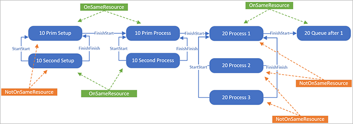

# Improve scheduling engine performance

[!include [banner](../includes/banner.md)]

The resource scheduling engine schedules routes for planned and released production orders.

The [job shop scheduling problem](https://en.wikipedia.org/wiki/Job_shop_scheduling) is an extremely complex combinatorial problem where solution time grows exponentially with the number of decision variables. Customers often set up production routes and related data in ways that create scheduling problems that aren't solvable in reasonable time, even on modern hardware. This article explains the scheduling engine and how a specific setup influences performance.

Improve scheduling performance by reducing the complexity of the problem the engine solves. Some of the main factors that can affect performance include:

- Routes with many operations
- Routes with parallel operations
- Operations with more than one resource
- Operations with many applicable resources
- Use of hard links
- Use of finite capacity
- Number of different calendars used
- Number of working time slots per day in the calendar
- Total duration of the route
- Running multiple scheduling engines in parallel

## Overview of basic scheduling flow

To understand how a given setup affects performance, you need to know how the process flows inside the engine and in the X++ code that surrounds it.

The basic process of scheduling an order consists of three main steps:

- **Loading data** – X++ data models transform into the engine's internal data model as jobs and constraints.
- **Scheduling** – The engine processes the given model and constraints to generate a result. It requests working time information and existing capacity reservations from X++ as needed.
- **Save data** – X++ code processes the engine result, in the form of job capacity reservation slots, to save capacity reservations and update the start and end times of the jobs, operation, or order.

## Load data into the engine

The scheduling engine uses a more abstract data model than the Supply Chain Management database because it's a generic engine that handles multiple data sources. The concepts of route, secondary operations, and run time are translated into the generic job and constraint model that the engine exposes. The logic for building the model includes significant business logic and varies depending on the source data. The responsible X++ class is `WrkCtrScheduler`, which includes derived classes for planned production orders, released production orders, and project forecasts.

For example, consider a route shown in the following table and image, which is relatively simple.

| Oper. No. | Priority | Setup time | Run time | Queue time after | Quantity of resources | Next |
| --- | --- | --- | --- | --- | --- | --- |
| 10 | Primary | 1.00 | 2.00 | | 1 | 20 |
| 10 | Secondary&nbsp;1 | | | | 1 | 20 |
| 20 | Primary | | 3.00 | 1.00 | 3 | 0 |

When you send this route to the engine, it splits the route into eight jobs, as shown in the following illustration (select the image to enlarge it).

The standard link between two jobs is `FinishStart`, which means the end time of one job must occur before the start time of another. The setup must be done by the same resource that later handles the process, so there are `OnSameResource` constraints between them. Between the jobs for the primary and secondary operation for 10, there are `StartStart` and `FinishFinish` links, which mean the jobs must both start and end at the same time. Additionally, there are `NotOnSameResource` constraints, which prevent the same resource from being used for both primary and secondary operations.

For operation 20, where the quantity of resources is set to 3, the process job is split into three distinct jobs where all the jobs must run at the exact same time.
In this case, the route group is set up to not reserve capacity for queue after times, which is why there's only a single job for the queue after.

The scheduling engine understands only the concepts of jobs and doesn't recognize operations. This limitation means that when you do operation scheduling, the system splits operations into jobs, although these jobs aren't persisted in the database.

For each job, you define what the job capacity requirement is (the number of seconds required). Depending on how the resource requirements are defined, you might also send, for each job, a list of all the potential applicable resources that the job could run on and what the capacity requirement is for that specific resource. Although you send the list of applicable resources when building the model, the engine ensures the resource assignment stays valid for the entire job duration.

## Scheduling engine internals

### Scheduling engine interface

To understand how the engine works internally, review the functionality it exposes externally. In X++, the main interface is `WrkCtrSchedulerEngineInterface`. It has the methods described in the following subsections.

#### General engine

| **Method** | **Purpose** |
| --- | --- |
| `run` | Schedules all loaded jobs and returns the error code. |
| `getJobSchedulingSequenceResult` | Gets the scheduling result and the first error job for the sequence identified by a specific job. |
| `validateJobCapacityReservations` | Validates the capacity reservations for all the jobs stored by the engine. |
| `setReservationsTimeStamp` | Sends a timestamp to the engine set on all new capacity reservations for the scheduled jobs in the cache of the engine. |
| `addPropertyToGroupAggregation` | Adds a property prefix to the set of properties used when capacity is aggregated. |
| `addResource` | Adds a resource to the scheduling engine resource pool. |
| `addResourceGroup` | Adds a resource group to the scheduling engine resource group pool. |
| `addResourceGroupMembership` | Adds a resource as a member to a resource group. |
| `addOptimizationGoal` | Adds a scheduling optimization goal (duration or priority). |

#### Individual jobs

| **Method** | **Purpose** |
| --- | --- |
| `addJobInfo` | Adds a job information record that informs the engine about a job that should be scheduled. |
| `addConstraintJobEndsAt` | Adds a constraint that a job should end at a specified date and time. |
| `addConstraintJobStartsAt` | Adds a constraint that a job should start at a specified date and time. |
| `addConstraintMaxJobDays` | Defines the constraint that a job can span over a specified maximal number of days. |
| `addConstraintResourceRequirement` | Adds the constraint that the job must be scheduled on a specific resource. |
| `addJobBindPriority` | Adds a job bind priority for a (job, constraint level) pair. A higher priority value means the job variables are bound earlier. The job is processed before jobs with lower priority value in the same sequence. |
| `addJobCapacity` | Adds capacity load information for a job (like the required job runtime) independent on which resource the job runs on. |
| `addJobResourceCapacity` | Adds a resource to the set of resources that can be used to perform a job, and states the capacity required when running on that resource. |
| `addJobGoal` | Adds job goal information for a specific constraint level (earliest end time or latest start time). |
| `addJobResourcePriority` | Adds the priority to use when a job is scheduled on a resource. |
| `addJobResourceRuntime` | Specifies a job time that is dependent of the resource the job is scheduled on. |
| `addJobRuntime` | Specifies a job time that is independent of the resource on which the job is scheduled. |
| `scheduleJobOnResourceGroup` | Marks a job for scheduling on the resource group level. |
| `setJobResourcePreemptionAllowed` | Sets whether preemption is allowed for a job on a resource (if engine is allowed to schedule the job in noncontiguous capacity slots). |
| `setRequiredNumberOfResources` | Sets the number of resources required to schedule a job (only for operations scheduling). |

#### Constraints between jobs

| **Method** | **Purpose** |
| --- | --- |
| `addJobLink` | Adds a link (such as finish\>start) between two jobs. |
| `addConstraintEndsDelayed` | Defines the constraint that a job can't end before another jobs end plus some delay time. |
| `addConstraintJobListWorkingTimeIntersect` | Adds a constraint that the capacity slots reserved for the jobs must be on the intersecting working times for the two resources used by the jobs. |
| `addConstraintJobOverlap` | Adds a constraint that defines how jobs are sequenced when a given quantity of an item can be moved between two resources while the first resource is still not finished processing, so that the second resource can start processing. |
| `addConstraintNotOnSameResource` | Adds a constraint that two jobs shouldn't be scheduled on the same resource. |
| `addConstraintOnSameResource` | Adds a constraint that two jobs must be using the same resource. |
| `addJobSameReservations` | Adds a constraint that a job must end up having capacity reservations for the same time slots as the primary job. |
| `setPrimaryParallelJob` | Adds information about what job is the primary job in a set of parallel jobs. |

### Solver

The engine is a specialized constraint solver with custom heuristics. The solver is based on two main elements: variables and constraints.

#### Variable

A variable represents a domain of possible values. The scheduling engine has two types of variables:

- **DateTime variable** - Has a domain of all dates and times. You can restrict the domain by moving the lower and upper bounds for the time of the variable closer to each other.
- **Resource variable** - Has a domain of applicable resources. You can restrict the domain by eliminating resources from the list.

#### Constraint

A constraint acts on variables by restricting their domains. It also depends on variables, so it gets activated when variables change. The process of "constraint propagation" is when a constraint performs its main function and reports back to the main logic if successful.

A variable is considered bound when it can't be restricted further. For a DateTime variable, this condition means that the upper and lower bounds are the same. For the Resource variable, it means that it has only a single applicable resource. When all variables are bound, a solution is found.

### Constraint levels

When scheduling is part of the material requirements planning (MRP) coverage phase, the system schedules orders backward from the requirement date. However, if the system can't find a schedule that starts today or later and ends before the requirement date, it changes the scheduling direction to forward from today.

The system organizes the constraints in levels to handle this main business rule. If the system doesn't find a solution when using the constraints on the highest level, it drops all the constraints on that level and tries the lower level. In practice, this process means that for backward scheduling, the model contains a level 1 with job goals of latest start time given a maximum end time constraint (the requirement date), and a level 0 with job goals of earliest end time and given a minimum start time constraint of today.

### Algorithm

The main steps of the engine algorithm are:

1. Find sequences (job chains) which can be solved separately.
1. Try to find an initial solution for the sequence at the highest constraint level.
    1. Sort the jobs in the sequence based on job goal and priorities, so the system can find a start job.
    1. Loop through the jobs in the following sequence:
        1. Find all constraints that need to be propagated and run propagation.
        1. If all variables for the job are bound, then a solution for that job was found.
        1. If one of the variables can't be bound without violating the constraints, roll back the variable binding, try a different value in the domain (for resource variable), and rerun the constraint propagation.
1. If no solution was found, remove all constraints on the current constraint level, lower the constraint level (if any lower levels are available), and retry solution search with the new set of constraint.
1. If a feasible solution was found, start the optimization phase, which tries to find a better solution until the optimization timeout is reached or all resource combinations are exhausted.

The constraint solver doesn't account for the specifics of the scheduling algorithm. The "magic" happens in the definition and combination of the various constraints.

### Determining working times

A large part of the (internal) constraints in the engine controls the working time and capacity of a resource. Essentially, the task is to traverse the working time slots for a resource from a given point in a given direction, and find a long enough interval in which the job's required capacity (time) can fit.

To do this, the engine needs to know the working times of a resource. Unlike the main model data, the working times are *lazy loaded*, which means that they're loaded into the engine as needed. The reason for this approach is that there are often working times in Supply Chain Management for a calendar for a very long period and typically many calendars exist so the data would be quite large to preload.

The engine requests calendar information in chunks by invoking the X++ class method `WrkCtrSchedulingInteropDataProvider.getWorkingTimes`. The request is for a specific calendar ID in a specific time interval. Depending on the state of the server cache in Supply Chain Management, each of these requests could end up in several database calls, which takes a long time (relative to the pure computational time). Also, if the calendar contains very elaborate working time definitions with many working time intervals per day, this complexity adds to the time the loading takes.

When the scheduling engine loads the working-time data, it retains this data in its internal cache for the specific calendar. This retention means that if any other jobs or resources use the same calendar, the next lookups can be performed quickly from memory. One common cause of bad performance is if a separate calendar ID is used for each resource, because data is then requested for each calendar, even though the content of the calendars might be the same.

### Finite capacity

When you use finite capacity, the system splits and reduces the working time slots from the calendar based on the existing capacity reservations. The same `WrkCtrSchedulingInteropDataProvider` class fetches these reservations along with the calendars, but it uses the `getCapacityReservations` method. When scheduling during master planning, the system considers the reservations for the specific master plan. If you enable the setting on the **Master planning parameters** page, the system also includes reservations from firmed production orders. Similarly, when scheduling a production order, you can choose to include reservations from existing planned orders, although this sequence isn't as common as the other way around.

Scheduling takes longer when you use finite capacity for several reasons:

- Fetching the capacity information from the database is a slow operation. The server-side caching of capacity information is typically not as good as for working times because they aren't shared among resources like calendars typically are.
- The number of working time slots to traverse increases due to the splits. The system typically needs to investigate slots for a longer time period before it can find a solution.
- After scheduling is complete, the system must check for conflicting reservations (see the "Running scheduling engines in parallel" section for details).

### Examining the resource combinations

If the job sequence only contains the standard `FinishStart` links, meaning it forms a simple chain without any branches, the system can achieve an optimal result (seen from the single order, not across orders) by finding the best solution for the first job and then moving on to find the best solution for the next job. The best solution for a job is to find the resource that can get the from and to date of the job closest to the job goal (in forward scheduling this means getting the end date of the job as early as possible) while still respecting the constraints.

When there are parallel jobs, finding a solution might involve examining different combinations of resources. The number of possible resource combinations is the product of the number of applicable resources for the connected parallel jobs. Especially when scheduling an order backwards from a requirement date, it can take quite a while for the logic to realize that there's no solution to the problem that will make the parallel jobs fit before today's date. The logic needs to check all the combinations because there could be some resources that have a higher efficiency or a different calendar that might give a result. This condition means that if you don't set a timeout limit, the process runs for a long time before changing the direction to forward.

This combinatorial logic also means that adding more applicable resources might make the engine run slower. If performance problems occur when you have parallel operations and scheduling with infinite capacity, you can partly fix the problem by having the route designer take a decision on which resource should be used and then assign the resource directly on the operation (because the engine in most cases always ends up picking the same resource, so the end result is the same).

### Hard links

When you set the link type between two jobs to hard, you ensure that there's no time gap between the finish of one job and the start of the next one. This condition is useful in scenarios where metal is heated in one job and processed in the next, and cooling between jobs isn't desirable.

By using standard soft links and forward scheduling, if the route forms a simple chain without any branches, you can achieve a result by finding a solution for the first job that satisfies its own constraints and then moving on through the chain propagating the end time from the previous job to the next job. If the current job can't find any capacity, the system moves the start time out further, without any consequence for the previous jobs. This action potentially creates gaps between the jobs. However, by using hard links (especially in connection with finite capacity) for the same scenario, the fact that one job later in the chain can't find capacity, means that all previous scheduled jobs must be "dragged" along one by one and thereby rescheduled several times. Especially in scenarios with high load for multiple resources, the hard links can cause a chain reaction where the jobs affect each other and several iterations must be performed before the result stabilizes into a feasible schedule.

## Running scheduling engines in parallel

When you perform scheduling as part of a master planning run where you use helpers, each of the master planning helper threads can also pick up production order scheduling tasks. This approach means that multiple scheduling engines can run at the same time. While multithreading provides a significant performance benefit, it also introduces some functional downsides for scheduling.

In MRP, the system schedules all production orders for a given bill of materials (BOM) level in requirement date sequence. This sequence means that the system schedules those orders with the earliest requirement date first, so they have the highest chance of getting the available resource capacity. However, when multiple engines pick from the list of unscheduled orders, the sequence isn't ensured because one engine might complete faster than the other.

When you schedule with finite capacity and multiple engine instances, a race condition can occur if you try to schedule orders that use the same resources at the same time. The **Scheduling conflicts** field on the master plans history page records the number of race conditions. The conflict resolution logic follows these steps:

1. Schedule an order (lock-free) and get capacity reservations.
1. Take the lock.
1. Check if newer capacity reservations exist for the scheduled resources in the time span.
    - If no, write the capacity and release the lock.
    - If yes, release the lock and reschedule the order from the beginning.

When scheduling with multiple engine instances, the result isn't fully deterministic because it depends on the exact timing of each thread.

## Operation scheduling performance

Operation scheduling, also known as rough-cut capacity planning, can be harder to solve from an engine standpoint if finite capacity is used because more data is needed to determine feasibility.

The capacity of a resource group depends on which and how many resources are members of the resource group. A resource group itself doesn't have any capacity—only when resources are members of the group does it have capacity. Because the resource group membership can vary over time, capacity must be evaluated per day.

In operations scheduling, the resource group's calendar is used to determine the start and end times for each operation. This calendar places a limit on how much time you can schedule operations for one operation on one day in one resource group. Unlike the calendar for specific resources, the efficiency data of the resource group's calendar is ignored because it only denotes opening hours, not actual capacity.

For example, if the working time for a resource group on one specific date is from 8:00 to 16:00, one operation can't put more load on the resource group than what can fit into 8 hours, no matter how much capacity the resource group has available in total on that day. However, the available capacity can limit the load further.

Job scheduling load on all resources in the resource group for a given day is considered when calculating the available capacity for that day. For each date, the calculation is:

*Available resource group capacity = Capacity for resources in the group based on their calendar &minus; Job scheduled load on the resources in the group &minus; Operations scheduled load on the resources in the group &minus; Operations scheduled load on the resource group*

On the **Resource requirements** tab on the route operation, you can specify the resource requirements using either a specific resource (in which case the operation is scheduled using that resource), a resource group, a resource type, or one or more capabilities, skill, course, or certificate. Using all these options provides flexibility in route design but complicates scheduling for the engine because capacity must be accounted for per 'property' (an abstract name used in the engine for capability, skills, and so on).

The resource group's capacity for a capability is the sum of the capacity for all resources in the resource group that have the capability in question. If a resource in the group has a capability, the engine considers it no matter what level of the capacity is required.

In operations scheduling, the available capacity for a certain capability for a resource group is reduced when it's loaded with an operation that requires the capability in question. If the operation requires more than one capability, the capacity is reduced for all required capabilities.

For each date, the required calculation is:

*Available capacity for a capability = Capacity for the capability &minus; Job scheduled load on the resources with the specific capability, included in the resource group &minus; Operations scheduled load on the resources with the specific capability, included in the resource group &minus; Operations scheduled load on the resource group itself that require the specific capability*

If a specific resource has a load, the engine considers it when calculating the resource group's available capacity per capability because the load reduces its contribution to the group's capacity, regardless of whether the load is for that specific capability. If there's load on the resource group level, the engine considers it in the calculation of the resource group's available capacity per capability only if the load is from an operation that requires the specific capability.

This logic applies to each type of property, so using operations scheduling with finite capacity requires loading a significant amount of data.

## Improve MRP performance

The following tech conference video provides tips to improve master planning performance when you use MRP with the deprecated master planning engine: [Help! MRP is slow!](https://www.youtube.com/watch?v=RLXybx20B5o)

## Viewing scheduling engine input and output

To get specific details about the input and output of the scheduling process, enable logging by going to **Organization administration** \> **Setup** \> **Scheduling** \> **Scheduling tracing cockpit**.

On this page, select **Enable logging** on the Action Pane, and then run the scheduling for the production order. When complete, return to the **Scheduling tracing cockpit** page and select **Disable logging** on the Action Pane. Refresh the page, and a new line appears in the grid. Select the new line, and then select **Download** on the Action Pane. This action gives you a .zip compressed folder containing the following files:

- **Log.txt** – This log file describes the steps the engine goes through. It's detailed and can be overwhelming, but when you experiment with the route setup to resolve performance problems, look for the time difference between the first and last line. This difference shows the exact time the scheduler spent.
- **XmlModel.xml** – This file contains the model that is built in X++ and that the engine operates on. The `JobId` used in the file correlates to the `RecId` from the source table containing the jobs (`ReqRouteJob` or `ProdRouteJob`). In this file, check that the dates in `ConstraintJobStartsAt` and `ConstraintJobEndsAt` are as expected, the `JobGoal` property is set correctly, and the jobs are related through the `JobLink` constraints.
- **XmlSlots.xml** – This file contains all the working times and capacity reservations that the engine requests. The calendar working times and reservations are only requested by the engine for the time periods where it tries to place the jobs (and an extra buffer), so if the file contains times very far in the future, it might be an indication of a problem with the setup. The `ResourceProperty` nodes display the resource group and capabilities associated with each resource, along with the relevant time periods.
- **Result.xml** – This file contains the result of the scheduling run.

The tracing functionality adds significant performance overhead, so use it only to investigate scheduling specific orders in a controlled manner. If you turn it on during a master planning run, it quickly reaches its size limit and stops.

## Troubleshooting performance

As you can see from the previous sections, some pitfalls in the setup and usage of the scheduling engine can lead to performance problems. The following checklist can help you troubleshoot these problems. Look at all the points because it's often a combination of multiple factors that leads to problems.

> [!TIP]
> The following table summarizes the most common job scheduling performance problems and their recommended solutions. Use the links to jump to the detailed guidance for each area.
>
> | Problem | Recommendation | Details |
> |---|---|---|
> | Scheduling not needed during MRP | Set capacity time fence to zero or use a standard production lead time | [Scheduling as part of MRP](#performing-scheduling-as-part-of-mrp-when-it-isnt-needed) |
> | Too many applicable resources | Assign a specific resource to the operation at route design time | [Many applicable resources](#many-applicable-resources-for-an-operation) |
> | Parallel operations slow scheduling | Model pairs as "virtual" resources or exclude non-bottleneck operations | [Parallel operations](#route-with-parallel-operations) |
> | Resource quantity greater than one | Review whether multiple resources are truly required for the operation | [Resource quantity](#route-with-quantity-of-resources-higher-than-one) |
> | Finite capacity overhead | Use the bottleneck option and separate capacity time fence for bottleneck resources | [Finite capacity](#excessive-use-of-finite-capacity) |
> | Hard links complicate scheduling | Use hard links only when strictly necessary | [Hard links](#setting-hard-links) |
> | Separate calendar per resource | Reuse calendars among resources as much as possible | [Calendars](#separate-calendar-for-each-resource) |
> | Many time slots per calendar day | Minimize working time slots (for example, skip five-minute break modeling) | [Time slots](#high-number-of-working-time-slots-per-calendar-day) |
> | Missing or large scheduling timeouts | Enable both timeout settings; set maximum scheduling time to about 30 seconds | [Timeouts](#large-or-none-scheduling-timeouts) |

### Performing scheduling as part of MRP when it isn't needed

Although routes are used for production control purposes like costing and reporting, they might not need to be considered during MRP. In some cases, having a standard production lead time specified for the item will be sufficient for planning. Set the capacity time fence to zero to turn off route scheduling. If scheduling is needed, carefully set the capacity time fence because routes might not need to be considered for the full extent of the MRP's coverage time fence.

If the order isn't scheduled during MRP, then it will instead need to be scheduled when the planned order is firmed. This means that the firming process will take longer, so depending on how many of the suggested planned orders get firmed the performance gain during MRP might be lost at firming.

### Route with unnecessary operations

When you design the route, avoid trying to model the real world exactly with all the steps the production process goes through. While this approach can be useful in some cases, it isn't good for performance because the engine's model grows larger (in terms of jobs and constraints), and more SQL statements are executed to insert and update jobs and capacity reservations. Also, there's the downstream effect of having to eventually report progress on the jobs, which automatic postings can mitigate. If the data isn't used for anything, it creates unnecessary load.

Create only the operations strictly needed for scheduling (typically bottleneck resources) or costing purposes. Instead, group many smaller distinct operations into one larger operation that represents a greater part of the process.

### Many applicable resources for an operation

Resource requirements set on the operation relation determine the number of applicable resources for an operation. The requirement can either be for a specific resource or it can be based on the resource's membership in a resource group or capability.

If you don't use finite capacity for scheduling and all the applicable resources have the same calendar and efficiency, the scheduling engine always picks the same resource for an operation, but only after it tries all the applicable resources to check if there's one that is better than the others. In this case, you can greatly reduce the load of the scheduling by always assigning a specific resource to the operation at the route design time.

### Route with parallel operations

While parallel operations (primary/secondary) are a powerful tool to model scenarios like when a machine and an operator are both needed to perform a specific task, they're also the source of many performance problems. If you assign a requirement for a specific individual resource to both the primary and secondary operation, it's typically not a problem. But if there are many possible resources for each of the operations, then it adds significant computational complexity to the scheduling.

An alternative to using parallel operations is either to model the pairs as "virtual" resources (which then represent the team that always goes together for the operation) or to simply not model one of the operations if it doesn't represent a bottleneck.

### Route with quantity of resources higher than one

If the quantity of resources needed for an operation is greater than one, the result is effectively the same as using primary/secondary operations because multiple parallel jobs are sent to the engine. However, for this case, you can't use specific resource assignments because a quantity higher than one requires more than one resource to be applicable for the operation.

A secondary operation that has a resource load quantity greater than one means that the specified quantity of secondary resources is needed for each resource of the primary operation. For example, if a primary operation has its quantity of resources set to two and its secondary operation has its resource quantity set to three, then a total of six resources is needed for the secondary operation.

### Excessive use of finite capacity

Using finite capacity requires the engine to load capacity information from a database, which can add computational overhead, especially in environments where resources are booked close to maximum capacity. As a result, it's important to carefully evaluate if a resource really needs to use finite capacity or they can be overbooked. Because there might be a difference among finite capacity resources in how important they are to not overbook, use the bottleneck option on a resource in combination with a separate value on the plan in "Capacity time fence for bottleneck resources." Using the bottleneck concept can enable lowering the general finite capacity time fence.

### Setting hard links

The standard link type of the route is *soft*, which allows a time gap between the finishing time of one operation and the start of the next. If you allow this gap, it can cause production to be idle if materials or capacity aren't available for one of the operations. This situation can lead to an increase in work in progress. This problem doesn't happen with hard links because the finish and start must align perfectly. However, setting hard links makes the scheduling problem more difficult because the system must calculate working time and capacity intersections for the two resources of the operations. If the schedule also involves parallel operations, this requirement adds significant computational time. If the resources of the two operations have different calendars that don't overlap at all, the problem is unsolvable.

Use hard links only when strictly necessary, and carefully consider if it's necessary for each operation of the route.

To reduce work in progress without applying hard links, schedule the order twice with changing to the opposite direction for the second pass. If the first schedule was done backward from delivery date, then the second schedule should be done forward from the scheduled start date. This approach compresses the jobs as much as possible so that the work in progress is minimized.

### Separate calendar for each resource

One of the main sources of data for the scheduling engine is calendar information, which can be expensive to load from the database. Because calendars are generated based on templates, it might seem tempting to generate a calendar for each resource and then adjust the information in this calendar when the resource has downtime and other issues. However, this approach severely limits the engine's ability to cache the calendar data because it needs to request new data for each resource. This approach can cause performance problems. Reuse calendars as much as possible between resources, and control downtime changes by assigning a different calendar ID for a period.

### High number of working time slots per calendar day

Because the engine works by examining time slots one-by-one for capacity, it's beneficial to minimize the number of time slots per calendar day. For example, consider whether it's important for the resulting schedule to reflect that workers take a five-minute break every hour.

### Large (or none) scheduling timeouts

You can optimize scheduling engine performance by using parameters found on the **Scheduling parameters** page. Always set the **Scheduling timeout enabled** and **Scheduling optimization timeout enabled** settings to *Yes*. If you set them to *No*, scheduling can potentially run infinitely if an unfeasible route with many options is created.

The value for **Maximum scheduling time per sequence** controls how many seconds can, at most, be spent trying to find a solution for a single sequence (in most cases a sequence corresponds to a single order). The value to use here highly depends on the complexity of the route and settings like finite capacity, but a maximum of about 30 seconds is a good starting point.

The value for **Optimization attempts timeout** controls how many seconds can at most be used to find a better solution than the one originally found. This value only influences routes that use parallel operations as these operations make it necessary to test different combinations.

> [!NOTE]
> The values you set for the timeouts apply both to scheduling of released production orders and to planned orders as part of MRP. As a result, setting very high values can significantly add to the run time of MRP when running for a plan with many planned production orders.

## Related information

- [Calendars and master planning](supply-chain-calendars-master-planning.md)
- [Calculate requested ship dates for purchase orders](supplier-requested-confirmed-dates.md)
- [Date and time parameters used by Planning Optimization](planning-optimization/date-time-used.md)
- [Safety margins](planning-optimization/safety-margins.md)
