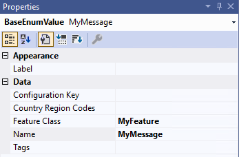

# Business events, custom message queues, and custom message types

[!include [banner](../../includes/banner.md)]

This article describes how to design your own custom message queues and message types for the [message processor](../message-processor.md) by using Visual Studio. It also describes how to set up business events to deliver alerts for failed processing results.

## <a name="business-events"></a>Set up business events to deliver alerts for failed processing results

You can set up [business events](../../../fin-ops-core/dev-itpro/business-events/home-page.md) to alert you about failed processing results. To complete this setup, activate the *Message processor message processed* business event on the **Business events catalog** page (**System administration \> Setup \> Business events \> Business events catalog**). As part of the activation process, you'll be directed to specify whether the event is specific to one legal entity or all legal entities. You'll also be directed to provide an endpoint name, which must be defined in advance.

> [!NOTE]
> If **When a Business Event occurs** is set to *Microsoft Power Automate* (instead of *HTTPS*, for example), the endpoint name will automatically be created in Supply Chain Management, based on the *Microsoft Power Automate* setup.

## Business events Power Automate example

In this example, **When a Business Event occurs** is set to *Microsoft Power Automate* to send email notifications that containing Action center (formerly Infolog) messages and hyperlinks that open the **Message processor messages** page for a specific failed message. As you require, you can add extra logic to send the notifications in parallel via different channels and control the recipients based on the event data.

1. In [Power Automate](https://preview.flow.microsoft.com), create an automated cloud flow for the **When a Business Event occurs - Fin & Ops App (Dynamics 365)** flow trigger, followed by the **Parse JSON** and **Send an email** steps.

    :::image type="content" source="media/message-processor-power-automate-example1.png" alt-text="Power Automate automated cloud flow.":::

1. In the **When a Business Event occurs** step, you can look up or enter values in the **Instance** and **Category** fields, and then set the **Business event** field to *Message processor message processed*.

    :::image type="content" source="media/message-processor-power-automate-example2.png" alt-text="Power Automate When a Business Event occurs step.":::

1. In the **Parse JSON** step, in the **Schema** field, enter a schema that defines the extended fields. You can use the **Download schema** option on the **Business events catalog** page in Supply Chain Management, or you can start by pasting in the following example schema text.

    ```json
    {
        "properties": {
            "BusinessEventId": {
                "type": "string"
            },
            "ControlNumber": {
                "type": "integer"
            },
            "EventId": {
                "type": "string"
            },
            "EventTime": {
                "type": "string"
            },
            "MajorVersion": {
                "type": "integer"
            },
            "MessageContent": {
                "type": "string"
            },
            "MessageDestinationCompanyId": {
                "type": "string"
            },
            "MessageDestinationOperationalSiteId": {
                "type": "string"
            },
            "MessageDestinationWarehouseId": {
                "type": "string"
            },
            "MessageDestinationWorkloadName": {
                "type": "string"
            },
            "MessageInfolog": {
                "type": "string"
            },
            "MessageProcessingResult": {
                "type": "string"
            },
            "MessageProcessingResultLabel": {
                "type": "string"
            },
            "MessageProcessorMessagePageUrl": {
                "type": "string"
            },
            "MessageQueue": {
                "type": "string"
            },
            "MessageQueueLabel": {
                "type": "string"
            },
            "MessageSourceCompanyId": {
                "type": "string"
            },
            "MessageSourceOperationalSiteId": {
                "type": "string"
            },
            "MessageSourceWarehouseId": {
                "type": "string"
            },
            "MessageSourceWorkloadName": {
                "type": "string"
            },
            "MessageState": {
                "type": "string"
            },
            "MessageStateLabel": {
                "type": "string"
            },
            "MessageType": {
                "type": "string"
            },
            "MessageTypeLabel": {
                "type": "string"
            },
            "MinorVersion": {
                "type": "integer"
            }
        },
        "type": "object"
    }
    ```

    :::image type="content" source="media/message-processor-power-automate-example3.png" alt-text="Power Automate Parse JSON step.":::

1. In the **Send an email** step, you can select the individual fields, or you can start by pasting the following example email body into the **Body** field.

    ```plaintext
    Message queue: @{body('Parse_JSON')?['MessageQueue']}
    Message queue label: @{body('Parse_JSON')?['MessageQueueLabel']}
    Message type: @{body('Parse_JSON')?['MessageQueueType']}
    Message type label: @{body('Parse_JSON')?['MessageQueueTypeLabel']}
    Message content: @{body('Parse_JSON')?['MessageContent']}
    Message state: @{body('Parse_JSON')?['MessageState']}
    Message state label: @{body('Parse_JSON')?['MessageStateLabel']}
    Message processing result: @{body('Parse_JSON')?['MessageProcessingResult']}
    Message processing result label: @{body('Parse_JSON')?['MessageProcessingResultLabel']}
    Message infolog: @{body('Parse_JSON')?['MessageInfolog']}
    Message source company ID: @{body('Parse_JSON')?['MessageSourceCompanyId']}
    Message source workload name: @{body('Parse_JSON')?['MessageSourceWorkloadName']}
    Message source site ID: @{body('Parse_JSON')?['MessageSourceOperationalSiteId']}
    Message source warehouse ID: @{body('Parse_JSON')?['MessageSourceWarehouseId']}
    Message destination company ID: @{body('Parse_JSON')?['MessageDestinationCompanyId']}
    Message destination workload name: @{body('Parse_JSON')?['MessageDestinationWorkloadName']}
    Message destination site ID: @{body('Parse_JSON')?['MessageDestinationOperationalSiteId']}
    Message destination warehouse ID: @{body('Parse_JSON')?['MessageDestinationWarehouseId']}
    Message processor message page URL: @{body('Parse_JSON')?['MessageProcessorMessagePageUrl']}
    ```

    :::image type="content" source="media/message-processor-power-automate-example4.png" alt-text="Power Automate send an email step.":::

When you save the business event, it's automatically activated and is ready to be used as part of Supply Chain Management.

## Message processor scheduler

The message processor has one scheduler. The `SysMessageKeyDateTimeSequenceProcessorScheduler` class schedules messages that have dependencies that are based on a key, date, and time, so that the messages are processed in the correct order. Messages that must be processed are stored in the `SysMessageProcessorTaskBundle` and `SysMessageProcessorTaskBundleMessage` tables. Dependent messages must be in the same bundle.

The `SysMessageKeyDateTimeSequenceProcessorScheduler` class is used by the [third-party MES integration](../../production-control/mes-integration.md) feature to secure messages that are related to a production order, and that are processed in the order that they're received or created in. The dependencies are defined by a key (production order number) and the time.

For example, the system receives or creates the following messages:

- Production order 1 – Start message
- Production order 2 – Start message
- Production order 2 – Report as finished message
- Production order 1 – Report as finished message

In this case, the `SysMessageKeyDateTimeSequenceProcessorScheduler` class will schedule the processing of messages in the following order:

1. Production order 1 – Start message
1. Production order 1 – Report as finished message
1. Production order 2 – Start message
1. Production order 2 – Report as finished message

Each report-as-finished message depends on the successful processing of the related start message.

Because a bottleneck can occur when records are picked up for processing for multiple tasks, and because there might be dependencies between the messages, the system bundles the messages. For example, if the bundle size is 2, the system will create the following bundles:

- Bundle 1 - Production order 1 – Start message
- Bundle 1 - Production order 1 – Report as finished message
- Bundle 2 - Production order 2 – Start message
- Bundle 2 - Production order 2 – Report as finished message

For scalability, when you develop a new queue, you can configure the number of tasks that should process the bundles. (Learn more in [Implement a new queue](#custom-queue).) If the configuration uses two message processor tasks, the two bundles can be processed in parallel.

## <a name="custom-queue"></a>Development example: Implement a custom message queue

This example shows how to add a new queue. After the queue is created, you'll be able to submit messages to it. Those messages will then be processed by the message processor according to the settings that were described earlier.

1. In Visual Studio, create an extension for the `SysMessageQueue` enum.
1. Add a new enum value for the new queue.

    

1. Set a feature class on the enum value.

    

1. Create a class that extends `SysMessageQueueMetadata`, as shown in the following example.

    ```xpp
    [SysMessageQueueFactoryAttribute(SysMessageQueue::MyQueue)]
    public final class MyQueue extends SysMessageQueueMetadata
    {
    
        /// <summary>
        /// Gets the default number of message processor tasks.
        /// </summary>
        /// <returns>The default number of message processor tasks.</returns>
        public SysMessageProcessorsTasks getDefaultMessageProcessorsTasks()
        {
            return 1;
        }
    
        /// <summary>
        /// Get the maximum number of messages in a bundle.
        /// </summary>
        /// <returns>The maximum number of messages in a bundle.</returns>
        public SysMessageProcessorMaxBundleSize getMaxBundleSize()
        {
            return 10;
        }
    
        /// <summary>
        /// Determines if messages should be queued when sending or processing messages.
        /// </summary>
        /// <returns>true if messages should be queued when sending a message; otherwise false.</returns>
        public boolean queueMessageOnSend()
        {
            return true;
        }
    
        /// <summary>
        /// Determines if dependent messages should be committed per created transaction ID.
        /// </summary>
        /// <returns>true if dependent messages should be committed per created transaction ID.; otherwise false.</returns>
        public boolean commitPerCreatedTransactionID()
        {
            return false;
        }
    
    }
    ```

1. Create an extension for the `SysMessageProcessorToggle` class to enable the message processor in the user interface (UI).

    ```xpp
    [ExtensionOf(classStr(SysMessageProcessorToggle))]
    final class MySysMessageProcessorToggle_Extension
    {
        /// <summary>
        /// Determines if the toggle is enabled.
        /// </summary>
        /// <returns>
        /// true if the toggle is enabled; otherwise, false.
        /// </returns>
        internal boolean isEnabled()
        {
            return next isEnabled() || MyFeature::instance().isEnabled();
        }
    
    }
    ```

## Development example: Implement a custom message type

This example shows how to create a message type for each type of process that you want to make available to the message processor. The message type establishes which processes can be run by messages of that type. The name of the message type will be shown on the **Message processor messages** page to identify the purpose of each message in the queue.

Follow these steps to create a new message type.

1. In Visual Studio, create an extension for the `SysMessageType` enum.
1. Add a new enum value for the new message type.

    

1. Set a feature class on the enum value.

    

1. Create a class that extends `SysMessageTypeMetadata`, as shown in the following example.

    ```xpp
    [SysMessageTypeFactoryAttribute(SysMessageType::MyMessage)]
    public final class MyMessage extends SysMessageTypeMetadata
    {
        /// <summary>
        /// Validates if it is allowed to send a message on a given queue.
        /// </summary>
        /// <param name = "_messageQueue">A queue to send message to.</param>
        /// <param name = "_messageTarget">A message target.</param>
        /// <param name = "_sourceMessageTarget">A message source.</param>
        /// <returns>true if it is allowed to send a message; false, otherwise.</returns>
        public boolean canSendMessage(SysMessageQueue _messageQueue, SysMessageTargetRecId _messageTarget, SysMessageTargetRecId _sourceMessageTarget)
        {
            if (_messageQueue == SysMessageQueue::MyQueue)
            {
                return true;
            }
    
            return false;
        }
    
        /// <summary>
        /// Returns a list of allowed message state transitions.
        /// </summary>
        /// <returns>A list of allowed message state transitions.</returns>
        public Enumerator getAllowedMessageStateTransitions()
        {
            // Allow the following state transitions:
    
            // SysMessageState::None -> SysMessageState::Queued
            // SysMessageState::None -> SysMessageState::Processed
    
            // SysMessageState::Queued -> SysMessageState::Processed
    
            // SysMessageState::Failed -> SysMessageState::Queued
            // SysMessageState::Failed -> SysMessageState::Cancelled
            // SysMessageState::Failed -> SysMessageState::Processed
    
            return SysMessageStateTransition::getProcessedCancelledStateTransitions();
        }
    
        /// <summary>
        /// Returns dependencies related to a message.
        /// </summary>
        /// <param name = "_message">The message to add dependencies to.</param>
        /// <returns>A list of dependencies related to a message.</returns>
        public List getDependencies(SysMessage _message)
        {
            List dependencies = new List(Types::Record);
    
            // Add a dependency to the message if you need to process messages in order. 
            // For example, process a start message before an end message. 
            // The message will not be processed before the dependent message is processed or cancelled.
    
            // The default scheduler, SysMessageKeyDateTimeSequenceProcessorScheduler only supports one dependency per message.
            // Messages with different keys may be processed in parallel.
    
            SysMessageDependencyKey dependencyKey = strFmt('Mykey:%1', this.getContract(_message).parmMyKey());
            dependencies.addEnd(SysMessageKeyDateTimeSequenceDependency::create(dependencyKey));
    
            return dependencies;
        }
    
        /// <summary>
        /// Execute the logic associated with the given message state transition.
        /// </summary>
        /// <param name = "_message">The message.</param>
        /// <param name = "_messageStateTransition">The state transition to execute.</param>
        public void processMessageStateTransition(SysMessage _message, SysMessageStateTransition _messageStateTransition)
        {
            if (_messageStateTransition.isEqual(SysMessageStateTransition::newFromStates(SysMessageState::Queued, SysMessageState::Processed)))
            {
                this.processMessage(_message);
            }
            else if (_messageStateTransition.isEqual(SysMessageStateTransition::newFromStates(SysMessageState::Failed, SysMessageState::Processed)))
            {
                this.cancelMessage(_message);
            }
        }
    
        private void processMessage(SysMessage _message)
        {
            // Add logic to process the message.
        }
    
        private void cancelMessage(SysMessage _message)
        {
            // Add logic to cancel the message if needed.
        }
    
        private ClassId contractClass()
        {
            return classNum(MyContract);
        }
    
        protected MyContract getContract(SysMessage _message, ClassId _objectTypeId = this.contractClass())
        {
            var contract = FormJsonSerializer::deserializeObject(_objectTypeId, _message.Content) as MyContract;
    
            return contract;
        }
    
    }
    ```

## Additional resources

- [Monitor and control message processor messages](../message-processor.md)
- [Clean up processed and canceled message processor messages](../message-processor-cleanup.md)
