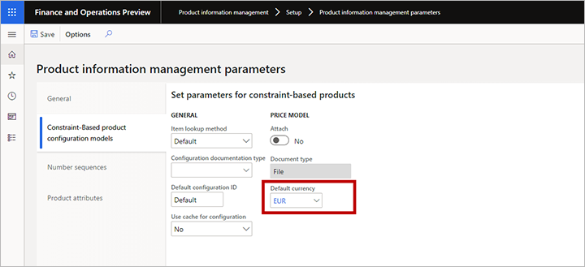
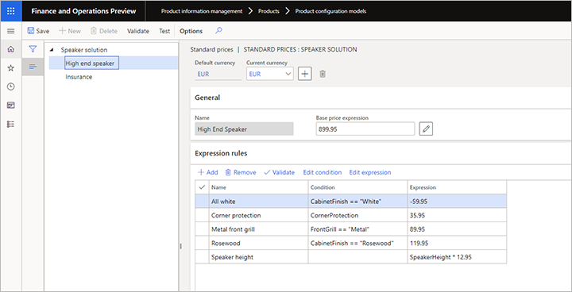
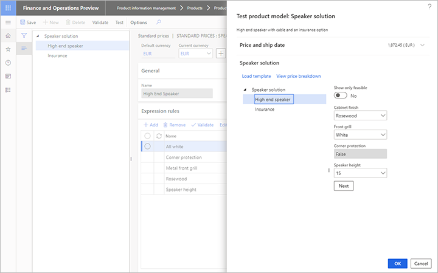
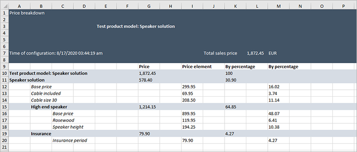
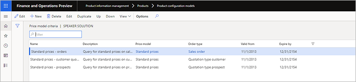
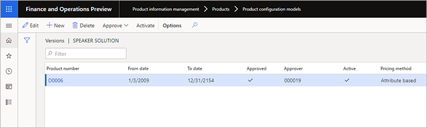

# Attribute-based sales prices for constraint-based product configuration

[!include [banner](../includes/banner.md)]

This article describes how to build sales price models with sales prices based on components and attributes rather than on the physical bill of material and the route. You can build several sales price models for each product configuration model.

## Set relevant product information management parameters

Before you start building your price models, you must define a default currency, which is used when you build your sales price models. You can also choose whether to attach a Microsoft Excel file with a price breakdown for all order or quotation lines. The price breakdown will enable you to share details with customers about how you arrived at a specific sales price for a configured product.

To set your default currency:

1. Go to  **Product information management \> Setup \> Product information management parameters**.
1. Open the **Constraint-Based product configuration models** tab.
1. Open the **Default currency** drop-down list and select your currency.

    

1. If you'd like to attach an Excel file with a price breakdown for all order or quotation lines, then in the **Price model** section, set **Attach** to *Yes*.

## Build your sales price models

To build a sales price model:

1. Go to  **Product information management \> Products \> Product configuration models**.
1. Select the target product configuration model.
1. On the Action pane, open the **Model** tab and, from the **Set up** group, select **Price models**.
1. The **Price models** page opens.
1. Select a price model or add a new one to the grid.
1. Select **Edit** to open the edit page for your selected model, which provides the following features:
    - The header of the form shows the default currency and lets you add new currencies for your price setup.
    - The left pane shows all the components and user requirements of the product model. Each node in the product model tree can have one base-price expression and an optional number of expression rules. An expression rule consists of a condition and an expression and each expression rule covers a product option that helps control the price of the product.
    - When you build your conditions and expressions, you have the same operators available as for calculations in a product model. The expression editor also supports both conditions and expressions.
1. Select a node in the left column and then use the features described in the previous step to establish pricing rules for it (see also the example provided after this procedure). Repeat this step for each node as needed.

The following example shows a base price of a static number of 899.95 EUR, which can be modified by one or more of the following five expression rules, depending on the configuration selected by the customer:

- For white cabinet finish, subtract 59.95 EUR.
- For corner protection, add 35.95 EUR.
- For a metal front grill, add 89.95 EUR.
- For rosewood cabinet finish, add 119.95 EUR.
- Add 12.95 EUR for each unit of speaker height.

## Add support for multiple currencies

When a configurable product is sold, the system checks whether the prices have been set explicitly in the currency of the customer. If so, the explicit values are used. If not, the system uses the currency exchange rates established for the sales company to convert the default currency value to the customer's currency.

To add explicit prices in an additional currency:

1. Open the edit page for your price model, as described in [Build your sales price models](#build-price-model).
1. Select the **Add** button in the header of the price model to open the **Currencies** drop-down dialog box, which lists the available currencies.
1. Select the currency you want to add in the **Currencies** drop-down dialog box and then select **OK**.
1. The **Current currency** drop-down list now includes the currency that you just added, plus any other currencies that may have been added previously. Select your new currency and notice that the grid in the **Expression rules** section now includes two expression fields:
    - **Expression** - Shows the expression (or constant value) for finding the price using the currency currently selected for **Current currency**.
    - **Default expressions** - Shows the expression (or constant value) for finding the price using the default currently (shown in the **Default currency** field).

    > [!NOTE]
    > The **Condition** field for the expression rules is "owned" by the default currency, which means that you can't modify the condition for other currencies. You also can't add new expression rules while a currency other than the default currency is selected as the **Current currency**.
1. Edit values in the **Expression** column as needed for the current currency.

In the example below, _EUR_ is the default currency, and _USD_ has been added as an additional currency.

> [!NOTE]
> You can't add expression rules that are unique for a non-default currency. To create expression rules that would be relevant only for a currency other than the default currency, set the price expression for the default currency to zero. Then set the appropriate expression for the non-default currency.

## Test your price model

To test how the sales prices work in a configuration session, open the edit page for your price model, as described in [Build your sales price models](#build-price-model) and then select  **Test** on the Action Pane. The **Test product model** dialog box opens, where you can do the following:

- Use the configuration settings offered here to select product options and then see how they affect the value shown for **Price and ship date**.
- Select **View price breakdown** to download an Excel document that shows full details about how the price was calculated.

The downloaded spreadsheet shows both the absolute value and the contribution as a percentage for each active price element. If you have set the **Attach** price model option on the **Product information management parameters** page, this Excel sheet gets attached to the order or quotation line.

## Set up selection criteria for price models

When your price models are in place, you must establish at least one selection criterion to pick up the price model when you configure to quote or to order. You'll do this by setting up one or more queries. In a combination with matching sales price models, the queries provide great flexibility in targeting sales prices for particular customers, regions, periods, and other criteria.

To set up selection criteria for price models:

1. Go to  **Product information management \> Products \> Product configuration models**.
1. Select the target product configuration model.
1. On the Action pane, open the **Model** tab and, from the **Set up** group, select **Price model criteria**. The **Price model criteria** page opens.
1. If the query row you need doesn't exist yet, select **New** on the Action Pane to add a new row to the grid and make the following settings for it:
    - **Name** - Enter a name for this row.
    - **Description** - Briefly describe the query and what it is for.
    - **Price model** - Select a [price model](#build-price-model) (from the current configuration model) that the query will apply when triggered.
    - **Order type** - Select the type of order where the query will apply.
    - **Valid from** - Specify the first day when the query will apply.
    - **Expire by** - Specify the last date when the query will apply.

    

1. Select the row for the query you want to define and then select **Edit** on the **Action Pane**. The query designer dialog box opens. It works like most query designers in Supply Chain Management. Use it to define the conditions under which the price model for the row you selected should be applied.

1. Repeat steps 4-5 for each query you require.
    > [!TIP]
    > You can save time by copying an existing row that is already similar to a new one that you need to add. To do this, select a target row and then select **Duplicate** on the Action Pane.

1. When you have finished setting up your criteria, arrange them into the proper order in the **Price model criteria** list. To reposition a row, select the row and then select **Up** or **Down** on the Action Pane.

    > [!IMPORTANT]
    > At configuration time, the system starts searching from the top of the list and uses the first query that matches the data on the quote or the order line. Therefore, you must put your most specific queries on top. If you place a general query at the top of the list, this is the one that will be used even though there might be a query further down the list that targets the exact customer or prospect of the configuration.

## Set attribute-based sales prices for the product model version

The final step is to specify attribute-based sales prices for the product model version. To do this:

1. Go to  **Product information management \> Products \> Product configuration models**.
1. Select the target product configuration model.
1. On the Action Pane, open the **Model** tab and, from the **Product model details** group, select **Versions**.
1. The **Versions** page opens. Make sure the **Pricing method** is set to **Attribute based**.
    

[!INCLUDE[footer-include](../../includes/footer-banner.md)]