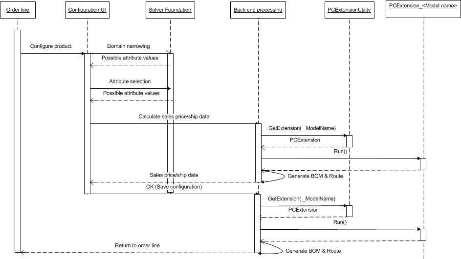

# Product configuration overview

[!include [banner](../includes/banner.md)]

The need to configure products to meet special requirements is becoming the rule rather than the exception, in both business-to-business and business-to-consumer relationships.

A manufacturer that supports configure-to-order scenarios has an opportunity to tend more carefully to customer needs. Additionally, by stocking semi-finished goods in the form of generic components instead of finished products, the manufacturer can reduce the capital that is tied to inventory.  

A successful move from a manufacture-to-stock setup to a configure-to-order setup requires careful analysis of the product structures, identification of product families, and componentization. To reduce the number of parts and minimize the number of goods that are in process, it's important that you understand the product interfaces, and that you design for reusability.  

There are several product configuration modeling principles, such as rule-based, dimension-based, and constraint-based modeling. Studies show that the constraint-based methodology can reduce the number of code lines in models by about 50 percent compared to other modeling principles. Therefore, this methodology can reduce the total cost of ownership (TCO). By moving from a rule-based model that is based on X++ code to a constraint-based model, you no longer require a developer license in order to maintain product models.

## Product configuration

The industrialization period has led to great achievements in producing high-quality and feature-rich products at affordable prices. The economies of scale have made it possible for most people in the industrialized world to buy cars, TVs, household appliances, and other goods that most of us consider a necessary part of our everyday life.  

As many products have become commodities, a need to differentiate them has arisen. The immediate response of manufacturers to this challenge has been to create variants of each product, so that customers have more alternatives. This strategy has led to increased forecast challenges, and also to an increase in inventory cost and unsold products that become obsolete.  

By adopting a configure-to-order philosophy, manufactures have an opportunity to meet customer demand for unique products while reducing or eliminating obsolete inventory items. When a manufacture-to-stock philosophy is shifted to a configure-to-order philosophy, one immediate challenge that arises is that the need for short lead times must be balanced against low inventory levels.  

The key to success here is to carefully analyze the product portfolio, and to look for patterns in both product features and processes. The goal is to identify generic components that can be manufactured by the same equipment and used in all variants.  

The product configuration feature set includes a user interface (UI) that provides a visual overview of the product configuration model structure, and also a declarative constraint syntax that doesn't have to be compiled. Therefore, companies that want to support a configuration practice can get started more easily. As the following sections explain, a product designer no longer requires the support of a developer to build a product configuration model, test it, and release it to the sales organization.

## Building a product configuration model

There are several approaches that a user can take to build a product configuration model. One option is to follow a sequential flow by first creating all the reference data, such as product masters, distinct products, and operational resources, and then including them as components, bill of materials (BOM) lines, route operations, and other elements of the product configuration model. Alternatively, you can select a more iterative approach by first creating the model and then adding reference data as the need arises.

### Components

A product configuration model consists of one or more components that are tied together through subcomponent relationships. Components are defined one time, and can then be used many times in one or more product configuration models. The components are the main building blocks of a product configuration model, and nearly all information about the model is related to them.

### Attributes

Each component has one or more attributes that identify its properties. The attributes are what users will choose during the configuration process. Attributes control both inter-component and intra-component relationships through inclusion in constraints or calculations. Through conditions that are applied to BOM lines, the attributes can be used to determine which physical parts the configured product will consist of. Additionally, an attribute can control the property of a BOM line through a mapping mechanism. Similar functionality exists for route operations regarding both inclusion and property settings.

>[!NOTE]
> When you create attribute types, avoid creating a high number of values for the attribute type domain. Doing so could cause slowdowns in the product configurator.

### Expression constraints

Use of a constraint-based product configuration model implies that some limitations exist when the user selects values for the various attributes. Such limitations can be implemented as expression constraints by using the Optimization Modeling Language (OML). Alternatively, a constraint can be implemented in the form of a table constraint.

### Table constraints

Table constraints can be user-defined or system-defined.  

A user-defined table constraint is built by the user. The user selects a combination of attribute types to represent the columns of the table and then enters values from the domains of the selected attribute types to form the rows in the table constraint.  

A system-defined table constraint is defined by selecting which table to use as a reference and then selecting fields from this table to form the columns in the constraint. The rows of the table constraint are the rows of the Supply Chain Management table that are present at configuration time.  

A table constraint is included in a product configuration model by referencing the table constraint definition and mapping the relevant attributes in the model to the columns in the table constraint.

### Calculations

Calculations represent a mechanism for performing arithmetic operations in a configuration model. For example, a calculation can determine the length of a specific piece of raw material or the processing time for a polishing operation. Calculations are imperative and set the value for a target attribute after all the attribute values that are included in the calculation expression become available.

### Subcomponents

Subcomponents represent the nodes in the product configuration model structure. For each subcomponent relationship, a reference must be specified to a product master that has the variant configuration technology set to constraint-based configuration.

### User requirements

A user requirement has all the constituents of a subcomponent. The only difference is that a user requirement isn't bound to a product master. The practical effect of this difference is that any BOM lines or route operation that are defined in the context of a user requirement are collapsed into the parent component BOM structure or route. This behavior resembles the behavior of a phantom BOM.

### BOM lines

BOM lines are included to identify the manufacturing BOM for each component. A BOM line must reference an item, and all item properties can be set to a fixed value or mapped to an attribute.

### Route operations

Route operations are included to identify the manufacturing route. A route operation must reference a defined operation, and all operation properties can be set to a fixed value. All properties except resource requirements can be mapped to an attribute instead of a value.

## Validating and testing a product configuration model

Validation of a product configuration model can occur on several levels in the model and can therefore cover various scopes. The lowest level is for a single expression constraint. In this case, validation is typically performed by the product designer to verify that the syntax of an expression is correct.  

Similarly, a condition for a BOM line or a route operation can be validated in isolation.  

Validation can also be done for a user-defined table constraint definition. In this case, the user can verify that the values that are entered for each field are inside the domain of the corresponding attribute types.  

Finally, validation can be done for a complete product configuration model to verify that the complete syntax is correct, and that all naming and modeling conventions have been respected.

### Testing

Testing a model is similar to running an actual configuration session. The user can walk through the configuration pages and verify that the model structure supports the configuration process. The user can verify that the attribute values are correct, and that the attribute descriptions guide the user to select the correct values. Finally, after a test session is completed, the system tries to create the BOM and the route that corresponds to the selected attribute values, and presents an error message if anything goes wrong.

### The configuration page

To navigate between components, select **Next**, or select a component in the product configuration model tree to set focus on it.

## Finalizing a model for configuration

When a product configuration model is ready to be used in configure-to-order scenarios, a version must be created. However, there are several options that can enhance the modeling experience.

### User interface

The configuration UI can be modified by introducing attribute groups in one or more subcomponents. Such a grouping can highlight the relationships between specific attributes and help the configuration user identify the area of the product that is currently in focus.

### Templates

One or more configuration templates can be created to speed up the configuration process. Alternatively, templates can be created to promote specific attribute combinations, such as when a sales campaign focuses on a specific set of product features.

### Translations

If the product will be sold in different countries/regions, translations can be created for all text that appears in the configuration UI. This text includes not only name and description fields, but also attribute text values.

### Versions

The last and most important step in the finalization process is to create a version for the product configuration model. The version represents the relationship between the product master, which can be selected for configuration on an order or quotation line, and the product configuration model. A version must be approved and activated before it can be used in a configuration session.

## Extending a product configuration model through the API

A dedicated application programming interface (API) has been implemented, so that partners and others who have a developer license can extend the capabilities of a product configuration model. The main goal has been to establish a mechanism that lets partners and customers who use the existing Product Builder migrate the code that is embedded in Product Builder models to the API. In this way, they can migrate their models from Product Builder to a product configuration. However, new partners and customers can also benefit from using the API to extend new product configuration models.

The API is implemented by using a set of **PCAdaptor** classes that expose the data structure of the product configuration models. An instance of the **PCAdaptor** class must be created for each model that will be extended. After a configuration session is completed, the system checks for an instance of this class and runs it if it's found.  

The following API flow diagram outlines the process.  

  

## Configure products

### Configure one or more products

You can configure products from the following places:

- Sales order line
- Sales quotation line
- Purchase order line
- Production order line
- Item requirement line (project)

The purpose of the configuration is to create a distinct variant of the product that meets the customer's requirement. A unique configuration ID is created for each new configuration. This ID enables tracking through inventory.

### Multiple sites and intercompany considerations

If configuration will be done at a site, or even a company, that differs from the site or company where production will occur, the BOM and the route will be created for and put at the supplier site in the supplying company. The product variant will be released in all companies that participate in the supply chain.

[!INCLUDE[footer-include](../../includes/footer-banner.md)]
