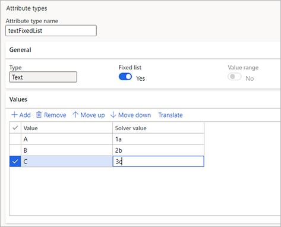
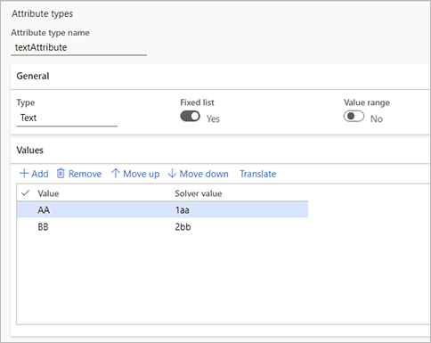

# Product configuration model calculations

[!include [banner](../includes/banner.md)]

This article describes how to create calculations for attributes in a product configuration model.

## Prerequisites

Calculations are used in a product configuration model to calculate the configuration values for a product. Before you can start to set up calculations, the related product configuration model must exist. For an overview of the setup process for configuration models and the related tasks, see [Set up a product configuration model](set-up-maintain-product-configuration-model.md).

## Create a calculation

A calculation consists of an expression and a target attribute. Learn more in [Calculations for product configuration models FAQ](calculate-product-configuration-models.md).

To create a calculation for an existing product model, follow these steps.

1. Go to **Product information management \> Common \> Product configuration models**.
1. Open a product configuration model, and then select **Edit**.
1. On the **Calculations** FastTab, select **Add** to add a calculation, and then set the following fields:

    - **Name** – Enter a name for the calculation.
    - **Description** – Enter a description of the calculation.
    - **Target attribute** – Select the attribute that you're making the calculation for.

1. Select **Edit expression**.
1. In the **Enter a calculation** dialog box, add the required attributes, operators, and values to the expression. For more information about how to work with these elements, see [Expression constraints and table constraints in product configuration models](expression-constraints-table-constraints-product-configuration-models.md).
1. When your expression is ready, select **OK**.

## Calculation examples

This section provides a few examples that show how calculations work.

### Example 1

The target attribute is Boolean, and the calculation uses the following conditional expression:

`If[(decimalAttribute1 / decimalAttribute2) < 1, True, False]`

This expression returns a value of *True* to the target attribute if `decimalAttribute2` is greater than or equal to `decimalAttribute1`. Otherwise, it returns a value of *False*.

### Example 2

This example uses the text attribute `textFixedList` as the target attribute. This attribute contains the following fixed list.

| Value | Solver value |
|---|---|
| A | 1a |
| B | 2b |
| C | 2c |

The following screenshot shows how the settings for this attribute might look in your system.

The attribute is used in the following conditional statement:

`If[integerAttribute < 150, 0, 2]`

If `integerAttribute` is less than 150, this statement returns the text value of the first record in the fixed list, *A*. Otherwise, it returns the text value of the third record in the fixed list, *C*.

> [!NOTE]
> The fixed list is equivalent to a zero-based enumeration (enum), and its values are accessed by the appropriate integer value. Therefore, the first fixed list value (*A*) is matched to *0*, the second value (*B*) is matched to *1*, and the third value (*C*) is matched to *2*.

### Example 3

This example uses the `textFixedList` target attribute from the previous example. It also uses another text attribute, `textAttribute`, that contains the following fixed list.

| Value | Solver value |
|---|---|
| AA | 1aa |
| BB | 2bb |

The following screenshot shows how the settings for this attribute might look in your system.

The value for the `textFixedList` attribute is calculated by using the following conditional statement:

`If[textAttribute == "1aa", 0, 2]`

If the `textAttribute` value has a solver value that equals *1aa*, this expression returns the text value of the first record in the `textFixedList` fixed list, *A*. Otherwise, it returns the text value of the third record in the `textFixedList` fixed list, *C*.

> [!NOTE]
> - The conditional statement must use the solver value of the attribute.
> - Only fixed-list text attributes can be used in calculations.

## Related information

- [Calculations for product configuration models FAQ](calculate-product-configuration-models.md)
- [Add an expression constraint to a product configuration model](tasks/add-expression-constraint-product-configuration-model.md)
- [Product configuration models overview](product-configuration-models.md)
