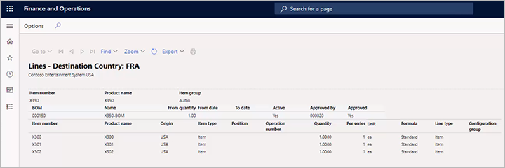

---
# required metadata

title: Country of origin
description: Many organizations issue certificates to their vendors to ensure that products meet specific certification standards. These certificates often depend on the country of origin. This article provides information about the country of origin feature, which lets you link a product to its country of origin and keep track of its product certifications.
author: t-benebo
ms.date: 07/15/2020
ms.topic: article
ms.prod: 
ms.technology: 

# optional metadata

ms.search.form:  COOVendorCerts
audience: Application User
# ms.devlang: 
ms.reviewer: kamaybac
# ms.tgt_pltfrm: 
# ms.custom: [used by loc for articles migrated from the wiki]
ms.search.region: Global
# ms.search.industry: [leave blank for most, retail, public sector]
ms.author: benebotg
ms.search.validFrom: 2020-07-15
ms.dyn365.ops.version: 10.0.9
---

# Country of origin

[!include [banner](../includes/banner.md)]

Many organizations issue certificates to their vendors to ensure that products meet specific certification standards. These certificates often depend on the country of origin. The country of origin feature lets you link a product to its country of origin and keep track of its product certifications.

## Turn the country of origin feature on or off

To use this feature, it must be turned on for your system. As of Supply Chain Management version 10.0.21, it's turned on by default. As of Supply Chain Management version 10.0.32, this feature is mandatory and can't be turned off. If you're running a version older than 10.0.32, then admins can turn this functionality on or off by searching for the *Country of origin management feature* feature in the [**Feature management** workspace](../../fin-ops-core/fin-ops/get-started/feature-management/feature-management-overview.md).

## Configure source and destination countries

Before you issue a certificate for a product, you must link the product to its destination country and its country of origin.

1. Go to **Product information management \> Setup \> Product compliance \> Country of origin \> Country of origin rules**.
2. Select an existing country setup to edit, or select **New** on the Action Pane to create a new country setup.
3. Set the following values for the selected or new country.

    | Field | Description |
    |---|---|
    | Item number | Select the item number of the product. |
    | Destination country | Select the country that you're sending the product to. |
    | Origin country | Select the country that you're shipping the product from. |

The purpose of this setup is to help you generate a bill of materials (BOM) report where you can include the country of origin for each part that source and destination countries are specified for. This report will help you get a holistic picture of where your parts come from and where they are going.

## Keep track of vendor certificates

You can use the **Country of origin vendor certificates** page to keep track of certificates that you issue to vendors.

You must decide which certificate documents you're issuing and how you will report them to customers. This feature helps you keep track of your certificates. It also lets you choose whether the relevant certificate numbers appear on invoices, packing slips, and/or order confirmations.

To set up your certificate information, follow these steps.

1. Go to **Product information management \> Setup \> Product compliance \> Country of origin \> Country of origin vendor certificates**.
2. Select an existing certificate setup to edit, or select **New** on the Action Pane to create a new certificate setup.
3. Set the following settings for the selected or new certificate.

    | Field | Description |
    |---|---|
    | Vendor account | Select the vendor that you issued the certificate to. |
    | Item number | Select the item that you issued the certificate for. |
    | Country/region | The destination country or region where you must use this certificate. |
    | Certificate number | Enter the identification number of the certificate that you issued. |
    | Effective | Select the first date when the current certificate is valid.|
    | Expiration | Select the last date when the current certificate is valid. |
    | Print on invoice | Select this check box to print the certificate number on invoices that are addressed to the specified country during the specified date range. |
    | Print on packing slip | Select this check box to print the certificate number on packing slips that are addressed to the specified country during the specified date range. |
    | Print on sales order | Select this check box to print the certificate number on sales orders that are addressed to the specified country during the specified date range. |

## Include the country of origin on BOM reports

When you generate a BOM report, you can include the country of origin for each part that you specified source and destination countries for on the **Country of origin rules** page.

1. Go to **Product information management \> Products \> Released products**.
1. Select or create a product to open its **Released product details** page.
1. On the Action Pane, on the **Engineer** tab, in the **BOM** group, select **Designer**.
1. On the page that appears, on the Action Pane, select **BOM \> Print**.
1. In **Bill of materials lines** dialog box, set the **Destination country** field to the destination country that you want to view on your report.
1. Select **OK**.

A report that shows information about the country of origin of each part is generated and shown. Here is an example of the report.

[!INCLUDE[footer-include](../../includes/footer-banner.md)]