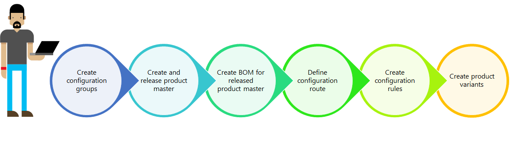

---
# required metadata

title: Dimension-based product configuration overview
description: Dimension-based product configuration represents a simple solution for creating many product variants from a single product master and its bill of materials.
author: t-benebo
ms.date: 07/25/2019
ms.topic: overview
ms.prod: 
ms.technology: 

# optional metadata

ms.search.form: BOMConfigRule, BOMTable, ConfigChooseFromRoute, ConfigGroup, ConfigHierarchy, EcoResDimensionBasedConfiguration
# ROBOTS: 
audience: Application User
# ms.devlang: 
ms.reviewer: kamaybac
# ms.tgt_pltfrm: 
ms.collection: get-started
ms.assetid: 4db9890b-306b-4be7-ba98-3be2094d561f
ms.search.region: Global
ms.search.industry: Manufacturing
ms.author: benebotg
ms.search.validFrom: 2016-02-28
ms.dyn365.ops.version: AX 7.0.0

---

# Dimension-based product configuration overview

[!include [banner](../includes/banner.md)]

Dimension-based product configuration represents a simple solution for creating many product variants from a single product master and its bill of materials.

Dimension-based product configuration is one of the three built-in product configuration technologies. The two other technologies are predefined variants and constraint-based configuration. All three technologies use a product master as the starting point and allow the user to create many product variants for one product master.

## Key concepts
Dimension-based product configuration is based on the following key concepts:

-   Product masters
-   Configuration product dimension
-   Configuration groups
-   Bill of materials (BOM)
-   Configuration route
-   Configuration rules

### Product masters

A product master is the starting point for any product configuration process. For the dimension-based product configuration, you need a product master with this particular configuration technology and a product dimension group that includes the configuration product dimension.

### Configuration product dimension

The configuration product dimension is used to identify the product variants for a product master with the dimension-based configuration technology. The configuration dimension value is entered by the user and should help to identify the individual product variants.

### Configuration groups

Configuration groups are defined in a central repository and can be used for all dimension-based product configuration models. Configuration groups are associated to the individual BOM lines and hold together a group of lines that are mutually exclusive. This means that only one line in a group can be selected for a single product variant.

### Bill of materials (BOM)

The BOM represent the building blocks for a dimension-based product configuration. It must include all the different products that can be used in any product variant. Each line in the BOM can reference a configuration group. If a line doesn’t reference a configuration group, it will be included in all product variants.

### Configuration route

The configuration route determines the sequence of the configuration groups, as they will be displayed to the user during the product configuration process.

### Configuration rules

The configuration rules represent a mechanism for ensuring that a product included in one configuration group in a BOM enforces either an inclusion or an exclusion of a product in a different configuration group in the same BOM.

## Product modeling process
The natural sequence for building a product model for a dimension-based product starts with defining the relevant configuration groups. It is important to ensure that all products which will be used in the BOM have been released to the company that the product model is built for. With these building blocks in place, the user can create the BOM and assign configuration groups to all relevant BOM lines. When the BOM is complete, a configuration route can be defined for ordering the configuration groups in the proper sequence.  If there are certain products from different configuration groups that either must or must not be used together, you can create configuration rules that will enforce these product relationships. After the BOM has been tied together with a dimension-based product master through a BOM version and both have been approved and activated, you can create product configurations and enter a name for each configuration. The configurations can be defined before any transactions are generated or it can be done when the need for a certain configuration occurs.

### Suggested use

The dimension-based configuration technology is best used for products with limited variability and the combination of the standard product dimensions size, color, style, and configuration is unsuitable for identifying a specific product variant. An example could be bicycle with frame height, wheel size, brake types, and different gears.

### Next step

The following eight task guides are listed in the order in which you should complete them. 

1.  [Create a dimension-based product master](tasks/create-dimension-based-product-master.md)
2.  [Release a dimension-based product master](tasks/release-dimension-based-product-master.md)
3.  [Complete basic setup of a released product master](tasks/complete-basic-setup-released-product-master.md)
4.  [Define configuration groups](tasks/define-configuration-groups.md)
5.  [Create a bill of materials for a dimension-based product master](tasks/create-bill-materials-dimension-based-product-master.md)
6.  [Define configuration routes](tasks/define-configuration-route.md)
7.  [Create configuration rules](tasks/create-configuration-rules.md)
8.  [Create dimension-based configurations](tasks/create-dimension-based-configurations.md)

[!INCLUDE[footer-include](../../includes/footer-banner.md)]