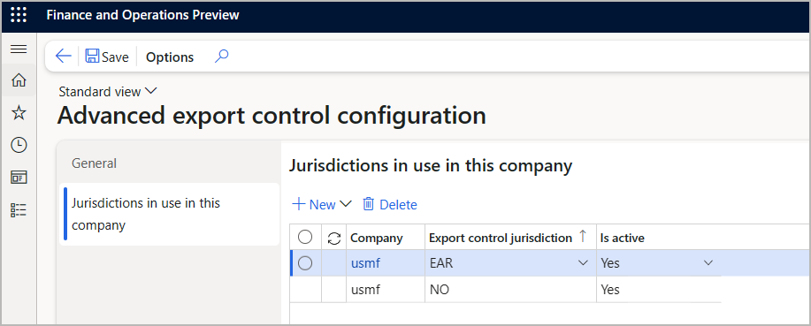

# Enable and configure advanced export control

## Prerequisites

To use advanced export control, your system must meet the following requirements:

- You must be running Microsoft Dynamics 365 Supply Chain Management 10.0.36 or later.
- The feature that is named *(Preview) Advanced export control configuration* must be turned on in [feature management](../../fin-ops-core/fin-ops/get-started/feature-management/feature-management-overview.md).
- Your Supply Chain Management environment must be [linked to a Dataverse environment](../../fin-ops-core/dev-itpro/power-platform/enable-power-platform-integration.md).

## Install the export control app

Follow these steps to install the export control app.

1. Open the [Microsoft Power Platform Admin Center](https://admin.powerplatform.microsoft.com).
1. Select your environment.
1. On the **Resources** tile, select **Dynamics 365 apps**.
1. From the list of apps, select **Dynamics 365 Export Control**.
1. Follow the instructions on your screen to install the app.

## Authentication and authorization

The system makes export control checks using application user calls, which means they can be made regardless of which user is working with the document in Supply Chain Management. Supply Chain Management users don't need to be added to Dataverse nor given extra permissions. To support this service-to-service (S2S) authentication, an Azure Active Directory (Azure AD) application must be created for each environment. You must not share or reuse the Azure AD applications across different environments.

### Register a new Azure AD application in your Azure portal

Follow these steps to create a new Azure AD application.

1. Sign in to your [Azure portal](https://portal.azure.com).
1. Go to **Azure Active Directory \> App registrations**.
1. Select **New Registration**.
1. The **Register an application** page opens. Enter the following information:
    - **Name** – Enter a unique name.
    - **Supported account types** – Select *Any Azure AD directory* (single or multi-tenant).
    - **Redirect URI** – Leave blank.

1. Select **Register**.
1. A page opens showing details about your new app. Copy the **Application (client) ID** value to a temporary text file because you'll need it later.
1. From the **Manage** list, select **Certificates & secrets**.
1. The **Certificates & secrets** page opens. Select **New client secret**.
1. The **Add a client secret** dialog opens. Enter a description and an expiration date and then select **Add**.
1. You return to the **Certificates & secrets** page, which now shows a row with details about your new client secret. Copy the value in the **Value** column to a temporary text file because you'll need it later and it will be hidden the next time you open this page.

### Grant the application permissions in the Power Platform Admin Center

Follow these steps to grant the application permissions in the Power Platform Admin Center.

1. Sign in to your[Power Platform Admin Center](https://admin.powerplatform.microsoft.com).
1. Go to **Environments** and select your environment.
1. The page for your selected environment opens. In the **Access** section, under the **Users** heading, select **See all**.
1. The **Users** page opens. Select the **app users list** link.
1. The **Application users** page opens. Select **New app user** from the toolbar.
1. The **Create a new app user** dialog opens. Select **Add an app**.
1. The **Add an app from Azure Active Directory** dialog opens. In the search field, paste the application ID for your new app, which you should have copied when you registered the app in your Azure portal. Then select your app in the list and select **Add**.
1. You return to the **Create a new app user** dialog. Select your **Business unit**.
1. Select the **Edit security roles** button to open the **Add security roles** dialog. Select *Export control application* in the **Role** list and then select **Save** to apply the role.
1. Select **Create** to create the new app user.

## Enable the functionality and configure the application in Supply Chain Management

Follow these steps to enable the functionality and configure the application in Supply Chain Management.

1. Sign in to Supply Chain Management.
1. Go to **Product information management \> Setup \> Product compliance \> Country of Origin \> (Preview) Advanced export control configuration**.
1. On the **General** tab, make the following settings:
    - **Advanced export control functionality enabled** – This setting turns advanced export control functionality on or off for your system. To use this feature, set this option to *Yes*.
    - **Validate data in Dataverse** – Set to *Yes* to ensure that the system checks all sales orders and shipments against the export rules established in the Dataverse app. This check confirms whether your company is allowed to sell or ship each item in an order according to the rules established for the relevant jurisdiction.
    - **Track sales order check history** – Set to *Yes* to keep a log of the order check history. Set to *No* if you don't need this log.
    - **Linked Dataverse environment URL** – Shows the URL of the Dataverse environment linked to your Supply Chain Management environment. This is where your advanced export control jurisdictions, codes, restrictions, exceptions, and licenses are defined.
    - **Application ID** – Paste the application ID for your new app, which you should have copied when you registered the app in your Azure portal.
    - **Application secret** – Paste the client secret for your new app, which you should have copied when you registered the app in your Azure portal.
1. On the Action Pane, select **Save**. The system checks whether it can connect and that the appropriate solution is installed. If you receive any errors, then make sure the Advanced Export Control solution is successfully installed and that the specified Azure AD application has the *Export control application* security role in Dataverse.
1. Select the **Synchronize country/region list** button to copy the existing list of country/region codes from Supply Chain Management to the Dataverse solution. This list is used when defining rules. Each time you change the country/region code list, you must come back here and select this button again to sync the changes. The name of the countries/regions is synchronized using the language of the user who selects this button.

## Configure jurisdictions for each legal entity

You must configure the set of jurisdictions that are available for each legal entity (company). For companies where no jurisdictions are enabled, advanced export control features won't be available on sales orders, items, or products. Instead, simpler [dual-use goods](dual-use.md) functionality will be provided. When at least one jurisdiction is enabled for a legal entity, then the dual-use goods functionality is hidden on forms in that legal entity and advanced export control functionality is shown instead.

Follow these steps to configure the jurisdictions for a legal entity.

1. Sign in to Supply Chain Management.
1. From the company picker, select the legal entity you want to configure.
1. Go to **Product information management \> Setup \> Product compliance \> Country of Origin \> (Preview) Advanced export control configuration**.
1. Open the **Jurisdictions in use in this company** tab. The grid shows the jurisdictions that are enabled for the legal entity. Initially, the grid is empty. Use the toolbar buttons to add or remove jurisdictions as needed.

    

1. On the Action Pane, select **Save**.
