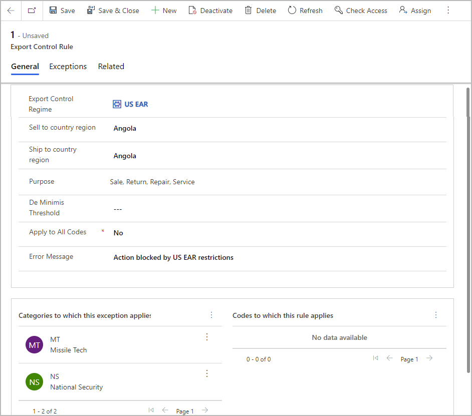
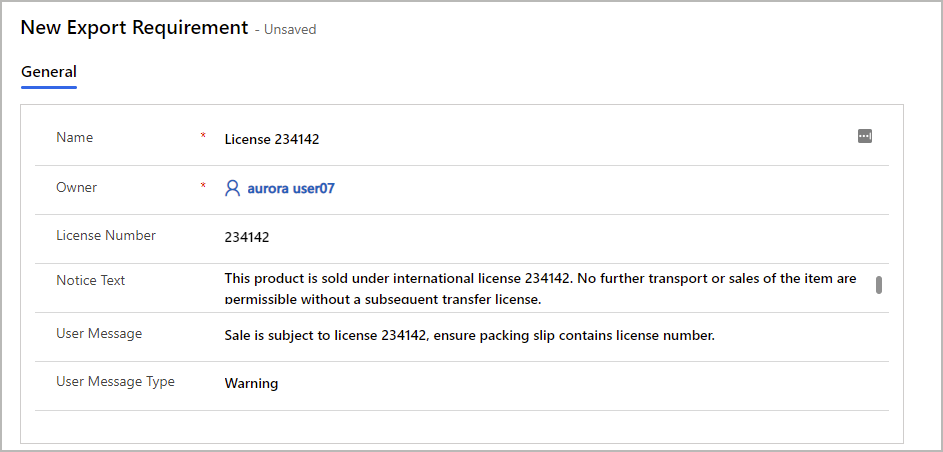

<!-- KFM: Is this really a sales/marketing feature? Seems more like product information management (like hazmat and dual-use). -->

<!-- KFM: We should maybe have a section about our architecture so we'll understand why we need Power Apps and Dataverse, and what benefits those may bring. -->

# Advanced export control overview

The advanced export control solution provides the foundation for managing, tracking, and checking export compliance. You can use it both with and without Supply Chain Management.

The solution implements five primary concepts:

- Jurisdictions
- Codes and categories
- Restrictions
- Exceptions
- Licenses

## Jurisdictions

A jurisdiction is a set of codes, categories, restrictions, exceptions, and licenses. It represents a set of configurations that apply to incoming requests. Each jurisdiction is associated with a set of rules that indicate when the jurisdiction applies. If a rule is configured as an error, then any activity matching the rule will be blocked for that jurisdiction unless an exception exists. A rule is usually a combination of a country, a transaction purpose, and a set of codes and categories.

The following list provides a set of examples of export control jurisdictions:

- US International Traffic in Arms Regulation (ITAR)
- The Wassenaar Arrangement
- EU Dual Use
- Norway Liste I and II
- US Export Administration Regulations (EAR)
- Controls on exports by an individual company
- Multilateral Export Controls
- Sanctions

Jurisdictions don't necessarily need to be based on countries or regions. They can also be configured to control export activities based on your company's own policies.

## Codes and categories

The codes that make up a jurisdiction are often referred to as Export Control Classification Numbers (ECCNs). If you use the export control functionality for customs scenarios, then Harmonized System (HS) codes may also be used. Codes can be linked to one or more control categories such as *Missile Technology* or *National Security*. The set of codes and categories is unique for each jurisdiction. Each ECCN may be a member of zero or more control categories, and each control category may contain many ECCNs.

An example of an export control classification number is *7A994*, which is defined by the United States Export Administration Regulations (US EAR) export control jurisdiction. This classification number applies to "Other navigation direction finding equipment, airborne communication equipment, all aircraft inertial navigation systems not controlled under 7A003 or 7A103, and other avionic equipment, including parts and components." According to the US EAR, ECCN 7A994 is a part of the *Anti Terrorism (AT)* control category.

Because ECCNs and control categories are defined by export control jurisdictions, the same ECCN may appear in more than one export control jurisdiction. For this reason, you must always specify which jurisdiction a code references. HS codes, which are used primarily for customs tracking, may also be used as codes to manage export controls related to customs.

## Restrictions

Each export control jurisdiction defines a set of restrictions under which export actions should be disallowed unless an exception exists. Often, restrictions are defined in terms of a commerce country chart, as seen in [this downloadable example from the US EAR](https://www.bis.doc.gov/index.php/documents/regulations-docs/2253-supplement-no-1-to-part-738-commerce-country-chart/file). A restriction is a set of ECCNs and/or control categories, together with a country, transaction purpose, and other aspects.

The following screenshot shows a sample rule for the US EAR restrictions based on the country chart. Based on this rule, any order containing an item with an ECCN in the MT or NS control categories would not be allowed to be sold to Angola. If a user attempted to confirm an order containing one of these items to be shipped to Angola, they would see the error message "Action blocked by US EAR restrictions."

## Exceptions

Exceptions allow an action even though a restriction would otherwise block it. Common types of exceptions include licenses, blanket exemptions, and corporate policies. Exceptions are defined the same way as restrictions, but also provide extra requirements that apply when the exception is used, such as the need to display a message the user or to print text and licenses on documents.

The following screenshot shows an example exception setup.

## Licenses

<!-- KFM: Seems like we are missing a description of *licenses*? -->

## Next steps

- [Enable and configure advanced export control](export-control-configure.md)
- [Work with advanced export control in products and sales orders](export-control-use.md)
