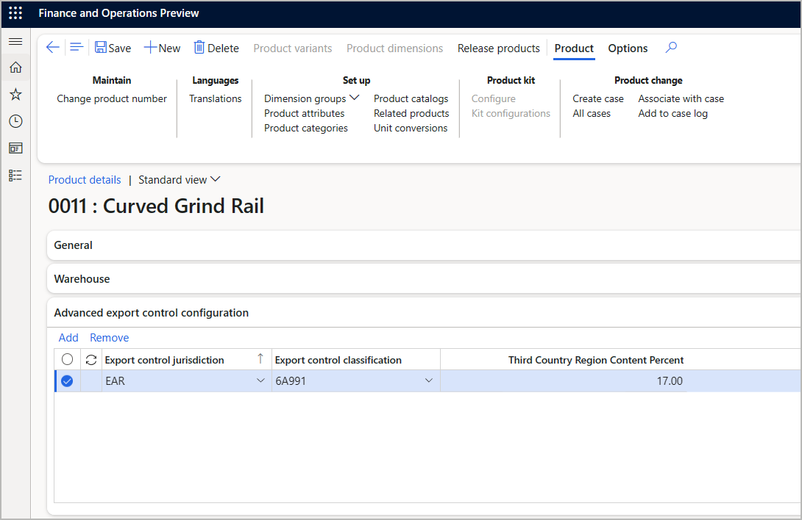
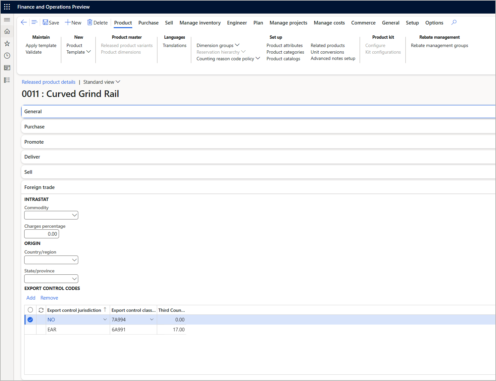
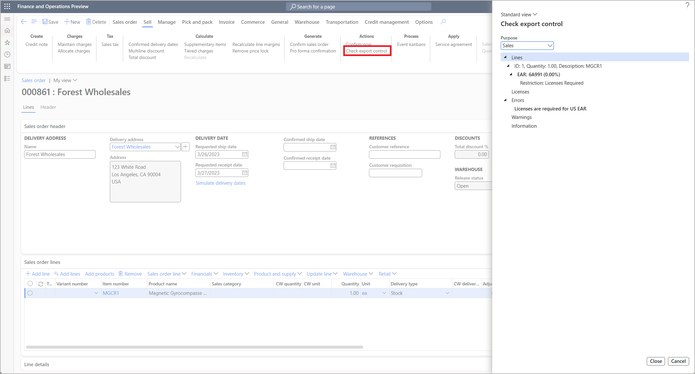
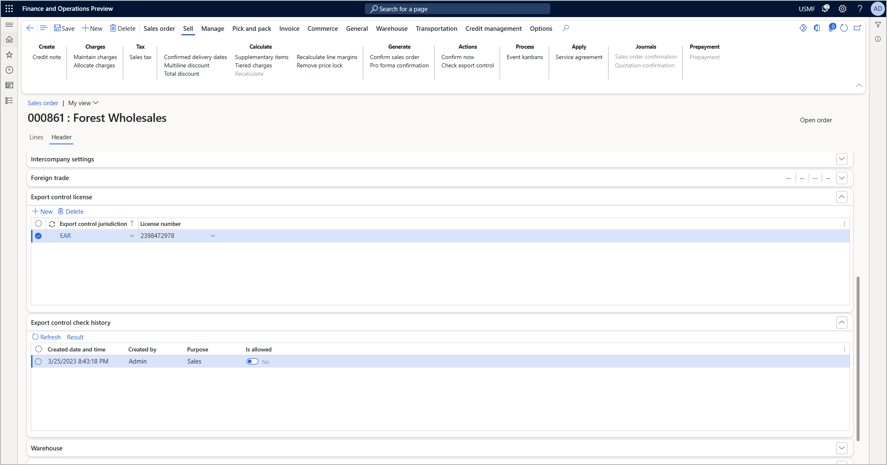
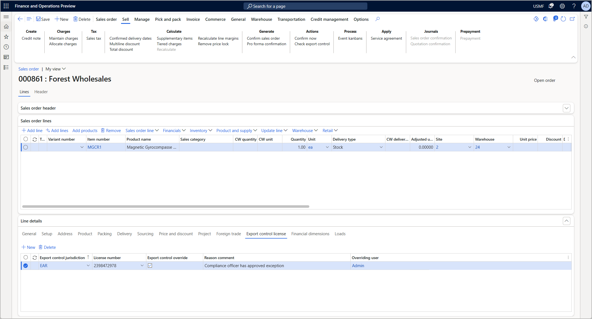

<!-- KFM: I think we might be missing info on how to configure exceptions, requirements, rules. Maybe something about "licenses" (it's not clear what those are)? -->

# Work with advanced export control in products and sales orders

The advanced export control feature lets you apply export control rules to sales orders. Individual jurisdictions can be enabled or disabled for each legal entity (company), which means that each company can have have different export control behaviors and rules.

## Assign export control classifications for global products

When advanced export control is [enabled](export-control-configure.md), it adds a new  **Advanced export control configuration** FastTab to the **Product details** page for products and product masters. Use this FastTab to specify the Export Control Classification Number (ECCN) and other export control settings for the product in various jurisdictions.

To set up advanced export control for a product or product master, follow these steps:

1. Go to **Product information management \> Products \> All products and product masters**.
1. Find and open the product you want to work with to get to its **Product details** page.
1. Expand the **Advanced export control configuration** FastTab.

    

1. The grid lists each export control that applies to the current product. Use the buttons on the toolbar to add and remove rows as needed. For each row, make the following settings:
    - **Export control jurisdiction** – Select the jurisdiction where the current row applies. This list shows all available jurisdictions, not just those enabled for the currently selected legal entity, because global products can be released to various legal entities.
    - **Export control classification** – Select the ECCN that applies for the current row. This establishes the set of export control rules that apply to the current product for the jurisdiction selected in this row.
    - **Third country region content percent** – <!-- KFM: Description needed -->

1. On the Action Pane, select **Save**.

## Assign export control classifications for released products

When you create a released product based on a global product, the **Advanced export control configuration** settings for the global product become default export-control values for that released product. If the export control settings for a global product are changed after releasing the product, those new settings won't be updated on the related released product unless the product is re-released. Released products are associated with a specific legal entity, so only the ECCNs for jurisdictions enabled for that legal entity will be inherited from the global product.

To set up advanced export control for a released product, follow these steps:

1. Use the company selector to select the legal entity where you want to work.
1. Go to **Product information management \> Products \> Released products**.
1. Find and open the product you want to work with to get to its **Released product details** page.
1. Expand the **Foreign trade** FastTab.

    

1. Provided at least one jurisdiction is [enabled](export-control-configure.md) for your selected legal entity, the FastTab includes an **Export control codes** section (otherwise, simpler [dual-use goods](dual-use.md) functionality will shown here instead). The grid here lists each export control that applies to the current released product. Use the buttons on the toolbar to add and remove rows as needed. For each row, make the following settings:
    - **Export control jurisdiction** – Select the jurisdiction where the current row applies. This list is filtered to only show the jurisdictions used in the currently selected legal entity.
    - **Export control classification** – Select the ECCN that applies for the current row. This establishes the set of export control rules that apply to the current product for the jurisdiction selected in this row.
    - **Third country region content percent** – <!-- KFM: Description needed -->

    <!-- KFM: If other settings here are especially relevant for this functionality, we should describe them too (e.g., origin settings) -->

1. On the Action Pane, select **Save**.

## Checking and enforcing export control rules for sales orders

<!-- KFM: Here, I think we should instead have explicit procedures for the following: 

- How and when automatic checks occur and what can happen.
- How to handle a sales order that includes items that require export control checks, including details such as:
    - How to do a manual check and interpret the results.
    - How to assign licenses to headers and lines, and what this means.
    - How to manually override the check.
- How to see the history of checks for an SO.

 -->

When advanced export control is enabled for a legal entity, an new button named **Check export control** will show up on sales orders. Select this button to check the current export control status of the current order. During confirmation, picking, packing, shipping, and invoicing, the same check will be performed. License quantity will only be consumed and history will only be tracked during confirmation and similar steps. Manual checks will not change license consumption, nor will they be tracked in history.

The sales order header has a tab to specify licenses per jurisdiction. Any licenses specified on the header are assumed to default to all lines of the document, though the license can be overridden at the line level. Licenses are only required to pass export control checks if restrictions and exceptions require a license. Blanket exemptions or corporate policies do not require licenses.

During confirmation and similar posting steps, the history of export control checks is provided tracked. This can be accessed from the sales order header by clicking on the **Result** button which will show the details of the check performed at that time.

Sales order lines allow the license from the header to be overridden. This allows different lines to be related to different licenses. Lines also provide the ability to override the export control check. When a line is overridden, the export control check is still performed and tracked, but any failures will not block the document processing. The user who edited the override information is automatically tracked on the record. Auditing of this information can be performed using the standard [logging](../../fin-ops-core/dev-itpro/sysadmin/configure-manage-database-log.md) functionality for finance and operations apps.

