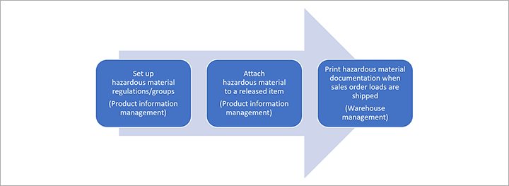

---
# required metadata

title: Hazardous materials overview
description: This topic provides an overview of features that are related to handling and documenting hazardous materials during product information management and warehouse management.
author: t-benebo
ms.date: 06/10/2020
ms.topic: overview
ms.prod: 
ms.technology: 

# optional metadata

# ms.search.form:  [Operations AOT form name to tie this topic to]
audience: Application User
# ms.devlang: 
ms.reviewer: kamaybac
# ms.tgt_pltfrm: 

ms.search.region: Global
# ms.search.industry: [leave blank for most, retail, public sector]
ms.author: benebotg
ms.search.validFrom: 2020-06-10
ms.dyn365.ops.version: 10.0.11
---

# Hazardous materials overview

[!include [banner](../includes/banner.md)]

To remain compliant with shipping and transport regulations, organizations that ship materials that are classified as dangerous goods must include additional paperwork with their shipments. The hazardous materials feature lets customers store information that is related to released items. This information can then be used to help prepare shipping documentation. An organization that ships dangerous goods must have its own processes and procedures for managing the shipping process. Microsoft Dynamics 365 Supply Chain Management is just a tool that can help generate the required documents.

The following diagram illustrates the steps needed to set up and use the hazardous materials feature.

The hazardous materials feature is set up in Product information management and provides documents that can be printed through Warehouse management. Therefore, broadly speaking, those areas are the two main areas where you will review, set up, and use this feature's functionality:

- **Product information management** – Set up the codes that will be applied to a released product.
- **Warehouse management** – Work with additional shipping documents that will be printed for shipments.

> [!IMPORTANT]
> The hazardous materials features in Supply Chain Management provide a collection of useful product information fields and related functionality that can help you record and reference information that is related to your hazardous products. These features can also help you design and print shipment documents that include some of the same information about any hazardous materials that you're shipping. However, the system won't automatically make you compliant with all applicable regulations in your country or region. Although these tools are intended to help you comply with common regulations, they are neither sufficient in themselves nor guaranteed to be so. Your organization is responsible for being aware of all applicable regulations and for taking all necessary steps to comply with them.

## Product information management

Product information management provides a range of setup tables where you can enter reference information for the various dangerous goods lists for road, air, and sea freight.

The following common regulations were referenced when this functionality was developed:

- **ADR** – Regulations that are related to the international carriage of dangerous goods by road
- **CFR 49** – Regulations in the United Sates for the carriage of dangerous goods
- **IMDG** – The International Marine Dangerous Goods (IMDG) code
- **IATA** – The International Air Transport Association (IATA) dangerous goods regulations

Each set of regulations provides standardized lists of dangerous goods and reference codes. Therefore, Supply Chain Management provides a reference table for the common codes on those lists. Each list also has some unique codes that you can define.

For more information about how to set up regulations and values for hazardous materials, and how to assign the values to relevant products, see the following topics:

- [Set up hazardous materials](hazmat-setup.md)
- [Hazardous materials in products, orders, shipments, and loads](hazmat-items.md)

## Warehouse management

When you prepare a shipment in Warehouse management, you will be able to print several new reports that use the information that you set up in Product information management. For more information about the available reports and how to use them, see [Hazardous materials inquiries and reports](hazmat-reports.md).

[!INCLUDE[footer-include](../../includes/footer-banner.md)]