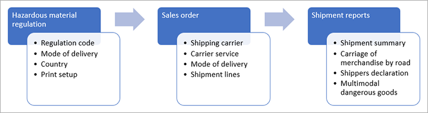

---
# required metadata

title: Hazardous materials inquiries and reports
description: This article explains how to work with the various reports that are related to hazardous materials. Many of these reports are required so that you remain compliant with various hazardous material regulations during shipping and storage.
author: t-benebo
ms.date: 06/10/2020
ms.topic: article
ms.prod: 
ms.technology: 

# optional metadata

# ms.search.form:  [Operations AOT form name to tie this article to]
audience: Application User
# ms.devlang: 
ms.reviewer: kamaybac
# ms.tgt_pltfrm: 
# ms.custom: [used by loc for articles migrated from the wiki]
ms.search.region: Global
# ms.search.industry: [leave blank for most, retail, public sector]
ms.author: benebotg
ms.search.validFrom: 2020-06-10
ms.dyn365.ops.version: 10.0.11
---

# Hazardous materials inquiries and reports

[!include [banner](../includes/banner.md)]

Microsoft Dynamics 365 Supply Chain Management provides various reports that are related to hazardous materials. Many of these reports are required so that you remain compliant with various hazardous material regulations during shipping and storage.

All these reports, except the **Multimodal dangerous goods** report, use the mode of delivery that is defined for the shipment to find the regulation that should be used to print the shipping text for items. The mode of delivery is associated with the shipping carrier and the carrier service. Therefore, you must set up a shipping carrier and carrier service, and link them to a mode of delivery. The mode of delivery is related to the hazardous materials regulation.

The following illustration shows the sequence of activities that occur when the system generates hazardous materials reports.

## Set up hazardous materials reporting

Usually, if you ship items that contain hazardous materials, you must generate specific reports to help preserve safety and comply with hazardous materials regulations. To set up your reports, follow these steps.

1. Go to **Warehouse management \> Setup \> Warehouse management parameters**.
2. Open the **Reports** tab. On the **Hazardous materials report parameter** FastTab, set the following fields.

    | Section | Field | Description |
    |---|---|---|
    | Multimodal Dangerous Goods | Regulation code | Select the regulation that should be used when a **Multimodal dangerous goods** report is generated. |
    | Hazardous Material stock limits | Regulation code | Select the regulation that should be used when stock limits are evaluated. |
    | Carriage of merchandise by road | CMR group product | CMR stands for "carcinogenic, mutagenic, and reprotoxic substances." Set this option to **Yes** to configure the system to print specific warnings and messages that are related to the handling of these substances. |
    | Carriage of merchandise by road | Hazardous material group description | Enter the text of specific warnings that are related to CMR and carriage of merchandise by road. This text will be included on the report. |
    | Shippers declaration | Warning | Enter the text of a warning message that should be printed on the shipper's declaration form (for example, "Warning: Dangerous Goods, Flammable"). |
    | Shippers declaration | Footer declaration | Enter the text of a message that should be printed at the bottom of the shipment declaration document. |
    | Hazardous goods report language | Hazardous goods domestic report language | Select the default language for hazardous materials reports that are associated with domestic shipments. |
    | Hazardous goods report language | Hazardous goods export report language | Select the default language for hazardous materials reports that are associated with international shipments. |

## Hazardous materials report

The **Hazardous materials** report shows a list of all items that have been set up and defined so that they have dangerous goods information. You can use this report to monitor and review the information that you must maintain. The page for the report shows a limited selection of fields from the hazardous material setup. However, you can personalize it to add additional fields as you require.

To view this report, go to **Product information management \> Inquiries and reports \> Hazardous material shipping documentation \> Hazardous materials**.

## Hazardous material stock limit report

The **Hazardous material stock limit** report lets you monitor the stock levels of the hazardous materials in your warehouse locations, to make sure that they remain under established, safe limits. These limits come from the limits that are defined for each released product.

To view this report, go to **Product information management \> Inquiries and reports \> Hazardous shipping documentation \> Hazardous material stock limits**.

For more information about how to set stock limits on a released product, see [Set stock limits for hazardous products](hazmat-items.md#stock-limits).

The regulation that is used for stock limits is defined on the **Warehouse management parameters** page. Go to **Warehouse management \> Setup \> Warehouse management parameters**, and then, on the **Reports** tab, in the **Hazardous materials stock limit**, specify a regulation code. For more information, see the [Set up hazardous materials reporting](#set-up) section earlier in this article.

## Verified gross mass report

The **Verified gross mass** report lets you print information about the weight of a shipment.

To generate and print this report, go to **Warehouse management \> Shipments \> All shipments**, and open the relevant shipment. Then, on the Action Pane, on the **Shipments** tab, in the **Hazardous materials document** group, select **Verified gross mass**.

## Multimodal dangerous goods report

The **Multimodal dangerous goods** report is provided for shipments that must be moved by using a combination of transport methods. It's typically used when a shipment is moved first by road and later by sea.

To generate and print this report, go to **Warehouse management \> Shipments \> All shipments**, and open the relevant shipment. Then, on the Action Pane, on the **Shipments** tab, in the **Hazardous materials document** group, select **Multi model dangerous goods**.

When you generate this report, the information is saved so that you can edit it and/or reprint the report if you must. To edit a generated report, go to **Warehouse management \> Enquiries and reports \> Hazardous materials shipping documentation \> Multimodal dangerous goods**, and find the relevant report in the list. After you've finished editing the content as you require, select **Print** on the Action Pane to print the report.

## Shippers declaration report

The **Shippers declaration** report lets you print information that is related to a declaration of the materials that are included in the shipment.

To generate and print this report, go to **Warehouse management \> Shipments \> All shipments**, and open the relevant shipment. Then, on the Action Pane, on the **Shipments** tab, in the **Hazardous materials document** group, select **Shippers declaration**.

## Carriage of merchandise by road report

The **Carriage of merchandise by road** report resembles a bill of lading but is typically used for road transportation in Europe under the Agreement concerning the International Carriage of Dangerous Goods by Road (ADR) regulations. This report uses the shipping print text for an item unless you set the **Hazardous material group description** field on the **Warehouse management parameters** page.

To generate and print this report, go to **Warehouse management \> Shipments \> All shipments**, and open the relevant shipment. Then, on the Action Pane, on the **Shipments** tab, in the **Hazardous materials document** group, select **Carriage of merchandise by road**.

When you generate this report, the information is saved so that you can edit it and/or reprint the report if you must. To edit a generated report, go to **Warehouse management \> Enquiries and reports \> Hazardous materials shipping documentation \> Carriage of merchandise by road**, and find the relevant report in the list. After you've finished editing the content as you require, select **Print** on the Action Pane to print the report.

## Shipment summary report

The **Shipment summary** report provides information that is summarized by the transport category that is related to the released items.

To generate and print this report, go to **Warehouse management \> Shipments \> All shipments**, and open the relevant shipment. Then, on the Action Pane, on the **Shipments** tab, in the **Hazardous materials document** group, select **Shipment summary**.

## bill of lading report

When the hazardous materials feature is turned on for your system, the **bill of lading** report includes a **Hazardous materials** column that indicates whether a load includes hazardous materials. This report is available from the **All loads** page, as usual.

## Packing list report

When the hazardous materials feature is turned on for your system, packing lists include additional information that is related to the shipping print text for an item. This report is available from the **All loads** page, as usual.

[!INCLUDE[footer-include](../../includes/footer-banner.md)]