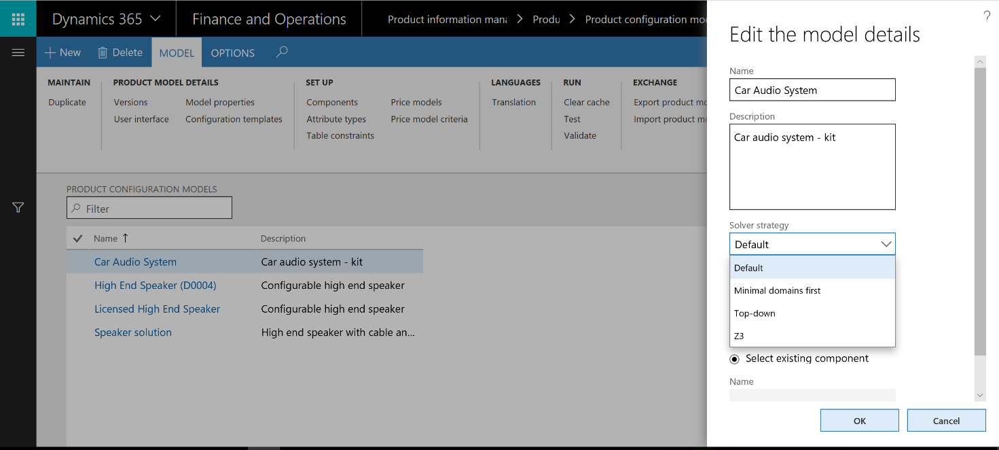

# Solver strategy for product configuration

[!include [banner](../includes/banner.md)]

This article describes how you can use the solver strategy to improve the performance of product configuration.

The concept of solver strategies was first introduced in Cumulative update 7 (CU7) for Microsoft Dynamics AX 2012 R2. It was extended in Cumulative update 8 (CU8) for Microsoft Dynamics AX 2012 R3 and finance and operations apps, Enterprise edition 7.3.

The solver strategy concept now consists of the following strategies:

- Default
- Minimal domains first
- Top-down
- Z3

## Solver strategy 

A product configuration model can be formulated as a [constraint satisfaction problem (CSP)](http://aima.cs.berkeley.edu/2nd-ed/newchap05.pdf). Microsoft Solver Foundation (MSF) provides two types of solver strategies to solve the CSPs that can be used from product configuration models. These solver strategies rely on [heuristics](https://techterms.com/definition/heuristic), which are used to determine the order that the variables of the CSPs are considered in when the problem is being solved. Heuristics can significantly affect performance when a problem or class of problems is being solved.

The solver strategy for product configuration models determines which solver is used with heuristics. The **Default**, **Minimal domains first**, and **Top-down** strategies use the two solvers from MSF, whereas the **Z3** strategy uses the Z3 solver. 

Real customer implementation studies have shown that a change in the solver strategy for a product configuration model can reduce the response time from minutes to milliseconds. Therefore, it's worth the effort to try different solver strategies to find the most efficient strategy for your product configuration model.

## Change the settings for the solver strategy

To change the solver strategy, on the **Product configuration models** page, on the Action Pane, select **Model properties**. Then, in the **Edit the model details** dialog box, select a solver strategy.

Currently, there is no logic that automatically detects which solver strategy will be the most efficient strategy for constraint-based product configuration. Therefore, you must try the solver strategies one by one.

The following table provides recommendations about the solver strategy to use in various scenarios.

| Solver strategy      | Use the strategy in this scenario |
|----------------------|-----------------------------------|
| Default              | The **Default** strategy has been optimized to solve models that rely on table constraints. Customer implementation studies have shown that this strategy is the most efficient strategy in scenarios where table constraints are used extensively. |
| Minimal domains first | The **Minimal domains first** and **Top-down** strategies are closely related. Customer implementation studies have shown that the **Top-down** strategy, outperforms the **Minimal domains first** strategy. However, the **Minimal domains first** strategy is kept in the product for backward compatibility. Both these solver strategies have been shown to be more efficient at solving models that contain several arithmetic expressions where no table constraints are used. However, in some cases, the **Default** strategy outperforms these two strategies. Therefore, remember to try each strategy. |
| Top-down             | The **Minimal domains first** and **Top-down** strategies are closely related. Customer implementation studies have shown that the **Top-down** strategy, outperforms the **Minimal domains first** strategy. However, the **Minimal domains first** strategy is kept in the product for backward compatibility. Both these solver strategies have been shown to be more efficient at solving models that contain several arithmetic expressions where no table constraints are used. However, in some cases, the **Default** strategy outperforms these two strategies. Therefore, remember to try each strategy. |
| Z3                   | We recommend that you use the **Z3** strategy as the default solver strategy. If you're concerned about performance and scalability, you can evaluate the other strategies. |

## Related information

[Product configuration overview](build-product-configuration-model.md)

[Heuristics](https://techterms.com/definition/heuristic)

[Constraint Satisfaction Problem](http://aima.cs.berkeley.edu/2nd-ed/newchap05.pdf)

[!INCLUDE[footer-include](../../includes/footer-banner.md)]
