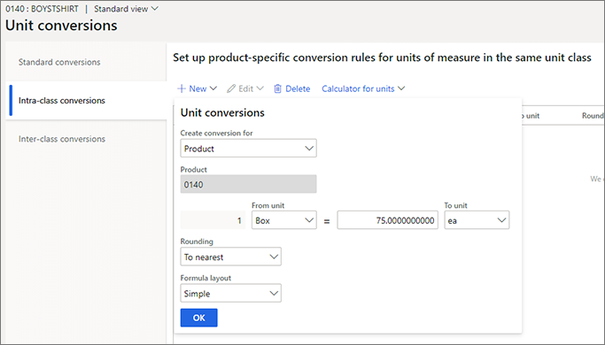

# Unit of measure conversion per product variant

[!include [banner](../includes/banner.md)]

This article explains how to set up unit of measure conversions for various product variants.

Instead of creating multiple individual products that must be maintained, you can use product variants to create variations of a single product. For example, a product variant might be a T-shirt of a given size and color.

Previously, unit conversions could be set up only on the product master. Therefore, all product variants had the same unit conversion rules. However, when the *Unit of measure conversions for product variants* feature is turned on, if your T-shirts are sold in boxes, and the number of T-shirts that can be packed in a box depends on the size of the T-shirts, you can now set up unit conversions between the different shirt sizes and the boxes that are used for packaging.

## Turn on the feature in your system

If you don't already see this feature in your system, go to [Feature management](../../fin-ops-core/fin-ops/get-started/feature-management/feature-management-overview.md), and turn on the *Unit of measure conversions for product variants* feature.

## Set up a product for unit conversion per variant

Product variants can be created only for products that are product masters. Learn more in [Create a product master](tasks/create-product-master.md). The *Unit of measure conversions for product variants* feature isn't available for products that are set up for catch-weight processes.

To configure a product master to support unit conversion per variant, follow these steps.

1. Go to **Product information management \> Products \> Product masters**.
1. Create or open a product master to go to its **Product details** page.
1. Set the **Enable unit of measure conversions** option to *Yes*.
1. On the Action Pane, on the **Product** tab, in the **Set up** group, select **Unit conversions**.
1. The **Unit conversions** page opens. Select one of the following tabs:

    - **Intra-class conversions** – Select this tab to convert between units that belong to the same unit class.
    - **Inter-class conversions** – Select this tab to convert between units that belong to different unit classes.

1. Select **New** to add a new unit conversion.
1. Set the **Create conversion for** field to one of the following values:

    - **Product** – If you select this value, you can set up a unit conversion for the product master. That unit conversion will be used as a fallback for all product variants that no unit conversion is defined for.
    - **Product variant** – If you select this value, you can set up a unit conversion for a specific product variant. Use the **Product variant** field to select the variant.

    

1. Use the other fields that are provided to set up your unit conversion.
1. Select **OK** to save the new unit conversion.

> [!TIP]
> You can open the **Unit conversions** page for a product or a product variant from any of the following pages:
> 
> - Product details
> - Released products details
> - Released product variants

## Example scenario

In this scenario, a company sells T-shirts in sizes small, medium, large, and extra-large. The T-shirt is defined as a product, and the different sizes are defined as variants of that product. The shirts are packed in boxes. For sizes small, medium, and large, there can be five shirts in each box. However, for size extra-large, there is space for only four shirts in each box.

The company wants to track the different variants in the *Pieces* unit, but it's selling them in the *Boxes* unit. For sizes small, medium, and large, the conversion between the inventory unit and the sales unit is 1 Box = 5 Pieces. For size extra-large, the conversion is 1 Box = 4 Pieces.

1. From the **Released product details** page for the **T-Shirt** product, open the **Unit conversions** page.
1. On the **Unit conversions** page, set up the following unit conversion for the **X-Large** released product variant.

    | Field                 | Setting                 |
    |-----------------------|-------------------------|
    | Create conversion for | Product variant         |
    | Product variant       | T-Shirt : : X-Large : : |
    | From unit             | Boxes                   |
    | Factor                | 4                       |
    | To Unit               | Pieces                  |

1. Because the **Small**, **Medium**, and **Large** product variants all have the same unit conversion between the *Box* and *Pieces* units, you can define the following unit conversion for them on the product master.

    | Field                 | Setting |
    |-----------------------|---------|
    | Create conversion for | Product |
    | Product               | T-Shirt |
    | From unit             | Boxes   |
    | Factor                | 5       |
    | To Unit               | Pieces  |

## Using Excel to update the unit conversions

If a product has many product variants that have different unit conversions, it's a good idea to export the unit conversions to a Microsoft Excel workbook, update them, and then publish them back to Dynamics 365 Supply Chain Management.

To export unit conversions to Excel, on the **Unit conversions** page, on the Action Pane, select **Open in Microsoft Office**.

## Related information

[Manage units of measure](tasks/manage-unit-measure.md)

[!INCLUDE[footer-include](../../includes/footer-banner.md)]