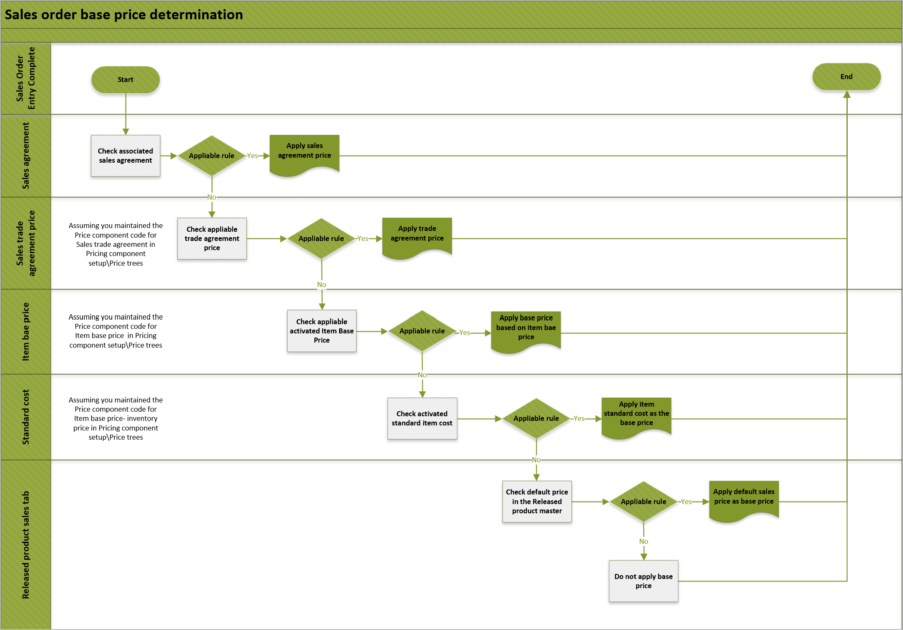

# Sales order base price determination rules

[!include [banner](../includes/banner.md)]
[!include [preview banner](../includes/preview-banner.md)]
<!-- KFM: Preview until further notice -->

This article describes the price determination rules for calculating the sales order base price.

| Terms | Definition, usage, and notes | Price component type |
|---|---|---|
| Unit price | The price that's calculated for each unit in a sales order. It's calculated by using the following formula: *Unit price* = *Base price* &plusmn; *Margin component price adjustments*. | |
| Base price | 
The basis for price adjustments. It's intended for all customers and is the standard rate for general purposes.
<ul><li>If there's an applicable sales trade agreement price, the base price is the *sales trade agreement price*.</li><li>If there's no applicable sales trade agreement price, the base price is the *item base price*.</li></ul> | |
| Sales trade agreement price | 
The price that reflects a negotiated pricing strategy for a collection of customers and a group of specific products. You can configure the system so that it uses one of the following formulas to calculate the unit price based on the sales trade agreement price:
<ul><li>*Unit price* = *Sales trade agreement price* (if no margin component price adjustment applies)</li><li>*Unit price* = *Sales trade agreement price* &plusmn; *Margin component price adjustments*</li></ul> | Sales trade agreement |
| Item base price | The **Item base price** page lets you set prices for each item by using either calculated values or manually entered values. Calculated prices use the following formula: *Item base price* = *Vendor list price* &plusmn; *Vendor term agreements*. | 
Any of the following:
<ul><li>Base price - purchase price</li><li>Base price - inventory price</li><li>Base price - sales price</li></ul> |
| Standard cost | The cost version of an item that's calculated by using the standard cost model. | Base price - inventory price |
| Margin component price adjustments | You can set up layers of margin components to adjust the base price up (positive) or down (negative). Margin component price adjustments have a calculation sequence and can be compounded to get the total adjustment price. | Margin component |
| Sales agreement | Although the **Pricing management** module respects [sales agreement rules](../sales-marketing/sales-agreements.md), the sales agreement feature isn't otherwise integrated with the **Pricing management** module. | |

The following flow chart shows the sales order base price determination rules.

## Next steps

- [Base price versions](base-price-versions.md)
- [Sales trade agreement prices](sales-trade-agreement-prices.md)
