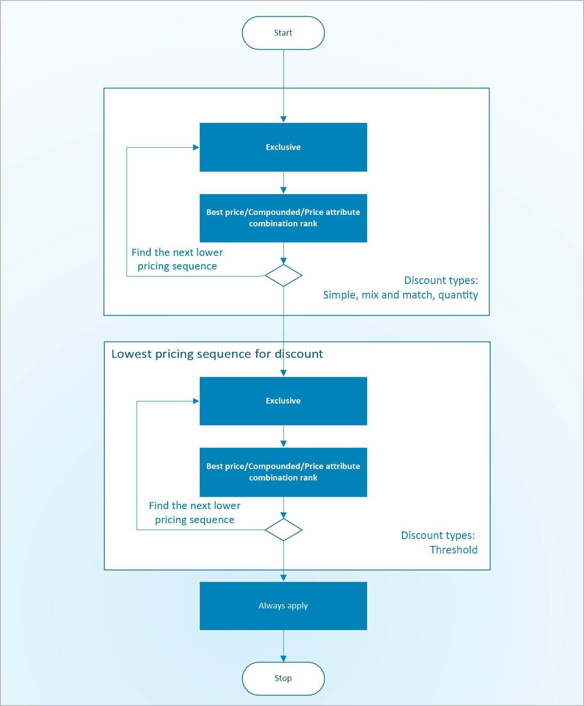

# Resolve concurrency within price component codes

[!include [banner](../includes/banner.md)]
[!include [preview banner](../includes/preview-banner.md)]
<!-- KFM: Preview until further notice -->

Concurrency rules let you define what happens if multiple pricing rules apply to the same order and/or order line. You can set up concurrency rules to control whether the customer receives just one of the matching rules (and if so, which one they receive), or whether the rules are combined (and if so, how they're combined). There are two types of concurrency:

- **Across-price-component-code concurrency** – This type of concurrency controls how the different [price component codes](price-component-code.md) that are included in a [price structure](price-structure-overview.md) combine with each other. A price structure defines a collection of different types of price component codes (including base price, sales agreement price, margin components, discounts, and/or charges), the order that the codes are calculated in, and the way that the price adjustments are calculated and combined to determine the final price.
- **Within-price-component-code concurrency** – Any number of [pricing rules](margin-discount-pricing-rules.md) can be associated with each price component code that's included in a price structure. This principle is especially true of discounts. This type of concurrency occurs when an order or order line qualifies for more than one pricing rule that's associated with the same component code. For example, if you define a price component code that's named *Seasonal promotion events*, and you associate multiple discount rules with it, multiple pricing rules might apply to the same order line. Therefore, in the *Seasonal promotion events* price component code, you'll set up concurrency rules to control whether the customer receives just one of the matching discounts (and if so, which one they receive), or whether the discounts are combined (and if so, how they're combined).

This article explains how to manage *within-price-component-code concurrency*. For information about how to manage *across-price-component-code concurrency*, see [Resolve concurrency across price component codes](concurrence-cross-codes.md).

## Types of within-price-component-code concurrency modes

The following types of within-price-component-code concurrency modes are available, depending on the type of price component code:

- **Exclusive** – The pricing rule can't be combined with other rules that are associated with the same price component code. If more than one of these rules are set up as exclusive, the price engine applies the rule that has the largest discount.
- **Best price** – Pricing rules that use this concurrency mode will compete for the largest discount (lowest price).
- **Compounded** – All applicable pricing rules are combined. On the **Pricing management parameters** page, you can configure the system so that each calculation is based on either the original price or a running total of all adjustments so far. For more information, see the [System settings for resolving discount concurrency within a price component code](#parameters) section of this article.
- **Always apply** – The pricing rule always applies. This calculation is always applied last within a price component code.
- **Price attribute combination rank** – Pricing rules that use this concurrency mode don't compete for prices. Instead, they compete based on which rule has the highest *price attribute combination rank*. If multiple rules have the same highest rank in the same price component code, they're combined.

## Configure within-price-component-code concurrency modes

You can view and/or set within-price-component-code concurrency modes in several places in the system:

- **Price component code level** – Each relevant price component code has a default within-price-component-code concurrency setting. The available modes vary, based on the type of price component code. This setting can be overwritten in any or all pricing rules as required. For more information, see [Price component codes](price-component-code.md).
- **Price structure level** – Each price component code that's included in a price structure shows its default concurrency mode, but you can't edit it here. For more information, see [Arrange price component codes into a price structure](price-structure-details.md).
- **Pricing rule level for discounts and margin price adjustments** – The concurrency mode that's assigned to a pricing rule overrides the default mode that's assigned by its associated price component code. For more information, see [Pricing rules for discounts and margin price adjustments](margin-discount-pricing-rules.md).
- **Company level for sales trade agreements** – Sales trade agreements are set up by using trade agreement journals, where the pricing rules are defined by the related journal lines. Concurrency rules for sales trade agreements are defined on the **Pricing management parameters** page for each company. For information about the options that are available and how to use them, see [Sales trade agreement prices](sales-trade-agreement-prices.md).

## System settings for resolving discount concurrency within a price component code

A few settings on the **Pricing management parameters** page affect the way that concurrent discounts are calculated. The calculation method can, in turn, affect the way that some of your price structure settings work as they apply to discounts. Follow these steps to set up the calculation.

1. Go to **Pricing management \> Setup \> Pricing management parameters**.
1. On the **Prices and discounts** tab, on the **Discount concurrency control** FastTab, under **Best price and compound concurrency control model**, select one of the following options:

    - *Best price and compound within priority, never compound across priorities*
    - *Best price only within priority, always compound across priorities*
    - *Best price and compound within priority, best price and compound across priority*

1. Under **Discount compound behavior**, select one of the following options:

    - *Compound*
    - *Compound on the original price*

1. Set the **Enable competition between exclusive threshold and other periodic discounts** option to *Yes* if exclusive threshold discounts should compete with exclusive non-threshold discounts, but priority should still apply. The behavior of best-price and compounded threshold discounts will remain unchanged (that is, they won't compete with the non-threshold discounts).

## Discount determination flow

The following flow chart shows how pricing rules, the price structure, and concurrency models work together to resolve within-price-component-code concurrency.

## Example

Here's an example that shows how concurrency determination works.

Item *BT023* has an item price of *$1,565.00*, the concurrency mode is *Compounded*, and your system includes the discount pricing rules that are shown in the following table. The pricing sequence comes from your price structure.

| Price component code | Pricing sequence | Pricing rule ID | Concurrency mode | Calculation method | Value | Discount type |
|---|---|---|---|---|---|---|
| DIS 01 | 30 | DIS01-01 | Best price | Percentage | 10 | Simple |
| DIS 01 | 30 | DIS01-02 | Always apply | Percentage | 5 | Simple |
| DIS 02 | 40 | DIS02-01 | Compounded | Percentage | 10 | Simple |
| DIS 02 | 40 | DIS02-02 | Always apply | Percentage | 8 | Simple |
| DIS 03 | 50 | DIS03-01 | Compounded | Amount | 20 | Threshold |
| DIS 03 | 50 | DIS03-02 | Always apply | Amount | 10 | Threshold |

An order is placed for a quantity of *1* of item *BT023*. Therefore, the system applies the rules in the previous table to calculate the discount that's shown in the following table. The result is a final price of $1,080.45.

| Concurrency mode | Pricing sequence | Discount price component code | Pricing rule ID | Calculation method | Value | Discount amount | New unit price |
|---|---|---|---|---|---|---|---|
| Best price | 30 | DIS01 | DIS01-01 | Percentage | 10 | 156.50 | 1,408.50 |
| Compounded | 40 | DIS02 | DIS02-01 | Percentage | 10 | 140.85 | 1,267.65 |
| Threshold | 50 | DIS03 | DIS03-01 | Percentage | 20 | 20.00 | 1,247.65 |
| Always apply | 30 | DIS01 | DIS01-02 | Percentage | 5 | 62.38 | 1,185.27 |
| Always apply | 40 | DIS02 | DIS02-02 | Amount | 8 | 94.82 | 1,090.45 |
| Always apply | 50 | DIS 03 | DIS03-02 | Amount | 10 | 10.00 | 1,080.45 |
