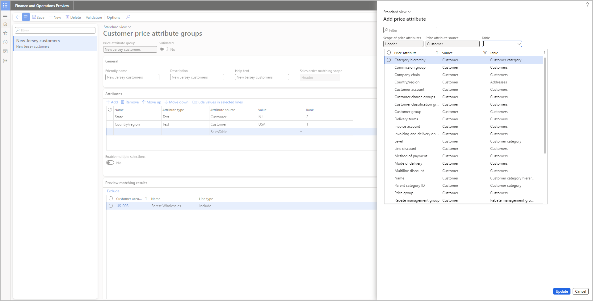
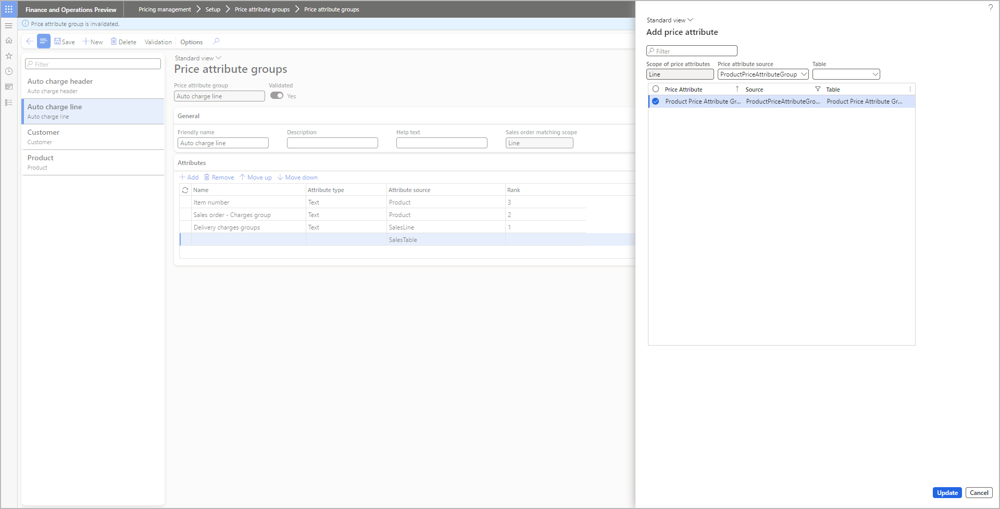

# Customer and product price attribute groups

[!include [banner](../includes/banner.md)]
[!include [preview banner](../includes/preview-banner.md)]
<!-- KFM: Preview until further notice -->

*Customer price attribute groups* and *product price attribute groups* let you create logic to define groups of customers and products, respectively. The membership of each group is based on the values of attributes that you assign to that group. These groups can make it easier to set up collections of customers and products that you can target in your pricing rules.

## Usage examples

The following examples show how you can simplify your [price attribute groups](price-attribute-groups.md) and pricing rules by setting up a customer price attribute group. Although these examples are focused on customer price attribute groups, product price attribute groups work in a similar way (but define groups of products instead of groups of prices).

The more often you have to use a given customer price attribute group in your price attribute groups and pricing rules, the more useful that group will be.

### Customer segment for the examples

For these examples, you often target a customer segment that consists of American female wholesale and retail customers aged 20–45. The following table shows the attribute values that you can use to define this segment.

| Price attribute | Value |
|---|---|
| Gender | Woman |
| Customer group | 30, 10 |
| Customer age range | 20-45 |
| Country/region | USA |

### Example 1: Price attribute group that doesn't use a customer price attribute group

To set up price attribute groups that can target the preceding segment without using a customer price attribute group, you must ensure that each of your price attribute groups includes all four attributes. Each pricing rule that's designed to address that segment must specify all four values, plus any additional values.

### Example 2: Price attribute group that uses a customer price attribute group

If you want to simplify the price attribute groups and pricing rules that you use to target the segment, you can create a customer price attribute group that has the name and attribute values that are shown in the following table.

<table>
<thead>
  <tr>
    <th>Customer attribute group</th>
    <th>Attribute</th>
    <th>Value</th>
    <th>Rank</th>
  </tr>
</thead>
<tbody>
  <tr>
    <td rowspan="4">US-F-20-45-RE&WH</td>
    <td>Gender</td>
    <td>Girls, Women</td>
    <td>4</td>
  </tr>
  <tr>
    <td>Customer group</td>
    <td>10, 30</td>
    <td>3</td>
  </tr>
  <tr>
    <td>Customer age range</td>
    <td>20-45</td>
    <td>2</td>
  </tr>
  <tr>
    <td>Country/region</td>
    <td>USA</td>
    <td>1</td>
  </tr>
</tbody>
</table>

Each price attribute group can now include just the *Customer Price Attribute Group* attribute, plus whatever other attributes are required for each individual group. The related pricing rules can just specify that a price applies when **Customer Price Attribute Group** = *US-F-20-45-RE&WH*.

## Manage customer and product price attribute groups

To add, edit, or delete a price attribute group, follow these steps.

1. Follow one of these steps, depending on the type of group that you want to create:

    - Go to **Pricing management \> Setup \> Price attribute groups \> Customer price attribute groups**.
    - Go to **Pricing management \> Setup \> Price attribute groups \> Product price attribute groups**.

1. Follow one of these steps:

    - To create a new group, select **New** on the Action Pane.
    - To edit an existing group, select it in the list pane, and then select **Edit** on the Action Pane.
    - To delete an existing group, select it in the list pane, and then select **Delete** on the Action Pane.

1. On the header of the new or selected group, review the settings of the following fields, and edit them as required:

    - **Price attribute group** – If you're creating a new group, enter a unique name for the group. This field becomes read-only after you save the group.
    - **Validated** – This option indicates whether the group has been validated. Only validated groups are active and can be used in pricing rules. You can't edit this option directly. When you create a new group or edit a previously validated group, this option is set to *No*. To validate a new or edited group, you must select **Validation** on the Action Pane to trigger a validation check. If the check passes, the system sets this option to *Yes*.

1. On the **General** FastTab, set the following fields:

    - **Friendly name** – Enter a descriptive or common name for the group. For new groups, the value initially matches the value that you entered in the **Price attribute group** field, but you can change it.
    - **Description** – Enter a short description of the group.
    - **Help text** – Enter help text that will be shown to describe the group on other pages of Microsoft Dynamics 365 Supply Chain Management.
    - **Sales order matching scope** – This read-only field indicates whether the group applies to the overall order header values or to individual order line values. If you're creating a customer price attribute group, the value is always *Header*. If you're creating a product price attribute group, the value is always *Line*. For more information about order matching scopes, see [Price attribute groups](price-attribute-groups.md).

1. On the Action Pane, select **Save**.
1. On the **Attributes** FastTab, review  the attributes that belong to the group, and edit them as required. Use the following toolbar buttons to work with the list:

    - **Add** – Open the **Add price attribute** dialog box, where you can add one or more attributes to the list. This dialog box shows attributes that match the selected group type (product or customer) and provides filtering controls to help you find the attributes that you're looking for. Select the checkbox for each attribute that you want to add, and then select **Update** to add those attributes to the group.

        

    - **Remove** – Remove a selected attribute from the list.
    - **Move up** and **Move down** – Move a selected attribute up or down in rank.

1. For each row on the **Attributes** FastTab, enter or select one or more values in the **Value** column. All customers or products that match the specified attribute values will become a member of the current group. The following rules apply:

    - All rows are combined by using a logical AND operator. Therefore, only those companies or products that have matching values for *all* rows will be included in the group.
    - If you want to create one or more rows that include multiple values, set the **Enable multiple selections** option to *Yes*. You can then add a comma-separated list of values in the **Values** column for each row. These values are combined by using an OR operator. Therefore, the row will find products or customers that have *any* of the values in the list.
    - You can specify values to exclude by adding an exclamation mark (\!) before the value. This exclamation mark is known as an exclusion prefix. For example, to find all companies that are located outside the United States, set the value of the **Country/region** attribute to *\!USA*. You can automatically add the exclusion prefix to the values of any row by selecting the row and then selecting **Exclude values in selected lines** on the FastTab toolbar.

1. As you set up attributes and values on the **Attributes** FastTab, the **Preview matching results** FastTab is updated to show the resulting group members. Therefore, you can verify that your settings are giving you the result that you expect.

    - If the list includes any rows that you want to exclude, select the target rows, and select **Exclude** on the toolbar.
    - The **Line type** column indicates which rows you've selected to exclude.
    - To re-include a previously excluded row, select it, and then select **Include** on the toolbar.
    - If you're working with a product group, to view, exclude, and/or re-include specific item variants, select **All variants** on the toolbar. While you're viewing the variants, you can select **Product master** on the toolbar to go back to the standard item list.

1. When you've finished adding and arranging attributes, select **Validation** on the Action Pane to trigger a validation check. If the check passes, the system sets the **Validated** option to *Yes*. This setting indicates that the price attribute group is activated and can be used in pricing rules.

## Use customer and product price attribute groups in price attribute groups

To use a customer or product price attribute group in a price attribute group, add the group as an attribute. You add these attributes just as you add other types of attributes.

*Customer* price attribute groups can be used only in price attribute groups where the **Sales order matching scope** field is set to *Header*. *Product* price attribute groups can be used only in price attribute groups where the **Sales order matching scope** field is set to *Line*.

You can use the **Price attribute source** filter in the **Add price attribute** dialog box to quickly find the value, as summarized in the following table.

| Price attribute group scope | Attribute name | Source | Table |
|---|---|---|---|
| Header | Customer Price Attribute Group | CustomerPriceAttributeGroup | Customer Price Attribute Group |
| Line | Product Price Attribute Group | ProductPriceAttributeGroup | Product Price Attribute Group |

For more information about how to set up price attribute groups, see [Price attribute groups](price-attribute-groups.md).
