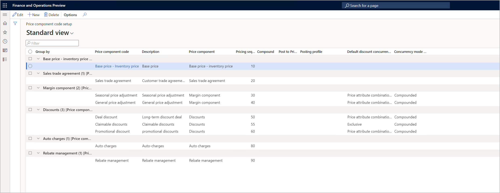

# Margin price adjustments

[!include [banner](../includes/banner.md)]
[!include [preview banner](../includes/preview-banner.md)]
<!-- KFM: Preview until further notice -->

This article describes how to set up and use margin price adjustments.

Pricing management enables you to use *margin price adjustments* to move item prices up or down from the base price. You can set this up by including one or price component codes of type *Margin component price adjustment* in your price structures. Across price component codes, price adjustment are compounded and add up to the total price adjustment.

In scenarios where you build your selling price based on the inventory standard cost or purchased price, it represents the layers of the margin components that add up to those base price. <!-- KFM: This isn't clear. Please revise. -->

Margin component price adjustments can be associated with many different types of agreements, promotions, and events. They make it easy for you to adjust price without changing the base price.

To use margin component price adjustments you must make the following configurations:

- Create one or more [price component codes](price-component-code.md) to set up various types of margin price adjustments that you can include in your price structures.
- Create one or more [price structures](price-structure-overview.md) to establish how your margin price adjustments combine with other price elements (such as base price and discounts) to find the final unit price.
- Set up one or more [margin price adjustment pricing rules](margin-discount-pricing-rules.md) to configure the margin price adjustments you need, which customers and items they apply to, and how they are calculated. You'll associate each price adjustment with a specific price component code and then define the details of the calculation.

For details about how to create pricing rules for each margin price adjustment (and discount), see [Pricing rules for discounts and margin price adjustments](margin-discount-pricing-rules.md).

For example, the following screenshot shows a price structure that contains two sequential margin component price adjustments (*General price adjustments* and *Seasonal price adjustments*).

