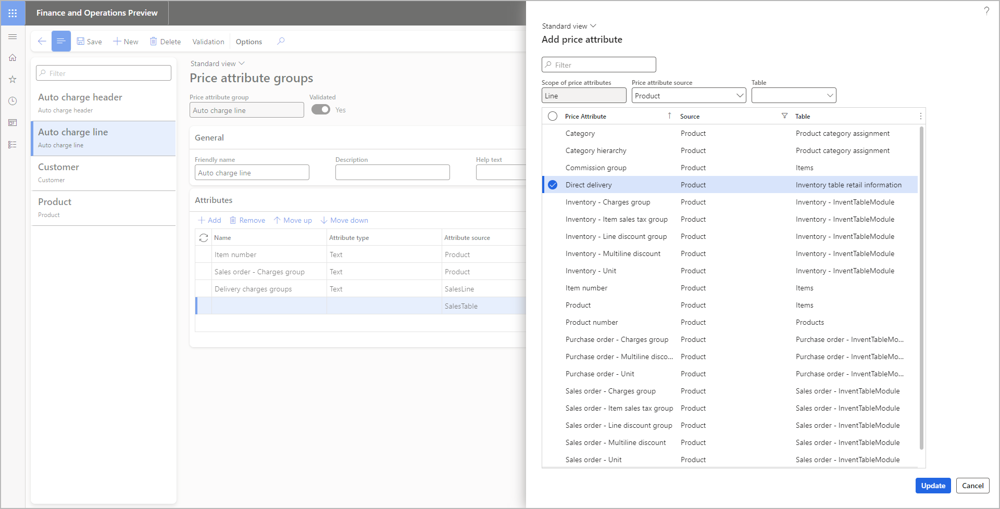
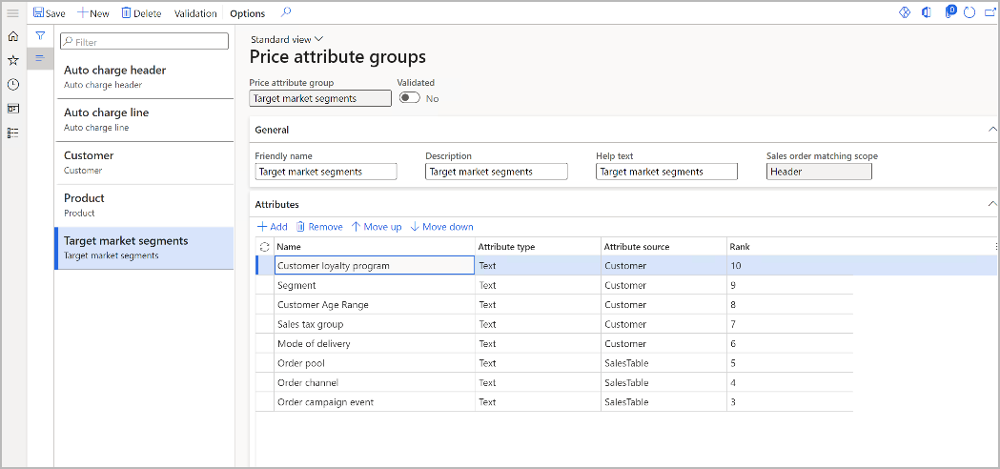

# Price attribute groups

[!include [banner](../includes/banner.md)]
[!include [preview banner](../includes/preview-banner.md)]
<!-- KFM: Preview until further notice -->

Each *price attribute group* establishes a collection of price attributes. When you define a pricing rule, you can select a price attribute group and then specify values for each of the associated attributes. In this way, you define the match criteria that are used to select the sales orders and order lines that the rule applies to. This article explains how to configure price attribute groups for the **Pricing management** module.

## Price attribute scopes

There are two scopes for price attribute groups: *header* and *line*.

- **Header scope** – These attributes are found on *sales order headers*. They describe the overall sales order. Examples include the sold-to customer and the invoice account.
- **Line scope** – These attributes are found on *sales order lines*. They describe each individual order line. Examples include the product ID, the quantity, and delivery details.

When you build a pricing rule, you can combine one header price attribute group and one line price attribute group to set up your condition.

<table>
<thead>
<tr>
<th>Attribute group</th>
<th>Source</th>
<th>Source table</th>
<th>Price attributes</th>
</tr>
</thead>
<tbody>
<tr>
<td rowspan="4">Header attribute group</td>
<td rowspan="2">Order (header)</td>
<td>Order table</td>
<td>The attributes provide out-of-box fields from the order header. You can extend them to add more fields.</td>
</tr>
<tr>
<td>
Order attributes

Attributes of the attribute group that are defined as the order attribute group in parameters
</td>
<td>Configurable</td>
</tr>
<tr>
<td rowspan="2">Customer</td>
<td>Customer master</td>
<td>The attributes provide out-of-box fields from customer masters. You can extend them to add more fields.</td>
</tr>
<tr>
<td>Attributes of the customer attribute group that are defined as the customer attribute group in parameters</td>
<td>Configurable</td>
</tr>
<tr>
<td rowspan="3">Line attribute group</td>
<td rowspan="2">Product</td>
<td>
Product master

Released product master
</td>
<td>The attributes provide out-of-box fields from product masters. You can extend them to add more fields.</td>
</tr>
<tr>
<td>Associated product attributes that are defined as price attributes and assigned to a product</td>
<td>Configurable</td>
</tr>
<tr>
<td>Order (line)</td>
<td>Order line</td>
<td>The attributes provide out-of-box fields from the order line. You can extend them to add more fields.</td>
</tr>
</tbody>
</table>

## Manage price attribute groups

To add, edit, or delete a price attribute group, follow these steps.

1. Go to **Pricing management \> Setup \> Price attribute groups \> Price attribute groups**.
1. Follow one of these steps:

    - To create a new group, select **New** on the Action Pane.
    - To edit an existing group, select it in the list pane, and then select **Edit** on the Action Pane.
    - To delete an existing group, select it in the list pane, and then select **Delete** on the Action Pane.

1. On the header of the new or selected group, review the settings of the following fields, and edit them as required:

    - **Price attribute group** – If you're creating a new group, enter a unique name for the group. This field becomes read-only after you save the group.
    - **Validated** – This option indicates whether the group has been validated. Only validated groups are active and can be used in pricing rules. You can't edit this option directly. When you create a new group or edit a previously validated group, this option is set to *No*. To validate a new or edited group, you must select **Validation** on the Action Pane to trigger a validation check. If the check passes, the system sets this option to *Yes*.

1. On the **General** FastTab, set the following fields:

    - **Friendly name** – Enter a descriptive or common name for the group. For new groups, the value initially matches the value that you entered in the **Price attribute group** field, but you can change it.
    - **Description** – Enter a short description of the group.
    - **Help text** – Enter help text that will be shown to describe the group on other pages of Microsoft Dynamics 365 Supply Chain Management.
    - **Sales order matching scope** – If you're creating a new group, select the [scope](#scopes) (*Header* or *Line*) where this group will apply. This field becomes read-only after you save the group.

1. On the Action Pane, select **Save**.
1. On the **Attributes** FastTab, review the attributes that belong to the group, and edit them as required. Use the following toolbar buttons to work with the list:

    - **Add** – Open the **Add price attribute** dialog box, where you can add one or more attributes to the list. This dialog box shows attributes that match the selected scope and provides filtering controls to help you find the attributes that you're looking for. Select the checkbox for each attribute that you want to add, and then select **Update** to add those attributes to the group.

        

    - **Remove** – Remove a selected attribute from the list.
    - **Move up** and **Move down** – Move a selected attribute up or down in rank. For more information about how to use these buttons, see the next section.

    > [!NOTE]
    > You can define groups of products or customers, and then add attributes here that will let you specify those groups by name in your pricing rules. For information about how to create and use those groups, see [Customer and product price attribute groups](customer-product-attribute-groups.md).

1. When you've finished adding and arranging attributes, select **Validation** on the Action Pane to trigger a validation check. If the check passes, the system sets the **Validated** option to *Yes*. This setting indicates that the price attribute group is activated and can be used in pricing rules.

## Price attribute ranks

A rank is assigned to each attribute in a price attribute group. The rank determines which rule applies if multiple pricing rules match for a given sales order. In this scenario, only the pricing rule that specifies a value for the highest-ranked attribute will apply.

For example, a price attribute group includes the following two attributes:

- **Price attribute 1:**

    - **Name** = *Customer loyalty program*
    - **Rank** = *10*

- **Price attribute 2:**

    - **Name** = *Segment*
    - **Rank** = *9*

The following two pricing rules use this price attribute group:

- **Pricing rule 1:** If **Customer loyalty program** = *Platinum* and **Segment** = blank (any segment), **Price** = *$100*.
- **Pricing rule 2:** If **Customer loyalty program** = blank (any loyalty program) and **Segment** = *20*, **Price** = *$150*.

Provided that no other pricing rules apply, the price will be $100, because that price is associated with a specific loyalty program, and the **Customer loyalty program** attribute has a higher rank than the **Segment** attribute.
