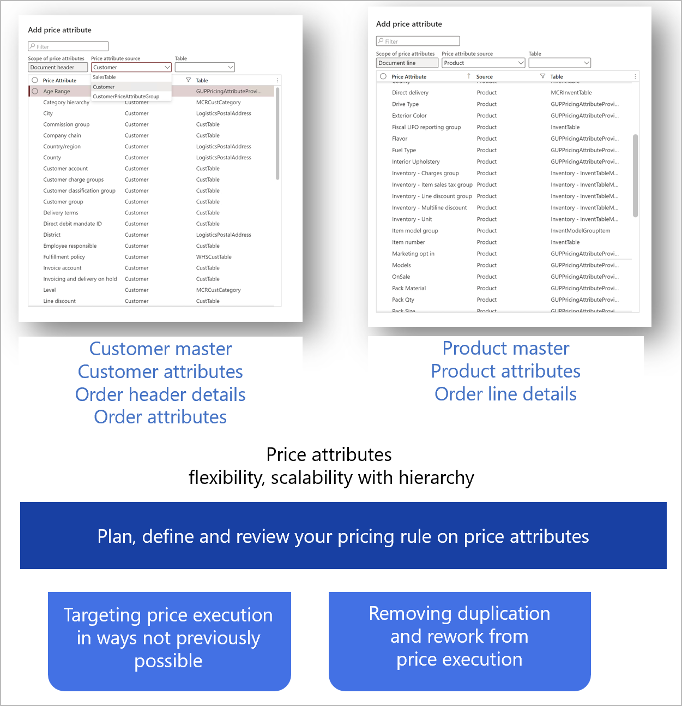

# Price attributes overview

[!include [banner](../includes/banner.md)]
[!include [preview banner](../includes/preview-banner.md)]
<!-- KFM: Preview until further notice -->

One of the key functions of a price manager is to work together with the product manager to accomplish the following tasks:

- Identify and classify products, customers, and order modes (for example, by region, pack size, brand, or age) to reflect each product's differentiating features, customer segments, and price sensitivity.
- Set up pricing rules that consider any combination of the customer, product, and order attributes to set up a flexible pricing architecture.

The **Pricing management** module provides *price attributes*. These attributes let price managers and sales promotion managers mark and group price differentiators that are defined for *products*, *customers*, and *sales order information*, and set up the pricing rules. Here are some examples of pricing rules:

- Sales trade agreement prices
- Margin component price adjustments
- Sales discounts
- Customer rebates on sales

You define these pricing rules by using combinations of price attributes to define the rule criteria.

## Price attribute sources

Microsoft Dynamics 365 Supply Chain Management can maintain prices based on price groups, discount groups, product categories, product variants, storage dimensions, and tracking dimensions. These pricing factors are fixed, and can't be extended or changed to accommodate additional pricing criteria. Examples of possible product-based pricing variables include product types, brands, flavors, pack types, and pack sizes.

Customer groups don't always provide enough control over the setup of customer-based pricing. Therefore, customer-based pricing variables can also include customer area, payment method, payment terms, and loyalty program membership.

Other sales order details (such as the ordering channel, ordering site, ordering campaign, and mode of delivery) can also include pricing conditions.

Pricing management offers three price attribute sources that can serve as a foundation for the setup of pricing rules and conditions. For each source, it also provides out-of-box price attributes. You can build price attribute groups (header or line scope) and combine them to create price attribute combinations.

<table>
<thead>
<tr>
<th>Attribute group</th>
<th>Source</th>
<th>Source table</th>
<th>Price attributes</th>
</tr>
</thead>
<tbody>
<tr>
<td rowspan="4">Header attribute group</td>
<td rowspan="2">Order (header)</td>
<td>Order table</td>
<td>The attributes provide out-of-box fields from the order header. You can extend them to add more fields.</td>
</tr>
<tr>
<td>
Order attributes

Attributes of the attribute group that are defined as the order attribute group in parameters
</td>
<td>Configurable</td>
</tr>
<tr>
<td rowspan="2">Customer</td>
<td>Customer master</td>
<td>The attributes provide out-of-box fields from customer masters. You can extend them to add more fields.</td>
</tr>
<tr>
<td>Attributes of the customer attribute group that are defined as the customer attribute group in parameters</td>
<td>Configurable</td>
</tr>
<tr>
<td rowspan="3">Line attribute group</td>
<td rowspan="2">Product</td>
<td>
Product master

Released product master
</td>
<td>The attributes provide out-of-box fields from product masters. You can extend them to add more fields.</td>
</tr>
<tr>
<td>Associated product attributes that are defined as price attributes and assigned to a product</td>
<td>Configurable</td>
</tr>
<tr>
<td>Order (line)</td>
<td>Order line</td>
<td>The attributes provide out-of-box fields from the order line. You can extend them to add more fields.</td>
</tr>
</tbody>
</table>

Each pricing rule allows for the combination of one header attribute group and one line attribute group.

> [!NOTE]
> The number of attributes can affect the performance of the pricing engine. For pricing rule data entities (such as sales trade agreement prices, discounts, and rebates), up to 14 price attributes can be imported into Pricing management. Each pricing rule allows for the combination of one header attribute group (which can have up to seven header price attributes) and one line attribute group (which can have up to seven line price attributes).

## Next steps

- [Price attributes for products, customers, and orders](price-attributes-setup.md)
