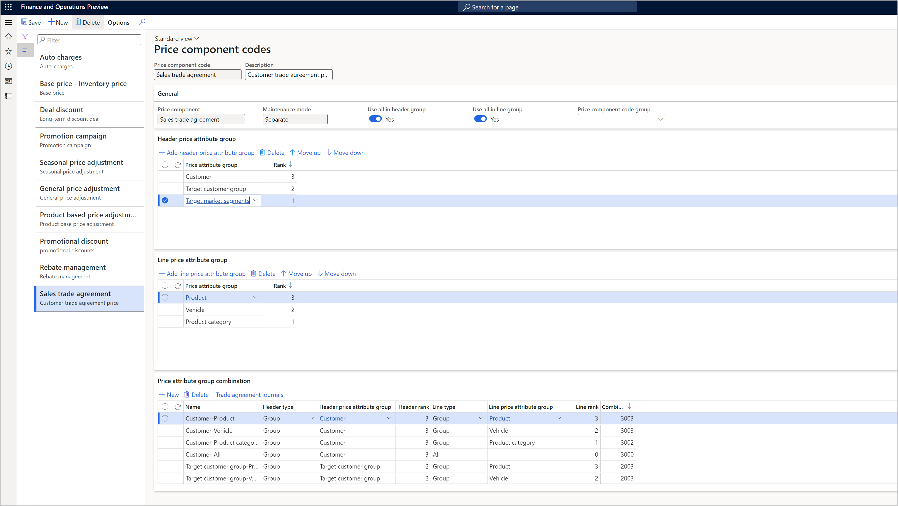

# Price component codes

[!include [banner](../includes/banner.md)]
[!include [preview banner](../includes/preview-banner.md)]
<!-- KFM: Preview until further notice -->

The purpose of making pricing decisions is to increase profitability. Good decision making demands a thorough understanding of the different elements that are involved in determining the price. By providing a list of pricing building blocks, Pricing management lets you create a price structure (price tree) for pricing at the macro level. The price component code is the basic unit of the price structure.

The following two methods are available for building the price structure:

- **Price component code setup** – This method provides a single, uniform price structure for each company.
- **Price trees** – This method enables multiple price structures that are based on order attribute values for each company.

You must use *either* the price component code setup (a single price tree) *or* multiple price trees. You'll make this decision based on the complexity of your price structure.

| Name | Description |
|---|---|
| Price components | 
*Price components* are the main price elements of the price structure. Here are some examples:
<ul><li>Price:<ul><li>Base price</li><li>Sales trade agreement price</li><li>Margin component</li></ul></li><li>Discounts</li><li>Rebate management</li><li>Auto charges</li></ul> |
| Price component codes | 
*Price component codes* are defined and structured based on the function and business use of your pricing elements.
<ul><li>Price component codes can be built according to the price sequence.</li><li>Price component codes can define default values for posting and the discount concurrency mode.</li><li>Each pricing and discount record is assigned to a specific price component code.</li></ul> |
| Price component groups | Price component codes can be grouped into *price component groups*. |
| Price attribute groups | Each *price attribute group* contains several price attributes. Each price component code can have one *header price attribute group* and one *line price attribute group*. Use these groups to define pricing rules based on attribute values that are defined in *pricing component codes*. |
| Combination rank | The *combination rank* for a price attribute group lets you define what occurs if multiple rules from the same price component code apply to a given order. If the concurrency mode is based on the *price attribute combination rank*, the rule that has highest rank will apply. |

> [!NOTE]
> You can have a maximum of one price component code record for each of the following price components:
>
> - Base price - inventory price
> - Base price - purchase price
> - Base price - sales price
> - Sales trade agreement
>
> You can have any number price component code records for each of the remaining price components.

Within each price component code, you can define multiple pricing rule records that have different combinations of price attribute groups.

## Set up price component codes

Follow these steps to set up your price component codes.

1. Go to **Pricing management \> Setup \> Price component codes \> Price component codes**.

    

1. Follow one of these steps:

    - To create a new price component code, select **New** on the Action Pane.
    - To edit an existing price component code, select it in the list pane, and then select **Edit** on the Action Pane.
    - To delete an existing price component code, select it in the list pane, and then select **Delete** on the Action Pane.

1. On the header of the new or selected price component code, set the following fields:

    - **Price component code** – Enter a name for the code. You can edit this field only for new records. (It becomes read-only when you save the record.)
    - **Description** – Enter more details that are related to the price component code that you're creating.

1. On the **General** FastTab, set the following fields:

    - **Price component** – Select the type of price component that you're creating. You can edit this field only for new records. (It becomes read-only when you save the record.) For more information about price component types, see [Price structure overview](price-structure-overview.md).
    - **Maintenance mode** – Select one of the following values to specify how you'll create or generate the different combinations of price attribute groups that the price component code will support when you create pricing rules for it. You can edit this field only for new records. (It becomes read-only when you save the record.)

        - *Separate* – You can assign a rank to each individual header and line attribute group. The system will then automatically generate each possible combination of header and line attribute groups, and will assign a combined rank to each combination, based on your individual rankings.
        - *Combined* – You can define each relevant combination of header and line attributes, and manually assign a combination rank to each of them.

    - **Use all in header group** – Set this option to *Yes* if you have the combination where header attributes have a value of *All*, so that you can create pricing rules that apply to all customers.
    - **Use all in line group** – Set this option to *Yes* if you have the combination where line attributes have a value of *All*, so that you can create pricing rules that apply to all products.
    - **Default auto charge concurrency mode** – Select the default concurrency rule to use for auto charges that are associated with the price component code. For information about how this type of concurrency works and the effects of each value, see [Resolve concurrency within price component codes](concurrence-within-codes.md). This field is available only when the **Price component** field is set to *Auto charges*.
    - **Default discount concurrency mode** – Select the default concurrency rule to use for discount pricing rules that are associated with the price component code. For information about how this type of concurrency works and the effects of each value, see [Resolve concurrency within price component codes](concurrence-within-codes.md). This setting is available only when the **Price component** field is set to *Margin component* or *Discount*.
    - **Price component code group** – Select a price component code group. You set up and maintain your component code groups on the **Price component groups** page (**Pricing management \> Setup \> Price component codes \> Price component groups**).

1. If you set the **Maintenance mode** field to *Separate*, on the **Header price attribute group** FastTab, add each [header attribute group](price-attribute-groups.md) that you want to use with the price component code. Use the buttons on the toolbar to add, remove, and rearrange header price attribute groups as required.
1. If you set the **Maintenance mode** field to *Separate*, on the **Line price attribute group** FastTab, add each [line attribute group](price-attribute-groups.md) that you want to use with the price component code. Use the buttons on the toolbar to add, remove, and rearrange line price attribute groups as required.
1. If you set the **Maintenance mode** field to *Combined*, use these guidelines to set up the **Price attribute group combination** FastTab:

    - Use the buttons on the toolbar to add and remove price attribute groups as required.
    - For each attribute group, set the following fields:

        - **Name** – Enter a descriptive name for the line.
        - **Header type** – Select the type of criteria that should be available for specifying header attributes in pricing rules that use the price attribute group combination. Select *All* to create rules that apply to all customers. Select *Group* to select a group of price attributes that the pricing rules can specify values for to identify specific customers.
        - **Header price attribute group** – If you set the **Header type** field to *Group*, specify the attribute group that the price attribute group combination will provide so that header attributes can be specified in pricing rules.
        - **Line type** – Select the type of criteria that should be available for specifying line attributes in pricing rules that use the price attribute group combination. Select *All* to create rules that apply to all products. Select *Group* to select a group of price attributes that the pricing rules can specify values for to identify specific products.
        - **Line price attribute group** – If you set the **Line type** field to *Group*, specify the attribute group that the price attribute group combination will provide so that line attributes can be specified in pricing rules.
        - **Combination rank** – Assign a rank to the price attribute group combination. The rank is used to resolve concurrency if more than one pricing rule applies to the price component code. For more information, see the [Price attribute combination rank](#rank) section of this article.

    - For price component codes where **Price component** is *Sales trade agreement*, the toolbar on the **Price attribute group combination** FastTab includes a **Trade agreement journals** button. Select a row, and then select this button to create a new trade agreement journal for the selected row. The selected row will be the default **Price attribute group combination** field in the trade agreement journal. For more information, see [Sales trade agreement prices](sales-trade-agreement-prices.md).

1. If you set the **Maintenance mode** field to *Separate*, use these guidelines to set up the **Price attribute group combination** FastTab:

    - The system automatically generates a row for each possible combination of header attributes (as listed on the **Header price attribute group** FastTab, plus *All* if the **Use all in header group** option is enabled) and line attributes (as listed on the **Line price attribute group** FastTab, plus *All* if the **Use all in line group** option is enabled).
    - The system automatically assigns a **Combination rank** value to each row, based on the **Rank** setting of individual header and line attribute groups.
    - Use the buttons on the toolbar to add and remove price attribute groups as required.
    - For each attribute group, set the following fields:

        - **Name** – For automatically generated rows, a name is generated to indicate the header and line attribute that were combined to create the row.
        - **Header type** – Select the type of criteria that should be available for specifying header attributes in pricing rules that use the price attribute group combination. Select *All* to create rules that apply to all customers. Select *Group* to select a group of price attributes that the pricing rules can specify values for to identify specific customers.
        - **Header price attribute group** – If you set the **Header type** field to *Group*, specify the attribute group that the price attribute group combination will provide so that header attributes can be specified in pricing rules.
        - **Line type** – Select the type of criteria that should be available for specifying line attributes in pricing rules that use the price attribute group combination. Select *All* to create rules that apply to all products. Select *Group* to select a group of price attributes that your pricing rules can specify values for to identify specific products.
        - **Line price attribute group** – If you set the **Line type** field *Group*, specify the attribute group that the price attribute group combination will provide so that line attribute can be specified in pricing rules.
        - **Combination rank** – Assign a rank to the price attribute group combination. The rank is used to resolve concurrency if more than one pricing rule applies to the price component code. For more information, see the [Price attribute combination rank](#rank) section.

    - For price component codes where the **Price component** field is set to *Sales trade agreement*, the toolbar on the **Price attribute group combination** FastTab includes a **Trade agreement journals** button. Select a row, and then select this button to create a new trade agreement journal for the selected row. The selected row will be the default **Price attribute group combination** field in the trade agreement journal. For more information, see [Sales trade agreement prices](sales-trade-agreement-prices.md).

1. On the Action Pane, select **Save**.

## Price attribute combination rank

Rankings enable the system to determine which pricing rule should be used if an order qualifies for more than one rule. In general, specific pricing rules (that is, rules that apply to a specific customer account and product number) have priority over more general rules (that is, rules that apply to a group of customers and/or a group of products). However, if two equally general rules apply (for example, a rule that targets a specific customer group and a rule that targets a specific region), it can be difficult to determine which rule should have priority. Therefore, Pricing management lets you specify a rank for each attribute group and each attribute group combination.

The price engine considers the **Combination rank** value if both the following conditions are met:

- Multiple pricing rules in the same price component code apply to the same order line.
- For all the qualifying rules, the **Concurrency mode** field is set to *Price attribute combination rank*.

In this situation, the rule that matches the row that has the highest **Combination rank** value will apply.

For example, you have a price component code where the **Price component** field is set to *Trade agreement* and the **Maintenance mode** field is set to *Separate*. The price component code uses the attribute group settings that are shown in the following table.

| Price attribute group | Group scope | Rank |
|---|---|---|
| Target customer group | Header | 2 |
| Target market segment | Header | 1 |
| Product group | Line | 2 |
| Product category | Line | 1 |

The following table shows the attribute group combinations and combination ranks that the system will automatically generate based on these settings.

| Combination | Combination rank |
|---|---|
| Target customer group-Product group | 2002 (highest rank) |
| Target customer group-Product category | 2001 |
| Target market segment-Product group | 1002 |
| Target market segment-Product category | 1001 |

The system includes two sales trade agreements that can apply to the same sales order line, as shown in the following table.

| Rule no. | Concurrency mode | Criteria with price attributes | Price | Combination Rank |
|---|---|---|---|---|
| RD001 | Price attribute combination rank | 
**Customer group** = *20*

**Product group** = *Standard*
 | $20 | 2002 |
| RD002 | Price attribute combination rank | 
**Target market group** = *Online*

**Product category** = *Electronic*
 | $30 | 1001 |

In this case, the pricing engine selects rule *RD001*, because that rule has the highest combination rank. Therefore, the price is $20.
