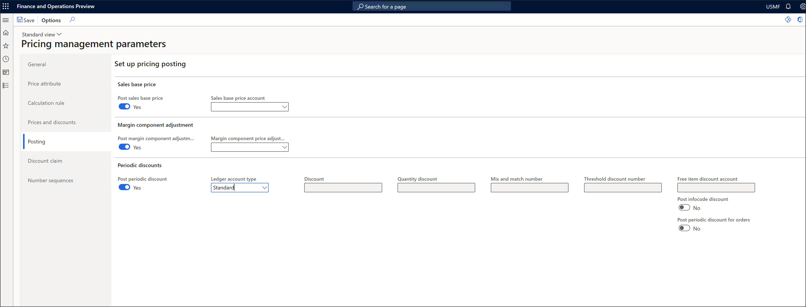
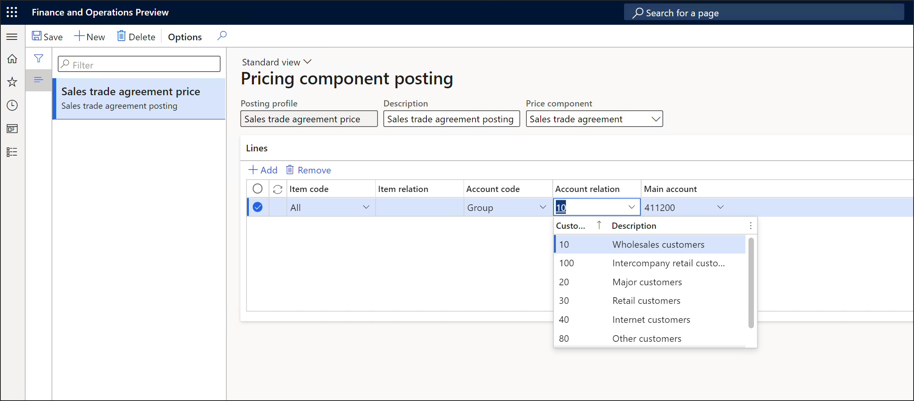
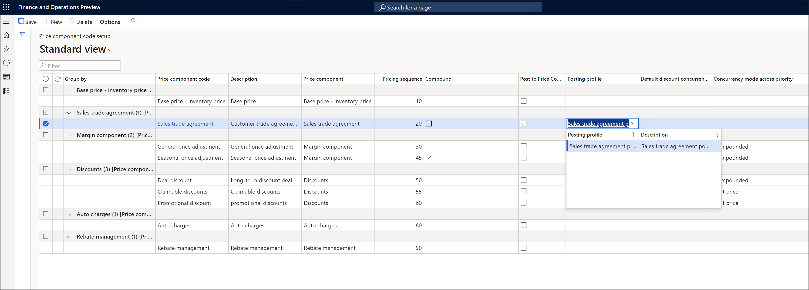

# Price component posting

[!include [banner](../includes/banner.md)]
[!include [preview banner](../includes/preview-banner.md)]
<!-- KFM: Preview until further notice -->

Pricing management lets you set up a different sales order posting ledger for each of the following types of [price component codes](price-component-code.md):

- Base price
- Sales trade agreement price
- Margin component price adjustment
- Discounts

This capability enables the system to keep ledger accounts that distinguish the many layers of your pricing composition at the price component level.

For more information about how to set up your price structures, including how to assign posting profiles for each relevant price component code in a structure, see [Arrange price component codes into a price structure](price-structure-details.md).

## Set up price component posting

Follow these steps to prepare your system to support price component posting.

1. Go to **Pricing management \> Setup \> Pricing management parameters**.
1. On the **Posting** tab, on the **Sales base price** FastTab, set the following fields:

    - **Post sales base price** – Set this option to *Yes* to enable *base prices* and *sales agreement prices* to be posted to a specific ledger. When you post a sales invoice, the system will use the ledger account that's specified by the posting profile that's assigned to each price component code line.
    - **Sales base price account** – Specify a fallback ledger account to use for sales base prices. This account will be used as required for price component code lines where no posting profile is specified.

1. On the **Margin component adjustment** FastTab, set the following fields:

    - **Post margin component adjustments** – Set this option to *Yes* to enable *margin component price adjustments* to be posted a specific ledger. When you post a sales invoice, the system will use the account that's specified by the posting profile that's assigned to each price component code line.
    - **Margin component price adjustment account** – Specify a fallback ledger account to use for margin component price adjustments. This account will be used as required for price component code lines where no posting profile is specified.

1. On the **Periodic discounts** FastTab, set the following fields:

    - **Post periodic discount** – Set this option to *Yes* to enable *periodic discounts* to be posted to a specific ledger. When you post a sales invoice, the system will first determine whether there's a specific discount account in the applied rule record. If there isn't, the system will instead use the account that's specified by the posting profile that's assigned to each price component code line. Periodic discounts include mix-and-match discounts, quantity discounts, and discount offers.
    - **Ledger account type** – Set this field to *Periodic* to set up fallback ledger accounts by using the other fields on the FastTab.

    

1. On the Action Pane, select **Save**.

## Configure price component posting profile

Follow these steps to set up your price component posting profiles.

1. Go to **Pricing management \> Setup \> Posting \> Pricing component posting**.
1. Follow one of these steps:

    - To create a new profile, select **New** on the Action Pane.
    - To edit an existing profile, select it in the list pane.
    - To delete an existing profile, select it in the list pane, and then select **Delete** on the Action Pane.

1. On the header of the new or selected record, set the following fields:

    - **Posting profile** – Enter a unique name.
    - **Description** – Enter a short description.
    - **Price component** – Select the price component type that the posting profile applies to.

1. On the **Lines** FastTab, set up the rules that the profile will use to assign ledger accounts when price component codes of the selected price component type are posted. Use the buttons on the toolbar to add or remove lines as required. For each line, set the following fields:

    - **Item code** – Select one of the following values to specify the scope of items where the line will apply:

        - *Table* – Assign an account for a specific item.
        - *Group* – Assign an account for an item group.
        - *All* – Assign an account for all items.

    - **Item relation** – If you set the **Item code** field to *Table*, select a specific item. If you set the **Item code** field to *Group*, select an item group.
    - **Account code** – Select one of the following values to specify the scope of customer accounts where the line will apply:

        - *Table* – Assign an account for a specific account.
        - *Group* – Assign an account for an account group.
        - *All* – Assign an account for all accounts.

    - **Account relation** – If you set the **Account code** field to *Table*, select a specific account. If you set the **Item code** field to *Group*, select an account group.
    - **Main account** – Select the account to use when the conditions that are defined by the line are met.

    

1. When you've set up all the lines that you need for the current profile, select **Save** on the Action Pane.

## Associate price component posting with the price structure

Follow these steps to set up your price structures to use a specific posting profile for each relevant price component code.

1. Follow one of these steps:

    - For companies that use a single price structure, go to **Price management \> Setup \> Price component codes \> Price component code setup**. (For more information, see [Set up a company to use a single price structure](price-structure-single.md).)
    - For companies that use multiple price structures, go to **Price management \> Setup \> Price component codes \> Price trees**, and select a price tree in the list pane. (For more information, see [Set up a company to use multiple price structures](price-structure-multiple.md).)

1. Find the price component code line that you want to assign posting for, and select its **Post to price component code** checkbox. Then set the **Posting profile** field to the profile that you want to use for the line.

    

1. Repeat the previous step until you've assigned a posting profile to each relevant line.
1. On the Action Pane, select **Save**.
1. If you're using multiple pricing trees, repeat the previous steps until you've set up each tree.
