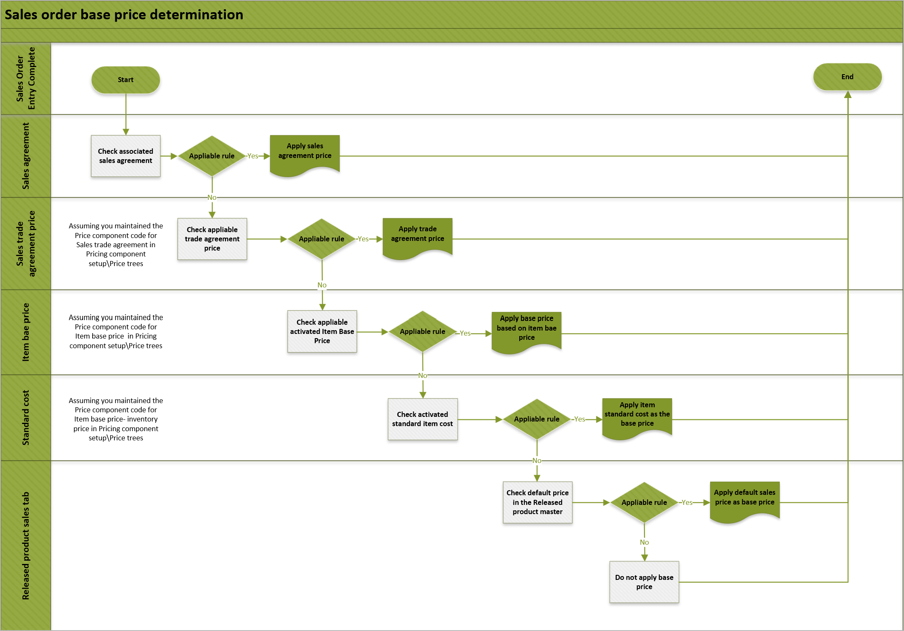

<!-- KFM: This is a very poorly explained topic. I can't really tell what it's about. Revision is needed. It contains many sentences that I can't understand and therefore can't edit. What kind of topic is this (overview, how-to, concept)? Is this topic actually just an older version of the next topic? -->

# Determining sales trade agreement prices

[!include [banner](../includes/banner.md)]
[!include [preview banner](../includes/preview-banner.md)]
<!-- KFM: Preview until further notice -->

This article describes the price determination rules for calculating the base price and the sales trade agreement price. <!-- KFM: We already have a topic talking about base price. Can we refer to that and instead concentrate on the sales agreement price here? -->

<!-- KFM: Introduce the following table. What does it show?  -->

| Terms | Definition, usage, and notes | Price component type |
|-------------------------|-------------------------|-------------------------|
| Unit price | The price calculated for each unit in a sales order. It's calculated as: *Unit price = Base price &plusmn; Margin component price adjustments* |  |
| Base price | The basis for the price adjustments. It's intended for all customers and is the standard rate for general purposes.<ul><li>If there is applicable sales trade agreement price, then the base price is the *sales trade agreement price*</li><li>If there is no applicable sales trade agreement price, the base price is the *item base price*.</li></ul> |  |
| Sales trade agreement price | Reflects a negotiated pricing strategy for a collection of customers and a group of specific products. You can configure the system to calculate the unit price based on it by applying one of the following formulas:<ul><li>*Unit price = Sales trade agreement price* (when no margin component price adjustment applies)</li><li>*Unit price= Sales trade agreement price &plusmn; Margin component price adjustments*</li></ul> | Sales trade agreement |
| Item base price | The **Item base price** page lets you set prices for each item using either calculated or manually entered values. Calculated prices use the following formula: *Item base price = Vendor list price &plusmn; Vendor term agreements* | Can be any of the following: <ul><li>Base price - purchaser price</li><li>Base price - inventory price</li><li>Base price - sales price</li></ul> |
| Standard cost | The cost version of an item calculated using standard cost model. | Base price - inventory price |
| Margin component price adjustments | You can set up layers of margin components to adjust the base price up (positive) or down (negative). Margin component price adjustments have a calculation sequence and can be compounded to get the total adjustment price. | Margin component |
| Sales agreement | The Pricing management module respects [sales agreement rules](../sales-marketing/sales-agreements.md), but the sales agreement feature is not otherwise integrated with the Pricing management module. |  |

The following flowchart illustrates the sales order base price determination rules.

## Determining the sales trade agreement price

<!--KFM: This section, the ranking rules, and the examples are unclear so I can't edit them. It's not clear where these various "ranks" come from. Please revise and add more details. -->

Follow these steps to set the concurrency model to use for sales trade agreement prices:

1. Go to **Pricing management \> Setup \> Pricing management parameters**.
1. Open the **Prices and discounts** tab.
1. Expand the **Trade agreements** FastTab.
1. Set **Enable default find next** to one of the following values:
    - *Yes* – The price engine will check all applicable trade agreement prices and apply the *cheapest* price.
    - *No* – The price engine will use the *price attribute combination rank* to determine the price by applying the following rules: <!-- KFM: It isn't clear where the various ranks in this table come from or what "records" we are referring to. -->
        - Apply the record with the highest *price attribute combination rank*.
        - If two or more records have an equal and highest *price attribute combination rank*, the price engine will check the *header price attribute* and apply the highest ranked record price group.
        - If two or more records have an equal and highest *header price attribute*, the price engine will check the *line price attribute* and apply the highest ranked record in the price attribute group.
        - In case there are multiple price records found with the same rank, Price engine will apply the cheapest price.

The following table shows an example of price component code attribute combinations. <!-- KFM: The table has two columns with the same heading. What does that mean?  -->

| Price attribute combination | Price attribute combination | Header price attribute | Rank | Line price attribute | Rank |
|---|---|---|---|---|---|
| Target customer segments + Vehicle product | 2003 | Customer account | 4 | Interior Upholstery | 4 |
| Target customer segments + Vehicle product | 2003 | Customer group | 3 | Exterior color | 3 |
| Target customer segments + Vehicle product | 2003 | Price group | 2 | Fuel type | 2 |
| Target customer segments + Vehicle product | 2003 | Sales group | 1 | Drive type | 1 |

Assuming there are two posted records for sales trade agreement price line with the same date range. <!-- KFM: What does this mean?  -->

Because the price attribute combination is the same, the price attribute combination rank are the same. <!-- KFM: What does this mean?  --> Price engine will apply the RID0002 price.

<!-- KFM: We should introduce the following table. What does it mean? -->

| IDs | Price attribute combination | Header price attribute criteria | Line price attribute criteria | Price | Applicable |
|---|---|---|---|---|---|
| RID0001 | Target customer segments + Product segments | Price group= 01 | Interior Upholstery= Package B | $1500 | No |
| RID0002 | Target customer segments + Product segments | Customer account= US-003 | Interior Upholstery= Package B | $1550 | Yes |

## Determining the sales trade agreement price

<!-- KFM: As far as I can tell, this is an exact copy of the previous section. Is that right? (I didn't edit this version.) -->

Sales trade agreement price can have 2 concurrency model by configuring the Enable default find next in the **Pricing management \> Setup \> Pricing management parameters \> Prices and discounts** tab:

- **Enable default find next= Yes**, Price engine will check all the applicable trade agreement price and apply the **cheapest** price.
- **Enable default find next= No,** Price engine will determine the price by 'Price attribute combination rank'.
  - Price engine will apply the **highest rank** record.
  - When the 'Price attribute combination rank' is with the same level rank, Price engine will check the 'Header price attribute', apply the highest rank record price group.
  - In case the same, it will then check the 'Line price attribute' and then apply the highest rank record in the price attribute group.
  - In case there are multiple price records found with the same rank, Price engine will apply the cheapest price.

Below illustrates an example:

Configure the price component code with below price attribute combination for sales trade agreement price:

| Price attribute combination | Price attribute combination | Header price attribute | Rank | Line price attribute | Rank |
|---|---|---|---|---|---|
| Target customer segments+ Vehicle product | 2003 | Customer account | 4 | Interior Upholstery | 4 |
| | | Customer group | 3 | Exterior color | 3 |
| | | Price group | 2 | Fuel type | 2 |
| | | Sales group | 1 | Drive type | 1 |

Assuming there are 2 posted records for sales trade agreement price line with the same date range.

As the price attribute combination is the same, the Price attribute combination rank are the same. Price engine will apply the RID0002 price.

| IDs | Price attribute combination | Header price attribute criteria | Line price attribute criteria | Price | Applicable |
|---|---|---|---|---|---|
| RID0001 | Target customer segments + Product segments | Price group= 01 | Interior Upholstery= Package B | $1500 | No |
| RID0002 | Target customer segments + Product segments | Customer account= US-003 | Interior Upholstery= Package B | $1550 | Yes |
