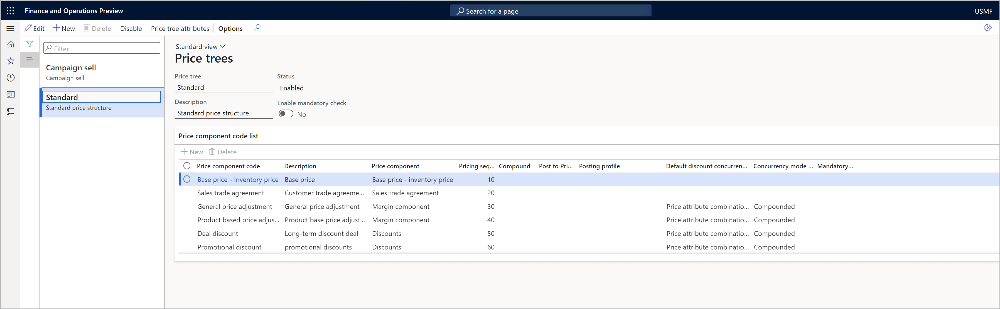

# Set up a company to use multiple price structures

[!include [banner](../includes/banner.md)]
[!include [preview banner](../includes/preview-banner.md)]
<!-- KFM: Preview until further notice -->

This article explains how to set up multiple price structures in a company. The purpose of a price structure is to define the order that the system calculates each type of price adjustment in, and to define other options for each price component code, such as concurrency and compounding rules.

In this scenario, companies and price structures have a one-to-many (1:N) relationship, and the multiple price structures are also known as *price trees*. The pricing engine will select a price structure based on the specified *price tree attribute*, which is one of the order attributes. After it determines the applicable price structure, the price engine will match the sales order with the price component codes according to the pricing sequence that's defined in the applicable price tree.

Price trees are the multiple-structure equivalent of the price component code setup for single price structures, and they provide almost all the same settings. For more information, see [Set up a company to use a single price structure](price-structure-single.md).

## Configure a company to use multiple price structures

Follow these steps to use multiple price structures for a company.

1. Select the company in the company picker.
1. Go to **Pricing management \> Setup \> Pricing management parameters**.
1. On the **Price attribute** tab, set the **Enable multiple price trees** option to *Yes*.
1. You'll use the value of one of the order attributes to select which price tree to use. Set the **Price tree attribute** field to the order attribute that you want to use.

## Configure the price structures

Follow these steps to create and configure a price structure.

1. Go to **Pricing management \> Setup \> Price component codes \> Price trees**. The **Price trees** page shows your current price structures (if you have any), and lets you add, remove, and configure price trees.

    

1. Follow one of these steps:

    - To add a new price tree, select **New** on the Action Pane.
    - To edit an existing price tree, select it in the list pane, and then select **Edit** on the Action Pane.
    - To delete a price tree, select it in the list pane, and then select **Delete** on the Action Pane.

1. On the header of the new or selected price tree, set the following fields:

    - **Price tree** – Enter a name for the price tree.
    - **Status** – This field shows the current status of the price tree. Only price trees that have a **Status** of *Enabled* will affect your price calculations. To change the status, select **Disable** or **Enable** on the Action Pane.
    - **Description** – Enter a short description of the price tree.
    - **Enable mandatory check** – If you want to be able to mark one or more price component codes as mandatory, set this option to *Yes*.

1. On the **Price component code list** FastTab, add each price component code that should be part of the price structure for the current price tree. Use the buttons on the toolbar to add and remove lines as required. The fields on this FastTab work just as they do on the **Price component code setup** page. For information about how to set these fields, and examples that show how the settings work, see [Arrange price component codes into a price structure](price-structure-details.md).
1. When you've set up all lines as required, select **Save** on the Action Pane.
1. On the Action Pane, select **Price tree attribute** to specify the value of the price tree attribute that will cause this price tree to apply to a given order.
1. On the Action Pane, select **Enable** to enable the current price tree.

## Auto charges in single and multiple price structures

Price component codes of the *Auto charges* type are handled differently, based on whether you're using a single price structure (price component code setup) or multiple price structures (price trees).

- *If you're using a single price structure*, you can add the price component code for auto charges in the price component code setup.
- *If you're using multiple price structures*, you can't add auto charges in the price tree structures. Instead, the system will apply the standard auto charge logic in Microsoft Dynamics 365 Supply Chain Management to determine which auto charges apply to the sales order.
