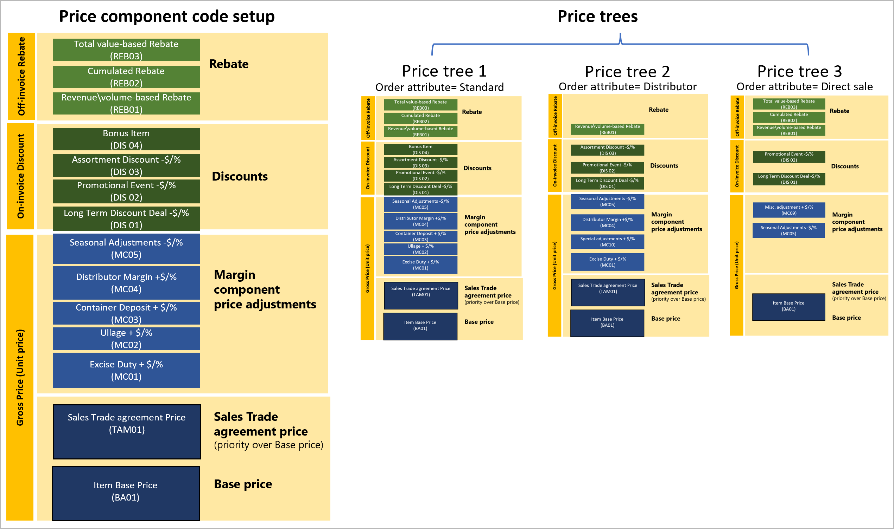

# Price structure overview

[!include [banner](../includes/banner.md)]
[!include [preview banner](../includes/preview-banner.md)]
<!-- KFM: Preview until further notice -->

When a sales order is placed, you can review the detailed price breakdown, including the price component. The breakdown corresponds to the price structure that you've configured. The price details provide an audit record that shows how the price was determined, and they can serve as a starting point for future price investigation.

The following two methods are available for building the price structure:

- **Price component code setup** – This method provides a single, uniform price structure for each company.
- **Price trees** – This method enables multiple price structures that are based on order attribute values for each company.

## Price component types

The following table summarizes the main component types that can be included in a price structure.

| Price component | Price position | Details |
|---|---|---|
| Base price | Unit Price | 
The *[base price](base-price-versions.md)* represents the common price for general use. It's at the level of the stock keeping unit (SKU). You can have only *one* price component code of this type in each price structure. That price component code can be of any of the following base price types:
<ul><li>Base price - inventory price</li><li>Base price - purchase price</li><li>Base price - sales price</li></ul>
The base price comes from the **Item base price** page, and can be either calculated or manually entered.

If you set up the base price by using a price structure (price component code setup or price trees), and no matching record exists on the **Item base price** page, the system will determine whether the item is a standard cost item. If it's a standard cost item, the system will source the base price from the active item standard cost.
 |
| Sales trade agreement price | Unit Price | 
If the *[sales trade agreement price](sales-trade-agreement-prices.md)* is available, it takes precedence over the base price, because it represents a special price arrangement with a specific group of consumers for a specific set of products.

You can have only *one* price component code of this type. However, any number of sales trade agreement prices can apply to that code in different situations.
 |
| Margin component price adjustment | Unit Price | 
*[Margin component price adjustments](margin-price-adjustments.md)* move item prices up or down from the base price. Margin component price adjustments can be associated with many types of agreements, promotions, and events. They let you easily adjust prices without changing the base price.

You can have *multiple* price component codes of this type, and you can associate any number of [pricing rules](margin-discount-pricing-rules.md) with each one. Price adjustments are compounded across price component codes and add up to the total price adjustment. |
| Discounts | On-invoice discounts | 
*[Discounts](discounts.md)* let you adjust prices based on a wide range of calculation methods that are designed to encourage the purchase of specific products, volumes, packages, and so on. You can have *multiple* price component codes of this type, and you can associate any number of [pricing rules](margin-discount-pricing-rules.md) with each one.
 |
| Rebate management | Off-invoice discounts | You can have *multiple* price component codes of this type. |

## Concurrency rules

If your price structure has multiple price rules that apply to the same price component code and/or to multiple price component codes of the same type, the system will apply concurrency rules to resolve them.

- If more than one pricing rule applies to the same price component code in a price structure, *within-price-component-code concurrency* rules will be applied to determine which rules apply and how they're combined. For more information, see [Resolve concurrency within price component codes](concurrence-within-codes.md).
- If your price structure includes more than one price component code of the same type, *across-price-component-code concurrency* rules will be applied to determine how they're combined. For more information, see [Resolve concurrency across price component codes](concurrence-cross-codes.md).

## Next steps

- [Set up a company to use multiple price structures](price-structure-multiple.md)
- [Set up a company to use a single price structure](price-structure-single.md)
- [Arrange price component codes into a price structure](price-structure-details.md)
