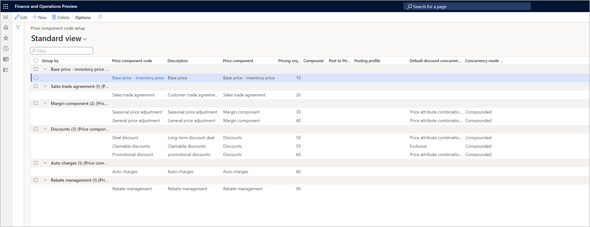

# Set up a company to use a single price structure

[!include [banner](../includes/banner.md)]
[!include [preview banner](../includes/preview-banner.md)]
<!-- KFM: Preview until further notice -->

This article explains how to configure a company to use a single price structure, and how to set up that structure. The purpose of a price structure is to define the order that the system calculates each type of price adjustment in, and to define other options for each price component code, such as concurrency and compounding rules.

In this scenario, companies and price structures have a one-to-one (1:1) relationship, and the single price structure is called the *price component code setup*. The pricing engine matches each sales order with the price component codes, based on the pricing sequence that's defined in the single structure.

The price component code setup is the single-structure equivalent of the price trees that are used for multiple price structures, and it provides almost all the same settings. For more information, see [Set up a company to use multiple price structures](price-structure-multiple.md).

## Configure a company to use a single price structure

Follow these steps to use a single price structure for a company.

1. Select the company in the company picker.
1. Go to **Pricing management \> Setup \> Pricing management parameters**.
1. On the **Price attribute** tab, set the **Enable multiple price trees** option to *No*.
1. On the Action Pane, select **Save**.

## Configure the single price structure

To set up the price structure for a company that uses a single structure, follow these steps.

1. Go to **Pricing management \> Setup \> Price component codes \> Price component code setup**. The **Price component code setup** page shows your current price structure (if you have one), and lets you add or remove price component codes in the structure. The components are grouped according to the **Price component** value that's set for each price component code in the list.

    

1. Set up your price structure by adding and removing lines to define a price sequence. Set the fields for each price component code that you want to include. These fields work just as they do on the **Price component code list** FastTab of the **Price trees** page. For information about how to set these fields, and examples that show how they work, see [Arrange price component codes into a price structure](price-structure-details.md).
1. When you've set up all lines as required, select **Save** on the Action Pane.

## Auto charges in single and multiple price structures

Price component codes of the *Auto charges* type are handled differently, based on whether you're using a single price structure (price component code setup) or multiple price structures (price trees).

- *If you're using a single price structure*, you can add the price component code for auto charges in the price component code setup.
- *If you're using multiple price structures*, you can't add auto charges in the price tree structures. Instead, the system will apply the standard auto charge logic in Microsoft Dynamics 365 Supply Chain Management to determine which auto charges apply to the sales order.

