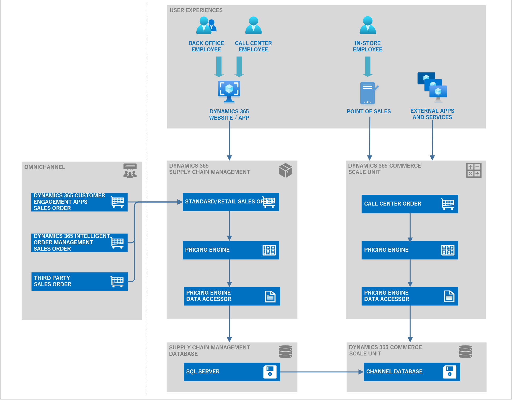

# Pricing management overview

[!include [banner](../includes/banner.md)]
[!include [preview banner](../includes/preview-banner.md)]
<!-- KFM: Preview until 10.0.33 GA -->

This article provides an overview of the Pricing management module in Dynamics 365 Supply Chain Management.

Increasingly, traditional business to business (B2B) companies are thinking of converting to omnichannel sales and selling directly to customers to gain more control over pricing and margins. The omnichannel transformation leads to massive changes to pricing models and rules. Pricing management aids B2B business in the transition to omnichannel pricing by enabling attribute-based pricing rules that use attributes and data from customers, products, and order segments.

The main challenges include:

- **Pricing silos** – A lack of transparency across channels and missing centralized pricing management.
- **Pricing relevancy** – Need to consider all pricing factors when establishing B2B and B2C pricing rules.
- **Pricing complexity** – Difficulties in converting to B2B and B2C pricing logic without validation.
- **Real-time execution** – Omnichannel customer experience requires a real-time pricing calculation response.

Dynamics 365 Supply Chain Management leverages the [Commerce Scale Unit (CSU) Core](../../commerce/dev-itpro/CSU-core.md) to help traditional B2B companies embrace omnichannel pricing. This function enables you to:

- Offer, manage, and calculate pricing and provide transparent pricing across channels, which is essential for aligning pricing strategies across multiple channels.
- Quickly determine prices while considering a variety of commercial aspects, such as general base prices, sales trade agreements, long-term discount agreements, short-term promotion discounts, and retrospective rebate calculations for each sales order.
- Create pricing data models based on price attributes. Price attributes can be based on categorized product pricing differentiators, customer groups, and order types.
- Manage complex pricing structures with price-component breakdowns and define margin component price adjustments on top of item base prices. When you create an order, the pricing details can provide a list of price component breakdowns for future in-depth analysis.
- Easily manage sophisticated pricing rules when converting from B2B pricing to B2B and B2C pricing that considers discount concurrency, bundle sales, mandatory sales items, and bonus free item pricing rules.
- Simulate prices and show detailed price calculations.
- Leverage enhanced discount budget controls to avoid margin leakage from fund consumption.
- Leverage the [CSU-based pricing API](../../commerce/pricing-apis.md) for Dynamics 365 Commerce to allow pricing calculations to be retrieved by a native Commerce point of sale system and/or consumed by external applications to support various pricing scenarios.

## Main feature components

Pricing management applies the following key elements to determine pricing:

- **Price attributes** – Provide a flexible way for you to define your pricing factors. They leverage information about customers, products, sales order header, and sales order lines. Price attributes work with the customer and product attribute framework, making them highly configurable. Extension points are available for you to extend the price attributes.
- **Price component codes** – Group the price attributes together. Price component codes represent the building blocks of your pricing structure. When you create a price and discount rule record, you'll also assign that record to a price component code.
- **Price structure** – Let you construe the sequence of your price component codes. You can choose to use one price structure for each company or use different price structures for each order attribute within a company. Within the price structure, price determination logic ensures that the base price can be found. To ensure that the base price can be established, the price determination logic is embedded into the price structure. The base price is the price before making any price adjustments (base price &plus; price adjustment = selling price).
- **Concurrency mode** – Controls how the final price should be calculated in situations where multiple pricing rules are associated with the same price component code.

The following illustration shows many of the components that affect Pricing management price calculations.

## Architecture overview

The following illustration shows the architecture of the Pricing management module.

> [!NOTE]
> You can create and maintain the pricing rules in Dynamics 365 Supply Chain Management.
>
> Omnichannel orders can come from a variety of front-end ordering systems.
>
> For orders that are created in Dynamics 365 Supply Chain Management, through integration, or through [dual-write](../../fin-ops-core/dev-itpro/data-entities/dual-write/dual-write-overview.md) (such as orders from Dynamics 365 customer engagement apps or Dynamics 365 Intelligent Order Management), the pricing engine can provide calculated pricing and pricing details for each sales order.
>
> For orders that are created in a native Dynamics 365 Commerce point of sale or a third-party system, calculated prices can be retrieved via the [CSU-based pricing API](../../commerce/pricing-apis.md).
